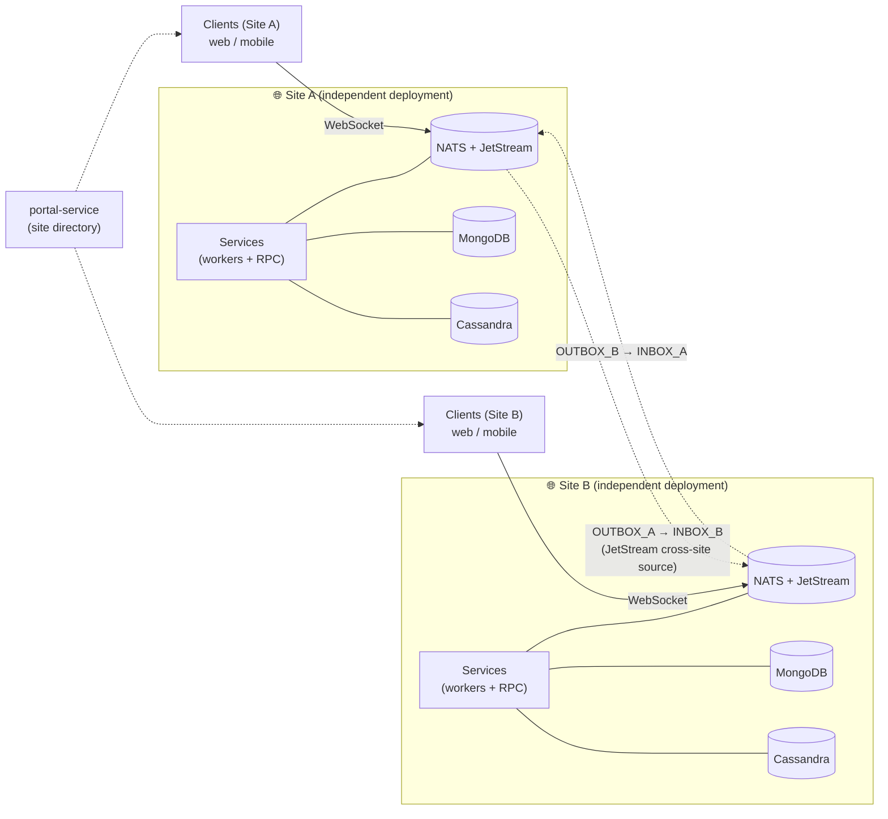
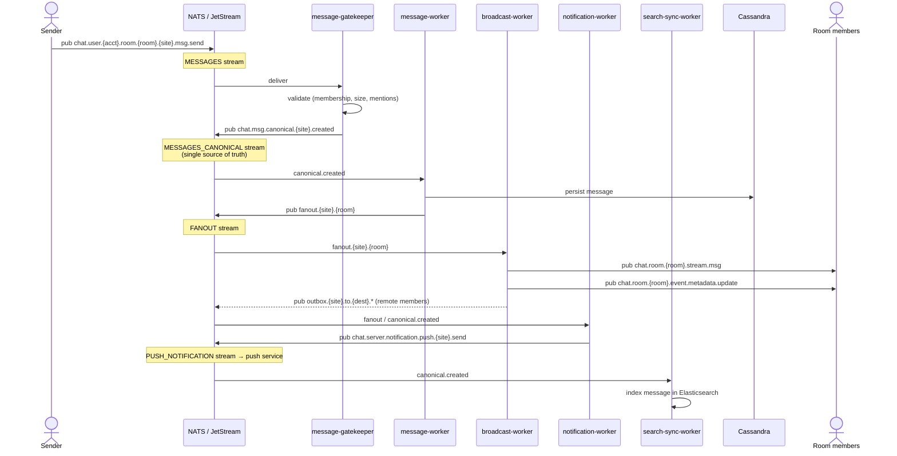
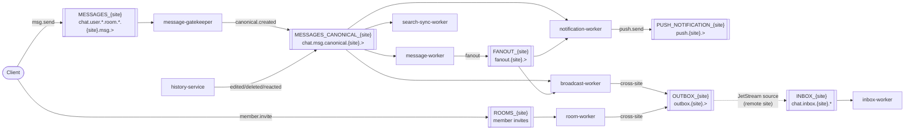
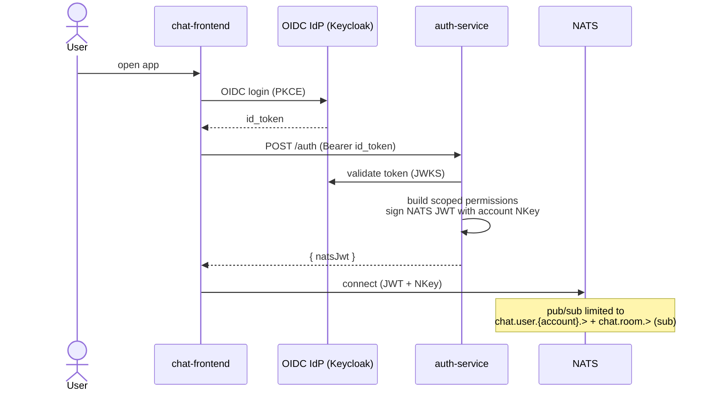

# System Architecture

A distributed, **multi-site federated** chat system written in Go 1.25. Each
site runs independently with its own NATS, MongoDB, and Cassandra. Real-time
delivery and async processing flow through **NATS JetStream**; synchronous
operations use **NATS request/reply**. Cross-site events use the
**Outbox/Inbox** pattern.

This document is the architectural map. For wire-level contracts see
[`client-api.md`](./client-api.md); for the full subject hierarchy see
[`nats-subject-naming.md`](./nats-subject-naming.md).

---

## 1. Multi-Site Federation (Context)

Each site is a self-contained deployment. Clients connect to their home site's
NATS over WebSocket. Cross-site events flow OUTBOX → (JetStream source) → INBOX.



---

## 2. Component Architecture (single site)

Three planes: **edge/HTTP** (auth, portal, upload), **request/reply RPC**
services, and **JetStream workers**. All real-time traffic crosses the NATS bus.

```mermaid
flowchart TB
    Client["🖥️ chat-frontend<br/>(React 19 + nats.ws)"]

    %% Edge / HTTP plane
    subgraph Edge["Edge — HTTP (Gin)"]
        Auth["auth-service<br/>OIDC → NATS JWT/NKeys"]
        Portal["portal-service<br/>site directory cache"]
        Upload["upload-service<br/>image uploads"]
    end

    %% NATS bus
    NATS{{"NATS + JetStream<br/>(message bus)"}}

    %% RPC plane (request/reply)
    subgraph RPC["Request/Reply Services"]
        RoomSvc["room-service<br/>room CRUD, invite auth, typing relay"]
        UserSvc["user-service<br/>users, subscriptions, apps"]
        HistSvc["history-service<br/>msg history, edit/delete/react"]
        Presence["user-presence-service<br/>online status"]
        Search["search-service<br/>messages/rooms/users search"]
    end

    %% JetStream workers
    subgraph Workers["JetStream Workers (event-driven)"]
        Gatekeeper["message-gatekeeper<br/>validate → canonical"]
        MsgWorker["message-worker<br/>persist + resolve mentions + fanout"]
        Broadcast["broadcast-worker<br/>deliver to members + metadata"]
        Notif["notification-worker<br/>push notifications"]
        RoomWorker["room-worker<br/>apply invites, sub events"]
        Inbox["inbox-worker<br/>consume remote OUTBOX"]
        SearchSync["search-sync-worker<br/>index canonical msgs"]
    end

    %% Data stores
    Mongo[("MongoDB<br/>rooms, subs, messages")]
    Cass[("Cassandra<br/>message history")]
    ES[("Elasticsearch<br/>search index")]
    Valkey[("Valkey<br/>caches, presence")]
    MinIO[("MinIO / Drive<br/>image blobs")]

    %% Client edges
    Client -->|HTTPS login| Auth
    Client -->|HTTPS| Portal
    Client -->|HTTPS multipart| Upload
    Client <-->|WebSocket pub/sub + req/reply| NATS

    %% RPC over NATS
    NATS <--> RoomSvc
    NATS <--> UserSvc
    NATS <--> HistSvc
    NATS <--> Presence
    NATS <--> Search

    %% Workers on NATS
    NATS <--> Gatekeeper
    NATS <--> MsgWorker
    NATS <--> Broadcast
    NATS <--> Notif
    NATS <--> RoomWorker
    NATS <--> Inbox
    NATS <--> SearchSync

    %% Data store edges
    RoomSvc --- Mongo
    UserSvc --- Mongo
    HistSvc --- Cass
    HistSvc --- Mongo
    MsgWorker --- Cass
    Broadcast --- Mongo
    Broadcast --- Valkey
    Notif --- Mongo
    Notif --- Valkey
    RoomWorker --- Mongo
    Inbox --- Mongo
    Gatekeeper --- Valkey
    Presence --- Valkey
    Presence --- Mongo
    Search --- ES
    SearchSync --- ES
    Upload --- MinIO
    Upload --- Mongo
```



---

## 3. Message Send Flow (happy path)

A user sends a message; it is validated, persisted, broadcast to room members,
notified, and indexed — each step on its own JetStream stream.



---

## 4. JetStream Stream Topology

Streams are named `<STREAM>_<siteID>` (see `pkg/stream/stream.go`). Stream
creation is opt-in (`BOOTSTRAP_STREAMS`) — owned by ops/IaC in production.



---

## 5. Authentication Flow

`auth-service` bridges the org's OIDC IdP to NATS. It validates the SSO token
and mints a short-lived NATS user JWT signed with the account NKey, scoping
pub/sub permissions to the user's own `chat.user.{account}.>` namespace.



---

## 6. Data Stores & Responsibilities

| Store | Used for | Owners |
|-------|----------|--------|
| **MongoDB** | Operational data: rooms, subscriptions, room members, users, apps | room-service, user-service, room-worker, broadcast-worker, notification-worker, inbox-worker |
| **Cassandra** | Message history (time-series, bucketed by `(room_id, bucket)`) | message-worker (write), history-service (read) |
| **Elasticsearch** | Full-text search index (messages, rooms, users) | search-sync-worker (write), search-service (read) |
| **Valkey** (cluster) | Subscription/room-meta caches, presence | message-gatekeeper, broadcast-worker, notification-worker, user-presence-service |
| **MinIO / Drive** | Uploaded image blobs | upload-service |

---

## 7. Tech Stack

| Concern | Choice |
|---------|--------|
| Language | Go 1.25 |
| Messaging | NATS + JetStream |
| Operational DB | MongoDB (`mongo-driver/v2`) |
| History DB | Cassandra (`gocql`) |
| Search | Elasticsearch |
| Cache / presence | Valkey (cluster mode) |
| Object storage | MinIO / Drive |
| Auth | NATS callout — OIDC → JWT + NKeys |
| HTTP server / client | Gin / Resty |
| Config | env vars via `caarlos0/env` |
| Observability | `flywindy/o11y` SDK (OpenTelemetry traces, Prometheus metrics, `log/slog` logs) |
| Frontend | React 19 + `nats.ws` + `oidc-client-ts` |
```

## 8. Observability

All three signals come from the `flywindy/o11y` SDK. Each service initializes it
once in `main` via `pkg/obs.Init`, which installs the SDK's providers as the
OpenTelemetry globals and the SDK logger as the `slog` default.

- **Traces** — context propagates across process hops: NATS via the
  `o11y/nats` facade (publish injects W3C `traceparent`, consume extracts it)
  and HTTP via the `o11y/gin` server middleware. Datastore spans
  (Mongo / Cassandra / Valkey / MinIO / Elasticsearch) come from the `pkg/*`
  connect helpers, wired with `WithObservability(sdk)`. A single message send is
  one trace spanning `message-gatekeeper → message-worker → broadcast-worker`
  with datastore spans as children.
- **Metrics** — each service exposes a Prometheus endpoint on `:2112`
  (`OTEL_EXPORTER_PROMETHEUS_PORT`) carrying SDK runtime + instrumentation
  metrics. Services that keep app-level counters (e.g. `search-service`) expose
  those on their own listener.
- **Logs** — `log/slog` JSON through the SDK logger; lines emitted under an
  active span carry `traceId` / `spanId` for correlation.
- **Export & backend** — OTLP (`OTEL_EXPORTER_OTLP_ENDPOINT`) to the o11y
  monitor stack (Alloy / OTel Collector → Tempo, Loki, Prometheus), viewed in
  Grafana. `OTEL_SERVICE_NAME` is required per service (the SDK fails fast
  without it).
