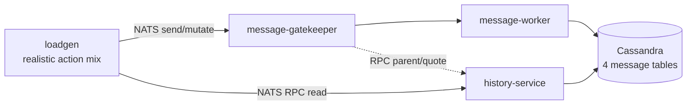

# Cassandra Load Test Plan (Soak Test)

> This is the authoritative specification for the Cassandra Run A soak test.
> The engineering work breakdown is maintained in
> [`run-a-implementation-plan.md`](run-a-implementation-plan.md).

A production-like soak test to validate the Cassandra **schema design** and
**access patterns** of this project before release. **Run A (a soak through the
real service path) is the primary test**; the pathological/direct-CQL
experiments are follow-on and out of the primary timeline.

| | |
|---|---|
| **Validates** | Cassandra schema, access patterns, sustained read/write/compaction behavior, disk-growth trend under realistic load |
| **Does NOT validate** | newchat end-to-end capacity, user-facing SLOs, NATS / broadcast-worker / notification path, degraded-mode (node failure) behavior, and Cassandra breaking points (this test is non-destructive by decision) |
| **A "pass" means** | No Cassandra-level defect surfaced under realistic sustained load — an exploratory result, **not** a production-readiness certification |

**Retention assumption.** The message tables have **no TTL in the repo DDL**
(confirmed). Staging currently applies a 1-year TTL out-of-band; production is
unset (may later align). Within a 3-day run TTL never fires in either
environment, so short-term behavior is comparable; the **long-term disk-growth
projection must use the production (no-TTL) assumption**, under which storage
grows unbounded. This test validates the growth trend, not expiry/reclamation.

---

## A. Decisions

| # | Decision | Resolution |
|---|---|---|
| D1 | Test positioning | **Exploratory, non-destructive** — observe behavior under realistic load; do not drive to failure |
| D2 | At-rest encryption | **On in all environments** (`ATREST_ENABLED=true`) — payload sizes and write latency reflect production |
| D3 | Soak duration | **3 days** (timeline-constrained). Caveat: at the 72h TWCS window this seals ~1 window and gives lower confidence on very-slow leaks; tombstone eviction is not observable regardless (gc_grace ≥ 10 days) |
| D4 | Degraded-mode risk | **Accepted as a known limitation** — node failure/repair is out of scope (managed cluster); degraded-read availability is unvalidated |
| D5 | Environment fidelity | Staging and production share the **same per-node spec** but **node count differs significantly** → per-node behavior/latency at equal per-node load is representative, but the **throughput ceiling and cross-node effects do not extrapolate** |
| D6 | Data isolation & cleanup | Test creates its own topology and messages; **all test data is deleted after the run** (prefer `TRUNCATE`/keyspace drop over row-by-row `DELETE`, which would itself create tombstones) |
| D7 | Table-property permission | `gc_grace_seconds` / `compaction_window_size` **cannot be modified** — run at production values (see Config Facts) |
| D8 | Acceptance stance | **Non-destructive** — report observed trends and any early-warning signals; do not push to a breaking point |

## B. Inputs — Production Workload Model

| # | Input | Drives | Value |
|---|---|---|---|
| I1 | Peak sustained send rate (msg/s) — **busiest site, incl. federation-in** | Run A rate | **100** |
| I2 | Read : write ratio | Action mix | **7 : 1** |
| I3 | Thread-reply share of sends | Action mix | **10%** |
| I4 | Mutation rate (edit + delete + pin), of sends | Action mix | **5%** |
| I5 | Message size (median / p95 / max), post-encryption | Payload, disk model | **1 / 2 / 10 KB** |
| I6 | Messages per room per day (hot / cold) | Bucket fill | **100 / 10** |
| I7 | Thread length (max / p99) | Thread cap | **500 / 50** |
| I8 | Reactions per message (median / max) | Reaction load | **30 / 500** |
| I9 | Soft-delete density | Scan cost | **0.1%** |
| I10 | Daily message volume *(confirm scope: global vs busiest site)* | Disk projection | **4M/day** |
| I11 | Topology: rooms / group:DM / users per room | Phase 0 shape | **1M / 3:7 / ~100** |
| I12 | Messages per active user per day | Active-user count | _TBD_ |
| I13 | Total users on the busiest site | Seed count | **≤ 20,000** |

> I1 is per-site (each site has its own Cassandra); a site's load = local origin
> writes + cross-site federation replays (`inbox-worker`). Do not use a global
> total against one cluster. **Open consistency check:** 4M/day (I10) from a
> ≤20k-user site (I13) implies ~200 msg/user/day — very high — so I10 is likely
> global; confirm. I8 as a median across all messages is not physically consistent
> with I13 at a realistic cadence (see Workload Model) — confirm its meaning.

---

## C. Primary Test — Run A (through the real service path)

Drive a weighted, realistic action mix (send, thread reply, read history, read
thread, point lookup, react add/remove, edit, soft-delete, pin/unpin, pinned
list) through the real services, which execute the exact production CQL
(prepared statements, LocalQuorum, token-aware routing, unlogged batch shape,
bucket math, post-encryption payload sizes). Production 72h window and default
gc_grace. Steady, non-overloading rate for **3 days**.

Verdict from **per-query latency (L2/L3), SSTables-per-read, pending-compaction
slope, and disk growth**; end-to-end publish→broadcast latency (L1) is a
secondary fidelity signal only.

### What Run A cannot test (explicit blind spots)

Run A goes through NATS + gatekeeper + workers, so it also loads those; and it
is non-destructive. It therefore does **not** cover:

1. **Breaking points / true capacity ceiling** — non-destructive by decision (D1/D8).
2. **Wide-partition failure** — only realistic thread sizes; a pathological long
   thread is a follow-on (Exp F2).
3. **Tombstone failure-threshold behavior** — only realistic delete density; a
   tombstone storm is a follow-on (Exp F1).
4. **Compaction falling behind** — Run A runs at a safe rate, not overload (Exp F3).
5. **Single-node hotspot ceiling** — realistic Zipf only (Exp F5).
6. **Out-of-order / federation TWCS pollution at scale** — needs deliberate
   `USING TIMESTAMP` injection (Exp F6).
7. **Full TWCS lifecycle & tombstone eviction** — a 3-day / 72h-window / ≥10-day
   gc_grace run seals ~1 window and evicts nothing.
8. **Production-scale, multi-node behavior** — staging has fewer nodes; the
   throughput ceiling and cross-node effects do not extrapolate (D5).
9. **Upstream saturation confounding** — if NATS or message-worker saturates
   first, the achieved rate into Cassandra is gated upstream; watch consumer lag
   to detect this.
10. **Degraded-mode (node failure)** — out of scope (D4).
11. **Aged-partition reads** — no historical backfill (v1, timeline), so reads
    only hit run-generated data; read latency, bucket-walk depth, and compaction
    history are shallow/optimistic versus production's aged data.

---

## D. Config Facts (verified in repo)

- **`compaction_window_size = 72 HOURS`** — pinned in
  `docker-local/cassandra/init/10-table-messages_by_room.cql:41`,
  `docker-local/cassandra/migrations/2026-05-twcs-message-tables.cql:40`,
  `docs/cassandra_message_model.md:160`. Coupled to `MESSAGE_BUCKET_HOURS`
  (`message-worker/main.go:39`, `history-service/internal/config/config.go:46`,
  envDefault `72`) — the two must change together.
- **`gc_grace_seconds`** — not set in the repo DDL → Cassandra default
  **864000s (10 days)**. In-repo references: `docs/specs/message-reactions.md:113`,
  `docs/research/dependency-instability-impact.md:214`.
- **TTL** — no `default_time_to_live` on the message tables in the repo (confirmed);
  staging applies 1 year out-of-band, production unset.

---

## E. Workload Model v1 (from Inputs)

Global rates (busiest site, I1 = 100/s):

| Action | Rate | Source |
|---|---|---|
| Sends (total) | 100/s | I1 |
| — top-level channel/DM | 90/s (90%) | I3 |
| — thread replies | 10/s (10%) | I3 |
| Reads (total) | 700/s | I2 (7:1) |
| — LoadHistory / GetThread / point-lookup | 75% / 15% / 10% *(assumption)* | — |
| edit + delete + pin (combined) | ~5% of sends ≈ 5/s | I4 |
| — soft-delete | 0.1% of messages ≈ 0.1/s | I9 |
| reaction add/remove | user-cadence bounded — see note | I8 |

Payload size ~ lognormal fit to I5 (1KB median / 2KB p95 / 10KB max),
post-encryption. Rooms selected by Zipf (I6: ~100 msgs/day hot, ~10 cold). Thread
length capped per I7 (p99 50, max 500). Production topology I11 (1M rooms / 3:7
group:DM / ~100 users/room) is scaled down — member count drives broadcast, not
Cassandra partition size.

**Reaction load — I8 must be clarified.** Taken literally as "median 30 across all
messages", steady-state reaction rate = send-rate × mean-reactions ≈ 3,000 add/s
(×3 tables ⇒ ~9,000 UPDATE/s) — **physically impossible for a ≤20k-user site at a
realistic cadence** (it implies every active user reacting ~1/second). v1 therefore
models the reaction **rate from active-users × a realistic per-user reaction cadence**
(bounded by the pool; order ~100–200/s), and uses I8's 30/500 to size the **MAP
width of popular messages** (the wide-row / collection-tombstone concern), not as a
rate multiplier. `reaction_rate` and `reactions_per_hot_message` are separate
parameters. Confirm whether I8 counts all messages or only reacted ones.

**Sizing.** ~26M messages over 3 days (100/s). Users: seed the site's real users
(**≤ 20,000**, I13), of which **~2,000–5,000 (~10–25%) are concurrently active** and
drive the load; the rest are idle room members for realistic topology. Firm up once
I12 (messages/active-user/day) and I10's scope are known.

## F. loadgen Implementation Notes (Run A)

- **Mutation targeting (send→persist lag).** A message is eligible to be mutated or
  used as a thread parent only after (a) a successful gatekeeper reply and (b) a
  `persist_grace` age (~10s, > observed p99 persist lag). A "not found" on a
  mutation is a soft error: retry K times, else skip and increment
  `mutation_target_missing` (should stay ~0; a rise means persist lag exceeded the
  grace — a finding).
- **Resilience.** Retry with backoff on transient errors; reconnect on NATS drop.
  NATS being up does not guarantee success — downstream (Cassandra/history-service)
  can time out under load (reads use a 2–5s NATS RPC timeout). The harness tolerates
  its own pod restart by re-warming (rebuilding the ring buffer from fresh sends);
  no cross-restart state checkpoint in v1.
- **Correctness sampling.** Periodically read back a sample of sent messages
  (GetMessageByID / LoadHistory) and assert presence/content; drive cursor
  pagination to exercise bucket-walk on the run's own accumulating history.
- **No historical backfill in v1** (timeline) — reads hit only run-generated data
  (see "What Run A cannot test", item 11).
- **Encryption on:** seed per-room DEKs (`SeedRoomKeys`); the write path encrypts
  via Vault/KMS (confirmed by functional acceptance).
- **Clock sync** across loadgen and Cassandra nodes assumed (NTP) for L1↔L3 alignment.

---

## 1. Cassandra Usage

Cassandra stores **message history (time-series) only**; everything else is in
MongoDB. Schema: `docs/cassandra_message_model.md`.

**Services** — two hold a direct Cassandra session (instrumented via
`cassutil.WithObservability`); `message-gatekeeper` has **no** session (reads via
NATS RPC to history-service):

| Service | Role | Primary operations |
|---|---|---|
| `message-worker` | Write | INSERT fan-out; bounded reply-count scan + parent UPDATE; thread-room stamp (LWT `IF EXISTS`) |
| `history-service` | Read + mutation write | LoadHistory / GetThreadMessages / GetMessageByID; edit, soft-delete, reaction, pin/unpin |

**Tables:**

| Table | Partition key | Read | Write | Design risk |
|---|---|---|---|---|
| `messages_by_room` | `(room_id, bucket)` | LoadHistory bucket walk | Channel messages; tshow mirror | Oversized bucket → wide partition; late writes → TWCS pollution |
| `thread_messages_by_thread` | `thread_room_id` | GetThreadMessages slice | Thread replies | **No bucket cap** → wide partition |
| `pinned_messages_by_room` | `room_id` | Pinned list | pin / unpin | Unpin tombstones |
| `messages_by_id` | `message_id` | Point lookup | Mirrored by most writes | Low |

**Access patterns (verified against code):**

- **Write fan-out**: channel message = `UnloggedBatch` over 2 tables; thread reply
  = batch over 2–3 tables + bounded reply-count scan + parent UPDATE in 2 tables.
- **Reply count is a bounded client-side scan, not `COUNT(*)`**: `pkg/threadcount`
  tallies live rows to `Cap`(99); cost is ~99 live rows **plus soft-deleted rows
  ahead of them** — heavy soft-delete inflates the scan.
- **LWT (Paxos)**: only soft-delete (`IF deleted != true`) and thread-parent stamp
  (`IF EXISTS`). **pin/unpin is a plain batch, not LWT.**
- **Tombstone sources** (`deleted = true` is a live cell, not a tombstone):
  reaction `DELETE reactions[?]`; soft-delete/edit null-column assignments; unpin
  `pinned_at = null` + pinned-row `DELETE`.

---

## 2. Observability Model (Three Layers)

| Layer | Source | Resolution | Representative metrics |
|---|---|---|---|
| L1 loadgen | The load tool | Per-RPC E2E | E2E latency p50/p95/p99, throughput, error rate |
| L2 o11y | gocql observer → `:2112` | Operation level (table only in traces) | `db.client.operation.duration`, `cassandra.query.attempts`, `error.type` |
| L3 Cassandra server | Infra Grafana | Full internals + per-node | SSTables/read, tombstones-scanned, pending compactions, partition size, CAS latency, per-node load |

o11y metric drops the table name (kept in traces) and uses the contact point, not
the real replica host; per-table via traces/L1, per-node only via L3.

---

## 3. Initialization & Data Ownership (Phase 0)

1. **Read real users** from Mongo `users` (seed the site's real users ≤ 20,000;
   ~2,000–5,000 active — see Workload Model). Real users are borrowed and read-only.
2. **Build topology** (channel/DM rooms, subscriptions, per-room keys) directly in
   Mongo. Topology (I11) sets partition count and heat.
3. **No historical backfill in v1** (timeline). Reads therefore hit only
   run-generated data (see "What Run A cannot test", item 11). If backfill is added
   later, note that *read-shape* (writing "now" with historical `created_at`) is
   distinct from *compaction-shape* (landing data in historical TWCS windows needs
   `USING TIMESTAMP` — the out-of-order case, not a baseline).

**Data ownership & cleanup (D6):**

| Class | Examples | Rule |
|---|---|---|
| Borrowed | real `users` | Read-only; **never deleted** |
| Test-owned | rooms, subs, keys, thread rooms, messages, pins, reactions | Tracked by `run_id` manifest; **fully deleted after the run** via `TRUNCATE`/keyspace drop (not row `DELETE`) |

Prefer a dedicated keyspace / Mongo DB / `SITE_ID`. Retain evidence 24–72h before
cleanup. Note: driving through real services also writes NATS/ES/Valkey — know the
blast radius on shared staging.

---

## 4. Acceptance (Run A)

Non-destructive; provisional thresholds to confirm before running. Metric source
in brackets.

- no timeouts / unavailables / dropped mutations — `ClientRequest.*.{Timeouts,Unavailables,Failures}`, `DroppedMessage` [L3]; `error.type` [L2];
- no query approaches the tombstone failure threshold — `TombstoneScannedHistogram` [L3];
- steady-state pending compactions bounded (not monotonically growing) — `Compaction.PendingTasks` slope [L3];
- late-window p99 ≤ early-window p99 + ~20% at equal load — `db.client.operation.duration` p99 [L2], per-table read/write latency [L3];
- SSTables-per-read bounded — `SSTablesPerReadHistogram` [L3];
- disk growth matches the bytes/message × fan-out × RF × compression model, projected under the no-TTL assumption and within the staging safety threshold — `TotalDiskSpaceUsed` [L3];
- achieved rate ≈ 100 msg/s target — published/s [L1], `cassandra.query.attempts` [L2].

Report observed trends and early-warning signals; do not drive to failure.

---

## 5. Follow-on Experiments (Run B / C — DEFERRED, not in v1 scope)

**v1 implements Run A only.** The following are direct-CQL pathological experiments
in an **isolated keyspace or clearly-marked time window**, using **Cassandra
client/server metrics only** (no E2E, no worker lag). Deferred to a later phase;
results are non-baseline.

| ID | Experiment | Verdict |
|---|---|---|
| F1 | Tombstone storm (per source) | tombstones-scanned/read; distance to failure threshold |
| F2 | Wide thread partition (100/1k/10k/100k × delete density) | rows/bytes/latency curve; actual scanned rows of the reply-count scan |
| F3 | Write / compaction capacity | sustainable write rate, compaction backlog slope, recovery |
| F4 | Reaction fan-out | MAP cells, row bytes, collection tombstones, read-latency curve |
| F5 | Hot partition | single-partition write ceiling; per-node skew (L3) |
| F6 | Out-of-order writes / TWCS pollution (`USING TIMESTAMP`) | SSTable time ranges, SSTables/read, read amplification |
| C | Accelerated lifecycle | reduced window + gc_grace in a dedicated keyspace (labeled non-prod) — requires `ALTER` permission (D7 says not available) |

Each stress experiment outputs a quantified knee / failure onset / recovery /
boundary, not a prose "acceptable".

---

## 6. Runbook

(1) Preflight: keyspace allowlist, Cassandra version/topology/RF/CL, schema +
compaction config, metric availability, abort thresholds, `run_id`, cleanup
strategy, repair schedule. (2) Inventory counts + disk. (3) Run A soak (3 days) at
a realistic, non-overloading rate; review L1/L2/L3 daily. (4) Follow-on Run B/C in
isolation, if time permits. (5) Evidence retention (24–72h). (6) Cleanup by
manifest (`TRUNCATE`/drop). (7) Verify. Avoid the infra team's full repair (it
pollutes TWCS windows).

---

## 7. Items to Confirm With Infrastructure

**Not visible in Grafana:** Cassandra version, node/DC/rack count, per-node
CPU/RAM/heap/disk, `num_tokens`, keyspace RF; live values of
`tombstone_warn/fail_threshold`, memtable flush thresholds, `compaction_throughput`,
`concurrent_compactors`, `batch_size_warn/fail_threshold`, read/write timeouts;
repair/snapshot schedule; dedicated vs shared cluster; maintenance windows;
**staging vs production node count and the actual staging TTL / gc_grace values**.

**Confirm present in Grafana:** read/write latency (coordinator + per-table),
SSTables/read, tombstones-scanned, pending compactions, flush count, per-table
disk/SSTable count, partition size, CAS latency, dropped mutations, thread-pool
pending/blocked, timeouts/unavailables, hinted handoff, GC pause, per-node
CPU/disk (often missing on shared clusters).

---

## Appendix A: Cassandra Background

Defaults/rules-of-thumb below are version-dependent — confirm against the deployed
version.

- **Masterless**: partition key → token → owning nodes; RF replicas; LocalQuorum.
- **Write path**: commitlog + memtable → flush → immutable SSTable; never modified
  in place.
- **Read path**: memtable + SSTables merged by timestamp; more SSTables per row =
  slower reads.
- **Compaction**: merges SSTables, discards superseded versions, purges tombstones
  past `gc_grace_seconds`, reclaims disk. TWCS groups by write-time window; a sealed
  window is compacted once. Whole-SSTable drop needs all data deleted/expired.
- **Partition**: rows share one node set, ordered by clustering key; a large
  partition (guideline > ~100MB / ~100k rows) degrades reads and causes hotspots.
- **Tombstone**: a delete/null/collection-update marker retained `gc_grace_seconds`
  (default 10 days); scanned on read, counts toward warn/fail thresholds (defaults
  1000 / 100000).
- **LWT**: `IF …` writes use Paxos (~4 round-trips) and contend on the same
  partition.
