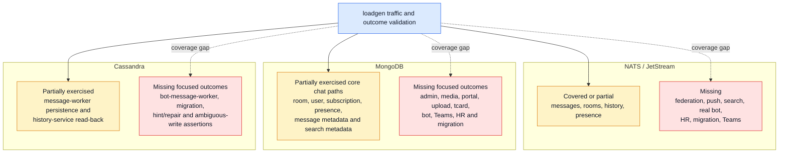
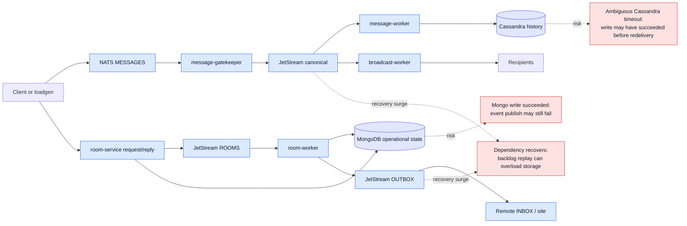
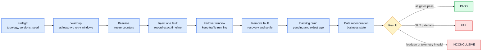

# Distributed Dependency Failure-Testing Overview

> Inventory date: 2026-08-11. This document is the shared entry point for NATS / JetStream, MongoDB, and Cassandra failure testing. Detailed subsystem plans remain authoritative for fault mechanics and subsystem-specific acceptance criteria.

## 1. Purpose and Scope

This program validates that production-like chat traffic remains correct and observable while messaging and storage dependencies fail and recover. It covers three independent failure domains:

- NATS / JetStream: transport, request/reply, stream persistence, consumer delivery, and federation.
- MongoDB: operational chat state, replica-set availability, elections, read/write behavior, and connection recovery.
- Cassandra: message-history persistence, partition availability, ambiguous writes, hinted handoff, and repair convergence.

The program must answer four questions for every injected fault:

1. Which services and user journeys were affected?
2. Did the system return success, an explicit failure, or a queryable terminal outcome for every accepted operation?
3. Did recovery create loss, duplication, reordering, stale state, or an uncontrolled backlog surge?
4. Was the observed failure in the system under test rather than in loadgen itself?

## 2. Documentation and Translation Policy

English files under `docs/` are the only repository source of truth. Local Traditional Chinese mirrors live under `.local-docs/zh-TW/`, are ignored by Git, and exist only as reading aids.

Every local translation records:

- The authoritative English source path.
- The source commit SHA.
- The generation date.
- A warning that changes must be made in the English source first.

When the recorded SHA differs from the branch revision containing the English source, the local translation is stale and must be regenerated. Local translations must never be used as an independent editing branch.

## 3. Dependency and Loadgen Coverage Map

Coverage labels describe whether current loadgen scenarios can generate relevant traffic **and** validate a business outcome. Incidental service activity without an outcome assertion is not considered full coverage.

## 4. Direct Service Dependency Inventory

The following inventory comes from direct connection construction in service startup code. Shared package dependencies are represented through their owning services.

| Dependency | Directly connected services/processes | Current loadgen status |
|---|---|---|
| NATS / JetStream | admin-service; bot-message-handler; bot-message-worker; botplatform-service; bot-room-service; broadcast-worker; history-service; hr-sync-worker; inbox-worker; media-service; message-gatekeeper; message-worker; notification-worker; outbox-worker; push-notification-service; room-service; room-worker; search-service; search-sync-worker; teams-hr-sync; teams-room-creation; translation-service; user-presence-service and its sync process; user-service; oplog connector/transformers | Partial. Core messages, rooms, selected request/reply, history, and presence are exercised. Federation, push, search correctness, real bot, HR, migration, and Teams lanes remain missing |
| MongoDB | admin-service; bot-message-handler; bot-message-worker; botplatform-service; bot-room-service; broadcast-worker; history-service; hr-sync-worker; inbox-worker; media-service; message-gatekeeper; message-worker; notification-worker; portal-service; room-service; room-worker; search-service; search-sync-worker; tcard-service; teams chat/member/HR/room/user sync and verification processes; upload-service; user-presence-service; user-service; migration processes | Partial. Existing message, room, user, history, and presence modes exercise many reads/writes indirectly, but there is no MongoDB fault-aware per-operation ledger or complete service-outcome coverage |
| Cassandra | message-worker; bot-message-worker; history-service; es-index-migrator | Partial. Soak and history modes cover normal user-message persistence/read-back. Bot, migration, ambiguous-write, hint, repair, and node-specific recovery outcomes are missing |

Services that do not connect directly may still fail because an upstream NATS-, MongoDB-, or Cassandra-dependent service is unavailable. Each detailed plan must distinguish direct dependency failure from propagated product impact.

## 5. Critical Cross-Dependency Write Paths

The detailed plans must verify both directions of every boundary:

- The dependency operation fails before committing, and the caller retries or returns an explicit failure.
- The dependency operation commits but the response is lost, causing an ambiguous retry.
- The data write succeeds but a later event publish fails.
- The event is durable but the downstream database remains unavailable.
- The dependency recovers and accumulated work replays faster than storage or downstream services can absorb it.

## 6. Shared Failure Classes

| Failure class | NATS / JetStream | MongoDB | Cassandra |
|---|---|---|---|
| Single-node failure | Server, stream leader, or consumer leader loss | Primary or secondary process loss | Coordinator or replica node loss |
| Election/topology change | RAFT leader election and route/gateway changes | Replica-set primary election | Driver host-state and token-aware rerouting |
| Quorum/availability loss | JetStream quorum unavailable | Replica-set majority unavailable | Requested consistency level cannot be satisfied |
| Network partition | Service-to-NATS or cross-site gateway partition | Service-to-replica-set partition | Service-to-node, rack, or data-center partition |
| Slow dependency | PubAck delay, slow consumer, storage latency | Slow query, replication lag, storage latency | Read/write timeout, overloaded coordinator, storage latency |
| Capacity exhaustion | Reconnect buffer, stream storage, AckPending | Connection pool, disk, memory, replication lag | Connection pool, pending compactions, disk, hot partitions |
| Fault-time restart | Service starts while stream/consumer is unavailable | Service starts while no writable primary is available | Service starts while required consistency is unavailable |
| Recovery surge | Redelivery and backlog drain | Queued callers and retry storm after primary recovery | Retried writes/reads, hints, repair, and backlog replay |

## 7. Standard Campaign Lifecycle

Fault duration must include both short failover events and outages longer than the largest application retry window. Every run must keep loadgen active through recovery and include a settle period long enough to classify late outcomes.

## 8. Shared Loadgen Requirements

All subsystem plans depend on the same loadgen foundations:

1. **Resilient, observable load-generator connections**
   - Explicit reconnect policies and connection-state telemetry.
   - Generator resource and socket health.
   - Automatic inconclusive classification when the generator is invalid.

2. **Per-operation outcome ledger**
   - Operation ID, lane, start time, deadline, expected effects, and final read-back.
   - Mutually exclusive eligible/good/bad/missing-after-deadline outcomes.
   - Send, fault, recovery, and settle windows that remain separately queryable.

3. **Dependency-specific observers**
   - NATS / JetStream stream and consumer state, advisories, and reconnect behavior.
   - MongoDB topology, election, pool, command, replication-lag, and write/read outcomes.
   - Cassandra host state, consistency failures, timeouts, hints/repair state, and partition-level read-back.
   - Shared metric names, gaps, labels, and dashboard rows are defined in the [Storage Dependency Metrics and Dashboard Contract](../specs/o11y/storage-dependency-metrics.md).

4. **Business reconciliation**
   - Mongo operational state.
   - Cassandra message and thread history.
   - NATS recipient events, federation state, push outcomes, and search convergence.

Existing modes should be combined into a production-calibrated profile rather than relying on built-in default ratios. Until coverage gaps are closed, every report must state which product lanes were not exercised.

## 9. Shared Acceptance Gates

- Every accepted operation has a successful, explicitly failed, or queryable terminal outcome. Missing-after-deadline is zero unless an approved error budget explicitly allows otherwise.
- No silent drop exists only in logs. Retry exhaustion and terminal drops are enumerable by operation/event ID.
- At-least-once replay may produce duplicate delivery attempts, but final business state is idempotent and contains no duplicate membership, message mutation, notification, or other side effect.
- Dependency and application backlogs return to pre-fault steady state within the approved recovery-time objective.
- All connection pools, consumer loops, sessions, and service readiness states recover without manual data deletion or process intervention unless the documented design explicitly requires an operator action.
- MongoDB, Cassandra, NATS-delivered state, search, push, and remote-site state converge where the tested user journey crosses those boundaries.
- A loadgen connection failure, observer gap, clock error, or resource saturation makes the affected interval inconclusive rather than a system pass or failure.

## 10. Combined-Failure Campaigns

Combined faults are executed only after the corresponding single-dependency campaigns pass:

1. JetStream leader election while MongoDB elects a new primary.
2. JetStream redelivery while Cassandra returns ambiguous write timeouts.
3. NATS recovery before MongoDB or Cassandra, producing a controlled backlog surge.
4. MongoDB write success followed by OUTBOX or canonical publish failure.
5. Cross-site NATS partition while one site's MongoDB is read-only or unavailable.
6. Service restart while both its transport and storage dependencies are unavailable.

Each combined campaign must preserve single-fault attribution through exact timelines, trace/run IDs, dependency metrics, and operation-level evidence.

## 11. Detailed Plan Registry

| Subsystem | Detailed plan | Status |
|---|---|---|
| NATS / JetStream | [NATS / JetStream Failure Testing and Loadgen Coverage Plan](nats-jetstream-failure-test-plan.md) | Initial inventory and campaign plan available |
| MongoDB | [MongoDB Failure Testing and Loadgen Coverage Plan](mongodb-failure-test-plan.md) | Code-evidenced service/store inventory and campaign plan available |
| Cassandra | [Cassandra Failure Testing and Loadgen Coverage Plan](cassandra-failure-test-plan.md) | Code-evidenced message/history/migration inventory and campaign plan available |
| Storage observability | [Storage Dependency Metrics and Dashboard Contract](../specs/o11y/storage-dependency-metrics.md) | Existing/missing metric inventory and shared production/failure-test dashboard contract available |

The subsystem documents own detailed fault injection, service-by-service behavior, observability queries, recovery objectives, and test cases. This overview owns shared terminology, lifecycle, loadgen requirements, cross-dependency boundaries, and combined campaigns.

## 12. Minimum Report Contents

- Git SHA, image tags, dependency versions, topology, replica/consistency settings, site IDs, loadgen seed, and traffic profile.
- Baseline, fault, failover, recovery, backlog-drain, and reconciliation timestamps.
- Per-lane eligible/good/bad/missing outcomes and p50/p95/p99 latency, including maximum recovery latency.
- Dependency topology and state changes during the run.
- Retry, timeout, exhaustion, duplicate, and terminal-outcome evidence.
- Reconciliation results with all missing or duplicate operation IDs.
- Pass/fail/inconclusive conclusion, owner, and follow-up issue for every failed gate.
