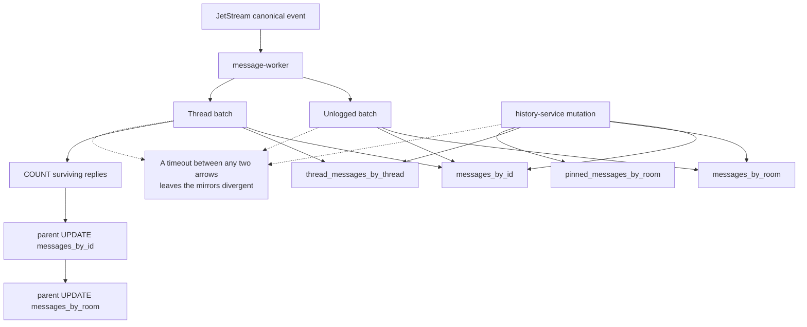

# Cassandra Behavior and Loadgen Coverage

> Verified against the code on 2026-08-21. Scope: message history through the
> real service path. The bot pipeline and the migration processes are out of
> scope and are listed in §5.
>
> Loadgen generates traffic and records what it can observe. It does not inject
> faults and it does not decide whether the campaign passed.

## 1. Dependency behavior that changes how a result reads

| Behavior | In the code | Why it matters when reading a result |
|---|---|---|
| Consistency | `gocql.LocalQuorum` everywhere (`pkg/cassutil`) | Availability follows local RF and reachable replicas. Record topology and RF for the run or a result cannot be interpreted |
| Query retry | `pkg/cassutil` never assigns `ClusterConfig.RetryPolicy`, and the gocql default is nil | An ordinary query is **not** retried by a shared policy. Whatever retries exist are per caller |
| Host reconnection | gocql's default constant policy: three attempts, one second apart | This restores the host connection. It does not replay the query that failed |
| Query timeout | Ten seconds | The caller's own deadline may expire first. Align every deadline before comparing timelines |
| Routing | Token-aware over round-robin | Queries move between coordinators during a fault, so client metrics must be read per server, not in aggregate |
| Pool | Eight connections per host by default; a service may override | A recovery surge can queue behind the pool while every node is technically up |
| message-worker retry | Transient handler errors use `jsretry.DefaultBackoff` against the consumer default `MaxDeliver=5` | A long outage exhausts the durable. The terminal drops are only enumerable from advisories |
| history-service | Cassandra reads and mutations run synchronously inside NATS request/reply | The caller sees an error or a timeout. An ambiguous mutation must be read back before any retry |
| Readiness | Health servers register `natsutil.HealthCheck` only | A worker whose Cassandra session is broken stays `Ready` |
| Bucket window | `MESSAGE_BUCKET_HOURS` defaults to 360 and must match every reader, every writer, and the TWCS compaction window | A mismatch is silent data unavailability. It will read exactly like data loss and is not one |

An ambiguous Cassandra write is the normal case, not the edge case: a timeout
means the coordinator stopped waiting, not that the write was rejected. Every
side-effecting lane therefore settles by reading back, never by counting reply
errors.

## 2. Services and what loadgen can prove about them

| Service | Cassandra role | Loadgen coverage |
|---|---|---|
| message-worker | Persists top-level and thread messages; reads quoted/parent metadata; updates parent thread counts and timestamps | **Reconciled**: the `cassandra_history` observer settles every admitted send. Not asserted: mirror-by-mirror convergence, terminal redelivery |
| history-service | Room/thread/pinned history and point lookups; edit, soft delete, reaction, pin/unpin | **Partial**: the soak lanes drive the main action set with sampled read-back. Ambiguous and partially-applied mutations are not individually settled |
| bot-message-worker | Persists bot messages and parent thread counts | **No traffic**: `botroom` mode is synthetic and does not drive the real bot chain |
| es-index-migrator | Reads history for the Elasticsearch migration | Out of scope this round (§5) |

Loadgen also opens its own Cassandra sessions for fixture seed and teardown.
Those are test infrastructure, they are uninstrumented, and their behavior must
never be read as service behavior.

## 3. Paths that need reconciliation, and how they fail

| Table | Partition key | Failure risk |
|---|---|---|
| `messages_by_room` | `(room_id, bucket)` | Bucket walk, TWCS late-write behavior, partial mirror write |
| `thread_messages_by_thread` | `thread_room_id` | Unbounded thread partition, partial mirror write |
| `pinned_messages_by_room` | `room_id` | Pin/unpin batch consistency, tombstones |
| `messages_by_id` | `message_id` | Ambiguous point write, LWT behavior |

| Path | Behavior | What it looks like |
|---|---|---|
| Top-level create | Unlogged two-table batch; INSERTs are primary-key idempotent and JetStream replay is meant to repair a partial attempt | A partial batch self-heals on redelivery. It does not self-heal if the delivery budget was already exhausted |
| Thread create | Writes two or three tables, counts surviving replies, then updates the parent in two independent statements | A failure after the batch leaves `tcount` and `thread_last_msg_at` stale until a replay completes |
| `UpdateParentMessageThreadRoomID` | Two separate `IF EXISTS` updates; a non-applied result is logged and returned as nil | A missing mirror during a fault produces no error at all. It needs an explicit consistency assertion |
| History edit | Updates `messages_by_id` first, then the room/thread/TShow/pinned mirrors in sequence | A failure partway leaves the earlier mirrors committed and the later ones stale |
| Soft delete | A `messages_by_id` LWT acts as a one-shot gate, then mirrors are updated and parent counts possibly recomputed | A retry after the LWT committed must repair the later steps. Classifying it as "already deleted, success" hides the incomplete delete |
| Reaction, pin/unpin | Denormalized batches; reaction is a **toggle** at the API layer | Blindly retrying an ambiguous reaction reverses the intended state. Read back, never retry |
| History bucket walk | Issues concurrent queries across buckets and pages | `cassandra.query.attempts` counts attempts and pages, not logical API requests. Do not read it as a request rate |

## 4. Reading the results

| Result | Meaning | Reading |
|---|---|---|
| `good` | The history observer read the message back and it matched | Persisted and readable |
| `bad` | Read back with content that disagrees | A real violation. Retained; it survives an unrelated scrape gap |
| `missing_after_deadline` | Admission recorded `good`, the message never appeared in history | The strongest loss claim available |
| `unverified` | The observer could not answer | Not evidence of loss |
| `not_sent` | The publish provably never left loadgen | No effect expected |

Cassandra-specific reading traps:

- **A bucket-window mismatch reads exactly like loss.** Confirm
  `MESSAGE_BUCKET_HOURS` is identical on message-worker, history-service and
  bot-message-worker before believing any `missing_after_deadline`.
- **`LOCAL_QUORUM` failing is a correct answer.** An explicit unavailable or
  timeout error during a replica loss is the system behaving as designed. The
  violation would be a success reply with no durable row behind it.
- **Read-back is not free.** Reconciliation borrows from the read lane, so a
  budget too small for the enabled observers turns every operation into
  `unverified` — a signature identical with and without a fault.

The query-time rules for turning these counters into `VALID` / `INCONCLUSIVE`,
impact and correctness live in
[`../loadgen/dashboard-contract.md`](../loadgen/dashboard-contract.md). Client
metric names and labels are in
[`../../specs/o11y/storage-dependency-metrics.md`](../../specs/o11y/storage-dependency-metrics.md).

## 5. Out of scope this round

- **The bot pipeline** (bot-message-handler → bot canonical →
  bot-message-worker). No loadgen lane drives the real chain.
- **Migration processes**, including es-index-migrator, which also has no
  Cassandra client instrumentation.
- **A Cassandra readiness probe.** Same reasoning as MongoDB: a probe would
  pull every pod out of its Service at once during a full outage. Client
  metrics carry the signal instead.

## 6. Code evidence

- Session, consistency, timeout: `pkg/cassutil/`
- Schema source of truth: [`../../cassandra_message_model.md`](../../cassandra_message_model.md)
- Row and UDT structs: `pkg/model/cassandra/`
- Bucket math: `pkg/msgbucket/`
- Write paths: `message-worker/store_cassandra.go`, `history-service/`
- Loadgen lanes, observers and the ledger: `tools/loadgen/soak_*.go`, `tools/loadgen/failure_*.go`
