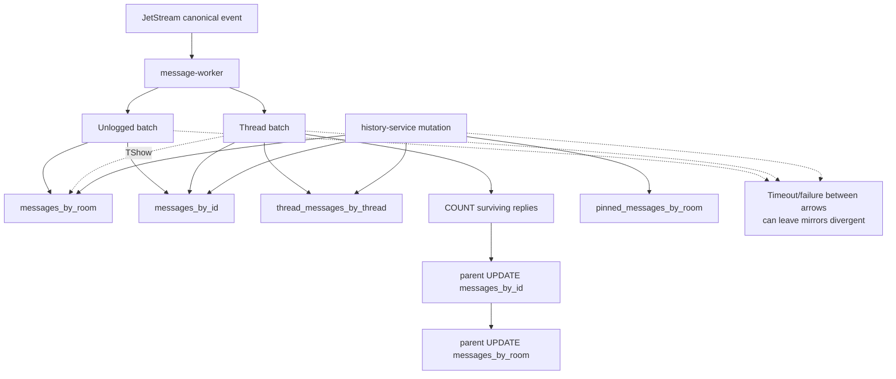

# Cassandra Failure Testing and Loadgen Coverage Plan

> Inventory date: 2026-08-11. This plan is based on the current Cassandra connection configuration, message/history repositories, JetStream consumers, loadgen soak implementation, CQL schema, and observability wiring. It complements the non-destructive [Cassandra Run A Soak Test](../cassandra/soak-test-plan.md); it does not replace it.

## 1. Executive Summary

Cassandra stores denormalized message history in four tables and is directly used by message-worker, bot-message-worker, history-service, and es-index-migrator. Current loadgen soak mode provides useful normal-path traffic and sampled read-back for user messages, threads, edits, deletes, reactions, pins, and history reads. It does not yet prove degraded-mode correctness.

The main gaps are:

1. No Cassandra server/JMX exporter is provisioned, so node, consistency, hint, compaction, dropped-message, tombstone, GC, disk, and repair state are invisible.
2. The shared Cassandra setup uses `LocalQuorum`, a ten-second query timeout, token-aware routing, and eight connections per host, but configures no query retry policy. JetStream redelivery or loadgen retry must not be reported as driver retry.
3. Cassandra batch operations use raw `session.ExecuteBatch`, which bypasses the o11y batch seam and leaves high-risk fan-out writes absent from operation metrics.
4. Denormalized create/edit/delete/reaction/pin workflows can partially commit. Aggregate success/error counters cannot prove convergence.
5. bot-message-worker and es-index-migrator have no focused loadgen failure scenario; es-index-migrator also lacks Cassandra instrumentation.
6. Service readiness checks NATS but not Cassandra.
7. Local Cassandra is one node with `SimpleStrategy` and replication factor 1. It cannot validate `LocalQuorum` degraded availability, hinted handoff, replica convergence, rolling failure, or repair.

The failure campaign must run against a disposable staging cluster with production-equivalent data centers, racks, replication factor, consistency, compaction, encryption, and bucket settings.

## 2. Connection, Retry, and Delivery Behavior

| Area | Current code behavior | Failure-test implication |
|---|---|---|
| Startup | `cassutil.Connect` creates the session; callers fail startup on error | Test steady-state node loss separately from service restart while Cassandra is unavailable |
| Consistency | `gocql.LocalQuorum` globally | Availability depends on local replication factor and reachable replicas; record topology/RF for every run |
| Query timeout | Ten seconds | User/RPC timeout may expire earlier or later; align all deadlines in the timeline |
| Routing | Token-aware over round-robin | Queries should move between replicas/coordinators; per-server client metrics are required |
| Pool | Eight connections per host by default; service config may override | Recovery surge can queue work even when nodes are technically up |
| Query retry | `pkg/cassutil` does not assign `ClusterConfig.RetryPolicy`; current gocql default is nil | Ordinary queries are not automatically retried by a configured shared query policy |
| Host reconnection | gocql default constant reconnection policy: up to three retries at one-second intervals | This restores host connections; it is not a guarantee that a failed query is replayed |
| message-worker retry | Transient handler errors use `jsretry.DefaultBackoff`; consumer defaults include `MaxDeliver=5` | A long outage can exhaust the durable. Final advisories/outcomes must be enumerable |
| bot-message-worker retry | Transient errors NAK against 1s/2s/5s/10s/30s consumer backoff with default `MaxDeliver=5` | Outages longer than the delivery budget can strand/exhaust bot messages |
| history-service | Cassandra mutations and reads run synchronously inside NATS request/reply | Callers receive errors/timeouts; ambiguous mutations require read-back before retry, especially reaction toggle |
| Readiness | Only NATS is registered in current health servers | Cassandra-broken workers/services can remain ready |

## 3. Direct Service Inventory and Loadgen Coverage

| Service/process | Cassandra role | Current loadgen coverage |
|---|---|---|
| message-worker | Persists top-level and thread messages; reads quoted/parent metadata; updates parent thread counts/timestamps; Teams batch migration writes | Partial. Soak/message/thread modes exercise normal user-message paths and sampled read-back; failover, terminal redelivery, Teams batch, and complete mirror reconciliation are missing |
| bot-message-worker | Persists bot top-level/thread messages and parent thread count | Missing. Existing `botroom` loadgen is synthetic and does not validate the real bot handler/canonical/worker persistence chain |
| history-service | Reads room/thread/pinned history and point lookups; edits, soft-deletes, reactions, pin/unpin | Partial. Soak covers the main action set, but aggregate/sampled verification is insufficient for ambiguous and partial failures |
| es-index-migrator | Reads Cassandra history for Elasticsearch migration | Missing. No focused loadgen scenario and no Cassandra client instrumentation |

Loadgen also opens Cassandra sessions for fixture seed/teardown and legacy direct modes. Those sessions are test infrastructure, are currently uninstrumented, and must not be confused with service behavior.

## 4. Schema and Multi-Write Risk Inventory

| Table | Partition key | Role | Failure risk |
|---|---|---|---|
| `messages_by_room` | `(room_id, bucket)` | Room history and TShow mirrors | Bucket walk, TWCS/late-write behavior, partial mirror writes |
| `thread_messages_by_thread` | `thread_room_id` | Thread history | Unbounded thread partition and partial mirror writes |
| `pinned_messages_by_room` | `room_id` | Pinned list | Pin/unpin batch consistency and tombstones |
| `messages_by_id` | `message_id` | Canonical point lookup/mutation gate | Ambiguous point write and LWT behavior |

`MESSAGE_BUCKET_HOURS` defaults to 72 and must match every reader/writer plus the TWCS compaction window. A mismatch is silent data unavailability, not a failover result.

Critical behavior verified in code:

- Top-level create uses an unlogged two-table batch. INSERTs are primary-key idempotent and JetStream replay is intended to repair a partial attempt.
- Thread create writes two or three tables, then counts surviving replies and updates the parent in two independent statements. Failure after the batch can leave `tcount`/`thread_last_msg_at` stale until a replay completes.
- `UpdateParentMessageThreadRoomID` uses two separate `IF EXISTS` updates. A non-applied result is logged and returned as nil, so fault-time missing mirrors need an explicit consistency assertion.
- History edit updates `messages_by_id` first and then the applicable room/thread/TShow/pinned mirrors sequentially. A later failure leaves an earlier mirror committed.
- Soft delete uses a `messages_by_id` LWT as a one-shot gate, then updates mirrors and possibly recomputes parent counts. A retry after the LWT committed must repair/verify later steps rather than be classified solely as an already-deleted success.
- Reaction and pin/unpin paths use denormalized batches. A reaction is a toggle at the API layer, so blindly retrying an ambiguous request can reverse the desired state.
- History bucket walks may issue concurrent queries and multiple pages. `cassandra.query.attempts` counts attempts/pages, not logical API requests.

## 5. Fault Campaign Matrix

| ID | Fault | Required topology | Primary assertions |
|---|---|---|---|
| C1 | Stop/restart one replica | RF3+ in one local DC | `LocalQuorum` remains available; coordinator traffic shifts; hints/lag converge |
| C2 | Stop enough replicas to lose local quorum | RF3+ | Reads/writes fail explicitly; no false success; JetStream delivery budget is not silently exhausted |
| C3 | Rolling node restart | Production-equivalent DC/rack topology | Continuous bounded service; pools/coordinators settle after every node |
| C4 | Partition one application from one node | Network fault | Token-aware routing moves work; no persistent bad-host pinning |
| C5 | Partition one application from quorum/all nodes | Network fault | Target service impact is isolated and observable; readiness policy behaves as documented |
| C6 | Inter-node partition | Multi-node | Consistency failures, hints, and recovery match RF/CL; no split-brain assumptions |
| C7 | Add latency/jitter/loss to one node | Multi-node | Ten-second query deadline and upstream RPC deadlines produce bounded, attributable failures |
| C8 | Ambiguous write timeout after replica application | Fault proxy/failpoint | Replay/read-back converges idempotent creates; mutations do not invert/duplicate state |
| C9 | Coordinator overload/thread-pool pressure | Multi-node | Dropped messages/queues/client errors correlate; traffic shedding prevents collapse |
| C10 | Compaction/disk pressure | Production compaction settings | Pending compactions/disk/latency recover; TWCS and bucket reads remain valid |
| C11 | Hinted-handoff accumulation and replay | Multi-node | Hint backlog is bounded, drains, and replicas converge without a second overload |
| C12 | Repair after outage/divergence | Multi-node disposable data | Repair completes; full reconciliation finds no missing/divergent mirrors |
| C13 | Restart service while Cassandra unavailable | Any | Startup failure is visible; service rejoins and resumes work cleanly after recovery |
| C14 | Recovery surge from JetStream backlog | Multi-node + real workers | Backlog drains without re-saturating pools, compaction, or thread pools |
| C15 | Hot room/thread during degraded state | Multi-node | No single-partition hotspot causes unbounded tail latency or dropped messages |

The local RF1 cluster can test only full outage/restart, client timeout, startup failure, and limited recovery behavior. It cannot produce a valid result for C1-C6, C11, or C12.

## 6. Workload and Reconciliation Plan

Use the existing soak action mix as the starting point:

- top-level send and thread reply;
- LoadHistory, GetThreadMessages, GetMessageByID, and pinned list;
- edit and soft delete;
- reaction add/remove;
- pin/unpin;
- correctness sampling and mutation-target-missing checks.

Extend it with real bot messages, Teams migration batches, and es-index migration reads. Keep traffic running through baseline, fault, recovery, backlog-drain, and settle phases.

For every run-owned message, reconcile all applicable mirrors:

| Message state | Required rows/assertions |
|---|---|
| Top-level | Equal semantic state in `messages_by_id` and the correct `messages_by_room` bucket |
| Thread reply | Equal state in `messages_by_id` and `thread_messages_by_thread`; also `messages_by_room` when TShow |
| Pinned | Base mirrors plus exactly one correct `pinned_messages_by_room` row |
| Edited | Content, encryption fields, quote metadata, `edited_at`, and `updated_at` agree across every mirror |
| Deleted | Deleted/type/body state agrees; pinned/TShow mirrors agree; no ghost partial row |
| Thread parent | `tcount` equals surviving replies and `thread_last_msg_at` equals newest surviving reply in both parent mirrors |
| Reaction | Final reactor membership agrees across mirrors; ambiguous toggle is resolved by read-back, not blind replay |

Sampling is useful for soak performance, but a fault campaign needs 100% reconciliation of the bounded run-owned operation set after settle.

## 7. Required Loadgen and Service Work

### P0 — before a conclusive campaign

1. Add an operation ledger with operation ID, expected table set, deadline, and eligible/good/bad/missing final state.
2. Add full post-settle mirror reconciliation for all run-owned operations.
3. Separate loadgen retry, NATS request retry, JetStream redelivery, Cassandra query attempt/page, and terminal exhaustion counters.
4. Add a real bot canonical-to-bot-message-worker scenario.
5. Add max-delivery advisory/terminal-message evidence for message-worker and bot-message-worker.
6. Instrument Cassandra batches through the supported o11y seam or an equivalent bounded batch metric.
7. Instrument es-index-migrator and expose loadgen's own Cassandra connection health so generator failure makes a run inconclusive.

### P1 — broader operational coverage

- Teams batch migration scenario and final row reconciliation.
- es-index migration scenario with search-document convergence.
- Old-bucket reads and aged-data faults.
- Hot-room and maximum-length-thread degraded scenarios.
- Operator-driven hint/repair validation with retained evidence.

## 8. Observability Preconditions

The authoritative metric inventory and dashboard design are in [Storage Dependency Metrics and Dashboard Contract](../../specs/o11y/storage-dependency-metrics.md).

A Cassandra campaign is conclusive only when:

- every targeted service emits query/connection metrics and batches are observable;
- every Cassandra node exports request latency/outcomes, timeouts/unavailable, dropped messages, pending compactions, hints, tombstones, thread pools, GC, SSTables, disk, and repair state;
- coordinator/node labels are bounded and topology metadata is captured;
- JetStream pending/redelivery/max-delivery signals are available;
- loadgen outcomes, saturation, resource health, run metadata, and exact fault phases are present;
- all clocks are synchronized and the reconciler remains healthy.

## 9. Acceptance Gates

- Availability during node loss matches the recorded local RF and `LocalQuorum`; no operation reports success without a queryable final state.
- Every accepted operation reaches a successful, explicitly failed, or queryable terminal outcome.
- All denormalized mirrors converge after recovery; thread counts/timestamps and reaction/pin states are correct.
- JetStream retries do not silently exhaust. Every terminally undelivered message/event is enumerable.
- Hints, pending compactions, thread-pool queues, client errors, and backlog return to baseline within the approved RTO.
- Node rejoin and repair complete without an unexplained increase in missing or divergent data.
- Recovery drain does not trigger a second overload event.
- Missing telemetry, loadgen saturation/disconnection, reconciliation failure, or a topology different from the declared test topology yields `INCONCLUSIVE`.

Numeric latency/error/RTO limits must use production objectives plus baseline measurements. The existing soak plan's exploratory thresholds are not automatically failure-test SLOs.

## 10. Execution Order

1. Baseline existing Run A soak against the multi-node staging topology.
2. One replica loss and rolling restart.
3. One-node application partition and latency injection.
4. Local quorum loss and recovery.
5. Ambiguous create, edit, delete, reaction, and pin outcomes with full reconciliation.
6. Hint accumulation/replay and compaction pressure.
7. Repair and post-repair reconciliation.
8. Hot-partition degraded run.
9. Bot and migration-specific campaigns.
10. Combined JetStream/Cassandra recovery-surge campaign after all single faults pass.

## 11. Code Evidence

- Session settings: `pkg/cassutil/cass.go`.
- Message writes and parent metadata: `message-worker/store_cassandra.go` and `pkg/threadcount/`.
- Bot message writes and consumer backoff: `bot-message-worker/store_cassandra.go`, `handler.go`, and `main.go`.
- History reads/mutations: `history-service/internal/cassrepo/` and `internal/service/`.
- Migration reader: `data-migration/es-index-migrator/messagesource_cassandra.go`.
- Schema and partitioning: `docs/cassandra_message_model.md` and `docker-local/cassandra/init/`.
- JetStream retry behavior: `pkg/jsretry/jsretry.go`, `pkg/stream/consumer.go`, and worker consumer setup.
- Existing workload and metrics: `tools/loadgen/soak_*`, `tools/loadgen/metrics.go`, and `docs/load-testing/cassandra/soak-test-plan.md`.
- Current local topology/RF: `docker-local/compose.deps.yaml` and `docker-local/cassandra/init/01-keyspace.cql`.
