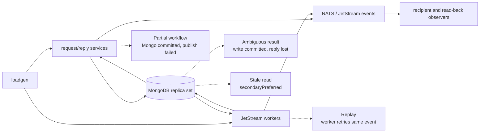

# MongoDB Failure Testing and Loadgen Coverage Plan

> Inventory date: 2026-08-11. This plan is based on direct MongoDB connection construction, store implementations, handler paths, current loadgen commands, and observability wiring in the repository. Code takes precedence over older inventory documents.

## 1. Executive Summary

MongoDB is the operational database for users, rooms, subscriptions, thread metadata, sessions, uploads/media metadata, bot/Teams state, and migration checkpoints. Current loadgen traffic exercises many core chat reads and writes indirectly, but it cannot yet prove service-complete MongoDB failover safety.

The main gaps are:

1. No loadgen-wide operation ledger correlates accepted requests with final MongoDB state and downstream events.
2. Admin, portal, media, upload, tcard, HR, Teams, and migration paths have no focused failure scenarios.
3. Six Teams processes and es-index-migrator do not enable MongoDB client instrumentation; loadgen's Mongo clients are also uninstrumented.
4. No MongoDB server exporter is provisioned in the repository.
5. Service readiness checks NATS but not MongoDB, so a Mongo-broken process may remain ready.
6. Local MongoDB is a standalone single node; it cannot validate replica-set election, majority loss, transaction behavior during failover, or secondary read staleness.

Run the first conclusive campaign in staging against the production replica-set topology, after the P0 work in Sections 7 and 8.

## 2. Connection, Retry, and Consistency Behavior

| Area | Current code behavior | Failure-test implication |
|---|---|---|
| Startup | `mongoutil.Connect` creates a client and performs `Ping`; callers normally exit on error | Restart/startup during an outage must be a separate campaign from steady-state failover |
| Read preference | Default is primary. `ConnectRead` uses `secondaryPreferred`; history-service parses a configurable preference | Secondary reads may remain available but stale; tests must record the effective setting and validate monotonic/business expectations |
| Driver retries | The MongoDB Go driver defaults retryable reads and supported retryable writes to one retry unless URI/options override it | A driver retry is not a general application retry and does not cover every operation, multi-updates, arbitrary bulk shapes, or whole business workflows |
| Application retries | There is no shared Mongo operation retry wrapper | NATS request/reply paths usually return an error/timeout; JetStream consumers retry only when handler errors reach their settle logic |
| Transactions | admin-service uses `WithTransaction` for password/session revocation and deactivation/session revocation | The callback may run more than once on transient transaction errors; side effects inside it must remain transaction-only and idempotent |
| Bulk writes | broadcast-worker, inbox-worker, room-service, room-worker, HR/Teams processes, and shared stores use unordered bulk writes | Partial results and retryability depend on the model mix; final per-document reconciliation is required |
| Change streams | oplog-connector uses resume tokens/checkpoints and exits on non-cancellation stream error; code 286 is an explicit operator-reseed failure | Node failover should resume without loss; a stale oplog window must fail loudly and never silently restart from now |
| Pool tuning | Most clients use driver/URI defaults. history-service explicitly configures min/max pool size | Pool exhaustion and recovery must be observed per service; one service's tuning cannot be assumed for another |
| Readiness | Current health servers register NATS only | MongoDB failure can leave pods ready while requests fail or workers repeatedly NAK |

Mongo write success and caller success are different facts. For a timed-out retryable write, the first attempt may have committed. Every side-effecting test therefore uses an operation ID and final-state reconciliation rather than counting response errors alone.

## 3. Direct Service and Process Inventory

Coverage means loadgen creates relevant traffic **and validates the final business outcome**. Incidental Mongo activity is partial, never full coverage.

| Service/process | MongoDB role and principal collections | Current loadgen coverage |
|---|---|---|
| admin-service | Users, admin audit, sessions; transactional credential/deactivation changes | Missing |
| bot-message-handler | Resolves subscriptions, rooms, and users for bot messages | Missing real bot flow |
| bot-message-worker | At-rest room DEKs when encryption is enabled | Missing real bot persistence outcome |
| botplatform-service | Bot users and subscriptions | Missing |
| bot-room-service | Rooms, subscriptions, users, room keys | Partial: synthetic `botroom` mode; not a complete real bot lifecycle |
| broadcast-worker | Reads room/subscription/thread/user state; asynchronously coalesces `rooms.lastMsg*` bulk updates | Partial: message E2 observes delivery, but does not reconcile coalesced Mongo updates |
| history-service | Reads apps, rooms, subscriptions, threads, users and room DEKs | Partial: history and soak modes exercise selected reads; not every metadata/error path |
| hr-sync-worker | Reads HR employees and bulk-upserts users | Missing |
| inbox-worker | Applies cross-site subscription/room/user/thread-subscription state | Missing federation scenario |
| media-service | Users, subscriptions, avatars, custom emoji | Missing |
| message-gatekeeper | Reads subscriptions, rooms, users and room metadata caches | Partial: all message modes exercise admission; cache hits can hide Mongo impact |
| message-worker | Reads users; writes thread rooms/subscriptions; reads/writes room DEKs | Partial: message/thread/soak modes exercise core paths; no complete Mongo side-effect ledger |
| notification-worker | Reads subscriptions, thread rooms, rooms, users | Partial incidental traffic; no notification outcome assertion |
| portal-service | Users and HR employees | Missing |
| room-service | Broad room/subscription/thread/user/app/Teams/room-key operational state | Partial: members, room-read, read-receipt, daily and selected RPC modes; many mutations remain uncovered |
| room-worker | Applies membership/room/thread state and room-key changes | Partial: member scenarios cover a subset; no complete retry/partial-bulk reconciliation |
| search-service | Apps, subscriptions, users for search authorization/enrichment | Missing search correctness under Mongo failure |
| search-sync-worker | Teams users and users for indexing events | Missing search convergence scenario |
| tcard-service | Cards | Missing |
| teams-chat-member-sync | Reads/writes Teams chat state and reads Teams users | Missing; Mongo client metrics also missing |
| teams-chat-sync | Reads/writes Teams users and chats | Missing; Mongo client metrics also missing |
| teams-hr-sync | Reads/writes HR employee state and users | Missing; Mongo client metrics also missing |
| teams-room-creation | Reads/writes Teams chat room-creation state | Missing; Mongo client metrics also missing |
| teams-room-inspector | Reads rooms and subscriptions | Missing |
| teams-room-verify | Reads/writes Teams chat verification state | Missing; Mongo client metrics also missing |
| teams-user-sync | Reads/writes Teams users and reads HR employees | Missing; Mongo client metrics also missing |
| upload-service | Reads subscriptions/rooms and writes uploads | Missing |
| user-presence-service | Reads/writes user presence state | Partial: presence modes exercise live behavior, but do not reconcile Mongo persistence/recovery |
| user-service | Users, apps, SSO tokens, subscriptions, rooms, threads | Partial: daily and selected request/reply paths; broad user surface is not covered |
| es-index-migrator | Reads Mongo subscriptions while migrating Cassandra history to search | Missing; Mongo client metrics also missing |
| oplog-connector | Watches configured source collections and persists checkpoints | Missing fault injection; dedicated progress metrics exist |
| oplog-direct-transfer | Reads/writes configured source/target collections | Missing |
| oplog-collections-transformer | Source lookups and target writes for users, threads, and room members | Missing |
| oplog-transformer | Reads source MongoDB and drives transform/event flow | Missing |

## 4. Critical Failure Boundaries

High-risk code paths requiring explicit reconciliation:

- admin-service transactions spanning user and session collections.
- room-service/room-worker multi-document and unordered bulk membership changes.
- message-worker thread room/subscription writes followed by Cassandra and event side effects.
- broadcast-worker's in-memory `rooms.lastMsg*` coalescer: flush errors are logged and not returned to the message handler because the field is derived.
- inbox-worker federation bulk application, where replay must converge without duplicate state.
- oplog-connector change stream, checkpoint, publish, and resume-token boundary.
- Teams sync processes with source/read and target/write clients, including `secondaryPreferred` reads where configured.

## 5. Fault Campaign Matrix

| ID | Fault | Required topology | Primary assertions |
|---|---|---|---|
| M1 | Kill/restart one secondary | 3+ member replica set | No primary-path outage; lag returns to baseline; change streams and secondary reads recover |
| M2 | Kill current primary | 3+ voting members | Election completes; bounded error/latency spike; supported retryable operations recover; no missing/duplicate business state |
| M3 | Rolling restart | Production-equivalent replica set | Continuous service within SLO; pools and topology settle after each member |
| M4 | Remove majority / isolate primary | 3+ voting members | Majority writes fail explicitly; no false success; reads match configured preference/concern |
| M5 | Partition one service from all members | Network fault at pod/client boundary | Only the targeted client fails; readiness policy and service-specific impact are correct |
| M6 | Partition service from current primary but not secondaries | Replica set | Primary reads/writes fail or reroute as designed; secondaryPreferred paths expose bounded/understood staleness |
| M7 | Add latency, jitter, and packet loss | Replica set | Pool queues/timeouts remain bounded; no retry storm; deadlines are honored |
| M8 | Exhaust client pool | Production concurrency and pool config | Pending checkout/timeouts visible; load sheds; recovery does not leak connections |
| M9 | Slow disk/cache pressure | Server-level fault | Server saturation explains client latency; replication and oplog window remain safe or alert |
| M10 | Restart service while MongoDB unavailable | Any | Startup fails visibly/crash-loops as designed, then joins cleanly after recovery |
| M11 | Ambiguous response after commit | Fault proxy/failpoint | Retried operation is idempotent or final state is reconciled; no duplicate side effect |
| M12 | Change-stream interruption/election | Replica set + oplog connector | Resume token continues without loss; duplicate publishes dedupe by `Nats-Msg-Id` |
| M13 | Oplog history loss | Disposable environment | Connector exits loudly with code-286 semantics; operator reseed is required; no restart-from-now data loss |
| M14 | Recovery surge | JetStream backlog plus recovering MongoDB | Drain rate is controlled; pools/server do not re-collapse; derived state converges |

Local single-node MongoDB can run only total-outage, restart, latency, pool-pressure, and startup-unavailable variants. Results from local M2/M4/M6/M12 are invalid because there is no replica-set election or majority.

## 6. Workload and Reconciliation Plan

Run a production-calibrated mix continuously across baseline, fault, recovery, drain, and settle phases:

- message admission, top-level messages, thread replies, edits/deletes/reactions/pins, and history read-back;
- room create/read, add/remove member, role/name/state changes, read receipts, and user chat-list reads;
- presence lifecycle;
- cross-site membership/subscription events;
- representative media/upload, admin/session, bot, HR, Teams, search, tcard, and migration canaries.

Each operation ledger record needs: run ID, operation ID, lane, target entities, submit time, deadline, acknowledged/accepted state, expected Mongo mutations, expected downstream events, and final reconciliation result.

Reconciliation must query by operation-owned identifiers and verify:

- exactly one intended document/state transition, including uniqueness constraints;
- membership and subscription sets agree;
- room/thread metadata and derived last-message fields converge;
- transaction pairs either both commit or neither commits;
- no duplicate audit/session/business side effects after ambiguous retries;
- change-stream checkpoints never pass an unacknowledged event;
- downstream NATS, Cassandra, search, recipient, and remote-site state converges where the journey crosses those systems.

## 7. Required Loadgen Work

### P0 — before a conclusive core-chat campaign

1. Add the shared operation outcome ledger with eligible/good/bad/missing-after-deadline results.
2. Add a Mongo reconciliation observer for rooms, subscriptions, thread rooms/subscriptions, users, and run-owned operation records.
3. Add run/scenario/phase metadata and fault annotations without placing run ID on every application metric.
4. Add loadgen connection/pool metrics and invalidate a run when loadgen itself cannot reach MongoDB or saturates.
5. Add explicit ambiguous-result cases for room/member/thread/user writes.
6. Add federation/INBOX reconciliation so Mongo replay behavior is observable across sites.

### P1 — complete product coverage

- Admin credential/deactivation transaction scenario.
- Media/upload authorization and metadata scenario.
- Portal/HR/user provisioning scenario.
- Real bot handler/worker/platform/room scenario.
- Search authorization plus index-convergence scenario.
- Tcard scenario.
- Teams chat/member/room/user/HR synchronization scenarios.
- Oplog connector and migration checkpoint/resume scenario.

## 8. Observability Preconditions

The authoritative metric inventory and dashboard design are in [Storage Dependency Metrics and Dashboard Contract](../../specs/o11y/storage-dependency-metrics.md).

A MongoDB campaign is conclusive only when:

- all targeted clients emit Mongo operation and pool metrics;
- a server exporter exposes member role/state, elections, replication lag, oplog window, connections, operations/latency, WiredTiger/cache, locks/flow control, disk and resource metrics;
- JetStream backlog/redelivery is available for Mongo-writing workers;
- service/runtime/loadgen health is present;
- every phase is annotated and clocks are synchronized;
- the operation ledger and reconciliation observer remain healthy.

## 9. Acceptance Gates

- Exactly one primary exists after recovery; all intended members return and replication lag converges within the agreed RTO.
- Every accepted operation has a successful, explicitly failed, or queryable terminal result; missing-after-deadline is zero unless an approved error budget says otherwise.
- No transaction is partially visible and no ambiguous retry duplicates a business side effect.
- Unordered bulk and replay-driven paths converge per document, not merely per request.
- Change-stream processing has no gap; duplicates are bounded/deduplicated; history loss is a loud operator-required failure.
- Pool pending requests/timeouts and service error rates return to pre-fault steady state without process intervention.
- Recovery/backlog drain does not cause a second outage.
- A missing exporter, broken observer, saturated loadgen, or unsynchronized timeline produces `INCONCLUSIVE`, never `PASS`.

Numeric SLO/RTO thresholds must come from the production service objectives and measured baseline; this document does not invent them.

## 10. Execution Order

1. Instrumentation/exporter/readiness preflight.
2. Baseline with the full workload and reconciliation, no injected fault.
3. Secondary loss and rolling restart.
4. Primary election.
5. Client-specific and primary-only network partitions.
6. Majority loss and recovery.
7. Latency/pool/disk pressure.
8. Ambiguous commit-response tests on selected idempotent and transactional operations.
9. Change-stream resume/history-loss tests.
10. Recovery-surge and combined NATS/MongoDB campaigns only after all single faults pass.

## 11. Code Evidence

- Connection, ping, instrumentation, pool tuning, and read preference: `pkg/mongoutil/`.
- Transaction path: `admin-service/store_mongo.go`.
- Change-stream/resume/checkpoint path: `data-migration/oplog-connector/`.
- Derived last-message coalescing: `broadcast-worker/coalescer.go` and `store_mongo.go`.
- Bulk-write paths: `inbox-worker`, `room-service`, `room-worker`, `hr-sync-worker`, Teams sync processes, and `pkg/mongoutil/collection.go`.
- Direct service wiring: each listed service/process `main.go`.
- Loadgen modes and Mongo fixtures/soak ownership: `tools/loadgen/`.
- Current local topology: `docker-local/compose.deps.yaml`.
