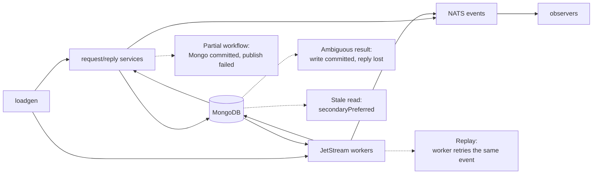

# MongoDB Behavior and Loadgen Coverage

> Verified against the code on 2026-08-21. Scope for this round: the services
> that serve ordinary chat traffic. Cross-site federation, push delivery, the
> Teams synchronisation processes and the data-migration processes are out of
> scope and are listed in §6.
>
> Loadgen generates traffic and records what it can observe. It does not inject
> faults and it does not decide whether the campaign passed.

## 1. Dependency behavior that changes how a result reads

These are the mechanisms that make "the request failed", "the request was slow"
and "we could not see the result" look alike. Everything else about MongoDB is
somebody else's dashboard.

| Behavior | In the code | Why it matters when reading a result |
|---|---|---|
| Read preference | `mongoutil.Connect` defaults to primary; `mongoutil.ConnectRead` uses `secondaryPreferred`; history-service parses its own | A degraded read can still answer, from stale data. Record the effective setting per service before attributing a wrong answer to loss |
| Observer read routing | The `room_state` observer forces a primary read even though the shared soak client is `secondaryPreferred` (`tools/loadgen/soak_roomverify.go`) | Without it a lagging secondary reports a committed write as missing, and replication lag becomes a false data-loss claim during exactly the fault being measured |
| Driver retries | The Go driver retries a retryable read or supported retryable write **once** unless the URI overrides it | One retry is not an application retry. It does not cover multi-updates, arbitrary bulk shapes, or a business workflow |
| Application retries | There is no shared Mongo retry wrapper | Request/reply handlers surface the error or the timeout. JetStream consumers retry only when the handler error reaches their settle logic |
| Transactions | admin-service uses `WithTransaction` for credential and session revocation (`admin-service/store_mongo.go`) | The callback may run more than once on a transient transaction error, so side effects inside it must stay transaction-only and idempotent |
| Unordered bulk writes | broadcast-worker, inbox-worker, room-service, room-worker and `pkg/mongoutil/collection.go` | A bulk result can be partially applied. Reconcile per document, never per request |
| Pool tuning | Driver/URI defaults almost everywhere; history-service configures min/max explicitly (`history-service/cmd/main.go`) | Pool exhaustion and recovery are per service. One service's headroom says nothing about another's |
| Readiness | Health servers register `natsutil.HealthCheck` only; no service probes MongoDB | A pod with a broken Mongo client stays `Ready` and keeps taking traffic. This is deliberate for this round — see §6 |
| Startup | `mongoutil.Connect` pings and callers exit on failure | A pod that restarts during an outage crash-loops. That is a different scenario from steady-state degradation and must not be read as one |

One consequence outranks the rest: **a Mongo write succeeding and the caller
seeing success are different facts.** A retryable write that times out may have
committed on the first attempt. Every side-effecting lane therefore carries an
operation ID and is settled by reading final state, never by counting reply
errors.

## 2. Services and what loadgen can prove about them

"Reconciled" means loadgen reads the final state back and can call the
operation good or bad. "Traffic only" means the service is exercised but a
Mongo-side failure would show up as latency or an error class, not as a
per-operation verdict.

| Service | MongoDB role | Loadgen coverage |
|---|---|---|
| room-service | Rooms, subscriptions, threads, users, room keys | **Reconciled**: member add/remove, rename, mute toggle, room create, read receipt. **Traffic only**: member list, rooms-info batch, subscription list |
| room-worker | Applies membership/room/thread state from the ROOMS stream | **Reconciled** through the same lanes — the write it performs is what `room_state` reads back |
| message-gatekeeper | Reads subscriptions, rooms, users and room metadata caches | **Traffic only**: every message lane exercises admission. A cache hit can hide a Mongo failure |
| message-worker | Reads users; writes thread rooms and thread subscriptions; reads/writes room DEKs | **Partial**: message persistence is reconciled in Cassandra, but the Mongo thread-room and thread-subscription writes are not read back |
| broadcast-worker | Reads room/subscription/thread/user state; coalesces best-effort `rooms.preview*` bulk updates | **Partial**: with the recipient observer enabled, delivery is reconciled per recipient. The coalesced preview write is not, and it is deliberately droppable — history-service's walk repairs a room with no stored preview |
| unread-worker | Writes `rooms.lastMsg*`, the sender's subscription `lastSeenAt` and the `hasMention` badge; reads nothing | **Partial**: the state it writes is read back by `room_state` and the unread lanes, but its own retry behaviour (batches held un-acked at `MaxDeliver=-1`) is not driven by any failure lane |
| history-service | Reads apps, rooms, subscriptions, threads, users, room DEKs | **Traffic only**: soak and history lanes cover the main reads |
| user-service | Users, apps, SSO tokens, subscriptions, rooms, threads | **Traffic only**: the `user_read` lane drives 14 reads uniformly. No write is reconciled |
| user-presence-service | Presence state | **Traffic only**: the presence lane compares live signals; Mongo persistence and recovery are not read back |
| search-service | Apps, subscriptions, users for authorisation and enrichment | **Traffic only**: the `search_read` lane |
| search-sync-worker | Users and Teams users for indexing | **Not observed**: the search-index observer is refused at startup (soak bodies carry no per-message marker) |
| notification-worker | Reads subscriptions, thread rooms, rooms, users | **Not observed**: incidental traffic, no notification outcome assertion |
| admin-service | Users, admin audit, sessions; transactional revocation | **No traffic** |
| media-service, upload-service, portal-service, tcard-service | Avatars/emoji, uploads, users and HR employees, cards | **No traffic** |
| bot-message-handler, bot-message-worker, bot-room-service, botplatform-service | Bot users, subscriptions, rooms, room DEKs | **No traffic**: the `botroom` mode is synthetic and does not drive the real bot chain |
| hr-sync-worker | Reads HR employees, bulk-upserts users | **No traffic** |
| inbox-worker | Applies cross-site subscription/room/user state | Out of scope this round (§6) |

## 3. Paths that need reconciliation, and how they fail



| Path | What can go wrong | What it looks like |
|---|---|---|
| room-service and room-worker membership changes | Multi-document and unordered bulk writes partially applied | The room reads back with a member set that matches neither the before nor the after state. `room_state` reports `bad`, not `missing` |
| message-worker thread writes | Thread room/subscription written, then Cassandra or the event publish fails | The reply exists in history with no thread metadata behind it. Not visible to any current observer |
| unread-worker `rooms.lastMsg*` coalescer | Flush errors hold the batch un-acked and retry (`MaxDeliver=-1`), on a consumer separate from fan-out | Room ordering and unread badges lag while the flush is failing, then land on recovery. Delivery is unaffected, so nothing in the ledger moves |
| broadcast-worker `rooms.preview*` coalescer | Flush errors are logged and **not** returned to the handler; the batch is dropped, not retried | The room list falls back to history-service's Cassandra walk for that room, which warms the document back on the next read. Invisible in the ledger, and by design |
| Ambiguous mutation | The request commits, the reply is lost | Loadgen never resends a mutation: a replayed remove drops a member the first attempt already removed, and a replayed mute toggle undoes itself. Ambiguity is settled by reading state back |
| `secondaryPreferred` reads | A secondary answers from behind the write | Without the forced-primary rule in §1 this is indistinguishable from data loss |
| admin-service transaction pairs | The callback re-runs and duplicates a side effect outside the transaction | No traffic drives it, so this round cannot see it at all |

## 4. Reading the results

Terminal results per operation, and what each one licenses you to say:

| Result | Meaning | Reading |
|---|---|---|
| `good` | Every required observer confirmed the effect | The write landed and is visible |
| `bad` | An observer saw a state that could not legally occur | A real correctness violation. Survives incomplete evidence — keep it |
| `missing_after_deadline` | Admission recorded `good`, but the effect never appeared | The strongest loss claim available. Requires admission to have succeeded first |
| `unverified` | The observer could not answer | **Not** evidence of loss. "We could not look" |
| `not_sent` | The request provably never left loadgen | No effect is expected; excluded from loss accounting |

Two failure modes belong to loadgen, not to MongoDB, and both look like a
healthy run if read carelessly:

- **A reconciliation deficit turns every operation into `unverified`.** The
  reconciler advances one observer per claim and borrows its budget from the
  read lane, so the budget must cover `enabled observers x send rate` plus
  headroom for retries. When it does not, the backlog grows until every
  operation ages out at `SOAK_RECONCILE_DEADLINE` and
  `loadgen_failure_inflight` parks at `rate x deadline`. That signature is
  identical with and without a fault.
- **A ledger invalidation is sticky.** Capacity, WAL and accounting failures
  latch for the life of the process (`loadgen_failure_invalidations_total`).
  An unreachable MongoDB does not invalidate the ledger; observer health marks
  the interval instead.

The query-time rules for turning these counters into `VALID` / `INCONCLUSIVE`,
impact and correctness live in
[`../loadgen/dashboard-contract.md`](../loadgen/dashboard-contract.md).

## 5. Campaign control-plane configuration

For a planned two-minute Mongo outage, use a campaign overlay rather than
changing the Chart defaults:

```yaml
soak:
  heartbeatInterval: 30s
  heartbeatStaleAfter: 30m
  roomReadRate: "30"

ledger:
  reconcileDeadline: 10m
  roomReconcileReadShare: 0.5

recipientObserver:
  enabled: true
```

`heartbeatStaleAfter` is the active-run lease used by seed and teardown, not a
dashboard freshness threshold. It must exceed the longest planned outage plus
Mongo/client recovery and operator margin; otherwise a stale `running`
manifest can authorize teardown while loadgen is still dispatching. The longer
lease also delays cleanup after a real loadgen crash. If heartbeat renewal does
not recover, loadgen stops the workload one heartbeat interval before the last
persisted heartbeat would become stale. That restores the lease invariant:
once seed or teardown may treat the manifest as abandoned, this process is no
longer dispatching. The emergency override for a crashed loadgen is documented
in the Kubernetes runbook and is permitted only after the Deployment is stopped
and the heartbeat is proven not to advance.

On that lease-risk path only, in-flight lanes receive half of one heartbeat
interval to drain. If they finish, the other half remains for ledger, observer,
NATS, and process shutdown. If a lane does not drain, loadgen logs the active
lane names and counts, records
`loadgen_failure_invalidations_total{reason="lease_abort"}` through the durable
ledger, and bypasses graceful cleanup so no later unbounded wait can cross the
lease boundary. The abandoned operations may recover from the WAL as
`unverified`, but the `lease_abort` invalidation makes the affected campaign
interval explicitly **INCONCLUSIVE**. Ordinary SIGTERM and duration completion
retain the existing unbounded graceful drain.

The invalidation write itself is bounded to one quarter of a heartbeat interval
so a stalled WAL cannot defeat the lease fence. If that final write does not
finish, loadgen emits a separate error saying the invalidation may not have
reached the WAL and exits anyway; the lease guarantee takes precedence over
preserving that last evidence record.

Loadgen requires
`heartbeatStaleAfter >= 2 * heartbeatInterval + 5s`; the additional interval is
the shutdown margin and the five seconds cover an in-progress heartbeat
attempt. The staging values above stop dispatch approximately 29 minutes 30
seconds after the last persisted heartbeat if renewal never recovers. This PR
adds no operator knob for the five-second bound. The Kubernetes runbook lists
the complete staging overlay and the corresponding environment variables. The
relationship is a workload-start requirement; teardown has no heartbeat loop
and validates its documented crash-recovery override separately.

At the configured mutation/read-receipt rates the room-state demand is 8.05
operations/second. The default room-read capacity leaves only
`20 * 0.5 - 8.05 = 1.95` operations/second for catch-up; the campaign overlay
raises that to `30 * 0.5 - 8.05 = 6.95`. A two-minute outage therefore creates
at most about 966 pending operations and takes about 139 seconds to drain under
the steady-rate model. This recovery calculation applies only while the outage
and recovery remain well below the ten-minute reconciliation deadline. Once an
operation expires, extra read capacity cannot turn its `unverified` result back
into evidence.

## 6. Out of scope this round

- **Cross-site federation** (OUTBOX, remote INBOX, inbox-worker convergence)
  and **push delivery** — next round.
- **Teams synchronisation and data-migration processes** — not part of ordinary
  operation. They are also the only Mongo clients still missing
  `mongoutil.WithObservability`, so they would have no client telemetry anyway.
- **A MongoDB readiness probe.** Adding one would take every pod out of its
  Service at the same moment during a full outage, which makes recovery slower
  and the "is the service itself alive" question harder to answer. Client
  metrics carry that signal instead.

## 7. Code evidence

- Connection, instrumentation, pool tuning, read preference: `pkg/mongoutil/`
- Transaction path: `admin-service/store_mongo.go`
- Derived last-message coalescing: `unread-worker/batch.go`, `unread-worker/flush.go`, `unread-worker/store_mongo.go`
- Room-preview coalescing (best-effort, drops on failure): `broadcast-worker/preview_writer.go`, `broadcast-worker/store_mongo.go`
- Bulk-write paths: `inbox-worker`, `room-service`, `room-worker`, `pkg/mongoutil/collection.go`
- Loadgen lanes, observers and the ledger: `tools/loadgen/soak_room*.go`, `tools/loadgen/failure_*.go`
- Client metric names and labels: [`../../specs/o11y/storage-dependency-metrics.md`](../../specs/o11y/storage-dependency-metrics.md)
