# NATS / JetStream Core-Message Failure Campaign Runbook

Status: operator runbook and readiness contract. Formal execution is blocked
until every **Required** capability in Sections 4 and 5 is implemented and the
known-failure proof in Section 8 passes.

## 1. Objective and Scope

The first campaign answers one bounded question:

> While production-like user-message traffic remains constant, does a
> NATS / JetStream failover or outage cause an accepted message to disappear,
> produce an unintended duplicate final state, fail to reach its expected
> recipients, leave a consumer loop dead, or fail to recover its backlog within
> the approved objective?

Included path:

```text
loadgen user publish
  -> MESSAGES
  -> message-gatekeeper admission
  -> MESSAGES_CANONICAL
  -> message-worker -> Cassandra -> history-service read-back
  -> broadcast-worker -> expected recipient event observer
  -> notification-worker processing/side-effect metric
```

Included campaigns:

- F01: stop/restart one follower NATS node;
- F02: stop/restart the current stream leader;
- F03: stop/restart the consumer leader or its hosting node;
- F04: rolling restart of the NATS cluster;
- F07a: short complete site-level NATS outage;
- F07b: long complete site-level NATS outage exceeding reconnect/retry windows.

Deferred:

- cross-site OUTBOX/INBOX federation;
- push-provider delivery;
- real bot, Teams, HR, and migration streams;
- MongoDB/Cassandra fault injection;
- disk-full, stream deletion, consumer deletion, and reply-loss ambiguity;
- combined dependency failures.

Deferred lanes may still experience incidental traffic, but they are not part
of this campaign's pass claim.

## 2. Roles and Separation of Duties

| Role | Responsibility | Prohibited action |
|---|---|---|
| Campaign lead | Approves manifest, starts/stops run, owns verdict | Must not silently change gates after fault begins |
| Loadgen operator | Seed, deploy, monitor loadgen/evidence | No fault-injection privileges |
| Fault operator/controller | Apply/remove exactly the declared fault and emit events | Cannot edit loadgen evidence or verdict |
| NATS observer | Identify leaders/quorum and monitor NATS state | Cannot change fault target without abort/restart |
| Service observer | Watch target workers, storage impact, logs/traces | Cannot mark missing telemetry as pass |
| Safety operator | Own abort/rollback authority | Does not override retained evidence |

One person may hold multiple roles in a non-production environment, but every
action and timestamp remains attributable.

## 3. Required Topology

- one isolated staging site;
- at least three NATS servers;
- JetStream stream replicas matching production, normally three;
- target streams and durables owned by IaC;
- production-equivalent AckWait, MaxDeliver, reconnect, and resource limits;
- MongoDB and Cassandra available so this campaign isolates NATS failure;
- loadgen and its retained PVC scheduled outside the NATS node failure domain;
- one or more real recipient connections with credentials issued through the
  approved authentication path;
- synchronized clocks across NATS, Kubernetes, loadgen, services, Prometheus,
  Grafana, log, and trace backends.

Single-node local Docker Compose is for instrumentation and total-outage smoke
tests only. It cannot produce a valid F01-F04 failover result.

## 4. Tool Readiness Gates

Every item is required before a formal run:

- [ ] Versioned run manifest and append-only fault events.
- [ ] PVC-backed operation ledger healthy with no invalidation/untracked/dropped delta.
- [ ] Message operation requires `admission`, `cassandra_history`, and
      `recipient_broadcast` observers.
- [ ] Recipient observer validates exact expected recipient set and duplicates.
- [ ] Every loadgen NATS pool exposes connected/outage/resource health.
- [ ] Target durable sampler exposes up, pending, ack-pending, redelivery,
      ack floor, oldest pending age, and last active.
- [ ] NATS advisory observer persists max-delivery/resource/leader evidence.
- [ ] Target services expose consumer-loop, disposition, redelivery,
      publish/retry/exhaustion, and terminal-failure metrics.
- [ ] Target services expose client connection state and reconnect-buffer
      events, so a broker outage is distinguishable from a dead consumer loop
      and Core NATS publish success can be qualified (metrics contract 7.1-7.2).
- [ ] Machine-readable report evaluates `PASS`, `FAIL`, and `INCONCLUSIVE`.
- [ ] Production base dashboard and failure overlay contain no empty required
      panels during a no-fault baseline.

Contracts:

- [Loadgen Failure Evidence Platform](../loadgen/evidence-platform.md)
- [NATS / JetStream Failure Metrics Contract](nats-metrics-contract.md)
- [Failure-Test Observability Deployment](observability-deployment.md)

## 5. Campaign Configuration

Freeze these values in `manifest.json` before warmup:

- Git SHA and every image tag;
- NATS version, server names, topology, stream replicas, AckWait, MaxDeliver,
  storage limits, and reconnect policy;
- site, namespace, seed, and fixture owner;
- traffic profile and every action rate;
- expected recipient policy;
- observer names and deadlines;
- baseline, fault, recovery, and settle minimum durations;
- latency/error/recovery/backlog objectives from the approved SLO/baseline;
- maximum allowed clock skew and scrape staleness;
- fault injector adapter and target-selection evidence;
- abort criteria and safety owner.

Do not use built-in loadgen defaults as production objectives. Capture an
approved production-calibrated profile. Repeating a campaign requires the same
seed/profile/fault duration unless the new manifest declares the difference.

## 6. Operator Variables and Read-Only Discovery

Examples use PowerShell-compatible environment variable notation only as
documentation. Resolve exact values before execution:

```text
NAMESPACE=<isolated staging namespace>
SITE_ID=<site>
RUN_ID=<unique run id>
NATS_MONITOR_URL=<internal monitoring endpoint>
PROM_URL=<campaign Prometheus>
GRAFANA_URL=<campaign Grafana>
EVIDENCE_DIR=<mounted run directory>
```

Read-only Kubernetes discovery:

```powershell
kubectl get pods -n $env:NAMESPACE -o wide
kubectl get deployments,statefulsets -n $env:NAMESPACE
kubectl get pvc -n $env:NAMESPACE
kubectl get events -n $env:NAMESPACE --sort-by=.lastTimestamp
```

NATS resource discovery must record raw monitoring responses for:

- server identity, routes, and gateways;
- JetStream meta leader/quorum;
- target stream leader/replicas/config;
- target consumer leader/config/pending/ack floor/last active.

The exact curl/NATS CLI command depends on the secured monitoring deployment.
The platform owner must provide a read-only wrapper that writes these responses
under `<run-id>/preflight/`; the runbook must not embed credentials.

## 7. Standard Campaign Lifecycle

```mermaid
flowchart LR
    A["Preflight"] --> B["Seed"]
    B --> C["Warmup"]
    C --> D["Baseline"]
    D --> E["Record fault_started"]
    E --> F["Inject one fault"]
    F --> G["Keep identical traffic"]
    G --> H["Remove fault"]
    H --> I["Record fault_removed"]
    I --> J["Recovery and drain"]
    J --> K["Settle"]
    K --> L["100% run-owned reconciliation"]
    L --> M["Evidence report"]
```



### 7.1 Preflight

1. Create and fsync `manifest.json`.
2. Verify topology, stream/consumer config, exporters, clocks, loadgen PVC, and
   fault-controller permissions.
3. Confirm no unrelated incident, deployment, rebalance, repair, or backup is
   active.
4. Confirm all target workers are ready and consumer-loop gauges are one.
5. Confirm required metrics are fresh and dashboards show baseline data.
6. Record baseline NATS monitoring responses and application versions.
7. Verify the safety operator can remove the planned fault.

Any failure stops the run before seeding.

### 7.2 Seed and warmup

1. Run the approved seed job with the manifest seed and run-owned site/data.
2. Start the soak Deployment using the production-calibrated profile.
3. Wait at least two maximum retry windows and until caches/pools stabilize.
4. Require one canary message to complete admission, history, and recipient
   observations.
5. Require offered load to match target without saturation.

### 7.3 Baseline

Baseline begins only after warmup gates pass. Record:

- operation/observer counters;
- latency distributions;
- stream/consumer state and ack floor;
- service loops, publish outcomes, storage client operations;
- loadgen/observer/runtime health;
- resource utilization.

The approved baseline duration must contain enough operations for every enabled
lane and at least two scrape windows.

### 7.4 Fault injection

1. Re-run target discovery immediately before the fault.
2. Verify the discovered target still matches the scenario.
3. Append and fsync `fault_started` with the selected target.
4. Apply exactly one fault through the approved external adapter.
5. Keep loadgen profile and deployment unchanged.
6. Monitor abort criteria continuously.

If target identity changed between discovery and injection, do not choose a new
target silently. Append `run_aborted`, remove any partial fault, and restart
with a new run ID.

### 7.5 Fault removal, recovery, and settle

1. Remove the fault through the same adapter.
2. Confirm the target process/link/node is restored.
3. Append and fsync `fault_removed`.
4. Continue identical traffic through recovery.
5. Wait for the settle gates in Section 10.
6. Stop new traffic only after the approved settle window.
7. Keep reconciliation and evidence services alive until all bounded run-owned
   operations are terminal or their deadlines expire.

### 7.6 Finalization

1. Run 100% reconciliation of the bounded run-owned message set.
2. Generate `report.json`, exact-ID sidecars, `summary.md`, and checksums.
3. Freeze dashboard queries and collect log/trace references.
4. Set deployment phase to `stopped` to retain evidence.
5. Review verdict and reasons; never hand-edit the generated result.
6. Copy evidence to the approved retention location before teardown approval.

## 8. Known-Failure Proof

Run once after tooling/environment changes and before formal F-campaigns.

### K1: observer loss

- isolate only the recipient observer from its NATS connection;
- leave services and message traffic healthy;
- require observer health to fall and affected operations to become
  `unverified`;
- expected overall verdict: `INCONCLUSIVE`, never `PASS` or product `FAIL`.

### K2: missing recipient event

- use a controlled test hook or subject-level proxy in the isolated environment
  to suppress one run-owned recipient event while allowing history persistence;
- require exact message and recipient evidence;
- expected operation result: `missing_after_deadline` or `bad` according to the
  observer contract;
- expected overall verdict: `FAIL`.

### K3: no-fault baseline

- remove all test hooks;
- run the same profile through baseline and settle;
- expected overall verdict: `PASS`.

Failure of any proof blocks formal execution.

## 9. Scenario Procedures

Fault commands are adapter-specific. Each adapter must implement `discover`,
`apply`, `status`, and `remove` and emit structured evidence. Raw destructive
commands must not be assembled from unvalidated names or broad selectors.

### F01: follower loss

Target discovery:

- select a NATS server that is not JetStream meta leader, target stream leader,
  or target consumer leader;
- store evidence proving the roles immediately before injection.

Apply:

- stop or isolate that one server for the approved duration;
- do not restart other servers or services.

Expected:

- quorum and leaders remain available;
- no required client closes;
- no accepted message is missing;
- transient replica lag returns to baseline;
- no unnecessary consumer-loop stop or terminal delivery.

### F02: stream-leader loss

Target discovery:

- identify the current leader of the selected target stream;
- record replicas and current consumer leaders.

Apply:

- stop or isolate only that server.

Expected:

- exactly one replacement leader appears within the approved election window;
- PubAck latency/errors are bounded and attributable;
- producers/consumers recover without manual stream creation;
- ack floor resumes and backlog/oldest age drain;
- final history and recipient observations converge.

### F03: consumer-leader loss

Target discovery:

- identify the target durable's current consumer leader and hosting server;
- select one durable per run, starting with `message-worker`, then
  `broadcast-worker`, then `notification-worker`.

Apply:

- stop or isolate the hosting server without deleting the consumer.

Expected:

- a replacement consumer leader appears;
- application iterator remains or becomes live;
- consumer-loop gauge returns to one;
- redelivery may increase, but terminal drops remain zero;
- ack floor resumes and business effects are idempotent.

### F04: rolling cluster restart

Target order:

- determine a safe order that preserves quorum at every step;
- restart only one server at a time;
- require the prior server to be healthy/current before proceeding.

Expected:

- no quorum loss;
- each server rejoins routes/RAFT before the next restart;
- loadgen and services reconnect as required;
- no cumulative consumer-loop or connection leak;
- final backlog and business state converge.

Abort the roll immediately if quorum, required stream availability, or the
prior node's rejoin gate fails.

### F07a: short complete outage

Apply:

- isolate all NATS servers from application/loadgen clients for a duration
  shorter than the approved reconnect/retry boundary;
- preserve the servers and storage themselves where the adapter permits.

Expected:

- loadgen records its own disconnect, so the availability interval is not
  misattributed;
- every target service records `disconnected` and then `reconnected`, and its
  connected gauge returns to one;
- buffered/retried work remains within configured bounds;
- no reconnect-buffer overflow on any service or loadgen pool;
- services and observers reconnect automatically;
- accepted operations converge after recovery.

Core NATS publish counters keep reporting success while the client buffers
across the disconnect, so recipient delivery for this interval is read from the
recipient observer and the connection metrics, never from
`chat_nats_publish_attempts_total` alone.

### F07b: long complete outage

Apply:

- use an approved duration longer than reconnect buffering and at least one
  application retry/AckWait boundary;
- keep the same steady offered traffic.

Expected:

- explicit failures, not false success;
- `not_sent`, availability failure, and downstream loss remain distinct;
- no process spin/OOM or uncontrolled retry storm;
- terminal/max-delivery evidence is enumerable;
- deliveries taken away at shutdown appear as `handler_cancelled`, not as
  `left_pending`, so AckWait expiry stays distinguishable;
- any reconnect-buffer overflow is recorded and the affected interval is marked
  unproven for Core NATS delivery;
- recovery does not create a second overload;
- all accepted operations reconcile or produce an explicit failed result.

Long outage results are `INCONCLUSIVE` for performance intervals in which
loadgen itself cannot offer traffic, but retained operation correctness can
still identify independent product failures.

## 10. Recovery and Settle Gates

All required gates must remain satisfied for the approved continuous settle
window:

- NATS server/routes/quorum and exactly one target stream/consumer leader are
  healthy;
- every target service consumer-loop gauge is one;
- loadgen and observer connections are healthy;
- consumer pending and ack-pending return to baseline tolerance;
- oldest pending age returns to baseline tolerance;
- ack floor advances after recovery;
- redelivery stops growing abnormally;
- terminal/max-delivery counters have no unexplained increase;
- every target service's client connected gauge is one, with no further
  disconnect or buffer-full events;
- service error, publish, pool, CPU, memory, and goroutine signals stabilize;
- Cassandra/Mongo downstream client pressure returns to baseline;
- no new ledger invalidation/untracked/dropped events occur;
- all due operation observers can make progress.

Pending zero alone is insufficient. A deleted durable can also report no
pending work; the durable and consumer loop must explicitly exist and be live.

## 11. Verdict Gates

### Hard `FAIL`

- a healthy authoritative observer confirms an accepted message absent after
  deadline;
- an expected recipient never receives the event after deadline;
- duplicate delivery creates duplicate final business state;
- terminal/max-delivery work cannot be enumerated and reconciled;
- a target consumer loop remains dead after dependency recovery;
- backlog/oldest age fails the approved recovery objective;
- recovery causes a second sustained outage or resource collapse;
- a service reports success without a queryable final effect.

### `INCONCLUSIVE`

- manifest/topology differs from the declared campaign;
- clocks exceed approved skew;
- required exporter, metric family, annotation timeline, or observer is absent
  or stale;
- loadgen OOMs, closes permanently, saturates, or misses offered load;
- ledger invalidates, drops, or cannot track a required operation;
- the fault target/action cannot be proven;
- an unrelated deployment/incident overlaps the campaign;
- final reconciliation does not complete.

### `PASS`

`PASS` requires complete evidence, zero hard failures, and every availability,
latency, backlog, and recovery objective satisfied. A campaign may pass only
the lanes explicitly declared in its manifest.

## 12. Abort and Rollback

Abort immediately when:

- the fault escapes the isolated namespace/site or affects an undeclared
  dependency;
- quorum loss occurs in a scenario intended to preserve quorum;
- safety limits for disk, memory, CPU, or error rate are exceeded;
- fault removal cannot be confirmed;
- evidence PVC becomes unavailable;
- the fault controller loses target identity or control;
- another operational incident begins.

Rollback order:

1. stop applying new fault actions;
2. remove/isolate the declared fault using the validated target reference;
3. restore required NATS members/routes/quorum;
4. verify service and observer connections/loops;
5. continue evidence capture and reconciliation if safe;
6. append `run_aborted` with reason and exact timestamps;
7. retain evidence; do not clean queues/streams/databases merely to make the
   environment look healthy;
8. perform data repair only under a separately recorded operator procedure.

The run verdict after abort is `INCONCLUSIVE` unless independent complete
evidence already proves a product `FAIL`; report both facts.

## 13. Evidence Review Checklist

- [ ] Manifest digest and image versions match the actual deployment.
- [ ] Fault target and start/removal times are independently visible.
- [ ] All required metrics were fresh for the complete evaluation window.
- [ ] Loadgen and observer health/invalidation were evaluated first.
- [ ] Eligible equals the sum of mutually exclusive terminal results.
- [ ] Exact missing/duplicate/unverified records are attached.
- [ ] Stream/consumer leader and ack-floor transitions are captured.
- [ ] Backlog peak and time-to-baseline are reported.
- [ ] Downstream storage pressure and service restarts are reported.
- [ ] Final history and recipient reconciliation completed.
- [ ] Deferred lanes are explicitly listed and not claimed as covered.
- [ ] Evidence checksums and retention copy are complete.

## 14. Recommended Execution Order

1. Local known-failure proof and total-outage smoke test.
2. Staging no-fault baseline.
3. F01 follower loss.
4. F02 stream-leader loss.
5. F03 one durable at a time.
6. F04 rolling restart.
7. F07a short outage.
8. F07b long outage.
9. Rerun any failed scenario after remediation using the same seed/profile and
   fault duration.

Do not advance to federation, MongoDB/Cassandra faults, or combined faults until
these single-site core-message campaigns produce conclusive evidence.
