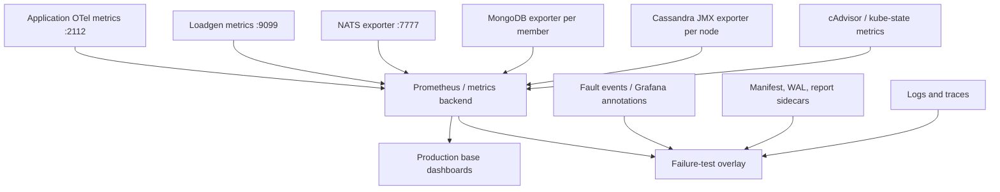

# Failure-Test Observability Deployment

Status: deployment and operations specification. Local NATS exporter and
loadgen dashboard components exist, but staging/production storage exporters,
canonical recording rules, and full campaign preflight are not represented in
this repository today.

## 1. Purpose

This document defines how metrics, logs, traces, fault annotations, and retained
loadgen evidence are deployed and validated for dependency failure campaigns.
The same base dashboards are intended for production operations. Failure tests
add a run overlay; they do not create a separate incompatible metric system.

The deployment must support two questions at the same time:

- What user-visible impact occurred?
- Which dependency, client, service loop, backlog, or recovery surge caused it?

## 2. Dashboard Reuse Model

Use one production base dashboard per dependency area and a failure-test
overlay:



Base dashboards are continuously useful after launch. The overlay adds run
metadata, fault windows, loadgen outcomes, reconciliation, and verdict panels.

## 3. Environment Support Matrix

| Capability | Local single-node | Staging multi-node | Production |
|---|---|---|---|
| App OTel metrics | Required | Required | Required |
| Loadgen metrics/evidence | Supported | Required for campaigns | Optional controlled canary only |
| NATS exporter | Existing in local observability/loadgen compose | Required, all nodes/JSZ | Required |
| MongoDB exporter | Missing | Required, every replica-set member | Required |
| Cassandra JMX exporter | Missing | Required, every node | Required |
| Fault annotations | Manual acceptable | Required durable event + Grafana copy | Change/incident annotations only |
| Election/quorum campaigns | Invalid | Required topology | Normally observation only |
| Full-disk/destructive faults | Disposable local variant only | Isolated disposable namespace/cluster | Prohibited unless separately approved |

Local results validate instrumentation, total outage/restart, and known-failure
detection. They do not certify NATS RAFT failover, MongoDB election/majority, or
Cassandra RF/consistency behavior.

## 4. Required Components

### 4.1 Application telemetry

Every targeted Go process initializes `pkg/obs.Init` once and exposes SDK
metrics on `:2112`. Cluster Prometheus must discover every targeted instance,
not a fixed stale list. Required labels include `service_name`, environment,
site, and instance/pod at collection time.

Application telemetry includes:

- runtime and process metrics;
- HTTP/NATS/Cassandra/Mongo client metrics where supported;
- shared cache/domain metrics;
- the NATS application contract in
  [NATS / JetStream Failure Metrics Contract](nats-metrics-contract.md).

### 4.2 Loadgen telemetry and evidence

- scrape `:9099` for aggregate loadgen and ledger metrics;
- mount the retained evidence PVC separately from target dependencies;
- retain manifest, fault events, WAL, report, and exact-ID sidecars;
- schedule loadgen outside the fault target's node/failure domain;
- collect container/pod restarts, OOM reason, CPU, memory, network, and volume
  usage;
- prohibit more than one ledger writer for a run-owned `ReadWriteOnce` PVC.

### 4.3 NATS / JetStream

- enable the NATS monitoring endpoint on an internal-only interface;
- deploy `prometheus-nats-exporter` with JSZ, route, gateway, connection, and
  server statistics needed by the metrics contract;
- query every NATS server or use an exporter mode that preserves member and
  leader identity;
- deploy the advisory observer with read-only subscribe permissions to the
  approved system advisory subjects;
- deduplicate stream/consumer replica data through recording rules.

The local repository uses `natsio/prometheus-nats-exporter:0.16.0` on `:7777`.
Staging and production must pin an explicitly approved version and validate its
raw metric names before applying canonical rules.

### 4.4 MongoDB

- deploy an exporter for every replica-set member;
- use least-privilege monitoring credentials stored in the cluster secret
  manager;
- expose member state/role, election, lag, oplog window, connections,
  operations/latency, WiredTiger/cache, locks/flow control, and disk;
- retain the source metric name and exporter version beside each canonical
  recording rule.

### 4.5 Cassandra

- attach a JMX exporter/agent to every Cassandra node;
- expose read/write latency/outcomes, timeout/unavailable, dropped messages,
  compaction, hints, repair, tombstones, thread pools, GC, SSTables, and disk;
- label nodes with bounded cluster/DC/rack/node identity;
- verify exporter overhead before production rollout.

### 4.6 Logs and traces

- retain structured JSON logs with service, site, request ID, and trace IDs;
- preserve NATS trace continuity and Cassandra/Mongo spans;
- never place tokens, credentials, plaintext message bodies, or full dynamic
  subjects in evidence;
- link from dashboard exemplars or time-aligned trace queries when supported;
- use logs/traces for per-operation diagnosis, not as the only retry/exhaustion
  counter.

## 5. Scrape Contract

| Job | Target | Discovery | Required labels | Failure behavior |
|---|---|---|---|---|
| `chat-services` | `:2112/metrics` | Kubernetes service/pod discovery | environment, site, service_name, instance | Missing targeted service invalidates affected campaign |
| `loadgen` | `:9099/metrics` | Run deployment/pod | environment, site, scenario, traffic_profile | Missing or stale makes run `INCONCLUSIVE` |
| `nats-exporter` | `:7777/metrics` | Exporter service/member targets | cluster, site, server | Missing member/stream/consumer signal blocks NATS campaign |
| `mongodb-exporter` | exporter port per member | Stateful member discovery | cluster, site, member | Missing targeted member blocks Mongo campaign |
| `cassandra-jmx` | JMX exporter port per node | Stateful member discovery | cluster, site, dc, rack, node | Missing targeted node blocks Cassandra campaign |
| `cadvisor` / kubelet | cluster standard | Kubernetes | namespace, pod, container, node | Needed for resource invalidation and recovery surge |
| `kube-state-metrics` | cluster standard | Kubernetes | namespace, workload, pod, reason | Needed for readiness, restart, OOM, scheduling evidence |

**Campaign scrape interval is 30 seconds, confirmed.** This is the cadence the
dashboard contract's evaluation rules are derived from
([`../loadgen/dashboard-contract.md`](../loadgen/dashboard-contract.md)): the
two-minute lookback, the one-minute evaluation step, the minimum of three
samples, and the five-consecutive-healthy-points recovery rule are all sized
against 30-second samples and do not carry over unchanged to another cadence.
A campaign that scrapes at a different interval must restate those thresholds,
not merely reuse them.

The 5-second interval in the loadgen docker-compose overlay is a local
development setting and is not the campaign cadence.

All campaign thresholds must remain longer than two scrape intervals or
explicitly account for sampling uncertainty.

Prometheus must reject samples older than the allowed clock-skew threshold. A
target that reports `up=1` but whose required business series is stale or absent
does not pass preflight.

## 6. Relabeling and Cardinality

Standardize:

- `environment`;
- `site`;
- `cluster`;
- `service_name`;
- `namespace`;
- `stream` and `consumer` for configured JetStream resources.

Retain pod/instance/node for drill-down, but aggregate it out of default user
impact panels. Do not copy Kubernetes UID, image digest, run ID, message ID,
room ID, account, or raw subject into application metric labels.

Run correlation uses:

1. dashboard time range;
2. environment/site/deployment labels;
3. bounded scenario/traffic-profile metadata;
4. manifest and annotation timestamps.

## 7. Canonical Recording Rules

Recording rules provide stable names over exporter changes. Required groups:

1. `chat:nats_server_and_raft`;
2. `chat:jetstream_stream`;
3. `chat:jetstream_consumer`;
4. `chat:mongodb_topology_and_capacity`;
5. `chat:cassandra_topology_and_capacity`;
6. `chat:service_dependency_client`;
7. `chat:loadgen_failure_evidence`.

Every rule file includes:

- canonical series and labels;
- raw source series/expression;
- exporter and server version tested;
- aggregation/deduplication rationale;
- a rule test with representative input series;
- owner and last validation date.

NATS leader and consumer rules must avoid counting the same logical resource
once per replica. MongoDB primary rules must prove exactly one primary.
Cassandra node rules must not hide a down node by summing only currently
reporting exporters.

## 8. Production Base Dashboards

### 8.1 `Messaging Dependencies`

Rows:

1. user impact and operation outcome;
2. NATS connections/routes/gateways;
3. stream leader/quorum/messages/bytes;
4. consumer availability, pending, ack-pending, redelivery, ack floor, oldest
   age, and last active;
5. application consumer-loop and disposition metrics;
6. publish/request results and latency;
7. terminal advisories/drops;
8. downstream Mongo/Cassandra/search impact;
9. runtime and resource saturation.

### 8.2 `Storage Dependencies`

Use the base rows in
[Storage Dependency Metrics and Dashboard Contract](../../specs/o11y/storage-dependency-metrics.md):

1. user impact;
2. client operations;
3. client pools/connections;
4. topology;
5. server saturation;
6. durability/convergence;
7. upstream JetStream backlog;
8. runtime.

Dashboard variables are `environment`, `site`, `dependency`, `cluster`,
`service_name`, and `operation`. Member/server/node is a drill-down variable.

## 9. Failure-Test Overlay

The overlay reuses base rows and adds:

- selected run manifest summary;
- baseline/fault/recovery/settle annotations;
- loadgen offered, completed, failed, retried, saturated, and untracked rates;
- terminal operation and observer result mix;
- loadgen and observer health;
- before/during/after deltas;
- backlog and oldest-age recovery duration;
- exact report/evidence-bundle link;
- `PASS`, `FAIL`, or `INCONCLUSIVE` with all reasons.

Grafana is a view, not the verdict authority. The report generated by the
evidence platform owns the final gate inputs and result.

## 10. Fault Annotation Deployment

The external fault injector or operator writes a durable fault event through
the evidence-platform interface first. A small annotation bridge copies it to
Grafana using a service account limited to annotation creation in the failure
test folder.

Annotation tags are bounded:

- `failure-test`;
- environment;
- site;
- scenario ID;
- event type;
- dependency.

The annotation text may include run ID and target for operator readability,
but those values do not become Prometheus labels. Annotation failure raises a
warning; durable local timeline failure invalidates the run.

## 11. Preflight

Run preflight immediately before warmup and store the results in the evidence
bundle.

### Topology and scrape

- declared NATS/Mongo/Cassandra members exactly match discovered members;
- required stream and durable names exist;
- every required scrape target is `up`;
- each required metric contract has a fresh sample;
- exactly one NATS stream leader and, where expected, one MongoDB primary exist;
- Cassandra nodes/DC/rack/RF/CL match the manifest;
- loadgen evidence PVC is mounted, writable, and has approved free space.

### Health and traffic

- every target consumer loop gauge is one;
- configured pending and oldest age are within baseline limits;
- loadgen pools and observers are connected;
- ledger invalidation/untracked/dropped deltas are zero;
- offered traffic reaches the approved baseline without saturation;
- one canary operation completes every required observer;
- Prometheus, Grafana, log, and trace clocks differ by less than the approved
  skew.

### Known-failure proof

Before the first formal campaign in an environment:

1. disable or isolate one non-production observer and confirm `INCONCLUSIVE`;
2. suppress one run-owned recipient event and confirm `FAIL` with the exact
   missing operation/recipient in the evidence bundle;
3. restore both and confirm a no-fault baseline can `PASS`.

An environment that has not passed known-failure proof cannot produce a
conclusive green campaign.

## 12. Retention and Evidence Bundle

Minimum bundle:

```text
<run-id>/
|-- manifest.json
|-- fault-events.jsonl
|-- report.json
|-- summary.md
|-- ledger.wal
|-- missing-operations.jsonl
|-- duplicate-observations.jsonl
|-- preflight/
|-- prometheus/
|-- logs/
|-- traces/
`-- checksums.sha256
```

Prometheus snapshots or query results must include query text, evaluation time,
window, and backend URL identity. Logs and traces may be references rather than
full exports when the approved backend retention exceeds the campaign evidence
retention.

Do not delete the PVC until report generation, checksums, upload, and operator
approval complete.

## 13. Security and Access

- monitoring endpoints are cluster-internal and network-policy restricted;
- exporter credentials are read-only and stored in the secret manager;
- loadgen has no pod-delete, node, network-policy, or database-admin rights;
- the fault injector has only scenario-specific permissions and cannot mutate
  evidence files;
- the annotation bridge cannot edit dashboards or alert rules;
- evidence access is audited because identifiers in exact sidecars may be
  operationally sensitive;
- plaintext message content and auth material are prohibited from evidence.

## 14. Ownership

Assign named owners before implementation:

| Deliverable | Required owner |
|---|---|
| Exporter deployment/versioning | Platform/IaC |
| Canonical recording rules and rule tests | o11y/platform |
| Application metric emitters | Service owners |
| Loadgen metrics/evidence/report | Load-test tooling owner |
| Dashboards and alerts | o11y plus dependency owner |
| Fault annotations and campaign runbook | Resilience-test owner |
| Evidence retention and access | Platform/security |

Unowned required telemetry is a campaign blocker, not an accepted silent gap.

## 15. Deployment Order and Definition of Done

1. Deploy exporters in local/staging and inventory raw series.
2. Add canonical recording rules and automated rule tests.
3. Close application/client instrumentation gaps.
4. Build production base dashboards.
5. Add loadgen evidence/report and failure overlay.
6. Execute scrape/topology preflight.
7. Execute known-failure proof.
8. Promote the same exporters/rules/base dashboards to production through the
   normal IaC review process.

Observability is ready for a campaign only when:

- every required target and metric contract is fresh;
- dashboards render without empty required panels;
- raw-to-canonical rule mappings are versioned and tested;
- fault events appear in both durable evidence and Grafana;
- observer/exporter loss produces `INCONCLUSIVE`;
- a known product loss produces `FAIL`;
- production base dashboards remain useful without a load-test run selected.
