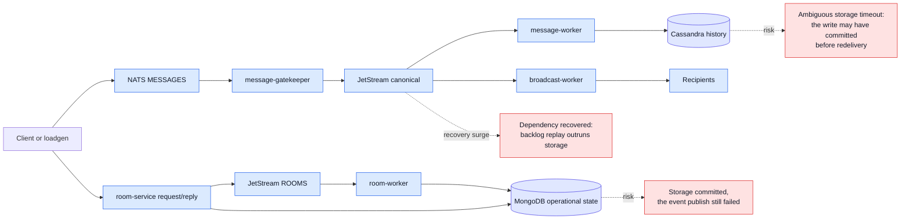

# Dependency Failure Testing — Overview

Entry point for the NATS / JetStream, MongoDB and Cassandra failure documents.
Each dependency document owns its own mechanisms; this page owns what the three
have in common.

## What loadgen does, and does not do

Loadgen runs a continuous production-shaped workload and records what it can
observe about each operation. It does not inject faults, does not schedule
campaign phases, and does not emit a verdict. The fault is performed
independently and its timestamps are an external input; loadgen keeps the same
traffic running through baseline, disruption and recovery, and does not change
behavior because a dependency state changed.

That split is why every document here is written around **reading a result**
rather than around executing a test.

| Document | Owns |
|---|---|
| [`nats-jetstream.md`](nats-jetstream.md) | Transport, request/reply, stream persistence, consumer delivery |
| [`mongodb.md`](mongodb.md) | Operational chat state: rooms, subscriptions, users, threads |
| [`cassandra.md`](cassandra.md) | Message history and its denormalized mirrors |
| [`../loadgen/observation.md`](../loadgen/observation.md) | The lanes, observers and ledger that produce the evidence |
| [`../loadgen/dashboard-contract.md`](../loadgen/dashboard-contract.md) | How a query window becomes valid / inconclusive, impacted, clean |
| [`../../specs/o11y/storage-dependency-metrics.md`](../../specs/o11y/storage-dependency-metrics.md) | Client metric names, labels and what each one proves |

## Cross-dependency write paths

A single user action crosses two or three dependencies, and each boundary
between them can fail in a way the next one cannot see.

Every boundary must be read in both directions: the operation failed before
committing, or it committed and the answer was lost.

## Shared failure classes

The same fault takes a different shape in each dependency. Naming the class
first keeps a NATS symptom from being attributed to storage and back.

| Failure class | NATS / JetStream | MongoDB | Cassandra |
|---|---|---|---|
| Single-node failure | Server, stream leader or consumer leader loss | Primary or secondary process loss | Coordinator or replica node loss |
| Election / topology change | RAFT election, route and gateway changes | Replica-set primary election | Driver host state and token-aware rerouting |
| Quorum / availability loss | JetStream quorum unavailable | Majority unavailable | Requested consistency cannot be satisfied |
| Network partition | Service-to-NATS or cross-site gateway | Service-to-replica-set | Service-to-node, rack or DC |
| Slow dependency | PubAck delay, slow consumer, storage latency | Slow query, replication lag | Read/write timeout, overloaded coordinator |
| Capacity exhaustion | Reconnect buffer, stream storage, AckPending | Connection pool, disk, memory | Connection pool, pending compactions, hot partitions |
| Restart during a fault | Starts while the stream or consumer is unavailable | Starts with no writable primary | Starts while the required consistency is unavailable |
| Recovery surge | Redelivery and backlog drain | Queued callers and retry storm | Retried writes, hints, repair, backlog replay |

## Three things that are true in all three

1. **An accepted request and a committed effect are different facts.** A
   timeout means the answer was lost, not that the work was rejected. Anything
   side-effecting carries an operation ID and is settled by reading state back.
2. **"We could not look" is not "it was lost".** An observer that cannot
   answer produces `unverified`. Only an observer that could look, and looked
   after the deadline, may claim absence.
3. **A degraded generator invalidates the window, it does not fail the
   system.** Loadgen connection loss, observer gaps, saturation or a broken
   clock make the interval inconclusive.
