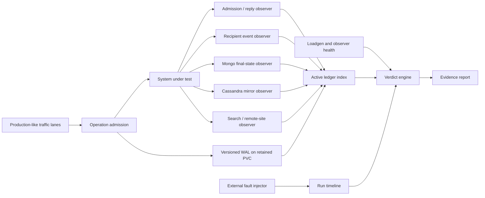
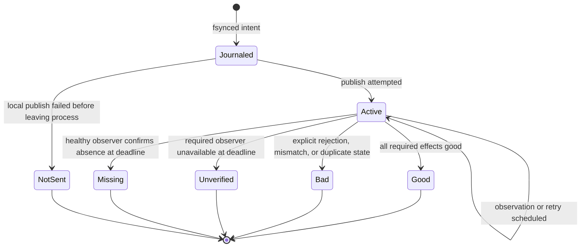

# Loadgen Failure Evidence Platform

Status: implementation specification. Only the Cassandra soak user-message
vertical slice described in [Loadgen Failure Observation Runtime](observation.md)
is implemented today.

## 1. Purpose

This document defines the shared evidence platform required by NATS / JetStream,
MongoDB, and Cassandra failure campaigns. It turns continuous load into a
bounded set of operations whose expected effects can be reconciled after a
fault. It does not grant fault-injection privileges to loadgen and it does not
change the traffic profile when a fault begins.

The platform must answer four separate questions:

1. Did loadgen generate the approved traffic without saturating or failing?
2. Which boundary accepted, rejected, timed out, or could not observe each
   operation?
3. Did all expected business effects eventually converge?
4. Is the available evidence sufficient to return `PASS` or `FAIL`, or must the
   interval be `INCONCLUSIVE`?

## 2. Scope and Non-Goals

In scope:

- one durable operation ledger shared by multiple workload lanes;
- multiple independent observers per operation;
- run manifests and externally supplied fault events;
- deadline-based reconciliation during continuous traffic and after settle;
- machine-readable verdict and evidence reports;
- explicit invalidation when loadgen or an observer is unhealthy;
- backward-compatible recovery of WAL data created by the existing message
  lane.

Out of scope:

- deleting pods, partitioning networks, or changing dependency topology;
- placing a run or operation ID on every application metric;
- storing plaintext message bodies, credentials, tokens, or encryption keys;
- using NATS, MongoDB, or Cassandra as the ledger store while that dependency
  is the fault target;
- turning an interrupted performance interval into a pass merely because the
  WAL recovered its unresolved operations.

## 3. Runtime Architecture



Loadgen continues the configured workload through baseline, fault, recovery,
and settle. `seed`, `soak`, `stopped`, and `teardown` remain deployment lifecycle
phases, not hot-path fault states.

## 4. Current and Target Capability

| Capability | Current implementation | Target |
|---|---|---|
| Durable store | Append-only WAL on one retained PVC | Versioned WAL shared by all enabled lanes |
| Active index | Bounded in-memory map plus due-time heap | Same implementation, generalized operation/observer definitions |
| Operation lane | Cassandra soak `message_send` | Message, mutation, room/member, federation, bot, migration, and canary lanes |
| Observers | `admission`, `cassandra_history` | Boundary and final-state observers declared per operation |
| NATS health | Soak pool callbacks | Every loadgen NATS pool and observer connection |
| Verdict | Terminal operation counters | Run-level `PASS` / `FAIL` / `INCONCLUSIVE` with gate evidence |
| Timeline | External timestamps interpreted manually | Versioned manifest plus append-only fault events and Grafana annotations |
| Report | Prometheus metrics and WAL | Stable JSON report plus concise Markdown summary and evidence bundle |

## 5. Run Manifest Contract

One immutable manifest identifies the intended run. Amendments are new events;
operators must not rewrite the original topology or traffic declaration after
the fault begins.

```json
{
  "schemaVersion": 1,
  "runId": "nats-core-20260812-001",
  "scenarioId": "F02",
  "gitSha": "101a074c3fe06f298a5667ae8081a075428d4584",
  "images": {"loadgen": "registry/loadgen:sha", "message-worker": "registry/message-worker:sha"},
  "environment": "staging",
  "sites": ["site-a"],
  "seed": 42,
  "trafficProfile": "nats-core-message-v1",
  "trafficParameters": {"sendRps": 100, "readRps": 700},
  "topology": {
    "natsServers": 3,
    "streamReplicas": 3,
    "mongodbMembers": 3,
    "cassandraReplicationFactor": 3,
    "cassandraConsistency": "LOCAL_QUORUM"
  },
  "requiredObservers": ["admission", "cassandra_history", "recipient_broadcast"],
  "requiredMetricContracts": ["nats-core-v1", "loadgen-health-v1"],
  "createdAt": "2026-08-12T12:00:00Z"
}
```

Required validation:

- `schemaVersion`, `runId`, `scenarioId`, `gitSha`, `environment`, `seed`, and
  `trafficProfile` are non-empty;
- run ID is safe as a file-name component and unique within the retained PVC;
- required observer and metric-contract names come from bounded registries;
- topology values satisfy the selected campaign preconditions;
- all timestamps are UTC RFC 3339 with nanosecond precision accepted;
- the manifest is fsynced before the first eligible operation.

## 6. Fault Event Contract

Fault events are supplied by an operator or external chaos controller. They
annotate evidence; they do not call into workload scheduling.

```json
{
  "schemaVersion": 1,
  "runId": "nats-core-20260812-001",
  "sequence": 3,
  "type": "fault_started",
  "scenarioId": "F02",
  "targetKind": "nats_server",
  "target": "nats-1",
  "faultKind": "process_stop",
  "at": "2026-08-12T12:15:00.123Z",
  "actor": "chaos-controller",
  "details": {"stream": "MESSAGES_CANONICAL_site-a"}
}
```

Allowed event types are `baseline_started`, `fault_started`, `fault_removed`,
`recovery_observed`, `settle_started`, `reconciliation_started`,
`reconciliation_completed`, `run_aborted`, and `note`. The sequence is strictly
increasing per run. The report rejects overlapping faults unless the manifest
explicitly declares a combined-failure campaign.

The platform writes the same event to the retained evidence directory and, on
a best-effort basis, to Grafana annotations. Failure to write the durable local
event invalidates the run. Failure to write only the Grafana copy is an
observability warning because the durable timeline remains authoritative.

## 7. Generalized Operation Record

The existing record remains readable. Version 2 adds a stable operation type,
typed expected effects, observer policy, and evidence references.

| Field | Required | Meaning |
|---|:---:|---|
| `schemaVersion` | yes | Record schema; existing records without it are interpreted as version 1 |
| `operationId` | yes | Loadgen-generated stable ID, not used as a metric label |
| `correlationId` | no | Request ID or transport correlation ID |
| `runId` | yes | Owning run |
| `scenario` | yes | Bounded workload scenario |
| `lane` | yes | Bounded traffic lane |
| `operationType` | yes | `message_create`, `message_edit`, `member_add`, and other registry values |
| `startedAt` | yes | Intent creation time |
| `verifyAfter` | yes | Earliest final-state reconciliation |
| `deadline` | yes | Latest time at which absence can become terminal |
| `targets` | yes | Entity identifiers needed for point reconciliation |
| `expectedEffects` | yes | Typed effects and their required observers |
| `observations` | no | Append-only observer outcomes |
| `finalResult` | no | Exactly one terminal operation result |
| `evidenceRefs` | no | Bounded local file/WAL offsets or trace IDs; never hot-path labels |

Example expected effects:

```json
[
  {"effect": "admission", "observer": "admission", "required": true},
  {"effect": "message_persisted", "observer": "cassandra_history", "required": true},
  {
    "effect": "recipient_event",
    "observer": "recipient_broadcast",
    "required": true,
    "cardinality": {"mode": "exact_set_hash", "count": 2, "sha256": "..."}
  }
]
```

Large recipient or entity sets are not copied into Prometheus labels. The WAL
may store their IDs or a run-local sidecar reference. Reports expose the exact
missing IDs only in retained evidence files.

## 8. Observer Contract

Each observer definition contains:

- a stable bounded name;
- supported operation and effect types;
- whether the observation is event-driven, query-driven, or both;
- earliest verification time and retry policy;
- the read/write budget it consumes;
- result normalization;
- a health probe and last-success timestamp;
- final reconciliation support.

Normalized observation results are:

| Observation | Meaning |
|---|---|
| `good` | Expected effect was observed and matched |
| `bad` | An explicit rejection, mismatch, duplicate final state, or impossible transition was observed |
| `unverified` | The observer could not answer before deadline |
| `missing_after_deadline` | A healthy authoritative observer confirmed absence at deadline |

An observer must not translate its own timeout or unavailability into
`missing_after_deadline`. It must return `unverified`. A query that successfully
returns not-found before the deadline is retried; it becomes
`missing_after_deadline` only when an authoritative query also answers
not-found at or after the deadline.

The first recipient-broadcast observer must:

- subscribe before the measurement window;
- use real recipient subjects and credentials;
- correlate by message ID and event type;
- retain the expected recipient set outside metric labels;
- distinguish zero observed recipients, a partial set, duplicates, malformed
  events, and observer disconnection;
- record duplicates as evidence while allowing an idempotent final business
  result to remain `good` only when the campaign permits duplicate delivery;
- expose its own subscription, connection, queue, and processing health.

## 9. Operation Lifecycle and Result Precedence



Terminal operation results remain:

- `good`;
- `bad`;
- `unverified`;
- `not_sent`;
- `missing_after_deadline`.

When observations disagree, strongest evidence wins:

```text
missing_after_deadline > bad > unverified > good
```

`not_sent` applies only when the platform knows the publish never left the
loadgen process. It is not comparable with downstream observations; observing
a downstream side effect after `not_sent` is an invariant violation and makes
the run `INCONCLUSIVE` until the accounting bug is resolved.

For a completed lane:

```text
eligible = good + bad + unverified + not_sent + missing_after_deadline
```

## 10. WAL Compatibility and Evidence Retention

- Add a versioned file header for new runs; continue replaying headerless
  version-1 event records.
- Never rewrite an existing WAL in place to migrate schema. Compaction writes a
  versioned temporary file, fsyncs it, and atomically replaces the old file.
- Unknown future record versions stop reconciliation and invalidate the run;
  they must not be skipped.
- A torn final record may be truncated only when all prior records decode.
- WAL write or compaction failure degrades observation but must not stop traffic.
- Capacity overflow records dropped/untracked counts and invalidates the
  affected evidence interval.
- `phase=stopped` preserves manifest, timeline, WAL, report, and sidecars.
- Teardown requires explicit approval after the evidence bundle is copied to
  the approved retention store.

## 11. Loadgen and Observer Health

The verdict engine consumes, at minimum:

- every NATS pool's connected state and outage duration;
- reconnect-buffer and async-error counters;
- offered-load underrun and saturation;
- ledger invalidation, untracked, dropped, and journal-size signals;
- process restarts, OOM, CPU, memory, goroutines, file descriptors, and network;
- observer connection state, last successful observation, queue depth, and
  dropped evidence;
- manifest/timeline durability and clock-skew preflight results.

Any required observer without a healthy sample during baseline is a preflight
failure. Loss of a required observer during the fault window makes operations
that depended on it `unverified` and the affected run `INCONCLUSIVE`; it is not
a product `FAIL` unless independent evidence proves a product failure.

## 12. Verdict Engine

Evaluation order is fixed:

1. Validate manifest, topology, metric contracts, clocks, and baseline.
2. Validate loadgen, ledger, and required-observer health.
3. Verify operation accounting invariants.
4. Evaluate hard correctness gates.
5. Evaluate availability, latency, backlog-drain, and recovery objectives.
6. Produce one run verdict and per-lane verdicts.

Precedence:

```text
INCONCLUSIVE > FAIL > PASS
```

This precedence means insufficient evidence is never converted into either a
pass or a product failure. Examples:

| Condition | Verdict |
|---|---|
| Required exporter absent or stale | `INCONCLUSIVE` |
| Loadgen OOM or sustained offered-load underrun | `INCONCLUSIVE` |
| Ledger invariant violated or required operation untracked | `INCONCLUSIVE` |
| Healthy observer confirms missing accepted message | `FAIL` |
| Duplicate final membership or message state | `FAIL` |
| Backlog does not return within approved RTO | `FAIL` |
| All evidence complete and every gate passes | `PASS` |

The engine must return all reasons, not only the highest-precedence reason.

## 13. Report Contract

The authoritative `report.json` contains:

- manifest digest and immutable manifest fields;
- ordered fault timeline;
- exact evaluation window boundaries;
- per-lane offered, eligible, and terminal counts;
- per-observer outcome counts and health intervals;
- latency p50/p95/p99/max for eligible operations, including failures;
- stream/consumer baseline, peak, final, and recovery duration;
- dependency topology changes;
- missing, mismatched, duplicate, unverified, untracked, and dropped evidence
  sidecar paths;
- every gate, its query/input, threshold, observed value, and verdict;
- overall verdict and reasons;
- SHA-256 digests for retained evidence files.

A generated `summary.md` presents the same verdict without becoming a second
source of truth. Prometheus provides aggregate visualization; it is not the
authoritative list of individual missing operations.

## 14. Metrics

Keep the existing bounded families and extend them rather than creating
per-lane one-off names:

- `loadgen_failure_operations_total{scenario,lane,result}`;
- `loadgen_failure_observations_total{scenario,lane,observer,result}`;
- `loadgen_failure_inflight{scenario,lane}`;
- ledger recovery/invalidation/untracked/dropped/journal metrics;
- loadgen NATS pool health metrics;
- `loadgen_failure_observer_up{observer}`;
- `loadgen_failure_observer_events_total{observer,result}`;
- `loadgen_failure_observer_queue_depth{observer}`;
- `loadgen_run_info{environment,scenario,traffic_profile}` with constant value
  one and no run ID label.

Individual operation, message, room, account, recipient, trace, and run IDs are
for the WAL/report only.

## 15. Implementation Slices

### Slice E1: platform contracts

- manifest and fault-event parser/validation;
- version-2 operation/effect model;
- version-1 WAL replay compatibility;
- observer registry and health interface;
- JSON verdict/report types and invariant evaluation.

### Slice E2: NATS core-message evidence

- recipient-broadcast observer;
- message operations requiring admission, Cassandra history, and broadcast;
- all soak/daily NATS pools wired to shared health callbacks;
- exact missing/duplicate recipient sidecar;
- failure-overlay metrics.

### Slice E3: storage and mutation effects

- Cassandra full-mirror effects for thread, edit, delete, reaction, and pin;
- Mongo room/member/subscription/thread effects;
- final post-settle 100% reconciliation of the bounded run-owned set.

### Slice E4: federation and extended lanes

- remote-site and search observers;
- bot, Teams, HR, migration, push, and admin/media canaries.

## 16. Test Strategy and Definition of Done

Follow the repository TDD workflow for every implementation slice. Required
tests include:

- manifest and event validation, ordering, duplicate sequence, and overlap;
- version-1 replay, version-2 replay, torn tail, unknown version, compaction,
  and restart recovery;
- every lifecycle transition and precedence combination;
- healthy not-found versus observer timeout at deadline;
- partial and duplicate recipient sets;
- observer disconnect/reconnect and queue overflow;
- capacity/WAL failure continuing traffic while invalidating evidence;
- loadgen OOM/restart simulation producing `INCONCLUSIVE` while reconciliation
  resumes;
- report invariant and deterministic JSON/golden tests;
- integration test with NATS JetStream, one accepted message, recipient event,
  history read-back, restart, and final report.

The evidence platform is complete for a campaign only when:

1. every enabled operation declares all required effects;
2. every required observer passes preflight and exposes health;
3. the bounded run-owned set reaches a terminal result after settle;
4. exact missing/duplicate evidence can be exported without metric labels;
5. deliberate observer loss returns `INCONCLUSIVE`;
6. deliberate business loss returns `FAIL`;
7. restart recovery preserves unresolved correctness evidence;
8. a no-fault baseline returns `PASS` under the approved gates.
