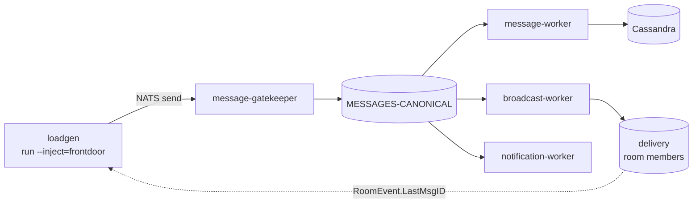

# End-to-End Load Test Plan — chat platform

> System-level load, stress, and capacity plan for the whole single-site message
> path. Acceptance criteria are the SLOs in
> [`../common/sli-slo.md`](../common/sli-slo.md); shared inputs live in
> [`../common/workload-model.md`](../common/workload-model.md) and
> [`../common/environments-and-data-ownership.md`](../common/environments-and-data-ownership.md).
> Component-level Cassandra work is in
> [`../soak/cassandra-soak-plan.md`](../soak/cassandra-soak-plan.md); dependency
> fault campaigns are in [`../failure/overview.md`](../failure/overview.md).

Where the Cassandra soak validates **one component** (schema + access patterns,
non-destructive), this plan validates the **whole single-site message path** —
`message-gatekeeper` -> `MESSAGES-CANONICAL` -> `message-worker` /
`broadcast-worker` / `notification-worker` -> client delivery — and, at the
edges, the cross-site federation lane.

| | |
|---|---|
| **Status** | Draft — for review |
| **Author** | Michelle Leu |
| **Driver** | `tools/loadgen` (NATS surface) |
| **Validates** | That current code / schema / usage-pattern design meets the SLOs under realistic load; end-to-end publish->delivery latency budget; sustainable per-site throughput; the throughput **ceiling** and which service saturates first; back-pressure and consumer-lag behavior |
| **Does NOT validate** | The frontend/last mile (render, websocket, browser login), true broker breakpoints (excluded by decision, not by hosting), cross-site federation at scale (single-site loadgen), auth/login (stub), component-internal defects already owned by a component plan, or any breaking-point result promoted to a production SLO without infra sign-off — see §13 |
| **A "pass" means** | The exercised scenario met its SLO predicate/target over an isolated run window, with bounded consumer lag — an evidence-based readiness signal, **not** a blanket production certification |

**Scope note — loadgen-driven, no frontend.** Every scenario is driven through
the **NATS surface** by `tools/loadgen`. Anything requiring the real frontend
(websocket client, decrypt/render, browser login) is **out of scope this round**
and is tracked as the observational last mile in
[`../common/sli-slo.md`](../common/sli-slo.md) §2.

**Relationship to existing tooling.** `tools/loadgen` already drives this path:
`run` (open-loop publish at a target rate, `--inject=frontdoor` for the full
gatekeeper path or `--inject=canonical` to bypass it), `max-rps` (ramp to find
the ceiling), `daily` (a scheduled baseline with a pass/fail verdict), plus the
focused `members-*`, `history-*`, and `presence-*` capacity workloads. This plan
defines **what to run, what to hold fixed, what to observe, and what "pass"
means** across those modes — it does not introduce a second load tool.

---

## 0. How this relates to the SLOs

The SLOs are the **acceptance criteria**; *capacity* = the load at which an SLO
first breaks. Two threshold modes (from
[`../common/sli-slo.md`](../common/sli-slo.md) §10), applied here:

- **Hard gate** — reuse the production SLO **predicate and target** (e.g. SLO-4 =
  95% within 500 ms), evaluated over an **isolated, quiescent run window**, never
  the 28-day aggregate rule.
- **Engineering headroom** — a separately-named, stricter latency-only guardrail
  (~50-70% of the bound) that *warns* before the SLO breaks; only a hard-gate
  miss fails a release.

**Run structure (required for every SLO-asserting run):** `warm-up -> send window
-> settle window`. The denominator counts the **send window**; async numerators
(persist, enqueue, forward) are waited out to the **max SLO deadline + a scrape
margin** so tail-end in-flight events are not misjudged as failures. Traffic
isolation is mandatory — a dedicated test `SITE_ID` or Prometheus tenant (see
[`../common/environments-and-data-ownership.md`](../common/environments-and-data-ownership.md)).

**Today vs enforced.** Most J1/J2 service-side SLI metrics are still on the
roadmap ([`../common/sli-slo.md`](../common/sli-slo.md) §8 P1-P4); **loadgen's own
L1 correlation already measures E2E latency**, so near-term runs gate on loadgen
L1 while the service-side SLI metrics land in parallel.

---

## 1. Decisions

| # | Decision | Resolution |
|---|---|---|
| D1 | Test taxonomy | Three distinct runs: **Baseline** (sustained, non-destructive), **Stress/Capacity** (ramp to the ceiling), **Resilience** (inject a dependency fault under load). Each has its own acceptance stance |
| D2 | Primary latency SLI | **End-to-end publish->delivery**: client send accepted by gatekeeper -> `RoomEventNewMessage` observable to a room member, correlated by `RoomEvent.LastMsgID`. Notification latency is a secondary SLI |
| D3 | Injection point | Baseline and Stress use `--inject=frontdoor` (real gatekeeper validation). `--inject=canonical` is a **diagnostic** to isolate gatekeeper cost, not an acceptance run |
| D4 | Encryption | **On** (`ENCRYPTION_ENABLED=true`, broadcast-worker default) for all acceptance runs so payload sizes and worker CPU reflect production; a plaintext A/B is diagnostic only |
| D5 | Scope of "the system" | **Single site** is the acceptance scope. Cross-site federation (`inbox-worker`/`outbox-worker`) is measured as a **bounded add-on lane**, not the primary ceiling, because staging supercluster topology does not match production |
| D6 | Stress stance | Stress/Capacity runs **are** driven past the knee (unlike the Cassandra soak, which is non-destructive). They run in an **isolated/disposable** environment, never against a shared staging tenant without explicit blast-radius sign-off |
| D7 | Observability truth | Verdicts come from **L1 (loadgen)** and **L2 (o11y `db.client`/consumer metrics)**; **L3** (NATS/JetStream + Cassandra/Mongo server) is the confirming layer. `O11Y_ENABLED=true` with a fixed sampler ratio (§10) is a run precondition |
| D8 | SLO authority | [`../common/sli-slo.md`](../common/sli-slo.md) is the authoritative user-facing SLI/SLO catalog. Any target marked *provisional* below is a placeholder pending an entry there, and is never an SLO commitment on its own |

---

## 2. Inputs — workload model

[`../common/workload-model.md`](../common/workload-model.md) is the single source
for shared production inputs (I1-I13): busiest-site peak **100 msg/s**, **7:1**
read:write, **10%** thread share, **5%** mutation, **1/2/10 KB** post-encryption
payload sizes, topology **1M rooms / 3:7 group:DM / ~100 users per room**. The
per-input detail and its open confirmations currently live in
[`../soak/cassandra-soak-plan.md`](../soak/cassandra-soak-plan.md) §B.

This plan adds the **delivery-side** inputs the component soak does not need,
because broadcast fan-out — not Cassandra partition size — drives them:

| # | Input | Drives | Value |
|---|---|---|---|
| S1 | Broadcast fan-out (members per room, median / p95) | broadcast-worker CPU + egress | **100 / 500** |
| S2 | Concurrent connected members per site | delivery lane load | _TBD — confirm with infra_ |
| S3 | Notification eligibility (share of sends that notify) | notification-worker load | _TBD_ |
| S4 | Cross-site share of sends (federation-out) | outbox/inbox add-on lane | _TBD; assume <= 10% for the add-on run_ |

> S1-S4 move into `../common/workload-model.md` once confirmed, so the two plans
> never drift.

---

## 3. Which test types we run

| Type | Question | Load shape | We run it? | On what |
|---|---|---|---|---|
| **Fixed-load / soak** | holds up at expected peak over time? | pinned at peak | Yes — **primary** | all (incl. managed) |
| **Capacity / ramp-to-breach** | where is the ceiling, what breaks first? | step up until an SLO breaks | Yes — selective | **Mongo** (dedicated), app services, self-hosted ES/Valkey; **Cassandra bounded**; **not** shared NATS to breakpoint |
| **Pathological / schema-stress** | does a worst-case shape break the schema? | deliberate bad shapes, isolated | Yes — targeted | Cassandra F1-F6 (isolated keyspace) |
| **o11y overhead A/B** | does observability cost throughput/latency? | same run, pillar on/off/sampler | Yes | `../common/sli-slo.md` §8 P-refs; owns `o11y-performance-and-sampling.md` §5 |
| **Resilience / fault injection** | a dependency dies/slows — what degrades? | fixed load + injected fault | Yes — owned elsewhere | [`../failure/overview.md`](../failure/overview.md) |
| **Spike** | absorb a surge / reconnect storm? | sudden burst | Later | presence-storm exists; broader later |

**Near-term set = fixed-load soak (SLO validation) + bounded capacity
(Mongo/app/self-hosted) + targeted Cassandra schema-stress + o11y A/B.** Spike is
phased after; resilience runs on the failure program's own schedule.

---

## 4. Worked example — one journey, two test types (J1 "send a message")

| | **Capacity (ramp-to-breach)** | **Fixed-load soak** |
|---|---|---|
| **Question** | "at how many msg/s does SLO-2 miss 1 s? what backs up first?" | "at 100 msg/s for N hours, does any SLO drift?" |
| **Load shape** | 100 (I1 baseline) -> 250 -> 500 -> 1k -> 2k -> 5k msg/s, hold each step, stop at first breach, then bisect between the last passing and first failing step | pinned at the expected peak (100 msg/s, workload-model I1) |
| **loadgen** | `max-rps --workload=messages` | `daily` / `soak` at a fixed rate |
| **Verdict** | largest step where **all** SLO signals held = capacity; `BOTTLENECK:` names the culprit | SLO held for the whole run **and** consumer lag / Mongo write latency / memory did not drift |
| **What it cannot tell you** | endurance / slow drift (it is short per step) | the ceiling (you never push past peak) |

Both use the **same realistic mix** (channel/DM/thread split, message-size
distribution, room-size Zipf); only the **rate profile** and the **question**
differ. This is the template for every other journey.

**The ramp starts at the declared I1 baseline (100 msg/s), not above it.** A ramp
that begins at 500 msg/s cannot observe a first SLO breach that occurs between
expected peak and that first step, and would report the ceiling as "at least
500" when it is in fact lower. After the first failing step, bisect the interval
between it and the last passing step until the breach point is bounded to within
one step width.

---

## 5. Prioritized scenario inventory

Priority = (journey/service criticality) x (likelihood current code/schema has a
problem) x (still-unvalidated). Columns: **SLO** it validates - **SLI metric
(prod)** today (exists / Pn to build, per `../common/sli-slo.md` §8) - **loadgen**
scenario (exists / partial / none).

### Tier 1 — most urgent (critical path + unvalidated + plausible risk)

| # | Scenario | Code anchor | Stresses | SLO | SLI metric | loadgen |
|---|---|---|---|---|---|---|
| T1-1 | **Cassandra schema soak (Run A)** | soak plan (unrun) | Cassandra write/read/compaction/disk | — (feeds 1a) | L2 op-duration exists - L3 exists | `soak` |
| T1-4 | **Mongo send-path writes** | broadcast-worker `UpdateRoomLastMessage` + `AdvanceSubscriptionLastSeen` per send | Mongo writes | 1a/1b (underlying) | P-pending; L2 mongo exists | `messages` (no Mongo assert) |
| T1-5 | **`SetSubscriptionMentions` UpdateMany fan-out** | broadcast-worker; @all -> many sub docs | Mongo write amplification | 1b | P-pending; L2 exists | partial: `realistic` (mentions, unasserted) |
| T1-6 | **gatekeeper 2-3 Mongo reads/send** | `GetSubscription` + `FindUserByID` (+ `GetRoomMeta`) | Mongo reads (blocks E1) | 1a/1b | P-pending; L2 exists | `messages` |
| T1-7 | **J1 full-chain E2E at peak** | gatekeeper->canonical->workers | all | **1a/1b/2** | P2; **loadgen L1 exists** | `messages`/`daily` |

### Tier 2 — critical but likely sturdier / needs setup

| # | Scenario | Code anchor | Stresses | SLO | SLI metric | loadgen |
|---|---|---|---|---|---|---|
| T2-8 | **notification O(room size)/msg** | `GetMembers` + O(N) filter + ceil(N/100) publishes | NATS + cache/Mongo | 6 | P4 | `botroom` (gates notif backlog) |
| T2-9 | **broadcast big-room fan-out + interest-map** | DM/thread per-recipient; channel via NATS; PR #139 subject split | NATS fan-out / gateway memory | 1b/2 | P3 + NATS exporter | partial: `botroom`/`daily`; interest-map needs exporter |
| T2-10 | **history bucket-walk (enter channel)** | `LoadHistory` multi-bucket | Cassandra read | **4** | P1; L1 exists + walk-depth | `history` |
| T2-11 | **room-service `$lookup` aggregation reads** | read-receipt / member / sub enrichment | Mongo aggregation | 4/5 (partial) | P1 | `read-receipt`/`room-read` |
| T2-12 | **outbox FIFO federation throughput** | per-peer `MaxAckPending=1` serializes membership | NATS cross-site | **9** | P4 + exporter | none (single-site) |

### Tier 3 — pathological / resilience (later)

Cassandra F1-F6 (tombstone storm, hot partition, TWCS pollution, reaction MAP
width — isolated keyspace) - dependency fault injection (see
[`../failure/overview.md`](../failure/overview.md)) - search (ES) capacity,
auth/login, reconnect/presence storms.

---

## 6. Run 1 — Baseline (sustained, non-destructive)

Drive the realistic action mix at the **target sustained rate (100 msg/s send +
700/s read)** through the real gatekeeper for a fixed window. Non-overloading;
this is the "is the budget met at expected load" run and the regression baseline
(`loadgen daily` runs a scoped version of this with a pass/fail verdict).

**Verdict from:** end-to-end publish->delivery p50/p95/p99 (L1), per-consumer
pending/lag on every downstream durable (L2/L3, must be **flat**), error/timeout
rate (L1/L2). Cassandra per-query latency is delegated to the soak plan.

**Acceptance (provisional — confirm against `../common/sli-slo.md` before running):**
- E2E publish->delivery p99 within the SLO-2 bound at target rate;
- every downstream durable's `pending` is bounded and **not monotonically
  growing** over the window — `final_pending == 0` on the loadgen summary;
- error + timeout rate within the SLO error budget;
- achieved send rate approximately 100 msg/s (a shortfall means an upstream
  saturation — investigate before reading any latency number).

---

## 7. Run 2 — Stress / capacity (ramp to the ceiling)

Use `loadgen max-rps` to ramp the send rate until an acceptance signal breaks,
then hold just below and just above the knee to characterize it. **Destructive
by design (D6)** — isolated environment only. Methodology detail:
[`capacity-test-plan.md`](capacity-test-plan.md).

**Report, per run, a quantified knee — not a prose "acceptable":**
1. the **sustainable ceiling** (max rate holding the latency/lag budget);
2. the **first-saturating component** (which durable's `pending` climbs first, or
   which service's CPU/`db.client.operation.duration` bends first — L2/L3);
3. the **failure mode past the knee** (latency blowup, timeouts, dropped
   mutations, or consumer lag runaway) and whether the system **recovers** when
   load returns to baseline.

**Explicit blind spots (what this run cannot claim):**
1. **Production-scale multi-node throughput** — staging node counts differ; the
   ceiling does not extrapolate (soak plan D5).
2. **Cassandra breaking points** — those belong to the deferred component Run B/C
   experiments, not here. If Cassandra saturates first, that is a *finding*
   ("Cassandra is the e2e bottleneck at rate X"), reported and handed to the
   component plan.
3. **Real client transport limits** — loadgen correlates on `RoomEvent`; it is not
   a fleet of real websocket clients, so the delivery-lane ceiling is
   worker/NATS-side, not client-side.

---

## 8. Run 3 — Resilience (owned by the failure program)

Fault injection under sustained load is **owned by
[`../failure/overview.md`](../failure/overview.md)**, which carries the dependency
criticality matrix, the campaign lifecycle, the evidence model, and the
per-dependency campaigns. This plan does not restate them; it only records which
service-layer faults it originally scoped and where each now lives.

| Fault | Owner |
|---|---|
| Downstream worker restart / pod kill | [`../failure/nats-jetstream.md`](../failure/nats-jetstream.md), [`../failure/mongodb.md`](../failure/mongodb.md), [`../failure/cassandra.md`](../failure/cassandra.md) |
| Slow database (latency injection) | [`../failure/mongodb.md`](../failure/mongodb.md), [`../failure/cassandra.md`](../failure/cassandra.md) |
| NATS reconnect / node bounce | [`../failure/nats-jetstream.md`](../failure/nats-jetstream.md) |
| **Collector / OTLP outage** | **Unowned.** Expectation: throughput unaffected (BatchSpanProcessor drops, never blocks — o11y perf spec §1); only traces degrade. No failure campaign asserts this yet — open coverage gap |

**Recovery surge** — the backlog replay that follows fault removal — is claimable
by both programs. Its *mechanics* (redelivery, hinted handoff, retry storms)
belong to [`../failure/overview.md`](../failure/overview.md) §6; its *quantitative
limit* (does the drain exceed what storage and downstream services absorb) belongs
to [`capacity-test-plan.md`](capacity-test-plan.md). Owner assignment for that
overlap is still open.

Datastore node-failure stays **out of scope** for this plan (managed clusters;
soak plan D4).

---

## 9. Cassandra: acute (now) vs endurance (deferred)

The staging window currently allows only a **few hours**, not the 3-day soak the
component plan ([`../soak/cassandra-soak-plan.md`](../soak/cassandra-soak-plan.md)
D3) assumes. A few hours is a **load test, not a soak** — split accordingly:

| Phase 1 — acute (run now) | Phase 2 — endurance (deferred, needs multi-day window) |
|---|---|
| schema/access-patterns correct under concurrent realistic load | compaction backlog accumulation over time |
| steady-state SSTables-per-read, per-read tombstones-scanned | disk-growth trend projection |
| immediate read/write latency, timeouts, errors | slow memory/resource leaks |
| acute hot-partition / wide-partition read degradation | **TWCS 72h window sealing** (even 3 days seals ~1) - gc_grace (>= 10d) tombstone eviction |

Phase 1 directly serves the primary goal ("confirm the schema/usage design will
not misbehave before prod"); the time-dependent questions are explicitly
**deferred**, not silently claimed. Pathological F1-F6 remain isolated-keyspace
follow-ons.

---

## 10. Observability (three layers)

Same model as the soak plan; the SLI is read from L2 where it exists, else
loadgen L1.

| Layer | Source | Signals used here |
|---|---|---|
| **L1 loadgen** | the driver's own correlation (`:9099`) | E2E publish->delivery p50/p95/p99, achieved throughput, per-RPC latency, error rate, `final_pending` per durable, `BOTTLENECK:` attribution (cAdvisor+Prom) |
| **L2 o11y** | each service -> `:2112` (`:8200` in k8s) | service-side SLI metrics (`../common/sli-slo.md` §8), `db.client.operation.duration`, consumer lag/ack-pending, per-service request duration, `error.type` |
| **L3 infra** | NATS/JetStream monitoring + Cassandra/Mongo server Grafana | stream/consumer pending, redeliveries, per-node CPU/disk, GC, dropped messages — **the only view for managed services** (§12) |

Assertion mode counts `eligible` / `good` / `missing-after-deadline` over the send
window with the settle boundary (§0), using the **same production source counters
and good/valid predicates** evaluated over **isolated run-window deltas** (not the
28-day aggregate rule, not loadgen-local metrics), with a **drain/reset after
warm-up** so warm-up completions cannot inflate the numerator.

`O11Y_ENABLED=true` is a run precondition, with
`OTEL_TRACES_SAMPLER=parentbased_traceidratio` and a **fixed, recorded**
`OTEL_TRACES_SAMPLER_ARG` — an unset sampler is 100% and distorts the very
overhead a stress run is trying to measure (o11y perf spec §3).

---

## 11. Runbook

1. **Preflight:** isolated/disposable environment confirmed (D6); `O11Y_ENABLED`
   and sampler ratio set and recorded; `ENCRYPTION_ENABLED=true`; loadgen scraped
   by Prometheus; L2/L3 dashboards reachable; blast radius acknowledged for
   every dependency the run touches - NATS, MongoDB, Cassandra, Elasticsearch,
   and Valkey - with the exact Mongo database and Cassandra keyspace scope
   recorded, and managed-service runs pre-communicated with infra per
   [`../common/environments-and-data-ownership.md`](../common/environments-and-data-ownership.md);
   `run_id` recorded.
2. **Seed** fixtures (`loadgen seed --preset=...`).
3. **Run 1 Baseline** for the fixed window; confirm the budget and flat lag.
4. **Run 2 Stress/Capacity** (`max-rps` ramp); capture the knee, the
   first-saturating component, and recovery.
5. **Resilience** campaigns run on the failure program's lifecycle
   ([`../failure/overview.md`](../failure/overview.md) §7), not this runbook.
6. **Evidence retention** (24-72h), then teardown by preset/manifest.
7. Cross-site add-on lane (D5/S4) only if time permits and topology allows.

---

## 12. Managed vs self-hosted (blast radius)

Full treatment in
[`../common/environments-and-data-ownership.md`](../common/environments-and-data-ownership.md).
In short: **NATS, MongoDB, and Cassandra each run as a cluster dedicated to us**
on **shared Kubernetes nodes**; ES and Valkey are self-hosted. Isolation is
therefore two-axis — dedicated at the data plane, shared at the resource plane —
and pod CPU/memory requests and limits bound that sharing for CPU and memory but
not for disk IO or network. Mongo may be driven to capacity; Cassandra stays
bounded by decision rather than by hosting; NATS raw throughput is not the
concern — **our usage patterns** are; ES/Valkey we own and may drive to capacity
in isolation. Runs still require pre-communication with infra and a recorded
blast radius.

---

## 13. Out of scope this round / to confirm

Out of scope:

- **Frontend / last mile** (render, websocket, browser login) — loadgen-only.
- **SLO-3 login** — auth is a loadgen stub.
- **Federation at scale (SLO-9)** — loadgen is single-site.
- **Search E2E (SLO-7/8)** — no search workload in loadgen yet (addable).
- **Datastore node failure** — managed clusters (soak plan D4).

To confirm with infrastructure:

- Authoritative **E2E latency and error-budget targets** (feed
  [`../common/sli-slo.md`](../common/sli-slo.md)).
- **S2/S3/S4** inputs (concurrent connected members, notification eligibility,
  cross-site share).
- **Workload-model inputs** — I10 (global vs busiest site), I12 (msgs per active
  user per day), I8 (reaction meaning).
- An **isolated/disposable** staging tenant (site ID, NATS account, Mongo DB,
  Cassandra keyspace) for the destructive Run 2 — never a shared tenant.
- Per-service CPU/memory requests and limits so loadgen-side vs service-side
  saturation is distinguishable.

---

## 14. Sibling documents

- [`../common/sli-slo.md`](../common/sli-slo.md) — acceptance criteria (SLOs).
- [`capacity-test-plan.md`](capacity-test-plan.md) — ramp-to-breach methodology.
- [`../failure/overview.md`](../failure/overview.md) — the failure-testing
  program: dependency criticality matrix, fault campaigns, recovery reconciliation.
- [`../soak/cassandra-soak-plan.md`](../soak/cassandra-soak-plan.md) — the
  Cassandra component soak.
- [`../common/environments-and-data-ownership.md`](../common/environments-and-data-ownership.md)
  — managed/self-hosted, blast radius, data ownership.
- [`../common/workload-model.md`](../common/workload-model.md) — shared inputs.
