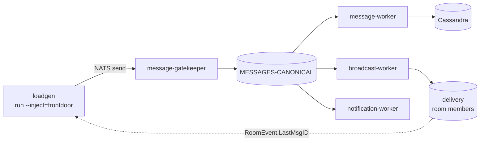

# System End-to-End Load & Stress Test Plan

> This is the authoritative specification for the **system-level** end-to-end
> load, stress, and capacity program. It is the umbrella plan under which the
> per-component plans (e.g. [`../cassandra/soak-test-plan.md`](../cassandra/soak-test-plan.md))
> and the future `sli-slo.md`, `capacity-test-plan.md`, and
> `resilience-test-plan.md` sit.

Where the Cassandra soak validates **one component** (schema + access patterns,
non-destructive), this plan validates the **whole single-site message path** —
`message-gatekeeper` → `MESSAGES-CANONICAL` → `message-worker` /
`broadcast-worker` / `notification-worker` → client delivery — and, at the
edges, the cross-site federation lane. It is where end-to-end capacity, the
user-facing latency budget, and degraded-mode behavior are measured, none of
which the component soak certifies.

| | |
|---|---|
| **Validates** | End-to-end publish→delivery latency budget, sustainable per-site throughput, the system throughput **ceiling** and where it first bends (which service saturates first), back-pressure/consumer-lag behavior, and graceful degradation under dependency stress |
| **Does NOT validate** | Component-internal defects already owned by a component plan (Cassandra schema → soak plan), correctness of business logic (functional tests own that), true multi-site scale (staging node counts differ — see D5 of the soak plan), and any breaking-point result promoted to a production SLO without infra sign-off |
| **A "pass" means** | The system sustains the target workload inside the provisional latency/error budget with bounded consumer lag, **and** the stress runs produce a quantified capacity ceiling and a named first-saturating component — an engineering characterization, **not** a production-readiness certification |

**Relationship to existing tooling.** The `tools/loadgen` binary already drives
this path: `run` (open-loop publish at a target rate, `--inject=frontdoor` for
the full gatekeeper path or `--inject=canonical` to bypass it), `max-rps`
(ramp to find the ceiling), `daily` (a scheduled baseline with a pass/fail
verdict), and the focused `members-*`, `history-*`, and `presence-*` capacity
workloads. This plan defines **what to run, what to hold fixed, what to
observe, and what "pass" means** across those modes — it does not introduce a
second load tool.

---

## A. Decisions

| # | Decision | Resolution |
|---|---|---|
| D1 | Test taxonomy | Three distinct runs: **Baseline** (sustained, non-destructive), **Stress/Capacity** (ramp to the ceiling), **Resilience** (inject a dependency fault under load). Each has its own acceptance stance |
| D2 | Primary latency SLI | **End-to-end publish→delivery**: client send accepted by gatekeeper → `RoomEventNewMessage` observable to a room member, correlated by `RoomEvent.LastMsgID`. Notification latency is a secondary SLI |
| D3 | Injection point | Baseline and Stress use `--inject=frontdoor` (real gatekeeper validation). `--inject=canonical` is a **diagnostic** to isolate gatekeeper cost, not an acceptance run |
| D4 | Encryption | **On** (`ENCRYPTION_ENABLED=true`, broadcast-worker default) for all acceptance runs so payload sizes and worker CPU reflect production; a plaintext A/B is diagnostic only |
| D5 | Scope of "the system" | **Single site** is the acceptance scope. Cross-site federation (`inbox-worker`/`outbox-worker`) is measured as a **bounded add-on lane**, not the primary ceiling, because staging supercluster topology does not match production |
| D6 | Stress stance | Stress/Capacity runs **are** driven past the knee (unlike the Cassandra soak, which is non-destructive). They run in an **isolated/disposable** environment, never against a shared staging tenant without explicit blast-radius sign-off |
| D7 | Observability truth | Verdicts come from **L1 (loadgen)** and **L2 (o11y `db.client`/consumer metrics)**; **L3** (NATS/JetStream + Cassandra/Mongo server) is the confirming layer. `O11Y_ENABLED=true` with a fixed sampler ratio (see §2) is a run precondition |
| D8 | SLO authority | This plan carries **provisional** targets only. The authoritative user-facing SLI/SLO catalog is deferred to `system/sli-slo.md`; nothing here is an SLO commitment |

---

## B. Inputs — Workload Model

The workload driving this plan is the **same production model** the Cassandra
soak enumerates (`../cassandra/soak-test-plan.md` §B, inputs I1–I13): busiest-site
peak **100 msg/s**, **7:1** read:write, **10%** thread share, **5%** mutation,
**1/2/10 KB** post-encryption payload sizes, topology **1M rooms / 3:7 group:DM /
~100 users/room**. That model is authoritative for message rates.

This plan adds the **delivery-side** inputs the component soak does not need,
because broadcast fan-out — not Cassandra partition size — drives them:

| # | Input | Drives | Value |
|---|---|---|---|
| S1 | Broadcast fan-out (members per room, median / p95) | broadcast-worker CPU + egress | **100 / 500** |
| S2 | Concurrent connected members per site | delivery lane load | _TBD — confirm with infra_ |
| S3 | Notification eligibility (share of sends that notify) | notification-worker load | _TBD_ |
| S4 | Cross-site share of sends (federation-out) | outbox/inbox add-on lane | _TBD; assume ≤ 10% for the add-on run_ |

> When `common/workload-model.md` is written it becomes the single source for
> both plans; until then, this section **references** the soak plan's inputs
> rather than restating them, so the two never drift. S1–S4 move there too.

---

## C. Run 1 — Baseline (sustained, non-destructive)

Drive the realistic action mix at the **target sustained rate (100 msg/s
send + 700/s read)** through the real gatekeeper for a fixed window. Non-
overloading; this is the "is the budget met at expected load" run and the
regression baseline (`loadgen daily` runs a scoped version of this with a
pass/fail verdict).

**Verdict from:** end-to-end publish→delivery p50/p95/p99 (L1), per-consumer
pending/lag on every downstream durable (L2/L3, must be **flat**), error/timeout
rate (L1/L2). Cassandra per-query latency is delegated to the soak plan.

**Acceptance (provisional — confirm before running):**
- E2E publish→delivery p99 ≤ **TBD ms** at target rate (defer authoritative
  target to `sli-slo.md`);
- every downstream durable's `pending` is bounded and **not monotonically
  growing** over the window — `final_pending == 0` on the loadgen summary;
- error + timeout rate ≤ **TBD%**;
- achieved send rate ≈ 100 msg/s (a shortfall means an upstream saturation,
  investigate before reading any latency number).

---

## D. Run 2 — Stress / Capacity (ramp to the ceiling)

Use `loadgen max-rps` to ramp the send rate until an acceptance signal breaks,
then hold just below and just above the knee to characterize it. **Destructive
by design (D6)** — isolated environment only.

**Report, per run, a quantified knee — not a prose "acceptable":**
1. the **sustainable ceiling** (max rate holding the latency/lag budget);
2. the **first-saturating component** (which durable's `pending` climbs first,
   or which service's CPU/`db.client.operation.duration` bends first — L2/L3);
3. the **failure mode past the knee** (latency blowup, timeouts, dropped
   mutations, or consumer lag runaway) and whether the system **recovers** when
   load returns to baseline.

**Explicit blind spots (what this run cannot claim):**
1. **Production-scale multi-node throughput** — staging node counts differ; the
   ceiling does not extrapolate (soak plan D5).
2. **Cassandra breaking points** — those belong to the deferred component Run
   B/C experiments, not here; if Cassandra saturates first, that is a *finding*
   ("Cassandra is the e2e bottleneck at rate X"), reported and handed to the
   component plan.
3. **Real client transport limits** — loadgen correlates on `RoomEvent`, it is
   not a fleet of real websocket clients; the delivery-lane ceiling is
   worker/NATS-side, not client-side.

---

## E. Run 3 — Resilience (fault injection under load)

Hold Run 1's baseline load and inject **one** dependency fault at a time,
measuring degradation and recovery. Isolated environment (D6).

| Fault | Injected how | Watch |
|---|---|---|
| A collector/OTLP outage | stop the collector | throughput unaffected (BatchSpanProcessor drops, never blocks — see o11y perf spec §1); only traces degrade |
| A downstream worker restart | kill one `message-worker` / `broadcast-worker` pod | consumer redelivery, no message loss, pending drains after recovery |
| A slow database | latency-inject Mongo/Cassandra | back-pressure surfaces as bounded lag, not cascading timeouts; recovery to baseline |
| NATS reconnect | bounce a NATS node | loadgen + services reconnect (unlimited attempts, 2s wait — `natsutil.Connect`); no permanent stall |

Degraded-mode node-failure at the datastore layer stays **out of scope** here
(managed clusters; soak plan D4) — resilience is measured at the **service and
messaging** layer this plan owns.

---

## F. Observability Model (reused three layers)

Same framing as the Cassandra soak (`soak-test-plan.md` §2), applied to the full
path:

| Layer | Source | Representative signals |
|---|---|---|
| L1 loadgen | the load tool (`:9099`) | E2E publish→delivery p50/p95/p99, achieved throughput, error rate, `final_pending` per durable |
| L2 o11y | each service → `:2112` | `db.client.operation.duration`, consumer lag/ack-pending, per-service request duration, `error.type` |
| L3 infra | NATS/JetStream monitoring + Cassandra/Mongo server Grafana | stream/consumer pending, redeliveries, per-node CPU/disk, GC, dropped messages |

`O11Y_ENABLED=true` is a run precondition, with
`OTEL_TRACES_SAMPLER=parentbased_traceidratio` and a **fixed, recorded**
`OTEL_TRACES_SAMPLER_ARG` — an unset sampler is 100% and distorts the very
overhead a stress run is trying to measure (o11y perf spec §3).

---

## G. Runbook

1. **Preflight:** isolated/disposable environment confirmed (D6); `O11Y_ENABLED`
   + sampler ratio set and recorded; `ENCRYPTION_ENABLED=true`; loadgen scraped
   by Prometheus; L2/L3 dashboards reachable; blast radius acknowledged for
   NATS/ES/Valkey side effects; `run_id`.
2. **Seed** fixtures (`loadgen seed --preset=…`).
3. **Run 1 Baseline** for the fixed window; confirm the budget and flat lag.
4. **Run 2 Stress/Capacity** (`max-rps` ramp); capture the knee, the first-
   saturating component, and recovery.
5. **Run 3 Resilience**; inject faults one at a time; capture degradation +
   recovery.
6. **Evidence retention** (24–72h), then teardown by preset/manifest.
7. Cross-site add-on lane (D5/S4) only if time permits and topology allows.

---

## H. Items to Confirm With Infrastructure

- Authoritative **E2E latency and error-budget targets** (feed `sli-slo.md`).
- **S2/S3/S4** inputs (concurrent connected members, notification eligibility,
  cross-site share).
- An **isolated/disposable** staging tenant (site ID, NATS account, Mongo DB,
  Cassandra keyspace) for the destructive Run 2/3 — never a shared tenant.
- Per-service CPU/memory requests/limits so loadgen-side vs service-side
  saturation is distinguishable.
- Fault-injection mechanism availability (pod kill, latency inject, NATS bounce)
  in the target environment.
