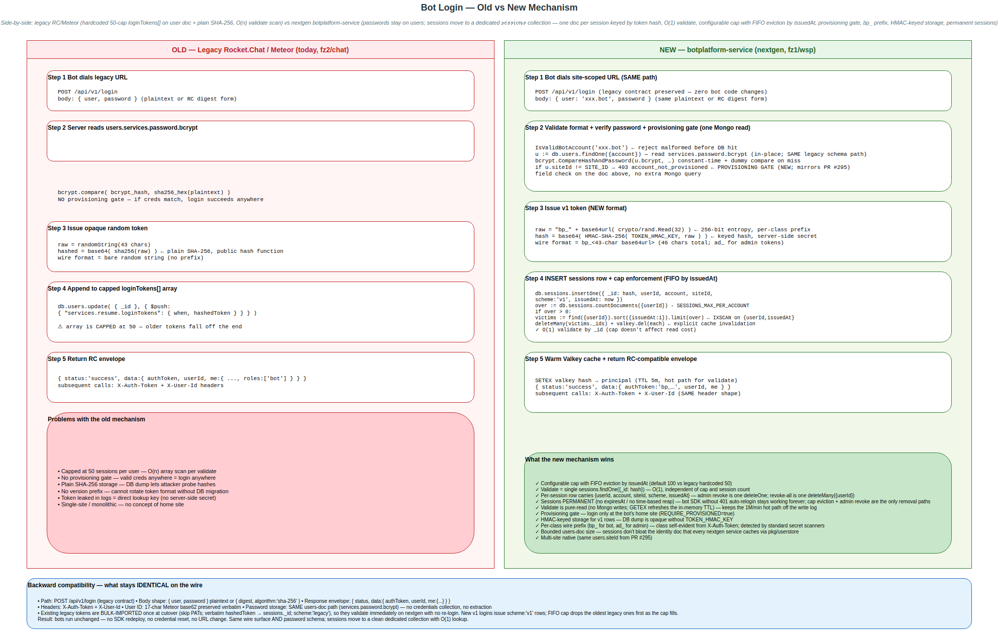
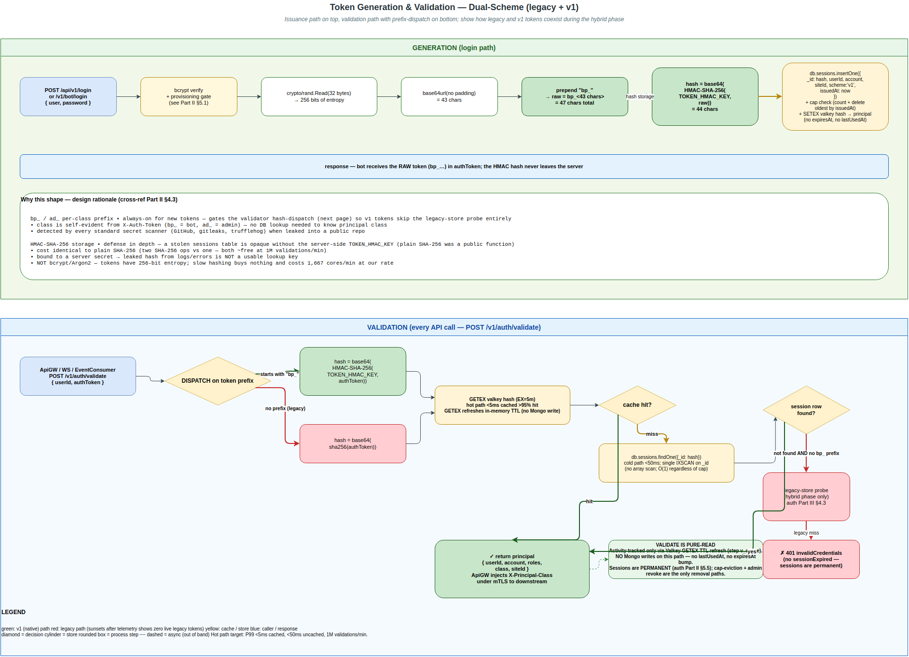
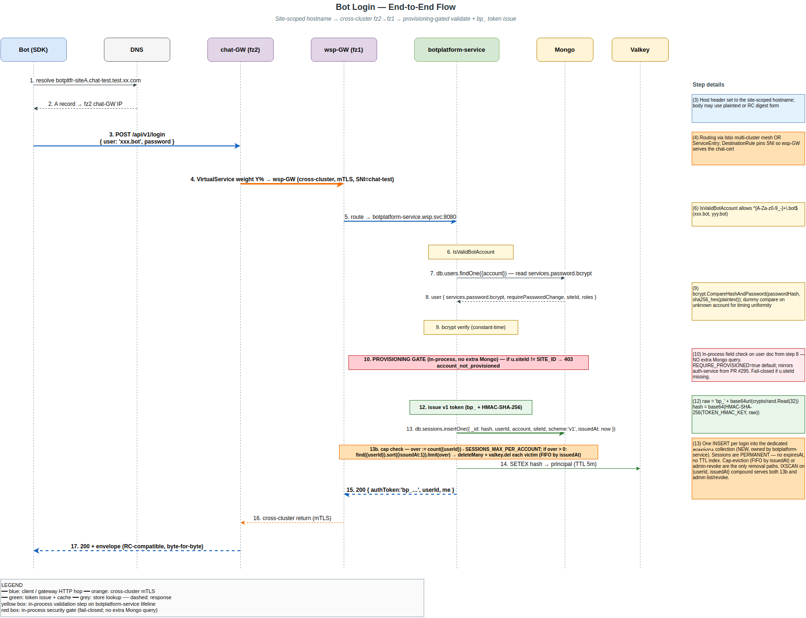

# Bot Platform NextGen — Auth Migration

> **Single combined design spec.** Sections are grouped into three parts: **Part I** (requirements & architecture) for product/architects; **Part II** (technical design) for implementers; **Part III** (components & integration) for downstream service teams. Companion: **[Schema & Migration Runbook](./migration-runbook.md)** (operational).
>
> **Status:** Architecture DECIDED 2026-06-15 (Option B / DEDICATED-SERVICE — see Part I §3). Spec under review for implementation.

---

# Part I — Architecture & Requirements


> **Master spec, Part I.** This document covers the *why*, the *what*, the architecture decision, and the rollout. The **technical design** (data model, algorithms, NATS subjects, config, tests) lives in **[Part II — Technical Design](./auth.md)**. A **Part III — Bot Platform Components Guide** is planned (to be provided).
>
> **Status:** architecture decision DECIDED 2026-06-15 (Option B / DEDICATED-SERVICE — see §3). Spec under review for implementation.

---

## 1. Executive summary

**What:** Build password-based authentication for **bots and admins**, migrating from the legacy v2 repo to the nextgen chat backend.

**Why:**
- The legacy system uses a **capped session array (50-token limit)** per user — both a scaling ceiling and an O(n) validation cost.
- The new system stores **one document per session** in a dedicated `sessions` collection keyed by token hash, with a **configurable per-account FIFO cap** (default 100, env-tunable via `SESSIONS_MAX_PER_ACCOUNT`) enforced at login by count + delete-oldest-by-`issuedAt`. Validate is O(1) — `sessions.findOne({_id: hash})` after a Valkey hit/miss. Replaces the legacy hardcoded 50-cap array-on-user-doc with O(n) scan.
- It enables **better admin controls**: create bot, rotate password, list/revoke sessions.

**Key constraint:** existing bots using the bot SDK **must keep working with zero code changes** — same URL, same credentials, same request/response contract.

---

## 2. Document map
- **Part I (sections 1–11, below)** — executive summary, architecture decision, business requirements, constraints, security, success criteria, rollout plan, scope.
- **Part II — Technical Design** (further below, after Part I) — auth data model (`users.services.password.bcrypt` + new `sessions` collection), hashing/verify algorithms, login & validation flows, NATS subjects, gateway topology & performance design, configuration, test plan, verification checklist, open questions.
- **Part III — Components & Integration** (further below, after Part II) — the bot-platform components (`botplatform-server`, websocket server, event consumer), what we build vs. what exists, and the integration points (API proxy, WebSocket auth, token-compatibility phases).

---

## 3. Architecture decision — DECIDED: Option B / DEDICATED-SERVICE (new `botplatform-service`)

> **Naming note.** This spec's Option A/B labels refer **only** to the auth-service placement decision below. The companion **bot-traffic isolation spec** also uses Option A/B/C for its own (different) routing decision — that spec **decides Option A** (subject-namespace split), which is unrelated to this spec's Option A. To avoid the cross-spec letter collision, both specs now pair the letter with a self-describing suffix (e.g. `Option B / DEDICATED-SERVICE` here; `Option A / SUBJECT-SPLIT` there). When citing across specs, always use the suffix.

Where do bot auth + the REST edge live? Two options were weighed (full breakdown in **Part II §7**):

- **Option A / EXTEND-AUTH.** Add password login + stores + middleware + admin RPCs to the existing `auth-service`. *Rejected 2026-06-15.*
- **Option B / DEDICATED-SERVICE. ✅ SELECTED (design-review decision, 2026-06-15).** A dedicated `botplatform-service` for bot password auth + REST→NATS translation + admin ops; `auth-service` stays pure-SSO.

| Criterion | Option A / EXTEND-AUTH | Option B / DEDICATED-SERVICE |
|---|---|---|
| Time to implement | faster | slower |
| Operational complexity | lower | higher |
| Separation of concerns | poor | **good** |
| Risk to human auth | higher | **lower** |
| Long-term maintainability | moderate | **better** |
| Team ownership | single owner | **split ownership** |

**Why B, despite A being faster** (the scope crossed a threshold — it is now **more than a JSON API**):
- **Blast radius / key safety:** `auth-service` holds the JWT signing key and does human SSO; a browser-facing web UI (HTML, cookies, CSRF) is a much larger attack surface that must not share a process with the signing key. Process isolation > file separation.
- **Signing key stays put:** `botplatform-service` never holds the key and never mints JWTs. The chat-frontend-with-bot-account flow (§5.2) calls `auth-service POST /auth` with `kind:"bot"`; `auth-service` calls `botplatform-service /v1/auth/validate` to verify the session, then mints. REST bot SDKs (flow A) never need a JWT at all.
- **Independent scaling & deploy:** bot load (10k logins/min, 1M validations/min) and the 1-week bot canary are decoupled from human SSO.
- **Clean sunset:** legacy bot auth (Phase 5) is far easier to retire as a standalone service.

A would have shipped faster but mixes a web app's security model into the human-auth signer. *(Note: A was the right call for the original narrow scope; the web-UI + dual-token additions are what tip it to B.)*

---

## 3a. Interfaces & endpoint paths

Three services own the surface (**REVISED 2026-06-24** — Q18 reversed, admin split out into its own portal + service):

1. **`botplatform-service`** — the auth provider. Universal login, password change, token validation. Role-agnostic.
2. **`admin-service`** — REST JSON APIs for all admin operations (suspend bot, revoke sessions, rotate password, future: rate-limit config). Authn via `/v1/auth/validate`; authz requires `class:"admin"`.
3. **`admin-portal`** — separate web frontend (HTML/JS) hosted at its own subdomain. Renders the admin UI; calls `admin-service` REST APIs over the user's session cookie.

`botplatform-service` does **not** proxy `/api/v2/*` (the existing **ApiGW** routes that to `Server`, calling our validate endpoint for auth). All endpoints are **REST** (Q15).

**`botplatform-service` surface:**

| Surface | Path | Method | Returns | Auth |
|---|---|---|---|---|
| Web — login form/submit | `/dev-login` | GET/POST | **HTML** / redirect + **cookie** | CSRF (POST) |
| Web — change-pwd | `/changepwd` | GET/POST | **HTML** / redirect | session cookie + CSRF |
| API — legacy bot login | `/api/v1/login` | POST | **JSON** (`authToken`,`userId`,`me`) | — |
| API — new bot login | `/v1/bot/login` | POST | **JSON** (new token) | — |
| API — token validation | `/v1/auth/validate` | POST | **JSON** (`valid`,principal) | `{userId,authToken}` |

**`admin-service` surface (REST JSON, all routes require `class:"admin"`):**

| Surface | Path | Method | Returns | Auth |
|---|---|---|---|---|
| List bots | `GET /v1/admin/bots` | GET | **JSON** | session cookie → validate → class==admin |
| Create bot | `POST /v1/admin/bots` | POST | **JSON** | + CSRF token |
| Suspend bot | `POST /v1/admin/bots/{id}/suspend` | POST | **JSON** | + CSRF token |
| Rotate password (revokes all sessions) | `POST /v1/admin/bots/{id}/password` | POST | **JSON** | + CSRF token |
| List sessions for a bot | `GET /v1/admin/bots/{id}/sessions` | GET | **JSON** | session cookie |
| Revoke one session | `POST /v1/admin/bots/{id}/sessions/{sid}/revoke` | POST | **JSON** | + CSRF token |
| Revoke all sessions for a bot | `POST /v1/admin/bots/{id}/sessions/revoke-all` | POST | **JSON** | + CSRF token |
| *(future)* Rate-limit config | `PUT /v1/admin/ratelimit/{key}` | PUT | **JSON** | + CSRF token |

**`admin-portal` surface:** static web app (HTML/JS bundle) hosted at e.g. `admin-{site}.chat-test.test.xx.com`. No backend logic of its own — every action is an XHR/fetch to `admin-service`.

- **`/dev-login` is the universal login form** — served by `botplatform-service`, used by chat frontend AND admin portal. Login is role-agnostic; the **post-login redirect target depends on the `Referer` / `?next=` parameter** the calling portal supplies. An admin who logs in via `https://chat.xxx.com/dev-login` lands on the **chat frontend**; the same admin via `https://admin-{site}.…/dev-login` lands on the **admin portal**. Admin-portal additionally enforces `class:"admin"` server-side on every API call — a non-admin who somehow lands there gets `403 forbiddenNotAdmin`.
- **Web routes** use **session cookies** (HttpOnly/Secure/SameSite=Lax) + **CSRF**. The cookie is **scoped to the requesting Host**, so the chat-domain cookie and the admin-domain cookie are distinct surfaces backed by the same `sessions` row.
- **`/v1/auth/validate`** is called by **ApiGW, the WebSocket server, EventConsumer, AND `admin-service`** to authenticate inbound traffic. Its response includes a **`principal.class`** field (`"bot"|"user"|"admin"`) so downstream services route or authorize by class without re-deriving (admin-service uses it for the `class:"admin"` authz check; bot-traffic isolation uses it for routing).
- **`/api/v1/login`** (legacy contract) + **`/v1/bot/login`** (new) are for **bot processes** (SDK); both via Istio at the same hostnames so bots don't change URLs.
- **All paths in this table are site-scoped via the hostname** — every site runs its own `botplatform-service` + `admin-service` + `admin-portal`. There is no central front door and no cross-site rewriting. A bot dials its home site directly; the provisioning gate (§5) refuses logins targeting any other site.

---

## 4. Business requirements — user stories

### US1 — Bot login
*As a bot, I want to log in with username/password to get an auth token.*
- Accept `{ user, password }` (plaintext or RC digest form).
- Return `authToken`, `userId`, `me`.
- **Performance: P99 < 200 ms** (stretch goal < 100 ms).
- **Must match the legacy response format exactly.**

### US2 — Session-based API access
*As an authenticated bot, I want to make API calls using my token.*
- Headers: `X-Auth-Token` + `X-User-Id`.
- **Configurable cap with FIFO eviction by `issuedAt`**: at most `SESSIONS_MAX_PER_ACCOUNT` (default 100, env-tunable) live sessions per account. New login at-cap evicts the oldest-issued session(s) by `issuedAt` ASC. Replaces the legacy hardcoded 50-cap stored as an array-on-user-doc with O(n) scan.
- Validation latency: **< 5 ms cached, < 50 ms uncached**.
- Support **1,000,000 validations / minute**.

### US3 — Permanent sessions until cap-evicted or admin-revoked
*As a bot, I want my session to keep working as long as my pod is running (the SDK does NOT auto-relogin on 401); and as an operator, I want a hard upper bound on session count per account so a runaway / misbehaving / compromised bot can't accumulate sessions unboundedly.*
- **No time-based expiry.** Sessions live in Mongo forever until either (a) the per-account cap evicts them, or (b) an admin explicitly revokes them.
- **Cap at `SESSIONS_MAX_PER_ACCOUNT` per account** (default 100, env-tunable).
- **FIFO eviction by `issuedAt`** when a new login at-cap arrives — oldest-issued session dropped first. This naturally targets orphaned tokens from prior pod restarts (which are always older than the currently-active one).
- **Validate is pure read** — no Mongo writes on the hot path. The Valkey cache is the in-memory activity signal (TTL-refreshed via `GETEX` on hit); Mongo row is unchanged across the session's life.

### US4 — Admin bot creation
*As an admin, I want to create new bot accounts.*
- Set a temporary password.
- Force password change on first login.
- **Only admins** can create.

### US5 — Password rotation
*As an admin, I want to reset bot passwords.*
- Change the password immediately.
- **Revoke all existing sessions.**
- Force re-login.

### US6 — Session management
*As an admin, I want to see and revoke bot sessions.*
- List all active sessions.
- Show last-used time.
- Revoke an individual session or all of them.

### US7 — Web login (browser)
*As an admin/developer, I want to log in through a web page.*
- `GET /dev-login` serves an **HTML** form; `POST /dev-login` submits it.
- On success, set a **session cookie** (HttpOnly/Secure/SameSite) and redirect.
- **CSRF-protected.**

### US8 — Web change-password (browser)
*As a logged-in user, I want to change my password through a web page.*
- `GET /changepwd` serves an **HTML** form; `POST /changepwd` submits it.
- Requires a valid session cookie + **CSRF** token.
- On success, **revoke other sessions** and force re-login (consistent with US5).

---

## 5. Critical constraints
- **User IDs:** 17-char Meteor format (**not** UUID).
- **Passwords:** `bcrypt(sha256_hex(plaintext))`, **cost = 10**.
- **Tokens (dual-format during hybrid phase, Part II §4.6):**
  - Legacy tokens: opaque random, stored `base64(sha256(rawToken))` — byte-for-byte RC compatibility.
  - Native v1 tokens: `bp_<43-char base64url of 32 random bytes>`, stored `base64(HMAC-SHA-256(server_secret, rawToken))`.
  - Validator dispatches on the `bp_` prefix; legacy fallback only for prefix-less tokens.
- **IDs must be preserved from legacy** — no remapping layer (the v2 Go repo already preserves the 17-char `_id`).
- **Provisioning-gated login.** After credential verification, the `siteId` field on the `users` doc (already loaded for the password check) must match `SITE_ID`; otherwise `403 account_not_provisioned`. **In-process field check, no extra Mongo round-trip.** Mirrors the auth-service gate introduced in PR #295. Controlled by `REQUIRE_PROVISIONED=true` (default); fail-closed on store errors.
- **Single home site per bot.** A bot is provisioned at exactly one site (its home site), identified by `siteId` on its user record. Login is accepted only at that site's `botplatform-service`. Cross-site interaction happens via NATS supercluster federation, never via cross-site login.
- **Bot account → subject-name strip.** Bot accounts use the legacy `*.bot` suffix (`xxx.bot`, `yyy.bot`), which contains a `.` and would multi-tokenize unsafely if used raw in a NATS subject. The subject-side identifier is the **`.bot`-stripped form** (`xxx.bot` → `xxx`) produced by `subject.BotSubjectName` — the `chat.bot.>` namespace already encodes the class so the suffix is redundant. Bot NATS subjects scope to **`chat.bot.{account}.>`** (where `{account}` is the stripped name) — never the `chat.user.>` namespace, eliminating ACL overlap between human `xxx` and bot `xxx.bot` (Part II §4.7). Validation: `subject.IsValidBotAccount` accepts the legacy `^[A-Za-z0-9_-]+\.bot$` shape; the strict `subject.IsValidAccountToken` from PR #295 continues to apply to human accounts on `chat.user.>`.

---

## 6. Migration
- **Import password hashes verbatim** — never rehash or recompute (we don't hold the plaintext).
- **Import active login tokens only.**
- **Skip personal access tokens** (`type:"personalAccessToken"`) — not used by bots.
- **Zero bot code changes required.**
- **Credential import and provisioning are coordinated.** The same migration job that writes `credentials` writes the `{userId, siteId}` membership row to that site's `users` collection. A credential without a provisioning row results in a correct-but-confusing `account_not_provisioned` 403; the migration order prevents that window. Until the multi-site rollout actually lights up >1 nextgen site, every migrated bot lands at the single nextgen site (gate is essentially a no-op safety belt).

**Dual-token validation (during migration):**
- **Accept old Rocket.Chat tokens** (imported, validated against the same store).
- **Issue new botplatform tokens** on every fresh login.
- **Gradually phase out old tokens** — as bots re-login they get new `bp_` tokens; FIFO cap eviction (§5.6) pushes the older imported legacy tokens out first when an account hits cap. Once telemetry shows no live legacy tokens (zero `scheme:"legacy"` validate hits), legacy acceptance can be switched off outright.

---

## 7. Security
- **Never log** tokens or passwords (or their hashes).
- **Timing-safe credential comparison** (run bcrypt even on unknown accounts; uniform error/timing — no account enumeration).
- **Rate limiting:** 5 failed attempts → **15-minute lockout**.
- **HTTPS only.**
- **CSRF protection on all web (form) routes** (`/dev-login`, `/changepwd`); API/token routes are exempt (no ambient cookie credential).
- **Session cookies for web** — HttpOnly, Secure, SameSite — distinct from API bearer tokens. Both resolve to the same session store.

---

## 8. Success criteria

**Performance**
- Login **P99 < 200 ms** (ideally < 100 ms).
- Token validation **P99 < 5 ms cached**.
- **Cache hit ratio > 95%**.
- Sustain **10k logins/min, 1M validations/min**.

**Migration**
- **Zero downtime** via Istio canary.
- **1% → 100% traffic over ~1 week**.
- **Rollback within 1 hour.**
- **Zero data loss.**

---

## 9. Migration plan (phases)

**Phase 1 — Foundation**
- Deploy the auth service with the login API.
- Create the session store.
- Build the migration script.

**Phase 2 — Integration**
- Update the API gateway with token validation.
- Test bot-platform server routing.
- Fix WebSocket authentication.

**Phase 3 — Data migration**
- Freeze legacy auth.
- Run migration (dry-run + live).
- Verify counts.

**Phase 4 — Cutover**
- Istio canary 1% → 10% → 50% → 100%.
- Monitor 24h.
- Dashboard gate: error rate **< 0.1%**.

**Phase 5 — Cleanup**
- Monitor stability.
- Sunset legacy auth (v2 Go repo auth, and possibly v1 auth).
- Update documentation.

---

## 10. Diagrams

Source-of-truth `.drawio` files live in `docs/specs/diagrams/`. PNG previews embedded below render the same diagram and round-trip to draw.io desktop (XML is embedded).

### 10.1 Old vs new login mechanism



Side-by-side comparison — legacy Rocket.Chat (hardcoded 50-cap session array on the user doc, O(n) scan per validate, plain SHA-256, no provisioning gate) vs nextgen botplatform-service (configurable cap with FIFO eviction by `issuedAt`, one doc per session = O(1) validate, HMAC-keyed storage, provisioning gate, **pure-read validate path — no Mongo writes**). Bottom panel calls out the wire-level backward compatibility that keeps bots running unchanged.

Source: [`login-old-vs-new.drawio`](./diagrams/login-old-vs-new.drawio) · PNG: [`login-old-vs-new.drawio.png`](./diagrams/login-old-vs-new.drawio.png)

### 10.2 Token generation & validation flow



Top half = generation pipeline (login → bcrypt verify → 32 bytes random → base64url → `bp_` prefix → HMAC-SHA-256 storage hash → INSERT sessions). Bottom half = validation with prefix-dispatch (Valkey cache hot path, Mongo cold path, legacy-store fallback only for pre-prefix tokens). Embedded rationale block in the middle explains why each design choice — see Part II §4.6.

Source: [`token-gen-validate-flow.drawio`](./diagrams/token-gen-validate-flow.drawio) · PNG: [`token-gen-validate-flow.drawio.png`](./diagrams/token-gen-validate-flow.drawio.png)

### 10.3 Bot login — end-to-end flow



17-step sequence diagram covering the whole wire path: Bot → DNS → chat-GW (fz2) → wsp-GW (fz1) → botplatform-service → Mongo + Valkey. Provisioning gate (red), in-process steps (yellow), token issue (green), cross-cluster mTLS hop (orange). Right-side annotation panel carries the long detail strings out of the arrow labels.

Source: [`bot-login-flow.drawio`](./diagrams/bot-login-flow.drawio) · PNG: [`bot-login-flow.drawio.png`](./diagrams/bot-login-flow.drawio.png)

### 10.4 Cross-cluster cutover topology


Topology + canary control surface. Per-namespace DNS binding visible at the top (the reason DNS-repoint to wsp gateway is infeasible). chat-GW VirtualService weights X% local + Y% cross-cluster. wsp-GW listens on both `*.wsp-test.*` and `*.chat-test.*` (the new chat-cert server block accepts the forwarded traffic). botplatform-service + ApiGW + Server + WS + EventConsumer + stores in fz1/wsp. Steady-state note on the right side of fz2 explains the permanent thin-forwarder shape after sunset.

Source: [`cross-cluster-cutover.drawio`](./diagrams/cross-cluster-cutover.drawio) · PNG: [`cross-cluster-cutover.drawio.png`](./diagrams/cross-cluster-cutover.drawio.png)

### 10.5 Regeneration

Open any `.drawio` source in draw.io desktop (or paste into [app.diagrams.net](https://app.diagrams.net)) to edit. Re-export with:

```bash
drawio -x -f png -e -s 2 docs/specs/diagrams/<file>.drawio
# headless Linux: prefix with `HOME=/tmp xvfb-run -a` and append `--no-sandbox` at the END
```

### 10.6 Other diagrams

- [Bot Platform NextGen — Auth Architecture](https://www.figma.com/board/fcnw0N493MwYeQBgXuA3qu) — FigJam whiteboard, earlier-iteration architecture overview. The `.drawio` files above are the up-to-date source.

---

## 11. Out of scope
- Human SSO/OIDC (unchanged; stays in `auth-service`).
- Bot permissions (separate system).
- Message routing (separate).
- **Personal access tokens** — bots don't use them. **Recommendation: do not support in this phase** — the session model already covers every bot need (login, long-lived tokens, capped per-account session pool with FIFO eviction). PATs are a human-user feature with no bot benefit here; revisit only if/when human REST API access moves to the nextgen stack.
- **General user administration** (humans + bots — list, search, view profile, change role, deactivate, audit) is **NOT in this spec**. The `/admin/bots…` surface here is **bot-specific** (create / rotate password / list-or-revoke sessions for a bot account). A separate spec is needed for `/admin/users…` because:
  - **Write path ownership** — it writes to the shared `users` collection owned by the PR #295 / portal-service team (we only read from it for the provisioning gate).
  - **Permission boundaries** — site-admin vs super-admin, cross-site visibility, audit log — the bot-only admin surface doesn't need any of these.
  - **UX surface** — search across N users, bulk operations, role pickers; bot admin is a tiny CRUD by comparison.

  Likely home for the follow-up spec: `docs/specs/botplatform/admin-user-management.md` if owned by this team (the admin web UI plumbing — `/dev-login` session, CSRF, role-gating — is already here). Alternative: `docs/specs/portal/…` if the portal-service team picks it up. Tracked as a follow-up; the bot admin surface here is intentionally bounded.


---

# Part II — Technical Design


> **Part II — Technical Design.** Builds on Part I (above). Section numbering restarts at §1 within this part. Cross-references like "Part II §4.3" refer to sections inside this part; bare "§X" cites within the same part.
>
> **Status:** DESIGN-COMPLETE — pending verification against the internal (legacy RC fork + nextgen) codebase. §22 is the verification checklist to run before this becomes an implementation plan. Open questions are tracked in §12 (all but two resolved).

*Bring password-based login (admins + bots) and durable session management to the nextgen NATS-native stack, migrating credentials from the legacy Rocket.Chat (RC) Mongo `users` collection without forcing any bot developer to change URLs, credentials, or client code, and cut over behind the shared Istio gateway with zero downtime.*

---

## 1. Goal & non-goals

### Goals
1. **Transparent migration for existing accounts.** Admins and bots that authenticate today via the legacy password endpoint keep the same URL, the same credentials, and the same request/response contract. No password resets, no client changes.
2. **Higher tunable session cap, O(1) validation.** Move sessions out of the legacy in-array shape and into a dedicated `sessions` collection — one doc per session, keyed by token hash. Cap raised to `SESSIONS_MAX_PER_ACCOUNT` (default 100, env-tunable) with FIFO eviction by `issuedAt` at login (count + delete-oldest). Validate is O(1) — a single `_id` lookup per request, independent of session count.
3. **Net-new operator surface.** A NATS-native operator UI (+ its request/reply handlers) for admin login and bot provisioning/management (create bot, set/rotate password, list/revoke sessions).
4. **Zero-downtime cutover** behind the shared Istio gateway, same public URL, new namespace.

### Non-goals (out of scope)
- The exact legacy REST **endpoint surface** and its full subject-mapping table (owned by the gateway track). This spec designs the auth model + the gateway's *responsibilities and topology* (§9), not the per-verb mapping.
- Room/message/federation dual-write consistency during cutover — a separate track (§10.4 flags the boundary only).

---

## 2. Current state (grounded)

Verified against the repo (`auth-service/`, `pkg/userstore`, `pkg/model`, `pkg/subject`):

- **`auth-service` is OIDC/SSO-only.** `POST /auth` (`auth-service/routes.go:5`) validates an SSO token (or a dev account name in dev mode), then signs a **NATS user JWT** using the account's scoped signing key (`AUTH_SCOPED_SIGNING_KEY`). Per-user permissions come from the scope template; the JWT only stamps the `account:<account>` tag so `{{tag(account)}}` in the template resolves to `chat.user.{account}.>`, `chat.room.>`, `_INBOX.>`, and presence subjects. The JWT also carries `issuer_account = AUTH_ACCOUNT_PUB_KEY` so the NATS resolver can attribute the SK back to the account.
- **Clients talk to NATS directly** after `/auth`. There is no HTTP→NATS gateway in the repo; all RPC is NATS request/reply via `pkg/natsrouter`.
- **No password storage, no bcrypt, no session/login-token store exists anywhere.** Clean slate — no legacy auth code in the nextgen repo to refactor around.
- **Identity already works for bots.** `model.User` (`pkg/model/user.go`) carries `Account`, `SiteID`, `Roles`, display names; `model.IsBotAccount` (`pkg/model/account.go`) classifies bots by `*.bot` suffix / `p_` prefix; `pkg/userstore` resolves any account through a pod-local LRU+singleflight cache.
- **JWT minting is reusable** — exactly what a password login needs after credential verification.

### 2.1 Legacy Rocket.Chat reference (verified against RC/Meteor)

The legacy system is Rocket.Chat. Confirmed behavior the migration must honor:

- **Login request** — `POST /api/v1/login` (the deployment's `/dev-login` is a fork-specific route, mechanics identical; exact path/body to confirm, §12 Q1). Body accepts **either** plaintext `{ user, password }` **or** a pre-hashed `{ user, password: { digest: <sha256-hex>, algorithm: "sha-256" } }`. Clients may use either form, so the nextgen login path must accept **both**.
- **Login response** — `{ "status":"success", "data":{ "authToken":"<raw>", "userId":"<17-char>", "me":{ "_id", "username", "name", "active", "roles":["bot"] } } }`. Subsequent calls authenticate with headers **`X-Auth-Token: <raw>`** + **`X-User-Id: <17-char>`**. (Full contract confirmed, §12 Q1.)
- **Password storage** — `users.services.password.bcrypt` = `bcrypt(sha256_hex(password))` (Meteor accounts-password). Verification: hex-SHA-256 the incoming plaintext (or take the client-supplied `digest`), then `bcrypt.CompareHashAndPassword`.
- **Login-token storage** — `users.services.resume.loginTokens[]`, each `{ when, hashedToken }` where **`hashedToken = base64(sha256(rawToken))`** (Meteor `Accounts._hashLoginToken`). The raw token is the `X-Auth-Token`; the server hashes the inbound token and matches.

> Sources: RC REST auth (`developer.rocket.chat`, RocketChat/Rocket.Chat issue #5466), RC password format (forums.rocket.chat "Password format in database"), Meteor `Accounts._hashLoginToken` (Meteor forums / accounts-base). Cited in chat.

**Implication:** identity is solved; we add (a) a credential store, (b) a session store using RC's exact token-hash form, (c) a password-login path that reuses JWT minting, (d) provisioning handlers + UI, (e) the gateway (§9).

### 2.2 Confirmed by internal codebase analysis (2026-06-15)

- **Bots authenticate with password only**, via the Node.js bot SDK calling `POST /api/v1/login`. **No PAT usage among bots** — Personal Access Tokens are a *human-user* feature. ⇒ PATs are **out of scope**; the session model carries no PAT `type`/`name` fields and migration imports no PAT tokens (§6 simplified, Q8 resolved).
- **`users._id` is a 17-char Meteor ID**, and the v2 Go repo **preserves the legacy `_id` verbatim** through identity-sync. ⇒ nextgen `users._id` == legacy `_id` == the `X-User-Id` a bot sends. **No ID-mapping layer, no `LegacyUserID` field** (Q9 resolved).

---

## 3. Key design decisions

| Concern | Decision | Why |
|---|---|---|
| Bot/admin **identity** | Stays in the shared `users` collection (roles distinguish admin/bot/user) | Every downstream service resolves accounts through the cached `userstore`; a second identity collection forces double lookups and breaks display-name/federation resolution. |
| **Password material** | `users.services.password.bcrypt` (legacy schema path, in-place; DECIDED 2026-06-24, §4.1) | Internal-only system; bot passwords are machine-generated with strong entropy → bcrypt-10 is computationally infeasible to reverse. Collapsing into `users` eliminates schema migration for the password side, the credentials-extraction step, and every "credentials vs identity" coherency problem. Reasoning + accepted costs in §4.4. |
| **Sessions** | New `sessions` collection, **one doc per session** keyed by a per-row token hash. Dual-hash scheme (§4.6): legacy rows use `base64(sha256(token))`, native `v1` rows use `base64(HMAC-SHA-256(server_secret, token))`. **Configurable per-account cap with FIFO eviction by `issuedAt`** — default 100, env-tunable via `SESSIONS_MAX_PER_ACCOUNT` (§5.6). **Sessions are permanent** until cap-evicted or admin-revoked; no time-based expiry. **Validate is pure read** — Valkey hit (refreshing in-memory TTL via `GETEX`) or Mongo `findOne({_id: hash})` on miss; no Mongo writes on the hot path. | O(1) lookup independent of session count (validate reads sessions by `_id` regardless of cap); per-session + per-account revocation. Bounded users-doc size (sessions can't bloat the identity doc that every nextgen service caches). Cap bounds account-scope growth (essential since sessions are permanent); FIFO naturally targets old orphaned tokens from prior pod restarts. Bot SDKs that don't auto-relogin on 401 stay working forever as long as the session row exists. Dual hash preserves bit-for-bit legacy compatibility while raising the storage-leak bar for new tokens. Replaces the legacy hardcoded 50-cap stored as a `loginTokens[]` array on the user doc (O(n) scan per validate). |
| **Token wire format** | Per-class unversioned prefixes: **`bp_<43-char base64url>`** for bot session tokens, **`ad_<43-char base64url>`** for admin session tokens; legacy tokens unchanged (§4.6) | Class is self-evident from the `X-Auth-Token` prefix — no DB lookup needed to know whether the bearer is bot or admin. Unlocks a single-store fast path (no legacy fallback lookup), and the prefix is detected by every standard secret-scanner. **No version digit** (`bp_`, not `bp1_`) — the login mechanism isn't planned to rotate; YAGNI. |
| **Scope** | Both surfaces (password on `users`, sessions collection) are **account-agnostic** (admins *and* bots) | The legacy login authenticates admins too — shared password-login infrastructure, not bot-only. |
| **NATS JWT** | **Minted by `auth-service` only** — never by `botplatform-service`, never returned from `/api/v1/login` or `/dev-login`. `auth-service POST /auth` takes a `kind` discriminator with **three values**: `sso` (OIDC bearer → `chat.user.{account}.>`), `bot` (`bp_…` session token → `chat.bot.{strippedAccount}.>` where `xxx.bot → xxx`), `admin` (`ad_…` session token → `chat.>` god-mode). For `kind:"bot"` and `kind:"admin"`, `auth-service` calls back into `botplatform-service /v1/auth/validate` before minting. See §5.2. **Only chat-frontend callers need this** — bot SDK pods (flow A) never request a JWT. | Single signing key, single minter (blast-radius isolation, §7 Option B rationale). The bot SDK is REST-only — JWT mint stays out of the login surface. Reuses the existing JWT machinery and grants infrastructure on `auth-service`; bot/admin kinds just add validator branches that delegate to `botplatform-service`. |
| **Validation hot path** | Mongo durable + **read-through cache (in-pod LRU + Valkey)** | Every REST call validates a token; a Mongo read per call is the bottleneck (§9.3). |

---

## 3a. Two consumer flows for a bot account (orientation)

A single bot account can be consumed in **two distinct ways**. The rest of this spec assumes the reader has internalized which flow each section serves:

| Flow | Consumer | Login path | Credential carried on each request | NATS JWT? | Backend reach |
|---|---|---|---|---|---|
| **A. Pure bot service** *(the main case — 99% of bots today)* | Bot pod / SDK running independently | `POST /api/v1/login` (or `/v1/bot/login`) → `{authToken, userId, me}` | `X-User-Id` + `X-Auth-Token` (REST headers) | **No** | REST → `bp-api/api/v2/*`; bp-api bridges REST→NATS-RPC internally. The bot never speaks NATS. |
| **B. Bot account in the chat frontend** *(future / niche — e.g. a human operator using a bot's identity in the web UI)* | Chat frontend (NATS-native browser app) | Same login first → then `auth-service POST /auth` with `kind:"bot"` to exchange the session token for a NATS JWT (§5.2) | NATS JWT (short-lived; refreshed from the still-valid session) | **Yes** — minted by `auth-service`, never by botplatform-service or by login | NATS directly, same grants infrastructure as a human SSO user (just a bot-scoped subject grant) |

**Implications baked into the spec:**
- **`/api/v1/login` and `/dev-login` return only `{authToken, userId, me}`** — no JWT, no `natsPublicKey` field on the request. Flow A bots need nothing more; flow B users hop to `auth-service` separately.
- **`botplatform-service` never mints NATS JWTs and never holds the signing key.** It only verifies session tokens via `/v1/auth/validate` (§9.8). The single minter is `auth-service`, for both human SSO and bot-kind (§5.2).
- **Native bot SDKs that speak NATS directly are not in scope.** A future native-bot SDK milestone would route through the flow-B path (extend the existing `auth-service` extension); no new mint surface on `botplatform-service`.

---

## 4. Data model

### 4.1 Password material on `users` (DECIDED 2026-06-24)

**Passwords stay on the `users` document — no separate `credentials` collection.** Same legacy RC/Meteor schema paths. Reasoning: this is an internal company-only system, bcrypt hashes are computationally hard to reverse (and bot passwords are machine-generated with strong entropy), and collapsing the credential side into `users` eliminates the credentials-extraction step + the per-write "credentials vs identity" coherency problem. **Sessions stay separate** (§4.2) — they are higher-volume, must not bloat the cached identity doc, and need O(1) hash-keyed lookup.

| Field path | Type | Notes |
|---|---|---|
| `_id` | `string` | **17-char Meteor ID** preserved verbatim from legacy (Q9). Same id space as `X-User-Id`. |
| `account` | `string` | Login username. Unique index. |
| `siteId` | `string` | Home site (PR #295). Provisioning gate (§5.1 step 3) reads this. |
| `roles` | `[]string` | e.g. `["bot"]`, `["admin"]`. |
| `name`, `active`, `createdAt`, … | (existing identity fields) | Unchanged by this design. |
| `services.password.bcrypt` | `string` (`json:"-"`) | Bcrypt hash, **same legacy path** (no rename). Read by botplatform-service for verify; never serialized; `String()` method masks on `model.User`. |
| `services.password.scheme` | `string` (`json:"-"`) | `"rc-sha256-bcrypt"` for imported; same for new (we keep the verify family). Optional — verify uses default scheme if absent. |
| `requirePasswordChange` | `bool` | First-login flag (§5.4). Existing legacy field at root. |

`services.resume.loginTokens[]` is **read but not written** on `users` during the hybrid phase (legacy app still writes there); nextgen reads it only as a fallback during the cutover (§5.3 / Part III §4.3) and copies entries out to the `sessions` collection at migration time (§6).

### 4.2 `sessions` collection (NEW)

One Mongo doc per live session, keyed by the per-row token hash.

| Field | Type | Notes |
|---|---|---|
| `_id` | `string` | The **token hash** — primary lookup key. **`v1` entries:** `base64(HMAC-SHA-256(server_secret, rawToken))` (§4.6). **`legacy` entries (imported):** `base64(sha256(rawToken))` byte-for-byte from RC `Accounts._hashLoginToken`. |
| `userId` | `string` | The 17-char Meteor ID — matches `X-User-Id` and `users._id`. |
| `account` | `string` | Denormalized login username so validate returns it without a join. |
| `siteId` | `string` | Home site stamped at issue time; never changes for the row. |
| `scheme` | `string` | `"v1"` for new entries; `"legacy"` for imported. Documents which hash function produced `_id`; required for the validator to pick the right hash on cache miss. |
| `issuedAt` | `int64` (ms epoch) | Issue time. **The FIFO ordering key for cap eviction** (§5.6). |

**Not present** (dropped in the 2026-06-24 pivot, §4.4): `lastUsedAt`, `expiresAt`, TTL index.

### 4.3 Indexes

```js
// users (existing, plus provisioning-gate compound)
db.users.createIndex({ _id: 1 })                                          // existing primary
db.users.createIndex({ account: 1 }, { unique: true })                    // existing
db.users.createIndex({ account: 1, siteId: 1 }, { unique: true })         // provisioning gate (or via PR #295)

// sessions (NEW)
db.sessions.createIndex({ _id: 1 })                                       // primary, auto — token-hash lookup, the hot path
db.sessions.createIndex({ userId: 1, issuedAt: 1 })                       // compound: cap-eviction victim lookup (§5.6) AND list-sessions/revoke-all-by-user
```

The token validate path is `sessions.findOne({_id: hash})` — single index hit, O(1) cost independent of session count. The cap-eviction path at login is `sessions.find({userId}).sort({issuedAt:1}).limit(N).project({_id:1})` then a batch delete by `_id` — IXSCAN on the compound index, bounded by overflow size (typically 1).

### 4.4 Why mixed (passwords on `users`, sessions separate)

**Why passwords collapsed onto `users` (vs the earlier `credentials` collection):**
- **Zero schema migration for the password side.** Legacy already stores `services.password.bcrypt` on `users`; the identity-sync that PR #295 wires up already carries it end-to-end. The credentials-extraction step in the migration runbook disappears.
- **Single source of truth for the credential.** Identity and password live on one doc; password rotation is a single `$set` on the user doc (and a parallel `deleteMany` on sessions for revoke-all — §5.6).
- **Free cache hit.** `pkg/userstore`'s LRU cache holds the user doc; password verify benefits from cached identity reads.
- **Cost accepted (internal-system context):** `pkg/userstore`'s fleet-wide cache now holds `services.password.bcrypt` in every pod's memory. Mitigations: `model.User`'s password field has `json:"-"` (no JSON serialization) and a `String()` override that masks it (no `%+v` leak). A core-dump leak is still possible. Accepted because (a) internal-only, audited infra, (b) bot passwords are machine-generated with strong entropy — bcrypt-10 on a `crypto/rand(16 bytes)` password takes longer than the heat-death of the universe to brute-force.

**Why sessions stayed in a dedicated collection (vs collapsing them onto `users` too):**
- **O(1) validate independent of session count.** Validate is `findOne({_id: hash})` — one index hit, no in-doc array scan. Collapsing 100 sessions per account into `users.services.resume.loginTokens[]` would have made every userstore cache entry that much larger and every validate either (a) fetch the whole user doc or (b) need a multikey index plus a doc fetch anyway.
- **Bounded users-doc size.** `users` is cached fleet-wide by `pkg/userstore`; bloating it with session history blows up the cache footprint and the per-fetch wire size on every identity resolve in every service.
- **Per-session revocation primitive.** Admin revoke is a single `sessions.deleteOne({_id: hash})` + Valkey del; revoke-all is `sessions.deleteMany({userId})`. No `$pull` against a (potentially concurrently-modified) embedded array.
- **Clean ownership boundary.** `users` is shared infra; `sessions` is exclusively owned by `botplatform-service` (Mongo RBAC scoped). The credential is the only field that crosses the ownership line — accepted because of the entropy argument above.

### 4.5 What dropped from earlier drafts

- **`lastUsedAt` field on sessions** — validate is pure read (§5.3); no Mongo writes; field would be dead data.
- **`expiresAt` field on sessions** — sessions are permanent until cap-evicted or admin-revoked (§5.5); no time-based expiry. Bot SDK doesn't auto-relogin on 401, so a hard expiry would silently break long-running bots.
- **Partial TTL index on `expiresAt`** — no `expiresAt`, no TTL index.
- **Separate `credentials` collection** — collapsed into `users` (§4.1).
- **`UpdatedAt` on the credentials row** — there IS no credentials row; password-change timestamp is on the existing `users` doc.

### 4.6 Token format & storage hash (Q10 — DECIDED 2026-06-16, supersedes the earlier "same format" stance)

Two formats coexist for the duration of the hybrid phase. Both are stateful opaque tokens — see §3 for why this is not JWT — but they differ in wire shape and storage-hash function.

| Aspect | Legacy (`scheme:"legacy"`) | Native v1 (`scheme:"v1"`) |
|---|---|---|
| Wire format | Opaque random string (RC/Meteor shape) — no prefix | **`bp_<43-char base64url of 32 random bytes>`** (256 bits of entropy) |
| Storage hash | `base64(sha256(rawToken))` — Meteor `Accounts._hashLoginToken`, byte-for-byte | **`base64(HMAC-SHA-256(server_secret, rawToken))`** |
| Source | Imported from `users.services.resume.loginTokens[]` (§6.2) | Issued by `botplatform-service` on every fresh login (§5.1) |

**Why the `bp_` prefix on new tokens:**
- **Validation fast-path.** Validator inspects the token: starts with `bp_` → look up in the v1 namespace **only** (HMAC hash); else legacy → SHA-256 hash, our store first then legacy-store fallback. No double-lookup on native tokens.
- **Forward versioning.** When (not if) the token shape rotates — new entropy length, embedded checksum, algorithm change — `bp_` → `(future bp_v2 alt)` lets both formats coexist with zero ambiguity at the validator.
- **Leaked-secret detection.** GitHub secret scanning, gitleaks, trufflehog all key off prefixes. A `bp_…` value in a public repo gets flagged automatically. A bare base64 string doesn't.
- Cost: 4 bytes on the wire. Negligible.

**Why HMAC-SHA-256 storage for v1 (not plain SHA-256):**
- **Hardens against offline attack on a stolen sessions table.** Plain SHA-256 is a public deterministic function — a DB dump lets an attacker probe hash guesses. HMAC keys the hash on a server secret only `botplatform-service` holds; without the secret, the dump is opaque even if the attacker knew the algorithm. (Token entropy is 256 bits, so SHA-256 brute-force is already infeasible — this is defense in depth.)
- **Decouples in-DB hashes from public hash equality.** Plain `sha256(token)` is the same value everywhere; HMAC binds the storage key to our server. Logs / error reports that leak the hash don't give an attacker a usable lookup key.
- **Cost is identical.** HMAC-SHA-256 is two SHA-256s — both ~free at our throughput. No measurable latency impact on the 1M-validations/min path.
- **Storage size identical.** 32-byte digest → 44-char base64.

**Why NOT bcrypt/Argon2/scrypt for token storage:**
- Slow hashes exist for low-entropy inputs (passwords). Tokens have 256 bits of entropy — slow-hashing them is pure cost. 1M validations/min × 100 ms bcrypt = 1,667 cores wasted on a problem we don't have.
- Passwords still use bcrypt (§14). Tokens don't. Different inputs, different tools.

**Why NOT JWT / PASETO:**
- We need cheap revocation (US5), session enumeration (US6), per-site issuance, and ≤5 ms cached validation at 1M/min — with **no Mongo writes on the validate path**. Stateful opaque tokens with Valkey read-through cache give all of those; JWTs would replace state with crypto verification but make revocation an out-of-band problem (no kill switch for a leaked token) while saving nothing meaningful (Valkey cache handles the lookup latency).

**Why NOT rotating bot tokens:**
- Bots are long-lived processes, not browsers. Rotating their access tokens would force credential reloads across the bot fleet for marginal security gain. Stable + revocable + idle-expiring is the right shape for bot tokens. (Web *admin* sessions are a separate question — rotating session cookies per request is reasonable there, tracked separately.)

**Server-secret rotation (HMAC key):** the HMAC `server_secret` is loaded from `TOKEN_HMAC_KEY` (env, required for v1). Rotating it requires a graceful key-rollover: keep the previous key as `TOKEN_HMAC_KEY_PREVIOUS` while bot operators rotate sessions to the new key (admin-driven password reset across the affected accounts, which revokes all sessions for those accounts and forces re-login under the new HMAC key). Documented in §16.

### 4.7 Bot account namespace & subject tokens (DECIDED 2026-06-16)

Bot accounts in production carry the legacy `*.bot` suffix (`xxx.bot`, `yyy.bot`, confirmed against the v2 Mongo `users` collection). The `.` is unsafe as a NATS subject token — it would multi-tokenize, and `chat.user.xxx.bot.…` (4 account tokens) would let a human account `xxx` (grant `chat.user.xxx.>`) match a bot account `xxx.bot`'s subject space. That's an ACL escape, separate from the format-validation problem PR #295 introduces.

**Two-layer fix.** The Mongo identity is unchanged; the change is at the NATS subject layer.

#### Layer 1 — separate top-level namespace
Bot subjects live on **`chat.bot.>`**, never under `chat.user.>`. Top-level token disambiguates classes — a human grant `chat.user.alice.>` and a bot grant `chat.bot.alice.>` cannot overlap regardless of the bot account's underlying name. This is also the same namespace the bot-traffic isolation spec uses for class routing, so the two specs converge on a single ontology.

#### Layer 2 — strip the `.bot` suffix to derive the subject-side name
The subject already encodes the class (`chat.bot.>`), so the `.bot` suffix on the account is redundant inside that namespace. Strip it. The subject parameter is named **`{account}`** (not `{botToken}` — `token` would conflate with the auth credential).

```go
// pkg/subject/account.go (new — added in this spec's PR)

// BotSubjectName extracts the subject-side bot identifier from a bot account.
// "alice.bot" → "alice"; "weatherbot.bot" → "weatherbot".
// Caller is expected to have validated the account via IsValidBotAccount first.
func BotSubjectName(botAccount string) string {
    return strings.TrimSuffix(botAccount, ".bot")
}

// BotAccountFromSubjectName is the inverse — reconstructs the account.
// "alice" → "alice.bot". Used when a service receives a subject and needs the
// canonical Mongo account back.
func BotAccountFromSubjectName(subjectName string) string {
    return subjectName + ".bot"
}

// IsValidBotAccount accepts exactly the legacy bot shape: <token>.bot where
// <token> matches the strict IsValidAccountToken rule. Used at the login path
// to refuse anything that wouldn't strip cleanly to a subject-safe name.
var botAccountRE = regexp.MustCompile(`^[A-Za-z0-9_-]+\.bot$`)

func IsValidBotAccount(account string) bool {
    return botAccountRE.MatchString(account)
}
```

#### Admin account namespace (DECIDED 2026-06-24)

Admins are not real human SSO users — they're privileged superuser accounts that auth like bots (username + password → session token), distinguished by a `p_` prefix on the account and the `admin` role on `users.roles`. Their NATS JWT grant scope is **`chat.>` god-mode** (decided 2026-06-24, §3 Key Decisions / §5.2 `kind:"admin"`). No per-admin subject namespace token is needed because the grant is unconditioned on identity.

```go
// pkg/model/account.go (extension)

// IsAdminAccount classifies an account as an admin by the legacy `p_` prefix
// convention (e.g. "p_jeff", "p_alice"). Used by /v1/auth/validate to set
// principal.class = "admin" when the row's roles also contain "admin".
func IsAdminAccount(account string) bool {
    return strings.HasPrefix(account, "p_")
}
```

The `principal.class` returned by `/v1/auth/validate` is derived from the row's `roles` (authoritative), not from the account-name pattern alone — `IsAdminAccount` is a sanity gate on the LOGIN path (reject malformed admin usernames), not a class-source on the VALIDATE path.

Concrete result:

| Account in Mongo | Class | Subject namespace | Subject parameter | JWT scope |
|---|---|---|---|---|
| `alice` (human SSO) | `user` | `chat.user.>` | `alice` | `chat.user.alice.>` |
| `alice.bot` (bot) | `bot` | `chat.bot.>` | `alice` (stripped) | `chat.bot.alice.>` |
| `weatherbot.bot` (bot) | `bot` | `chat.bot.>` | `weatherbot` (stripped) | `chat.bot.weatherbot.>` |
| `p_jeff` (admin) | `admin` | n/a (god) | n/a | `chat.>` |
| `alice` (human) vs `alice.bot` (bot) | — | disjoint top-level tokens | — | **no overlap** ✅ |

#### Validation dispatch by class
Three validators side-by-side; callers pick by login path:

- **Human SSO (auth-service OIDC):** validates `claims.preferred_username` with `subject.IsValidAccountToken` (strict PR #295 form — no dots).
- **Bot login (botplatform-service `/api/v1/login`, `/v1/bot/login`):** validates `user` field with `subject.IsValidBotAccount` (allows the `*.bot` shape only).
- **Admin login (botplatform-service `/api/v1/login`, `/dev-login`):** validates `user` field with `model.IsAdminAccount` (allows the `p_*` shape only).
- The subject derived for human or bot is always strict-safe after normalization — no path produces a subject token containing `.`, `*`, `>`, whitespace, or control characters. Admin doesn't need subject-safety because admins don't live in a per-identity subject namespace.

#### Why this resolves the PR #295 conflict
PR #295 introduces `subject.IsValidAccountToken` (rejects accounts containing `.`) as a routing-layer invariant before any account reaches `chat.user.{account}.>`. As-shipped it would reject every production bot. With this fix:

- Bots never reach `chat.user.{account}.>` — they're on `chat.bot.{account}.>` (with `.bot` stripped) instead, so the human-side validator never sees them.
- The bot side has its own validator (`IsValidBotAccount`) tuned to the bot shape; the stripped subject name (`alice` from `alice.bot`) is itself dot-free so any downstream `IsValidAccountToken` check on the token (not the raw account) passes.
- Admins never reach the subject-token validators at all — their grant is `chat.>` (unscoped).

`pkg/subject` will have **all three** validators side-by-side; callers pick the right one for their class. JWT grants are minted from the appropriate scope based on the principal's class — auth-service mints `chat.user.{account}.>` for SSO humans, `chat.bot.{stripped}.>` for bots, `chat.>` for admins (§5.2 `kind` discriminator dispatches; mint scope is selected from `principal.class` returned by `/v1/auth/validate`).

---

## 5. Login & session flows

### 5.1 Password login (admin or bot)
1. Client `POST`s `{ user, password }` (plaintext **or** RC digest form) to **`POST /api/v1/login`** (the confirmed path, §12 Q1).
2. Auth service loads the user by account from the `users` collection; reads `services.password.bcrypt`; derives `sha256_hex(pw)` (or uses the supplied digest); `bcrypt.CompareHashAndPassword` against the bcrypt hash. Constant-time; uniform error on unknown-account vs bad-password (dummy compare on miss).
3. **Provisioning gate (when `REQUIRE_PROVISIONED=true`, default) — in-process field check, NO extra Mongo query.** The `users` doc loaded in step 2 already carries `siteId`; the gate is just `if u.SiteID != cfg.SiteID { return 403 account_not_provisioned }`. Zero extra round-trips, zero extra latency. Store error in step 2 → **fail closed** (same `403`, loud server-side log). Disabling the gate logs a loud startup warning. Mirrors the auth-service gate from PR #295.
4. On success: generate a raw v1 token (§4.6 — `bp_<43-char base64url>`), compute `hashedToken = base64(HMAC-SHA-256(server_secret, raw))`.
5. **INSERT the session row + enforce the cap (§5.6):**
   ```js
   db.sessions.insertOne({
     _id: hashedToken, userId, account, siteId,
     scheme: "v1", issuedAt: nowMs,
   })
   // Cap enforcement (FIFO by issuedAt) — runs synchronously after the INSERT:
   over := db.sessions.countDocuments({userId}) - SESSIONS_MAX_PER_ACCOUNT
   if over > 0:
     victims := db.sessions.find({userId}).sort({issuedAt:1}).limit(over).project({_id:1})
     db.sessions.deleteMany({_id: {$in: victims._ids}})
     for v in victims: valkey.del(v._id)   // explicit cache invalidation
   ```
   IXSCAN on the `{userId, issuedAt}` compound index (§4.3); `over` is typically 0 or 1. Tolerates a brief concurrent-login overshoot (cap+1 or cap+2 for a few ms — Mongo doesn't serialize across docs, but two parallel `insertOne`s + count-then-delete are safe enough); next login heals to cap.
6. Return the **RC-compatible envelope** (`{ status:"success", data:{ authToken, userId, me } }`) + `X-Auth-Token`/`X-User-Id`. **Login never returns a NATS JWT** — the bot SDK is REST-only and has no use for one (§5.2 covers the chat-frontend-with-bot-account flow, which mints the JWT via `auth-service` from the session token *after* login completes).
7. If `RequirePasswordChange`, signal it (§5.4).

### 5.2 NATS JWT minting from a session — `auth-service` extension (flow B only)

**Where it lives.** `botplatform-service` does **not** mint NATS JWTs and does **not** hold the JWT signing key. The single NATS-JWT minter for the whole system is `auth-service` (existing today for SSO humans). This subsection specifies a small extension to `auth-service` so the **same minter** also serves bot accounts that need a JWT.

**When it's used.** Only **flow B** — a bot account being used inside the chat frontend (which is NATS-native and needs a JWT to talk to NATS). **Flow A — pure bot-service pods using the REST SDK — never invoke this path; they have no use for a NATS JWT** (the REST→NATS bridge inside `bp-api` keeps NATS server-side).

**Extension shape — unified 3-field body with a `kind` discriminator.** Today `auth-service POST /auth` takes `{ssoToken, natsPublicKey}`. The extension generalizes the credential field to `token` and adds `kind` so one endpoint mints JWTs for both human and bot principals; the server picks the validator branch from `kind`. **The caller always knows which `kind` to send** because the caller knows which login it just performed — frontend that completed SSO sends `kind:"sso"`; frontend that ran a bot login on behalf of a bot account (flow B) sends `kind:"bot"`. No server-side guessing.

**Only two kinds: `sso` and `bot`.** Admin is **not** a separate kind — admin = human SSO with `roles ∋ admin`, gets the same `chat.user.{account}.>` JWT scope and enforces admin-ness server-side per action. Admins working in admin-portal don't need a NATS JWT at all (admin-portal is HTML/REST to admin-service — no NATS).

```jsonc
// SSO (human) — new shape
POST /auth
{
  "kind":          "sso",                 // selects the OIDC validator branch
  "token":         "<OIDC bearer>",
  "natsPublicKey": "<43-char nkey>"
}

// Bot (flow B — chat-frontend with bot account)
POST /auth
{
  "kind":          "bot",                 // selects the botplatform /v1/auth/validate branch
  "token":         "<bp_… session>",     // the X-Auth-Token from the bot's prior /api/v1/login
  "natsPublicKey": "<43-char nkey>"
}

// Response — IDENTICAL envelope across all kinds (everything is a "user" to the system).
// Populated fields differ by kind: human SSO carries the full HR profile (email,
// employeeId, engName, chineseName, deptName, deptId); bot carries account only
// (other fields empty/omitted). Frontend reads `user.account` universally and
// treats the human-specific fields as best-effort.
{
  "natsJwt": "<signed NATS user JWT, scoped pub/sub grants>",
  "user": {
    "account":     "alice"  | "xxx.bot",   // ALWAYS present
    "email":       "...",                   // SSO only
    "employeeId":  "...",                   // SSO only
    "engName":     "...",                   // SSO only (bot may reuse account)
    "chineseName": "...",                   // SSO only
    "deptName":    "...",                   // SSO only
    "deptId":      "..."                    // SSO only
  }
}
```

**No separate `userId` field for bot.** The session token IS the credential; `botplatform-service /v1/auth/validate` looks up the row and returns the full principal (`userId`, `account`, `class`, `siteId`). Adding a `userId` request field would only re-introduce a sanity-check that the validate endpoint already treats as optional (skipped when absent).

**Just update the existing `/auth` endpoint in place.** No new route, no migration window, no compat shape — the endpoint is still under active development. Rename `ssoToken` → `token`, add the required `kind` field, add the `kind:"bot"` branch. `kind` is required on every request (missing → `400 invalid_request`).

**Bot-kind flow inside `auth-service`:**
1. Receive `{kind:"bot", token, natsPublicKey}`.
2. Call `POST botplatform-service/v1/auth/validate` with `{authToken: token}` — same dual-token authority (§9.8) used by ApiGW/WS/EventConsumer (no `userId` field — the token self-identifies).
3. On `valid:true`, take the returned `principal` (incl. `class:"bot"`, `account`, `siteId`).
4. Mint a NATS user JWT scoped to `chat.bot.{strippedAccount}.>` for `kind:"bot"` (where `strippedAccount = subject.BotSubjectName(principal.account)`, e.g. `xxx.bot → xxx`) or `chat.>` for `kind:"admin"` (god-mode, decided 2026-06-24). Never `chat.user.{account}.>` for these kinds. Same signing key, same JWT shape, different grant scope per class.
5. Return `{natsJwt, user}` — same response envelope as the SSO path.

**Why this shape:**
- **Single signing key, single minter.** `botplatform-service` never holds the key, never mints. Blast-radius isolation (the §3 Key Decisions / Option B rationale) is preserved.
- **`auth-service` already does this for humans.** Bot kind adds one branch: where SSO calls the OIDC validator, bot calls `botplatform-service /v1/auth/validate`. Everything downstream (JWT mint, response shape) is the existing code path.
- **REST bots are untouched.** Flow A bots never call `auth-service`; their `X-Auth-Token` works against `bp-api` directly. The frontend-bot flow B is a separate use case with a separate (existing) entry point.
- **No password re-entry.** The bot's existing session token is the credential; the JWT is a short-lived derivation of it. JWT expiry ≪ session expiry; the frontend refreshes the JWT from the still-valid session.

**Scope note.** This extension is **out of the July scope** (no chat-frontend caller yet). Documented here so the auth-service team knows what shape to target when flow B lands.

### 5.3 Session validation (every request)

Prefix-dispatch the hash function (§4.6) then look up the sessions row directly by `_id`:

```
h := hashFor(xAuthToken)                                    // HMAC for "bp_*", SHA-256 otherwise
cached := valkey.GETEX(h, EX=5min)                          // get + refresh in-memory TTL (Valkey op, no Mongo write)
if cached != nil:
    if xUserId != "" && xUserId != cached.userId -> 401     // sanity check
    return cached.principal

s := db.sessions.findOne({_id: h})                          // cold path: O(1) primary-key read (READ ONLY)
if s != nil:
    if xUserId != "" && xUserId != s.userId -> 401          // sanity check; same 17-char id space
    principal := buildPrincipal(s)                          // {userId, account, roles, class, siteId}
    valkey.SETEX(h, principal, 5min)                        // populate cache; Valkey op, no Mongo write
    return principal

// Token hash not found in our store
if !hasPrefix(xAuthToken, "bp_"):
    s = legacyStore.Validate(xAuthToken, xUserId)            // legacy-fallback (Part III §4.3)
    if s != nil: return s
return 401
```

**Zero Mongo writes** on the validate path. The `findOne({_id: h})` is a pure read; Valkey ops are in-memory cache. `xUserId` is a sanity check, not the lookup key — the token hash is.

### 5.4 First-login `requirePasswordChange`
Bots can't fill a form, so this is **operator-time**: a provisioned account has `RequirePasswordChange:true`; the operator sets the real password via the change-password handler (§8), which updates `PasswordHash`, clears the flag, and revokes existing sessions.

### 5.5 Session lifetime — permanent until cap-eviction or admin-revoke

**Sessions do not time-expire.** There is no `expiresAt`, no sliding window, no idle reap. A session row in Mongo lives forever — until one of two things happens:

1. The per-account cap (`SESSIONS_MAX_PER_ACCOUNT`, default 100) fills up and a new login pushes this session out via FIFO eviction (§5.6).
2. An admin explicitly revokes the session (the kill switch — single session via `/admin/bots/<id>/sessions/<sid>`, or all sessions for an account via rotate-password).

**Why this shape:** the bot SDK in this environment does **not** auto-relogin on `401 sessionExpired`. A hard time-based expiry would silently break long-running bots when their token aged out. Making sessions permanent removes that failure class — bots stay logged in as long as their session row exists.

**Trade-off accepted (Q-leaked-tokens-permanent, DECIDED 2026-06-24):** a leaked or phished token will continue to validate **until cap eviction pushes it out** (could be never, if the attacker is the most recent re-loginner for that account) **or until an admin detects and revokes it**. The original sliding-180d design would have auto-reaped leaked-but-unused tokens at the idle boundary; this design does not.

**Mitigations:**
- **Admin revoke** is the kill switch — invoked from the role-gated `/admin/bots` web UI (§8).
- **Per-token anomaly metrics** — `auth_session_validate_total` labelled by source (cache vs Mongo) and validate rate per token, surfaced via the per-class dashboard (§17). Sustained high-rate validation on an unexpected source IP/region is the operator's signal to revoke.
- **Audit queries** on `sessions` to find long-lived sessions: `db.sessions.find().sort({issuedAt: 1}).limit(N)` — exposes the oldest sessions fleet-wide for review (IXSCAN on `{userId, issuedAt}` for per-account variants).

**Eventual consistency cleanup of "ghost" sessions:** an account that never logs in again has its sessions rows sit in Mongo indefinitely (cap eviction only triggers on new logins). Storage cost is bounded by `accounts × cap` rows (~10M worst case at 100K accounts × 100 cap) — well within Mongo's comfort zone. If you ever need to clean up: an offline reaper job can delete sessions for accounts not seen in N days; not in scope here.

### 5.6 Session cap — count + delete-oldest after INSERT

**Cap.** `SESSIONS_MAX_PER_ACCOUNT` (env, default `100`) bounds the number of `sessions` rows for any single `userId`.

**Mechanism: post-INSERT count + delete oldest by `issuedAt`.** At login (§5.1 step 5), after `sessions.insertOne(...)`:

```js
over := db.sessions.countDocuments({userId}) - SESSIONS_MAX_PER_ACCOUNT
if over > 0:
  victims := db.sessions.find({userId})
                        .sort({issuedAt: 1})
                        .limit(over)
                        .project({_id: 1})
  db.sessions.deleteMany({_id: {$in: victims._ids}})
  for v in victims: valkey.del(v._id)            // explicit cache invalidation
  metric.auth_sessions_evicted_total.add(len(victims), {reason: "cap"})
```

The `find({userId}).sort({issuedAt:1})` walks the `{userId:1, issuedAt:1}` compound index (§4.3) — IXSCAN, sub-ms. `over` is typically 0 (account under cap) or 1 (this login pushed it over). FIFO by `issuedAt` deliberately drops the oldest tokens first — across many pod restarts those are the orphaned ones from prior pods.

**Race tolerance.** Two parallel logins for the same account can briefly push the row count to `cap+2` (both threads' `countDocuments` reads `cap` before either INSERT, both compute `over=0`, both INSERT → row count is `cap+1` then `cap+2` momentarily). The next login on that account heals it back to cap. No Mongo transaction needed — cost of a transaction far exceeds the cost of a brief 2-row overshoot that auto-corrects.

**Why FIFO over LRU.** LRU would require maintaining `lastUsedAt` on every validate — a Mongo write on the hot path (1M/min). We don't want that; validate is pure-read (§5.3). FIFO uses the `issuedAt` we already write at login, so the cap-eviction index doubles as the existing `userId` lookup index.

**Explicit Valkey invalidation on cap eviction.** Unlike admin revoke (instant), cap eviction happens during a login — we have the victim's `_id` (which IS the Valkey cache key) in hand, so `valkey.del` is a single round-trip per victim. Cheap; no reason to leave the entry to age out naturally.

**Failure mode — cap must exceed max concurrent active sessions per account.** If cap is too low (e.g., 3 for a 5-replica bot), eviction will drop a currently-active session during a rolling deploy → bot 401s → SDK can't recover. Cap should comfortably exceed `replica_count × deploy_overlap_factor + dev_access_buffer` for the largest bot fleet. Default 100 covers any bot with ≤20 replicas.

**Operator override:** admin revokes individual sessions via the role-gated `/admin/bots/<id>/sessions` UI (§8):
```js
db.sessions.deleteOne({_id: victimHash})
+ valkey.del(victimHash)                          // explicit cache invalidation
```

Password rotation revokes all sessions:
```js
db.users.updateOne({_id: userId}, {$set: {"services.password.bcrypt": newHash}})
db.sessions.deleteMany({userId})                  // IXSCAN on {userId, issuedAt}; bounded by cap
+ valkey: lazily expires via TTL (no per-key delete needed at this scale)
```

### 5.7 "Resume" / session reuse
**Legacy REST bots:** no resume verb — a bot logs in once (username + password) and reuses its `X-Auth-Token` header on every call; the header *is* session reuse.

**Flow B primitive (`auth-service` extension, §5.2):** a chat-frontend caller exchanges a still-valid bot session token for a fresh short-lived NATS JWT by calling `auth-service POST /auth` with `kind:"bot"`. Session token = durable resume credential; JWT = ephemeral capability. This primitive lives on `auth-service`, not `botplatform-service` — botplatform only verifies the session via `/v1/auth/validate`.

**Future native bot SDK milestone (Q1b):** if/when a native NATS-speaking bot SDK is built, it routes through the same flow-B `auth-service` extension — no new mint surface on `botplatform-service`. A public `session.refresh` resume RPC is **deferred to that milestone** (no caller until the SDK exists). Legacy REST bots (flow A) are untouched — they never call the JWT-mint path.

---

## 6. Migration (legacy RC Mongo → nextgen Mongo)

### 6.1 Password side — no extraction (DECIDED 2026-06-24)

Password material stays on `users` in **exactly the legacy schema paths** (§4.1):
- `users.services.password.bcrypt` — bcrypt hash, read directly by nextgen for verify
- `users.requirePasswordChange` — first-login flag, unchanged

The identity-sync that PR #295 wires up already carries `services.password.*` + `requirePasswordChange` end-to-end (verification item in the runbook). No bulk credential import, no real-time credential sync to build, no `credentials` collection.

### 6.2 Session side — bulk import from legacy `loginTokens[]` to `sessions`

Live legacy sessions DO need to land in the new `sessions` collection so existing bot tokens validate immediately on nextgen with zero re-login. The migration job iterates legacy `users.services.resume.loginTokens[]` and inserts one `sessions` row per non-PAT entry, **keeping the legacy `hashedToken` verbatim as `_id`** (`base64(sha256(token))`). See the runbook for the import script, allow-list filter, idempotency, and reconciliation queries.

Bot tokens in-flight at cutover continue to validate: the bot sends `X-Auth-Token` + `X-User-Id`; nextgen computes `h = base64(sha256(token))` (no `bp_` prefix → legacy hash function), does `sessions.findOne({_id: h})`, returns the principal.

PATs (`type:"personalAccessToken"` entries) are **skipped** by the import job (and by the legacy-fallback validator) — humans only, out of scope. New `bp_` logins under nextgen create fresh `sessions` rows (`scheme:"v1"`); as the per-account cap fills, FIFO eviction by `issuedAt` drops the oldest entries first (typically the legacy ones imported at cutover) — clean phase-out with no separate sunset step.

### 6.3 Cutover source-of-truth (Q3, revised)

**Two surfaces, two answers:**
- **Password material** lives on the same `users` doc both stacks read; identity-sync keeps it current. **One write-authority guard:** during the canary window, keep nextgen-side password changes (`/changepwd`, rotation) **disabled** until 100% cutover. Otherwise simultaneous legacy + nextgen writes to the same doc could lose updates. After 100% cutover, nextgen owns all writes to the password paths.
- **Sessions** live in the new `sessions` collection nextgen owns end-to-end after the bulk import. Legacy continues to write `users.services.resume.loginTokens[]` during the canary window; we **do not** sync those new legacy writes back into nextgen's `sessions` collection mid-canary (a bot that re-logs in via legacy gets a legacy-shaped token; if traffic then shifts to nextgen, the bot misses-fast on the new token and re-logs via nextgen — acceptable because the canary monotonically shifts traffic forward and re-login is cheap).
- **Tokens (downstream re-validation).** Nextgen-issued `v1` tokens don't exist on the legacy side, so any downstream that re-validates a bearer token must use our dual-token validator — see **Q14 / §9.8**.

---

## 7. Architecture decision — where bot auth + the REST edge live (DECIDED: Option B / DEDICATED-SERVICE)

> **Naming note.** Option A/B in this section refer **only** to this spec's auth-service-placement decision. The companion **bot-traffic isolation spec** uses Option A/B/C for a different (routing) decision and **decides Option A** (SUBJECT-SPLIT) — unrelated to this spec's letters. Both specs now pair the letter with a descriptive suffix (e.g. `Option B / DEDICATED-SERVICE` here; `Option A / SUBJECT-SPLIT` there) so cross-doc references are unambiguous. When citing across specs, always use the suffix.

Two viable placements. Both implement the *same* responsibilities (§9); they differ only in **which service hosts them**. **DECIDED: Option B** (design-review decision, 2026-06-15) — the bot edge grew into a browser-facing web app (§9.6: HTML forms, CSRF, cookies) plus dual-token validation; isolating that from the JWT-signing, human-SSO `auth-service` wins on **blast-radius/key safety** first and **independent scaling/lifecycle** second. **The signing key stays in `auth-service`; `botplatform-service` never mints JWTs.** Flow B (chat-frontend with bot account, §5.2) is an extension to `auth-service`'s existing `POST /auth` (new `kind:"bot"` branch that calls `botplatform-service /v1/auth/validate` before minting). Option A (faster, but mixes a web security model into human auth) remains documented below as the considered alternative; it was the right call for the *original* narrow scope.

### Option A (EXTEND-AUTH) — REJECTED 2026-06-15
> **Naming note.** Earlier drafts of this section tagged Option A as "(recommended)" because the original scope was a narrow JSON API and extending `auth-service` was the simpler path. The 2026-06-15 design review selected Option B once the scope grew to include a browser-facing web UI (HTML/CSRF/cookies) + dual-token validation; the "(recommended)" label was carried forward by accident and contradicted the decision below. Renamed here to make the section's role (rejected alternative documented for posterity) unambiguous on a skim. The subtitle `EXTEND-AUTH` is the durable identifier — the letter "A" is just a positional label.

Add password login + the bot REST edge to the existing `auth-service`.

```text
auth-service
  existing:  POST /auth              OIDC  -> NATS JWT        (main.go, handler.go)
  new:       POST /api/v1/login      password -> session (+ optional NATS JWT)
             model/credential.go, model/session.go
             store: credential_mongo.go, session_mongo.go
             passwordverify.go       (bcrypt over sha256-hex)
             middleware/bot_auth.go   (X-Auth-Token/X-User-Id validation)
             admin handlers           (NATS RPC for bot ops, §8)
```

**Pros:** single service/deployment; **reuses the existing JWT-minting code**; shared Mongo+Valkey connections; one Helm chart update; clear single-team ownership (auth team).
**Cons:** mixes concerns (SSO + password auth in one service); larger surface area; **risk that bot-auth changes regress human auth**.

### Option B (DEDICATED-SERVICE) — SELECTED 2026-06-15 ✅
A dedicated service for the bot REST API + password auth. This is the shape of today's `botplatform-service`.

```text
Istio ingress
  ├─▶ auth-service:8080   (human OIDC)      POST /auth
  └─▶ bot-gateway:8080    (bot password)    POST /api/v1/login
                                            GET/POST /api/v2/*   (REST -> NATS translation)
                                            admin operations     (NATS RPC)
      bot-gateway reads users.services.password.* (shared users coll) and
        owns the new sessions coll + Valkey;
      auth-service calls back IN to /v1/auth/validate for kind:"bot" JWT mints.
```

**Pros:** clean separation of concerns; `auth-service` stays pure-SSO; independent scaling (bots vs humans); easier to sunset legacy bot auth later; blast-radius isolation.
**Cons:** two services to maintain; more complex deployment; **service-to-service JWT-minting calls**; duplicated Mongo/Valkey connection logic.

### Decision criteria

| Criterion | Option A — EXTEND-AUTH | Option B — DEDICATED-SERVICE |
|---|---|---|
| Time to implement | **faster** | slower |
| Operational complexity | **lower** | higher |
| Separation of concerns | poor | **good** |
| Risk to human auth | higher | **lower** |
| Long-term maintainability | moderate | **better** |
| Team ownership | single owner | split ownership |

**Decision: Option B / DEDICATED-SERVICE.** A dedicated `botplatform-service` was chosen because the service is **more than a JSON bridge** — it serves a web UI (§9.6) with CSRF + session cookies and must validate legacy + new tokens, concerns best kept out of the pure-SSO `auth-service`. The new service is the sole writer of `users.services.password.*` (§4.1) on the shared `users` collection AND the sole owner of the new `sessions` collection (§4.2) + Valkey validation cache. **It never mints NATS JWTs** — the chat-frontend-with-bot-account flow (§5.2) calls `auth-service POST /auth` with `kind:"bot"`, and `auth-service` calls back into `/v1/auth/validate` to verify before minting. (Option A / EXTEND-AUTH would have been faster but mixes those web/auth concerns into human auth.)

> The rest of this spec (stores, flows, §9 responsibilities) is **placement-agnostic** — it holds under either option. Under the chosen Option B / DEDICATED-SERVICE they live in `botplatform-service`; the JWT-mint is a service-to-service call to `auth-service`.

---

## 8. Admin = separate portal + service (Q18 — REVISED 2026-06-24)

Earlier drafts kept admin inside `botplatform-service` as a role-gated web UI (the "Q18 — no separate admin API" answer). **Revised 2026-06-24** based on ops feedback: admin gets its own frontend and backend, distinct from the bot-platform auth provider.

**Why split admin out:**
- **Distinct frontend UX.** The admin console (suspend bot, kill specific sessions, configure rate-limits, audit views) is a different web app from the bot dev's "change my password" page — and a different web app from the chat frontend. Bundling all three into `botplatform-service` HTML handlers couples three lifecycles into one deploy.
- **Distinct deployment/ownership.** Admin features ship on a different cadence than the auth hot path; an admin-UI bug must not be able to take down `/v1/auth/validate` (1M/min hot path). Different service = independent rollback.
- **Clean authz boundary.** A standalone `admin-service` makes the `class:"admin"` check the *only* mode of authz — there's no risk of "did we remember to gate that handler?" because every route on the service requires it. Mixing admin and non-admin handlers in one service makes that brittle.
- **Reuses the same login.** `/dev-login` (on `botplatform-service`) stays the universal login form. After auth, the **caller's origin host** (via `Referer` or `?next=` param) determines whether the user lands on the **chat frontend** or the **admin portal**. The same admin user can land in either depending on which URL they hit:
  - `https://chat.xxx.com/dev-login` → chat frontend (regardless of role)
  - `https://admin-{site}.…/dev-login` → admin portal (admin-portal additionally rejects non-admins server-side)

**The three components after the split:**

| Component | Owner | Hosts | What it does |
|---|---|---|---|
| `botplatform-service` | this spec | `botpltfr-{site}.…` | Universal login (`/dev-login`), password change (`/changepwd`), token issue + validate. **Web UI scope reduced to just these two pages** — no `/admin/*` HTML routes anymore. |
| `admin-service` | this spec | `admin-{site}.…` (internal, mTLS) | REST JSON APIs for **all** admin operations. Every endpoint calls `/v1/auth/validate` → requires `class:"admin"` → writes to `sessions` and/or `users.services.password.*`. |
| `admin-portal` | this spec | `admin-{site}.…` (public) | Static web app (HTML/JS bundle). Renders the admin UI; every action is an XHR/fetch to `admin-service` under the session cookie. No backend logic of its own. |

**Admin operation routes (JSON on `admin-service`):**

| Operation | Route | Backend write |
|---|---|---|
| List bots | `GET /v1/admin/bots` | reads `users` |
| Create bot | `POST /v1/admin/bots` | `users` doc: identity fields + `services.password.bcrypt` + `requirePasswordChange:true` |
| Suspend bot | `POST /v1/admin/bots/{id}/suspend` | `users.active:false`; `sessions.deleteMany({userId})` (revokes all) |
| Rotate password | `POST /v1/admin/bots/{id}/password` | `users.services.password.bcrypt`; clears `requirePasswordChange`; `sessions.deleteMany({userId})` |
| List sessions | `GET /v1/admin/bots/{id}/sessions` | reads `sessions` by `userId` (IXSCAN on `{userId, issuedAt}`) |
| Revoke one session | `POST /v1/admin/bots/{id}/sessions/{sid}/revoke` | `sessions.deleteOne({_id})` + `valkey.del` |
| Revoke all sessions | `POST /v1/admin/bots/{id}/sessions/revoke-all` | `sessions.deleteMany({userId})` |
| *(future)* Configure rate-limit | `PUT /v1/admin/ratelimit/{key}` | rate-limit config store (out of July scope) |

All admin endpoints require CSRF (admin-portal sends the token in `X-CSRF-Token` from a cookie) and `class:"admin"` (verified via `/v1/auth/validate` against the inbound session cookie). Bot **processes** never call `admin-service` — admin operations are operator-only.

> **Cross-spec note (`docs/client-api.md`).** The admin REST API on `admin-service` is **not** part of `docs/client-api.md`, which is the bot/user-facing NATS `chat.user.` / `chat.bot.` RPC surface. Admin endpoints get their own API doc owned by the admin-service team.

---

## 9. `botplatform-service` — the auth provider (login · validate · sessions · login web UI)

`botplatform-service` (the §7 Option-B service; Part II's earlier "bot-gateway") is **not** a data-path proxy and (after Q18's 2026-06-24 revision, §8) **no longer hosts the admin UI** — that moved to `admin-portal` + `admin-service`. It is the **auth provider**: it reads/writes `users.services.password.*` (§4.1) and owns the `sessions` collection (§4.2) plus the Valkey validation cache, issues and validates tokens, and serves the universal login + password-change web pages. The existing **ApiGW** keeps routing/rate-limit/metrics and **delegates auth to us** (Q17).

> **Topology (Part III §4.1).** `bot → ApiGW → Server(/api/v2/*)`. ApiGW validates each request by calling our **`POST /v1/auth/validate`** (replacing today's slow proxy-to-legacy validation), then routes to `Server` with the validated principal in headers; `Server` trusts ApiGW under **Istio mTLS**. The WebSocket server and EventConsumer likewise call `/v1/auth/validate`. So **we never sit in the `/api/v2/*` data path** — no reverse proxy, no REST→NATS bridge here (that's downstream, Q13). Our only NATS use is a possible control-plane JWT-mint call to `auth-service` for *native* bots (future).

### 9.1 Responsibilities
1. **Universal login web UI (server-rendered HTML)** — `GET/POST /dev-login` and `GET/POST /changepwd` (§9.6); render forms, handle submits, set/clear **session cookies** (Host-scoped), enforce **CSRF** on POST. Post-login redirect honors the calling portal's `?next=` (chat frontend vs admin portal — §8).
2. **Login** — `POST /api/v1/login` (legacy contract) + `POST /v1/bot/login` (new); verify credentials, `sessions.insertOne(...)` + cap enforcement via count + delete-oldest-by-`issuedAt` (§5.6), return the RC-compatible envelope.
3. **Validation** — **`POST /v1/auth/validate`** (§9.8): the single dual-token (`legacy`+`v1`) authority, cache-fronted, called by ApiGW / WS / EventConsumer / **admin-service**.
4. **Stores** — sole writer of `users.services.password.*` on the shared `users` collection (writes only happen on `/changepwd` and on admin-service rotate-password proxied through us, see §8); sole owner of the new `sessions` collection (Mongo) and the Valkey validation cache.

> Admin operations (suspend, revoke, rate-limit, etc.) are **not** on this service — see §8 and `admin-service`. `admin-service` calls `/v1/auth/validate` for authn and then writes directly to `sessions` / `users.services.password.*` (it shares the Mongo URI; the "sole writer" status is really "the two services that may write to these paths, with `botplatform-service` owning the write on bot-self change-pwd and `admin-service` owning the write on admin-driven rotate / revoke / suspend").
### 9.2 Topology

```text
bot ──HTTP──▶ ApiGW ──(POST /v1/auth/validate)──▶ botplatform-service ──▶ Valkey / Mongo (users + sessions)
              │ rate-limit, metrics                  │ login · validate · login web UI
              └──route (principal in hdrs, mTLS)──▶ Server (/api/v2/*)

admin-portal (web) ──XHR + session cookie──▶ admin-service ──(POST /v1/auth/validate, class==admin?)──▶ botplatform-service
                                                              └──writes──▶ Mongo (sessions, users.services.password.*)
WS server :8899 ──(POST /v1/auth/validate)──▶ botplatform-service
EventConsumer    ──(POST /v1/auth/validate)──▶ botplatform-service
```

ApiGW/WS/EventConsumer are the **callers**; `botplatform-service` is the **auth provider**. We are not on the `/api/v2/*` data path — `Server` sits behind ApiGW and trusts the principal ApiGW injects (mTLS).

### 9.3 Performance — the validation hot path
The 1M/min hot path is **`/v1/auth/validate`**, so the whole design optimizes it:

**(a) Cache-fronted validation.** In-pod LRU + cross-pod **Valkey** in front of Mongo (same pattern as `pkg/userstore`). Login writes Mongo + warms the cache; revoke deletes Mongo + busts the cache (pub/sub invalidation or short TTL). Common case = a Valkey GET (<5 ms), not a Mongo round-trip. ApiGW may add an optional short-TTL micro-cache on top.

**(b) Pure-read validate path** — no Mongo writes during validate. Activity tracking is in-memory via Valkey TTL refresh (`GETEX`) only; sessions never time-expire so there's nothing to write back. Eliminates the write-amplification problem that throttled-update designs solve.

**(c) O(1) lookup per validate, capped per-account session pool with FIFO eviction** — keyed by `base64(HMAC-SHA-256/SHA-256(token))` (§4.3); validate cost is independent of cap and session count (`sessions.findOne({_id: hash})` is one IXSCAN). Cap (§5.6) bounds writes + storage, not reads.

**(d) Stateless service** → horizontal scale; the validate endpoint is read-mostly so it scales out trivially.

> Data-path connection pooling / principal injection to `Server` is **ApiGW's** concern, not ours — we just answer validate calls fast.

### 9.4 Build vs. buy
Build a **thin Go/Gin service**, consistent with the repo (`auth-service` is already Gin; reuse `errcode`, `idgen`, the `userstore` cache pattern). It's a focused auth provider — login + validate + stores + server-rendered web UI + admin REST — no proxy, no NATS data bridge.

### 9.5 Performance targets (SLA) & load criteria

**SLA targets**

| Path | Target |
|---|---|
| Login latency (`POST /api/v1/login`) | **P99 < 200 ms** |
| Token validation — hot path (Valkey cache hit) | **< 5 ms** |
| Token validation — cold path (Mongo miss) | **< 50 ms** |
| Concurrent sessions per account | **capped at `SESSIONS_MAX_PER_ACCOUNT`** (default 100), FIFO eviction by `issuedAt` (count + delete-oldest at login, §5.6); O(1) validate independent of cap. Sessions permanent until cap-evicted or admin-revoked (no time-based expiry). |
| Session cache hit ratio | **> 95%** |

**Load criteria (must sustain)**
- **10,000 logins / minute** sustained.
- **100,000 active sessions**.
- **1,000,000 token validations / minute**.

These drive the design choices in §9.3 (cache-fronted validation, **pure-read** hot path) and are asserted by a load-test stage before cutover. Metrics in §17 expose each (`auth_session_validate_latency_seconds`, `auth_session_cache_hits_total`, `auth_login_total`) so the SLAs are observable in prod.

### 9.6 Endpoint inventory — all REST (Q15)

| Surface | Path | Method | Returns | Credential | CSRF |
|---|---|---|---|---|---|
| Web — login form | `/dev-login` | GET | HTML | — | — |
| Web — login submit | `/dev-login` | POST | redirect + Set-Cookie | form | **yes** |
| Web — change-pwd | `/changepwd` | GET/POST | HTML / redirect | session cookie | **yes** (POST) |
| API — legacy bot login | `/api/v1/login` | POST | JSON (`authToken`,`userId`,`me`) | — | n/a |
| API — new bot login | `/v1/bot/login` | POST | JSON (new token) | — | n/a |
| API — token validation | `/v1/auth/validate` | POST | JSON `{valid,principal}` where `principal = {userId,account,username,roles,class,siteId}` and `class ∈ {bot,user,admin}` (§9.8) | `{userId,authToken}` body | n/a |
| Health | `/healthz` | GET | 200 | — | — |

- **There is no `/api/v2/*` here** — ApiGW (existing) routes that to `Server`; we only answer ApiGW's `/v1/auth/validate` calls (Q17).
- **Admin is part of the role-gated web UI** (not a separate JSON API, not NATS — Q15/Q18): the same `/dev-login` session, `roles ∋ admin`, server-rendered pages + CSRF form POSTs (§8).

- **Web** = server-rendered HTML, **session cookies** (HttpOnly/Secure/SameSite=Lax), CSRF on every POST.
- **API** = bearer tokens only; **no cookies, no CSRF** (no ambient credential to forge).
- `/api/v1/login` reproduces the legacy RC contract verbatim (existing SDK). `/v1/bot/login` is the new re-architected path. Both write to the same `sessions` store (one INSERT + cap-eviction, §5.6).
- `/v1/auth/validate` is the **once-per-connection** hook the websocket server (:8899) calls before accepting a connection (Part III §4.2). `/api/v2/*` is validated then reverse-proxied to `botplatform-server:8080` (Part III §4.1).

### 9.7 Dual-token validation (migration)
Validation (§5.3) accepts **both** token schemes against one store: imported legacy RC tokens (`scheme:"legacy"`) and gateway-issued (`scheme:"v1"`). As bots re-login they receive `v1` tokens; legacy tokens age out via FIFO cap eviction (§5.6) as the older imported rows get pushed out first when accounts hit cap. A `auth_session_validate_total{scheme}` metric tracks the legacy share so legacy acceptance can be **switched off** once it trends to zero — the planned phase-out.

### 9.8 `/v1/auth/validate` — the single dual-token authority (Q14)
`POST /v1/auth/validate` is the **one** place token validation lives; it runs §5.3 (dual-token: `legacy` + `v1`) and returns the principal:

```json
// request:  { "userId": "<17-char>", "authToken": "<raw>" }
// response (success):
{
  "valid": true,
  "principal": {
    "userId":   "<17-char meteor id>",
    "account":  "alice",
    "username": "alice",
    "roles":    ["bot"],
    "class":    "bot",            // enum: "bot" | "user" | "admin"
    "siteId":   "<siteID>"        // home site of this principal
  }
}
// response (failure): { "valid": false, "reason": "<errcode_reason>" }
```

The `class` field is the **authoritative principal class** consumed by every downstream that does traffic isolation — ApiGW stamps `X-Principal-Class` on the request before forwarding to `Server`; the WebSocket server tags the connection; EventConsumer tags each webhook. Derived inside `botplatform-service` from the resolved principal's role (`role==bot → "bot"`, `role==admin → "admin"`, else `"user"`); never re-derived downstream. This is the contract the bot-traffic-isolation spec consumes — see that spec's Part II §3.

**The caching is part of this API** — Valkey hot path (<5 ms, >95% hit) with `GETEX` TTL refresh, Mongo `findOne` on miss, legacy-fallback for prefix-less tokens, and lockout all live behind it — so callers get fast, correct validation without re-implementing any of it or coupling to our cache schema. **No Mongo writes on the validate path.** Downstreams **must not** re-implement token logic or blindly trust a raw `X-User-Id`:

- **ApiGW** — the front-door router; **calls `/v1/auth/validate`** before routing (replacing today's proxy-to-legacy validation, which added latency + failure points). May add an optional short-TTL micro-cache.
- **WebSocket server (:8899)** and **EventConsumer** — not behind ApiGW, so they **call `/v1/auth/validate`** directly.
- **Server / legacy v2 backend** — sits *behind* ApiGW, so it **trusts the principal ApiGW injects** under **Istio mTLS service-identity** + `X-User-Id` overwrite. No double-validation of the 1M/min hot path.

Rule of thumb: **front-door / no trusted upstream → call `/v1/auth/validate`; behind a trusted (mTLS) validator → trust the injected principal.**

---

## 10. Zero-downtime cutover (Istio, same URL — cross-cluster)

**Actual topology.** Legacy runs in cluster **fz2**, namespace **chat**, behind the **chat gateway**; the bot/chat domain (`botpltfr-{site}.chat.f15.com`) resolves to fz2. Nextgen runs in cluster **fz1**, namespace **wsp**, behind the **wsp gateway**. "No URL change" only constrains the **hostname the bot dials** — DNS, gateway routing, and TLS are all server-side, so the migration is invisible to bots.

### 10.1 Routing — chat gateway is the PERMANENT front door

> **Removed alternative — DNS-repoint to wsp gateway.** Earlier drafts of this section presented a DNS-repoint as a possible "final state" after migration. **Verified infeasible during the 2026-06-16 design review:** DNS is bound per-namespace in this environment — each ns points to its own gateway DNS, and the `chat` ns cannot be repointed to the `wsp` ns gateway. The chat gateway is therefore the **permanent** ingress for the chat domain, not a transitional one. Removing the alternative here to prevent it being chased as a future path.

- **DNS unchanged forever:** chat domain → **chat gateway (fz2)**. No bot-facing DNS or cert change, ever. (Per-namespace DNS binding makes the previously-listed DNS-repoint alternative impossible — see callout above.)
- The bot host's `VirtualService` on the chat gateway gets **two weighted backends**: legacy (local, `chat` ns) and **nextgen cross-cluster** to the **wsp gateway (fz1)** — reached via Istio multi-cluster mesh **or** a `ServiceEntry` to the wsp gateway's address.
- The **wsp gateway accepts the chat host** (a Gateway server block + cert/SNI for the chat domain alongside the wsp domain) and routes it to nextgen `botplatform-service`/ApiGW in the `wsp` ns. *Dual-host claim on wsp-GW is safe:* DNS for the chat domain points only at chat-GW, so direct bot traffic never reaches wsp-GW with a chat host; wsp-GW only sees the chat host on the cross-cluster forwarding path from chat-GW. The Istio "duplicate (host, port)" Gateway-collision rule fires only inside one cluster, never across.
- **Steady-state implication.** After cutover, chat-GW becomes a permanent thin forwarder for the chat domain (100% weight to wsp-GW; zero legacy backends). HA the chat-GW accordingly — its blast radius is now load-bearing forever.
- **Deploy nextgen in fz1 only during the ramp.** The `botplatform-service.wsp.svc` Service has zero endpoints in fz2 (we don't deploy pods there), so the cross-cluster mesh resolves all forwarded traffic to fz1 pods — no accidental fz2-side routing. (Note: if pods ever did exist in both clusters, Istio's default locality-aware LB would prefer same-cluster endpoints — fz2 sender → fz2 pod. Override via `DestinationRule.trafficPolicy.loadBalancer.localityLbSetting` if needed; keeping fz1-only during the ramp avoids the question entirely.)

### 10.2 Sequence

> **Cleanup note.** This subsection previously appeared twice — once with the correct cross-cluster narrative (fz2/chat → fz1/wsp) and once with a stale single-cluster narrative ("chat-nextgen" namespace, no cluster split). The stale duplicate was left in place when the cross-cluster section was layered on; it never matched any actual planned topology. Removed in the same pass that renamed Option labels (2026-06-16) — only the cross-cluster version remains.

1. Deploy nextgen dark in `fz1`/`wsp`; chat-gateway weight 100% → legacy (fz2); health-gate on `/healthz`.
2. **Canary ramp over ~1 week:** `1% → 10% → 50% → 100%` of the chat-gateway VirtualService weight shifted **cross-cluster to fz1/wsp**, holding at each step on SLOs; **gate on error rate < 0.1%** + §9.5 latency. Monitor 24h at 100%.
3. **Rollback within 1 hour** = shift weights back to the fz2 subset (instant via `VirtualService`).
4. **Zero data loss** — password material lives on the existing `users` collection (§4.1), shared by both stacks; bulk-imported sessions live in nextgen's `sessions` collection (§6.2); a bot's existing token validates on either stack via dual-token logic (§10.3).

### 10.3 Why either-stack routing is safe
Both stacks read the password from the **same `users` collection** (§4.1) — no credential sync layer. Sessions diverge on storage but converge on authority: legacy continues to read/write `users.services.resume.loginTokens[]`; nextgen reads/writes its own `sessions` collection (seeded at cutover from the legacy array, §6.2). Validate accepts **both** schemes — legacy tokens (`_id = base64(sha256(token))`) imported at cutover and v1 tokens (`_id = base64(HMAC-SHA-256(secret, token))`) issued on nextgen. A bot's existing legacy token validates on either stack; new logins (post-canary) issue v1 tokens that work on nextgen and (since legacy doesn't know the HMAC function and never sees the new sessions row) silently fail on legacy — acceptable because the canary monotonically shifts traffic forward.

### 10.4 Scope boundary
Clean no-downtime for the **login/session slice**. If both stacks also serve live room/message traffic in the window, dual-write/federation consistency is a **separate track**.

---

## 11. Security & rules compliance
- `services.password.bcrypt` (`json:"-"`) and raw tokens are **never** serialized and **never** logged. `model.User` has a `String()` override masking the password field for `%+v` safety. `sessions._id` stores only the hash (HMAC-SHA-256 for v1, SHA-256 for legacy) — raw token never reaches Mongo.
- **Timing-safe credential comparison** — run the bcrypt compare even on unknown accounts (dummy hash); uniform error + timing (no account enumeration).
- **Login rate limiting / lockout:** **5 failed attempts → 15-minute lockout** (keyed by account, ideally also by source IP). Backed by Valkey (shared across pods); lockout returns a uniform auth error, not a distinct "locked" leak. Successful login resets the counter.
- **HTTPS only** — TLS terminated at the Istio ingress gateway; the edge service speaks plain HTTP only inside the mesh.
- **CSRF protection on web (form) routes** (`/dev-login`, `/changepwd`) — synchronizer-token (or double-submit) pattern; verified on every POST. **API/token routes are exempt** (bearer token is not an ambient credential, so not CSRF-forgeable).
- **Session cookies (web)** — `HttpOnly`, `Secure`, `SameSite=Lax`, scoped path; the cookie carries the same session token (validated identically to the API header, §5.3). Distinct surface from API bearer tokens; both resolve against the same `sessions` collection.
- Client-facing errors use `pkg/errcode` named constructors + a domain `reason` where the frontend must branch (`requirePasswordChange`, `invalidCredentials`); replied via `errnats.Reply`. Infra failures return raw wrapped errors (collapse to `internal`).
- New client-facing handlers → update `docs/client-api.md` in the same PR.

**WebSocket auth (integration note).** The bot SDK also opens a realtime/WebSocket connection; that transport must authenticate against the **same** `sessions` collection (validate the token on connect/upgrade, reuse §5.3). Captured here because Part I's rollout calls out "fix WebSocket authentication" (Phase 2); the WebSocket handshake path and any per-frame auth belong in the Part III components guide.

---

## 12. Open questions & decisions

> "Confirmed" entries were verified against the internal codebase or decided in design review. As of 2026-06-16 **all open questions are decided** — the recommendation was accepted for each; Q12/Q13 remain subject to external-team wiring confirmation but the design assumes the recommended answer.

### Decided 2026-06-16 (recommendation accepted)
- **Q1b — Resume RPC.** ✅ **Defer the public `session.refresh` verb to the native-SDK milestone**; the underlying session→JWT exchange (§5.2) lives on `auth-service` as a `kind:"bot"` extension and ships when chat-frontend-with-bot-account (flow B) lands — not on `botplatform-service`. Legacy REST bots (flow A) use header reuse (§5.7) and never call this path.
- **Q3 — Cutover source-of-truth.** ✅ **Split answer** (§6.3, REVISED 2026-06-24): **password material** stays on the shared `users.services.password.bcrypt` path — no credential extraction, identity-sync already carries it end-to-end. **Sessions** are bulk-imported once at cutover from the legacy `users.services.resume.loginTokens[]` array into the new nextgen-owned `sessions` collection (§6.2); imported rows keep the legacy `hashedToken` verbatim as `_id` so existing bot tokens validate immediately on nextgen with zero re-login. One write-authority guard: nextgen-side password changes (`/changepwd`, rotation) are disabled until 100% cutover to avoid simultaneous writes to the same `users` doc.
- **Q10 — Token format.** ✅ **Two formats coexist** (§4.6): legacy tokens accepted byte-for-byte during the hybrid phase (Meteor `base64(sha256(token))` storage on the `loginTokens[].hashedToken` field); native `v1` tokens are **`bp_<43-char base64url of 32 random bytes>`** stored as **`base64(HMAC-SHA-256(server_secret, token))`** on the same field, distinguished by an added `scheme:"v1"` entry attribute. The `bp_` prefix is **always-on for new tokens** — it gates the validator's hash-dispatch (§5.3), enables forward-versioning (`(future bp_v2 alt)`…), and is detected by standard secret scanners. HMAC storage hardens against offline attack on a DB dump. Legacy entries stay on plain SHA-256 storage byte-for-byte to preserve zero-bot-change compatibility.
- **Q12 — WebSocket validation.** ✅ WS server **calls `/v1/auth/validate`** (Part III §7). *Wired during implementation/migration — not a design blocker.*
- **Q13 — REST→NATS bridge ownership.** ✅ Bridge lives in **`Server`/data-plane track**, never our auth service (Part III §4.1). *Wired during implementation/migration — not a design blocker.*

### Confirmed — closed
- **Q18 — Admin surface.** ✅ **REVISED 2026-06-24: separate `admin-portal` (web frontend) + `admin-service` (REST JSON API)** distinct from `botplatform-service` (§8). Earlier "no separate admin API" stance reversed based on ops feedback — admin gets independent deploy/rollback, isolated authz boundary (every route requires `class:"admin"`), and a distinct UX from the bot-dev change-pwd page and the chat frontend. `/dev-login` stays the universal login form on `botplatform-service`; the post-login redirect target depends on the calling portal (chat-frontend vs admin-portal). Bot processes use the login API only.
- **Q17 — Service scope.** ✅ **`botplatform-service` is the auth provider, not a data-path proxy** (Option (b), 2026-06-16). ApiGW (existing) keeps routing/rate-limit/metrics and calls our `/v1/auth/validate`; `Server` serves `/api/v2/*`. We own login + validate + the password path on `users` (§4.1) + the new `sessions` collection (§4.2) + web UI + admin (§9).
- **Q16 — Sequencing.** ✅ **Validation-first** (§19): move validation off the legacy proxy first (biggest win), then login, then sunset legacy. Login is phase-2.
- **Q15 — Admin/auth surface protocol.** ✅ **REST, not NATS** (§8, §15). Every caller (bots, browsers, ApiGW, WS, admin-portal) speaks HTTP; NATS is reserved for the nextgen backend's own comms. Admin ops are REST endpoints on `admin-service` (post Q18 revision); auth ops (login + validate) are REST on `botplatform-service`.
- **Q14 — Downstream validation.** ✅ `/v1/auth/validate` is the single dual-token authority (§9.8); ApiGW/WS/EventConsumer call it; `Server` trusts ApiGW's mTLS-injected principal (no double-validate).
- **Q11 — `/api/v1` scope.** ✅ **`/api/v1/login` only** + `/v1/bot/login`; data is `/api/v2/*` on `Server` (legacy v2 REST), never proxied by us. *(confirmed 2026-06-16.)*
- **Q5 — Architecture.** ✅ **Option B / DEDICATED-SERVICE** — dedicated `botplatform-service` (design review 2026-06-15). Driven by the web-UI scope (HTML/CSRF/cookies, §9.6) + dual-token validation; blast-radius/key-safety and independent scaling settle it. The new service is sole writer of `users.services.password.*` AND sole owner of the new `sessions` collection + Valkey cache; **never mints JWTs**. `auth-service` keeps the signing key and is the only minter — bot-kind JWTs (flow B) call back into `botplatform-service /v1/auth/validate` first (§5.2). (Cross-spec note: the bot-traffic isolation spec independently DECIDES its own "Option A / SUBJECT-SPLIT" — different decision, different namespace.)
- **Q6 — Cache layer.** ✅ In-pod LRU + **Valkey from day one** for the validation hot path (§9.3); **Valkey cluster confirmed available in prod**.
- **Q1 — Login contract.** ✅ `POST /api/v1/login`; body `{ user, password }` plaintext **or** `{ user, password:{ digest, algorithm:"sha-256" } }` (digest optional, for compatibility); response `{ status:"success", data:{ authToken, userId:<17-char>, me:{ _id, username, name, active, roles:["bot"] } } }`; subsequent headers `X-User-Id` + `X-Auth-Token`. Legacy bots use header reuse, not a resume verb (new-SDK resume = Q1b). *(Q1a folded in: path is `/api/v1/login`.)*
- **Q2 — Session lifetime.** ✅ **REVISED 2026-06-24: permanent sessions** (no time-based expiry). Sessions are removed only by cap eviction (§5.6 FIFO by `issuedAt`) or admin revoke (§5.5). Earlier "sliding 180-day idle" stance was dropped because the bot SDK does not auto-relogin on `401 sessionExpired` — a hard time-based expiry would silently break long-running bots.
- **Q4 — `LastUsedAt` throttle.** ✅ **REMOVED 2026-06-24.** No `lastUsedAt` field; validate is pure-read (§5.3). Activity tracking is in-memory via Valkey TTL refresh (`GETEX`); no Mongo writes on the validate path.
- **Q7 — `idleWindow`.** ✅ **REMOVED 2026-06-24.** Sessions are permanent (§5.5) — no idle reap. Cap eviction (§5.6, FIFO by `issuedAt`) + admin revoke are the only session-removal mechanisms. Bot SDK does not auto-relogin on 401, so a hard time-based expiry would silently break long-running bots.
- **Q8 — Bot auth mechanism.** ✅ Bots use **password login only**; PATs are human-only, **out of scope** (§2.2, §6).
- **Q9 — Identity ID mapping.** ✅ v2 Go repo **preserves the 17-char legacy Meteor `_id`**; nextgen `users._id` == `X-User-Id`. No `LegacyUserID`, no mapping (§2.2, §4).

---

## 13. Go types (proposed)

`pkg/model` (shared domain types, both `json` + `bson` tags per house rule). **Mixed model (§4):** password material lives on `model.User`; sessions are a dedicated `model.Session` type backed by `pkg/sessions`.

```go
// model/user.go — additions to the existing User struct (password material only)
type User struct {
    ID                    string `json:"id"                              bson:"_id"`     // existing — 17-char Meteor ID
    Account               string `json:"account"                         bson:"account"` // existing
    SiteID                string `json:"siteId"                          bson:"siteId"`  // existing (PR #295)
    Roles                 []string `json:"roles"                         bson:"roles"`   // existing
    // ... other existing identity fields (Name, Active, CreatedAt, etc.) ...

    // Auth fields (legacy paths, no rename):
    Services              UserServices `json:"-"                          bson:"services"`             // nested; never serialized to JSON
    RequirePasswordChange bool         `json:"requirePasswordChange"      bson:"requirePasswordChange"`
}

// String overrides %+v / %s formatting so accidental log lines / panic stacks
// don't leak the bcrypt hash. Mirror this on UserServices and Password too.
func (u User) String() string {
    return fmt.Sprintf("User{ID:%q Account:%q SiteID:%q Roles:%v}", u.ID, u.Account, u.SiteID, u.Roles)
}

type UserServices struct {
    Password Password `bson:"password"`
    // Resume.LoginTokens is read at migration time only (§6.2); not written by nextgen.
}

type Password struct {
    Bcrypt string `bson:"bcrypt"`              // bcrypt(sha256_hex(plaintext)) — NEVER LOGGED, NEVER SERIALIZED
    Scheme string `bson:"scheme,omitempty"`    // optional — "rc-sha256-bcrypt"; verify uses this family if absent
}

func (p Password) String() string { return "Password{REDACTED}" }

// model/session.go — owned by botplatform-service (§4.2)
type Session struct {
    HashedToken string `json:"-"        bson:"_id"`       // token hash; per-scheme (§4.6)
    UserID      string `json:"userId"   bson:"userId"`    // 17-char Meteor ID
    Account     string `json:"account"  bson:"account"`   // denormalized for fast validate response
    SiteID      string `json:"siteId"   bson:"siteId"`    // stamped at issue, immutable
    Scheme      string `json:"scheme"   bson:"scheme"`    // "legacy" or "v1"
    IssuedAt    int64  `json:"issuedAt" bson:"issuedAt"`  // ms epoch; FIFO ordering key (§5.6)
}

// Migration-only shape — legacy entry as it sits on users.services.resume.loginTokens[] (§6.2)
type legacyLoginToken struct {
    HashedToken string    `bson:"hashedToken"`
    When        time.Time `bson:"when"`
    Type        string    `bson:"type,omitempty"`        // PATs skipped by importer
}
```

Wire envelopes (login is HTTP; field names mirror RC — confirm Q1):

```go
// login request (plaintext OR digest form). No natsPublicKey field — login is
// REST-only; NATS JWT minting (flow B only) goes through auth-service after login (§5.2).
type loginRequest struct {
    User     string          `json:"user"`
    Password json.RawMessage `json:"password"`      // "secret"  OR  {"digest","algorithm"}
}
type loginResponse struct {
    Status string `json:"status"`                   // "success"
    Data   struct {
        AuthToken string  `json:"authToken"`         // raw token
        UserID    string  `json:"userId"`            // 17-char Meteor ID
        Me        meBlock `json:"me"`                // identity summary (RC parity)
    } `json:"data"`
}
type meBlock struct {
    ID       string   `json:"_id"`
    Username string   `json:"username"`
    Name     string   `json:"name"`
    Active   bool     `json:"active"`
    Roles    []string `json:"roles"`                // e.g. ["bot"]
}
```

Gateway→handler principal injection rides as **NATS message headers** (not body, so the per-verb body mapping is untouched):
`X-Chat-Account`, `X-Chat-User-Id`, `X-Request-ID`.

---

## 14. Algorithms (precise) — ✅ confirmed 2026-06-15 (amended 2026-06-16 for §4.6 dual-hash)

**Token issuance (v1):**
```go
raw := "bp_" + base64url.NoPadding(crypto/rand.Read(32 bytes))   // 4 + 43 = 47 chars
h   := base64.StdEncoding(hmac_sha256(server_secret, raw))        // 44 chars, stored as sessions._id
```

**Token hashing (per scheme — §4.6):**
- `legacy` rows: `tokenHash = base64.StdEncoding(sha256(rawToken))` — Meteor `Accounts._hashLoginToken`, byte-for-byte (golden fixture gates the implementation, §18).
- `v1` rows: `tokenHash = base64.StdEncoding(hmac_sha256(server_secret, rawToken))`.

The validator dispatches on the `bp_` wire prefix to pick the hash function (§5.3); no hash is ever computed both ways for the same token.

**Password verify:** ✅ confirmed flow.
```go
input = digest (if {digest,algorithm:"sha-256"} supplied)  else  hex(sha256(plaintext))   // SHA-256 -> hex string
ok    = bcrypt.CompareHashAndPassword(cred.PasswordHash /* = services.password.bcrypt */, input) == nil
```
i.e. **SHA-256 the plaintext → hex string, then `bcrypt.CompareHashAndPassword` against `services.password.bcrypt`.** Run the bcrypt compare even on unknown-account (against a dummy hash) to keep timing uniform.

**Session validation (gateway hot path):**
```go
h := tokenHashFor(xAuthToken)            // §5.3: HMAC for "bp_*", SHA-256 otherwise
hit := valkey.GETEX(h, EX=5m)            // hot path; GETEX refreshes the in-memory TTL (no Mongo write)
if hit != nil:
    return principal(hit)
// cold path: O(1) sessions read by _id
s := sessionStore.FindByID(h)            // mongo.findOne({_id: h}) — pure READ
if s != nil:
    principal := buildPrincipal(s)        // {userId, account, roles, class, siteId}
    valkey.SETEX(h, principal, 5m)        // populate cache
    return principal
if !hasPrefix(xAuthToken, "bp_"):       // legacy: fall back to the legacy-store probe (Part III §4.3)
    s := legacyStore.Validate(xAuthToken, xUserId)
    if s != nil: return principal(s)
return 401 invalidCredentials
// NO sessionExpired check — sessions are permanent (§5.5; no expiresAt field)
// NO LastUsedAt bump — validate is pure-read (§5.3; no lastUsedAt field)
```

---

## 15. Routes & error reasons (REST — Q15)

`botplatform-service` is a **REST/HTTP service** (Gin). Its full route surface is the §9.6 inventory: web (`/dev-login`, `/changepwd`), login (`/api/v1/login`, `/v1/bot/login`), validation (`/v1/auth/validate`). Admin (`/v1/admin/*`) lives on **`admin-service`** (§8), not here. **No NATS subjects** are exposed by either service.

> **NATS is out of this service's surface.** It's reserved for the nextgen chat backend's internal service-to-service comms and native-client access. `botplatform-service` itself never speaks NATS and never mints NATS JWTs — the chat-frontend-with-bot-account flow (§5.2) goes through `auth-service POST /auth` with `kind:"bot"`, and `auth-service` calls back into `botplatform-service /v1/auth/validate` over HTTP to verify the session before minting.

### 15.1 Transport choice — why HTTP, not NATS RPC

Reviewer FAQ: this codebase uses NATS request/reply for synchronous operations (CLAUDE.md §6), so why is `/v1/auth/validate` HTTP and not `nc.Request("chat.auth.validate", …)`? Both are synchronous — the question is operational fit. We chose HTTP because:

1. **Web UI forces HTTP on this service anyway.** `/dev-login`, `/changepwd` (and the admin-service REST surface that shares the auth-validate authority) are HTML/JSON + CSRF + session cookies — inherently HTTP. Adding a parallel NATS handler for `/v1/auth/validate` is more operational surface (second transport, second observability story, second auth model) for marginal gain.
2. **ApiGW is Envoy-native.** ApiGW is the highest-volume validate caller. HTTP routing is its native skill; calling NATS from inside an Envoy filter is awkward (custom Lua/WASM or sidecar). HTTP keeps ApiGW simple.
3. **Latency is well inside SLA.** In-mesh HTTP hop is ~1 ms; §9.5 SLA is `<5 ms cached`. The NATS-RPC latency saving (~0.5 ms) doesn't move the dial at our throughput target.

**For non-ApiGW callers** (WS server, EventConsumer): also HTTP. They're already HTTP-speaking in this codebase; one more HTTP call is trivial, validation is once-per-connect (WS) or once-per-event (EventConsumer), so volume is bounded.

**Reversible if metrics ever justify it.** Adding a NATS-RPC sidecar handler on `botplatform-service` later is cheap — same in-process session store, second transport. Shipping NATS-only and discovering ApiGW can't consume it cleanly is not. Defer the call until production data says it's needed.

Sync vs async is **not** the differentiator here. Both HTTP and NATS request/reply are synchronous request/reply patterns; either fits the caller's "block on response" expectation. Pub/sub and JetStream would be wrong (no reply value), but NATS request/reply would have worked — just at higher operational cost for the reasons above.

---

**Error reasons** (attached via `errcode.WithReason`, surfaced through `errhttp.Write`):
`invalidCredentials`, `requirePasswordChange`, `accountExists`, `notBotAccount`, `forbiddenNotAdmin`, `rateLimited`, `account_not_provisioned`. *(`sessionExpired` is intentionally absent — sessions are permanent until cap-evicted or admin-revoked, §5.5.)*

---

## 16. Configuration (env, `caarlos0/env`)

**`botplatform-service`** (the §7 Option-B auth provider): Mongo URI/DB (required — reads `users.services.password.*` and owns the `sessions` collection), `SITE_ID` (required when `REQUIRE_PROVISIONED=true` — the membership-row site key), `VALKEY_ADDRS` (required), `SESSION_CACHE_TTL` (`"5m"` — Valkey in-memory TTL refreshed via `GETEX` on each validate hit; cache miss falls back to `sessions.findOne({_id: hash})`), `BCRYPT_COST` (`"10"` — match legacy), `LOGIN_MAX_ATTEMPTS` (`"5"`), `LOGIN_LOCKOUT` (`"15m"`), `SESSIONS_MAX_PER_ACCOUNT` (`"100"` — per-account cap, FIFO eviction by `issuedAt` via count + delete-oldest at login, §5.6), `TOKEN_HMAC_KEY` (**required secret**, 32 bytes — keys the v1 token storage hash §4.6), `TOKEN_HMAC_KEY_PREVIOUS` (optional, 32 bytes — graceful key rollover; admin-driven password reset across affected accounts revokes their sessions to force re-login under the new key), `REQUIRE_PROVISIONED` (`"true"` — provisioning gate §5.1 step 3; mirrors auth-service from PR #295; fail-closed on store errors; disabling logs a loud startup warning), web-surface vars `COOKIE_DOMAIN`, `COOKIE_SECURE` (`"true"`), `CSRF_KEY` (required secret), and `HTTP_MAX_CONCURRENCY` (`"500"`), `PORT` (`"8080"`). No NATS/proxy vars (not a data-path proxy). **No `AUTH_SERVICE_URL`** — botplatform-service never calls auth-service to mint JWTs (the JWT mint is the *other* direction: auth-service calls botplatform-service's `/v1/auth/validate` for `kind:"bot"` requests, §5.2). Secrets never defaulted (house rule). HTTP middleware (request-ID, access-log, CORS) sourced from `pkg/ginutil` (introduced by PR #295) — no per-service reimplementation. Outbound HTTP via `pkg/restyutil`.

> **Removed env vars (pivot 2026-06-24):** `SESSION_IDLE_WINDOW` and `SESSION_LASTUSED_THROTTLE` — sessions are permanent (§5.5) and validate is pure-read (§5.3); neither setting has anything to anchor on anymore.

---

## 17. Observability (metrics)
- `auth_login_total{result}`, `auth_login_lockouts_total`, `auth_session_validate_total{source=cache|mongo,result,scheme}`, `auth_session_validate_latency_seconds`, `auth_session_cache_hits_total{hit}`, `auth_active_sessions` (gauge).
- **`auth_sessions_evicted_total{reason}`** (counter; `reason=cap` for FIFO eviction by `issuedAt` at login (§5.6), `reason=revoke` for admin action). No `reason=ttl` — sessions never time-expire (§5.5). Watch for sustained `reason=cap` increase on a single account — signal of runaway login behavior or compromise.
- **`auth_sessions_per_account`** (histogram of `sessions.countDocuments({userId})` at login time, sampled) — distribution shape tells ops whether the cap is meaningfully bounding any accounts.
- HTTP middleware: `http_request_duration_seconds{route,status}`.
- Logging: `log/slog` JSON, request-id propagated; **never** log tokens / password input / hashes.

---

## 18. Test plan (TDD, ≥80% / 90% core)
- **Golden hash fixtures** — both schemes (§4.6) gated by golden tests, **first tests; gate all store code**:
  - `TestHashLegacyToken`: a known `(rawToken → base64(sha256))` pair proving parity with Meteor `Accounts._hashLoginToken`.
  - `TestHashV1Token`: a known `(server_secret, rawToken → base64(hmac_sha256))` pair locking the v1 storage hash.
  - `TestTokenPrefixDispatch`: validator picks the correct hash function from the wire prefix (`bp_` → HMAC; else SHA-256).
  - `TestV1TokenShape`: issued v1 tokens start with `bp_`, total length 47, base64url body has 256 bits of entropy (statistical check across N samples).
- **Password verify** — `TestVerifyPassword` (table): plaintext-correct, digest-correct, wrong password, unknown account (uniform timing/error), `requirePasswordChange` surfaced.
- **Migration filter** — `TestImportLoginTokens_SkipsPAT`: a seed mixing `type:""` and `type:"personalAccessToken"` entries on legacy `users.services.resume.loginTokens[]`; the importer (§6.2) writes only the regular tokens as `sessions` rows; PATs are silently skipped.
- **Rate limit** — `TestLoginRateLimit`: 5 failures → 6th is locked out (uniform error); successful login resets the counter; lockout expires after the window.
- **Web/CSRF** — `TestDevLoginForm` (GET renders form + CSRF token), `TestDevLoginSubmit` (POST sets HttpOnly/Secure cookie on success; **rejects POST without/with bad CSRF token**), `TestChangePwd` (requires cookie + CSRF; revokes other sessions on success).
- **Dual-token** — `TestValidate_AcceptsLegacyAndV1`: a `scheme:"legacy"` row and a `scheme:"v1"` row in the same `sessions` collection both validate via the same `findOne({_id: hash})` path; the hash dispatch is correct per wire prefix.
- **Cap + FIFO eviction** (§5.6):
  - `TestLogin_BelowCap_NoEviction`: account with `< cap` rows; login inserts → row count grows by 1, no rows deleted.
  - `TestLogin_AtCap_EvictsOldestByIssuedAt`: pre-seed `cap` sessions with monotonically-increasing `issuedAt`; login → row count stays at cap, the oldest row is deleted (FIFO by `issuedAt`).
  - `TestLogin_OverCap_TrimsToCap`: pre-seed `cap+3` rows (e.g. via direct insert); next login → row count trimmed to exactly cap, 4 oldest rows deleted.
  - `TestValidate_PureRead_NoMongoWrites`: drive 1000 validates against a single session; assert zero `update`/`insert`/`delete` operations on the `sessions` collection (use Mongo's slow-query log or a wrapping store mock).
  - `TestLogin_ConcurrentOvershoot_HealsOnNext`: parallel logins for the same account briefly push the row count to `cap+2`; the next login evicts down to cap.
  - `TestEviction_InvalidatesValkey`: each cap-evicted row's hash is `valkey.del`'d, not just removed from Mongo.
  - `TestAdminRevoke_DeletesByID`: `/admin/bots/<id>/sessions/revoke` issues `sessions.deleteOne({_id: hash})` AND deletes the Valkey key — subsequent validate misses both.
  - `TestPasswordRotation_RevokesAll`: `/admin/bots/<id>/password` sets the new bcrypt AND `sessions.deleteMany({userId})` — all prior sessions stop validating.
  - `TestEviction_EmitsMetric`: each cap-driven eviction increments `auth_sessions_evicted_total{reason="cap"}` by the right delta.
- **Provisioning handlers** (table, mocked store): create bot (happy/`accountExists`/`notBotAccount`), set-password (clears flag + `deleteMany` on sessions), non-admin caller → `forbiddenNotAdmin`.
- **Validate endpoint** (unit): `/v1/auth/validate` happy/unknown, `errhttp` status mapping, Valkey hit vs Mongo `findOne` miss path, `X-User-Id` mismatch.
- **Integration** (`//go:build integration`, `pkg/testutil`): `userstore` reads `services.password.bcrypt`; sessions store (CRUD + the compound `{userId, issuedAt}` index) under concurrent writes; Valkey read-through + admin-revoke + cap-eviction invalidation; **migration script** against a Mongo seeded with legacy-RC-shaped `users.services.resume.loginTokens[]` (mix of regular + PAT entries) → assert sessions count matches the non-PAT count, all imported rows carry `scheme:"legacy"`, and `_id`s equal the legacy `hashedToken`s byte-for-byte.

---

## 19. Implementation phases (each = TDD + own PR)
*Architecture: Option B / DEDICATED-SERVICE — `botplatform-service` as the auth provider (§7, §9). **Validation-first** sequencing (Q16): the urgent win is moving validation off the legacy proxy.*

1. Scaffold `botplatform-service` (repo service template) + extend `model.User` with `Services.Password` (§13) + extend `pkg/userstore` with the read methods + add a new `pkg/sessions` Mongo store (§4.2/§4.3) + mocks.
2. **Migration script** — bulk-import the legacy `users.services.resume.loginTokens[]` array entries into the new `sessions` collection (allow-list: skip PATs; verbatim `hashedToken` → `_id`; `scheme:"legacy"`); `--dry-run` + verify (§6.2).
3. **Validation (the win): `POST /v1/auth/validate`** — dual-token (legacy + v1), Valkey read-through cache (`GETEX` TTL refresh, **no Mongo writes on the validate path** — §5.3), admin-revoke explicit invalidation. Wire **ApiGW + WS + EventConsumer** to call it (replacing legacy-proxy validation).
4. **Login:** `POST /api/v1/login` + `POST /v1/bot/login` — verify credentials, `sessions.insertOne(...)` + count + delete-oldest-by-`issuedAt` cap enforcement (§5.6). Reroute `/login` to us at the Istio layer (same URL).
5. **Web UI on botplatform-service:** `/dev-login` + `/changepwd` HTML forms (universal login, post-login redirect honors `?next=`), session cookies (Host-scoped), CSRF middleware.
6. **`admin-service` + `admin-portal`** — separate service + web frontend for admin operations (suspend bot, revoke sessions, rotate password, future: rate-limit config). See §9b/§10 + Q18.
7. **Load test** against the §9.5 SLAs/criteria — gate cutover on pass.
8. Istio routing + canary runbook (validation cutover, then login); monitor → sunset legacy auth.
9. (Future) native-bot `session.refresh` (Q1b) — separate track.

---

## 20. `docs/client-api.md` delta
- **§2.2** — add the password-login HTTP endpoint (request: `user`+`password` plaintext/digest; response envelope `{authToken, userId, me}`; **no `natsPublicKey` field — login never returns a NATS JWT, the chat-frontend-with-bot-account flow mints one via `auth-service` after login, §5.2**; error cases incl. `requirePasswordChange`).
- **New admin section** — the five provisioning RPCs (§15) with request/response field tables + JSON examples + error reasons.
- Updated in the **same PR** as the handlers (house rule).

---

## 21. Risks
- ~~PAT vs password (Q8)~~ — **closed:** bots are password-only, PATs out of scope (§2.2).
- ~~ID mapping (Q9)~~ — **closed:** legacy 17-char `_id` preserved end-to-end, no mapping (§2.2).
- **Permanent sessions** — standing bearer tokens with no time-based expiry (§5.5). Mitigation: cap eviction (§5.6 FIFO by `issuedAt` naturally retires old orphaned entries) + admin revoke. **Operators must have working revoke before go-live.** A leaked token survives until cap eviction pushes it out or an admin detects + revokes — accepted trade-off (Q-leaked-tokens-permanent, DECIDED 2026-06-24) because the bot SDK does not auto-relogin on 401.
- **Cache/Mongo divergence on revoke** — a revoke that updates Mongo but not the cache leaves a token live until cache TTL; admin-revoke AND cap-eviction paths both explicitly `valkey.del` (§5.6); we don't rely on TTL for invalidation.
- **Password hash exposure via `userstore` fleet cache** — every nextgen pod's `pkg/userstore` cache holds the full `users` doc including `services.password.bcrypt`. Mitigated by `json:"-"` + `String()` masking on `model.User` (§4.4); core-dump leakage is still possible. Accepted because it is an internal-only system and bot passwords are machine-generated with strong entropy.

---

## 22. Verification checklist (run against the internal codebase before implementation)

Tick each before promoting this spec to a plan. These are the assumptions the design rests on.

**Legacy RC fork**
- [x] **Login route = `POST /api/v1/login`**; request `{ user, password }` plaintext or `{digest, algorithm}`; full success envelope incl. `me` + `X-Auth-Token`/`X-User-Id` headers. *(confirmed 2026-06-15, Q1)*
- [x] **Password verify confirmed:** `services.password.bcrypt` = `bcrypt(sha256_hex(pw))`; verify = SHA-256→hex then `bcrypt.CompareHashAndPassword`. *(confirmed 2026-06-15, §14)* — *still capture the bcrypt cost for the migration.*
- [ ] Are there **admin** accounts with **no** local password (SSO/LDAP-only) that can't use operator-UI password login? (Bots are all password — confirmed.)
- [ ] Login-token storage: `services.resume.loginTokens[]`, `hashedToken = base64(sha256(raw))`, field names. **(§6.2)**
- [x] **Bots use password login only; PATs are human-only / out of scope.** *(confirmed 2026-06-15, Q8)*
- [x] **Token hashing matches Meteor `Accounts._hashLoginToken`** = `base64(sha256(token))`. *(confirmed 2026-06-15, §14)* — golden fixture still gates the code.
- [x] **Permanent sessions chosen** (no time-based expiry); removal only via cap-eviction (§5.6) or admin revoke (§5.5). `loginExpirationDays` is irrelevant. *(revised 2026-06-24, Q2/Q7)*

**Nextgen / identity**
- [ ] Does identity-sync already populate **admin + bot** accounts in nextgen `users`, with `roles`? **(§6.1)**
- [x] **Nextgen `users._id` == legacy 17-char Meteor `_id`** (v2 Go repo preserves it); no `LegacyUserID`, no mapping. *(confirmed 2026-06-15, Q9)*
- [ ] `model.IsBotAccount` covers every real bot naming pattern in production.

**Infra / platform**
- [x] **Valkey cluster available in prod** to the host service. *(confirmed 2026-06-15, Q6)*
- [ ] Shared Istio ingress gateway + who owns the `VirtualService`/`DestinationRule`; the new namespace name; cert ownership. **(§10)**
- [ ] **ApiGW** can be wired to call `/v1/auth/validate`; **Server** trusts ApiGW's injected principal via mTLS. **(Q14/Q17)**
- [ ] External-dev confirmations: **WS server** calls `/v1/auth/validate` (Q12); **Server/data-plane** owns the REST→NATS bridge (Q13).
- [x] **Password side: no extraction needed** — `users.services.password.bcrypt` stays in-place (§4.1); identity-sync already carries it end-to-end.
- [ ] **Session side: bulk-import** legacy `users.services.resume.loginTokens[]` entries (skip PATs) into the new `sessions` collection at cutover, preserving `hashedToken` verbatim as `_id` (§6.2). Reconciliation: post-import count of `sessions{scheme:"legacy"}` matches the legacy non-PAT count.

**Decisions (§12) — all decided 2026-06-16** *(Q12/Q13 get wired during implementation/migration — not blockers)*
- [x] Q1 contract · [x] Q1b defer-resume · [x] Q2 permanent-sessions (revised 2026-06-24) · [x] Q3 split-cutover (revised 2026-06-24: password no-extract / sessions bulk-import) · [x] Q4 lastUsedAt-removed (revised 2026-06-24, pure-read validate) · [x] Q5 Option B · [x] Q6 Valkey · [x] Q7 idleWindow-removed (revised 2026-06-24, no time-based expiry) · [x] Q8 password-only · [x] Q9 id-preserved · [x] Q10 dual-hash · [x] Q11 v1-login-only · [x] Q14 validate-authority · [x] Q15 REST-admin · [x] Q16 validation-first · [x] Q17 auth-provider · [x] Q18 separate-admin-service (revised 2026-06-24)


---

# Part III — Components & Integration


> **Part III — Components & Integration.** Builds on Parts I and II (above). Maps the bot-platform **components**, what we build vs. what already exists, and the **integration points** between them. Section numbering restarts at §1 within this part.
>
> **Scope/timeline:** External devs are building the bot-platform stack; target **July (integration only, not a full re-architecture)**. This doc covers how our auth service slots into the existing components.

---

## 1. Naming
- **`botplatform-service`** — *the new service we build*. Universal login + password change web UI + token validation + login API. **Not** a data-path proxy and (after Q18 revision, Part II §8) **not** the admin surface — `/api/v2/*` traffic flows ApiGW → `Server` directly (Part III §4.1).
- **`admin-portal`** — *new web frontend* (HTML/JS bundle). Renders the admin UI; every action is XHR/fetch to `admin-service` under the admin's session cookie. Hosted at `admin-{site}.…`.
- **`admin-service`** — *new backend service* (REST JSON APIs). All admin operations (suspend bot, revoke sessions, rotate password, future: rate-limit config). Calls `botplatform-service`'s `/v1/auth/validate` for authn and requires `class:"admin"` for every route.
- **`botplatform-server` :8080** — *existing* service (external-dev track): serves `/api/v2/*`. Today it reverse-proxies to the **legacy v2 REST code**; as the data plane migrates it will **bridge REST→NATS** to the nextgen backend (Q13). **ApiGW (not us) routes `/api/v2/*` to `botplatform-server`** under mTLS, with `X-User-Id` / `X-Account` / `X-Principal-Class` injected from our validate response. `botplatform-service` is NOT in this data path (§4.1).
- **websocket server :8899** — *existing*: real-time bot connections; **calls our service to authenticate**.
- **event consumer** — *existing*: NATS → webhook delivery.

> ⚠️ `botplatform-service` (new, ours) vs `botplatform-server` (existing) are one letter apart — keep them straight.

---

## 2. Component map — build vs. exists

| Component | Owner | Role |
|---|---|---|
| **Login web pages** (`/dev-login`, `/changepwd`) | **we build** (`botplatform-service`) | universal HTML forms; post-login redirect honors caller's portal |
| **Token validation** (`/v1/auth/validate`, Valkey + Mongo) | **we build** (`botplatform-service`) | dual-token, cache-fronted authority |
| **New token issuance** (login) | **we build** (`botplatform-service`) | issue + INSERT into sessions; cap-eviction |
| **Admin REST** (`/v1/admin/bots…`, `/v1/admin/sessions…`) | **we build** (`admin-service`, NEW 2026-06-24) | suspend / revoke / rotate / list; authz `class:"admin"` |
| **Admin frontend** (web UI for the above) | **we build** (`admin-portal`, NEW 2026-06-24) | static HTML/JS; calls admin-service |
| **ApiGW** (routing, rate-limit, metrics) | **exists** | **calls our `/v1/auth/validate`**, routes to `Server` |
| Room / message APIs (`/api/v2/*`) | exists | `Server` (legacy v2 REST today) |
| Webhook delivery (event consumer) | exists | NATS → webhook; **calls our validate** |
| WebSocket transport + logic | exists | websocket server :8899 (**calls our validate**) |

**Net:** we own **auth** (`botplatform-service`: login + validate + sessions store + login web UI) and **admin** (`admin-service` + `admin-portal`). The **data plane is ApiGW → Server** (existing); we are **not** in it — every component just calls our `/v1/auth/validate` for auth (Q17).

---

## 3. The new services

### 3a. `botplatform-service` (auth provider)

Endpoints (all REST):
- `GET/POST /dev-login` — universal HTML login form + submit (Host-scoped session cookie, CSRF). Redirect target honors `?next=` from the calling portal.
- `POST /api/v1/login` (legacy contract) + `POST /v1/bot/login` (new) — issue tokens.
- `GET/POST /changepwd` — HTML password change.
- `POST /v1/auth/validate` — **the dual-token validation authority** called by ApiGW / WS / EventConsumer / admin-service (§4.1–§4.2).
- Backed by **Valkey cache + Mongo** — reads `users.services.password.*` on the shared `users` collection; sole owner of the new `sessions` collection (Part II §4.1/§4.2).

### 3b. `admin-service` (admin REST) + `admin-portal` (admin web frontend) — NEW 2026-06-24

`admin-service` endpoints (all REST JSON, all require `class:"admin"` via `/v1/auth/validate`):
- `GET /v1/admin/bots`, `POST /v1/admin/bots` — list / create
- `POST /v1/admin/bots/{id}/suspend` — flip `users.active:false` + revoke all sessions
- `POST /v1/admin/bots/{id}/password` — rotate bcrypt + revoke all sessions
- `GET /v1/admin/bots/{id}/sessions` — list sessions for a bot
- `POST /v1/admin/bots/{id}/sessions/{sid}/revoke` — single-session kill
- `POST /v1/admin/bots/{id}/sessions/revoke-all` — bulk revoke
- *(future)* `PUT /v1/admin/ratelimit/{key}` — rate-limit config

`admin-portal` is a static HTML/JS bundle (no backend logic of its own) hosted at e.g. `admin-{site}.chat-test.test.xx.com`. Unauthenticated users get bounced to `botplatform-service`'s `/dev-login?next=/admin/` (the cookie comes back scoped to the admin host); authenticated users see the admin UI; every UI action is an XHR to `admin-service`. A non-admin who hits the admin host gets `403 forbiddenNotAdmin` from `admin-service`'s `class:"admin"` check.

**Not here:** the `/api/v2/*` proxy (ApiGW owns routing → `Server`), and any NATS surface.

---

## 4. Critical integration points

### 4.1 API routing (all `/api/v2/*` calls) — ApiGW validates, then routes
Flow when a bot calls `GET /api/v2/rooms`:
1. Request hits **ApiGW** at the site-scoped hostname (`{service}-{site}.chat-test.test.xx.com`) with `X-User-Id` + `X-Auth-Token`.
2. ApiGW **calls `POST /v1/auth/validate`** on `botplatform-service` (Valkey → Mongo → legacy fallback, §4.3) — *the caching lives behind this API*. The response includes `principal.class ∈ {"bot","user","admin"}` (Part II §9.8).
3. On success, ApiGW **routes to `Server`** with the validated principal in headers — `X-User-Id`, `X-Account`, `X-Principal-Class` — under **Istio mTLS** so `Server` can trust the injected values. `X-Principal-Class` is the signal the bot-traffic isolation design consumes to route to the right worker pool downstream; the gateway sets it from the validate response, never from a client-supplied header.
4. ApiGW returns the response to the bot.

> **Reconciliation with Part II §9 (Q17):** we are **not** a reverse-proxy. ApiGW (existing) keeps routing/rate-limit/metrics and just delegates auth to our `/v1/auth/validate` — replacing today's slow proxy-to-legacy validation. `Server` serves `/api/v2/*` from the legacy v2 REST code today and will bridge REST→NATS to nextgen later (owned by the data-plane track, Q13) — transparent to us.

### 4.2 WebSocket auth (security fix required)
Today the WS connection is unauthenticated. Required flow:
1. Bot opens a WS connection at the site-scoped hostname and sends `{ userId, authToken }` (e.g. `ws.send(JSON.stringify({ userId, authToken }))`).
2. The **websocket server calls our service** to validate before accepting:
   `POST http://botplatform-service:8080/v1/auth/validate` with `{ userId, authToken }`.
3. Our service validates (same dual-token logic) and returns accept/reject **plus the principal** — including `class` (Part II §9.8).
4. WS server **accepts or rejects** the connection accordingly. On accept, **`class` is stored on the connection** and tagged onto every message the bot publishes (subject + envelope) so the bot-traffic isolation design routes to the right worker pool.

Validation happens **once per connection** (not per frame), so an HTTP hop is cheap; the WS server caches the result (including `class`) for the connection lifetime. `/v1/auth/validate` is the **single dual-token authority** (Q14) — the WS server uses it precisely because it isn't behind our HTTP gateway.

### 4.3 Token compatibility (migration support)

| Phase | Web login | API validation |
|---|---|---|
| **1** | bot → `/dev-login` → **legacy v2 code** | `botplatform-server` validates against legacy v2 |
| **2 (hybrid)** | bot → `/dev-login` → **our service** (issues new token) | our service validates **new tokens + also accepts old** |
| **3** | bot → `/dev-login` → **our service only** | our service (new tokens); **legacy code off** |

**Validation logic (hybrid phase) — `/v1/auth/validate`:**
```text
look up token in OUR store (Valkey→Mongo)   → if found, validate (legacy or v1 scheme)
else fall back to legacy validation          → (call legacy code / legacy store)
keep both working through the transition
```

**Who validates (Q14).** New `v1` tokens don't exist in the legacy store, so any downstream that re-checks a bearer token must use **our** validator, not its own:
- **WS server** and **legacy v2 if reachable directly** → **call `POST /v1/auth/validate`** (dual-token).
- **Gateway-fronted `/api/v2/*`** → our service already validated once before proxying, so legacy v2 **trusts the injected principal**, enforced by **Istio mTLS service-identity** + the gateway **overwriting** client-supplied `X-User-Id`. This avoids double-validating the hot path.

---

## 5. Endpoint transition (current → after our deploy)

| Endpoint | Current | After our deploy |
|---|---|---|
| Bot login (web) | legacy `/dev-login` | **our** `/dev-login` |
| Bot login (API) | legacy `/api/v1/login` | **our** `/v1/bot/login` (and/or `/api/v1/login`, Q11) |
| API auth validation | ApiGW proxies to legacy `/login` | ApiGW **calls our `/v1/auth/validate`** |
| WebSocket | **not authenticated** | WS server **calls our `/v1/auth/validate`** |

---

## 6. Data-flow summary
- **`/dev-login`** → our service: show HTML form, validate credentials, **provisioning gate** (`{userId, siteId}` ∈ this site's `users` collection; else `403 account_not_provisioned`), issue token + set cookie.
- **`/api/v1/login` / `/v1/bot/login`** → our service: validate credentials, **same provisioning gate**, issue v1 `bp_…` token (Part II §4.3, §5.1).
- **`/api/v2/*`** → **ApiGW**: call our `/v1/auth/validate` (Valkey/Mongo + legacy fallback) → route to `Server` with principal headers (`X-User-Id`, `X-Account`, `X-Principal-Class`) under Istio mTLS → room/message logic runs there. *(We're not in this path beyond the validate call.)*
- **WebSocket** → websocket server :8899: sends auth → calls our `/v1/auth/validate` → accept/reject + cache principal (including `class`) for the connection lifetime; class tagged on every published message.

### Per-site scope
All flows above run **per site**. There is no central front door. A bot dials its home site's hostname (`botpltfr-{site}.…`), reaches that site's `botplatform-service`, and gets a session valid at that site only. Cross-site interaction is via NATS supercluster federation, never via cross-site login or validate. The provisioning gate is the belt to the URL's suspenders: a bot accidentally pointed at the wrong site's hostname fails with `403 account_not_provisioned`.

### Skip portal-service
Unlike humans (PR #295, portal-service → auth-service → NATS), **bots skip the portal lookup**. The site is encoded in the hostname; the bot already knows where to go. Portal-service is the human SSO discovery layer; the bot login flow is two-step (login → validate), not three.

---

## 7. Resolved integration decisions

### Q10 — Is the new token format the same as legacy, or different? ✅ DECIDED 2026-06-16
**Two formats coexist (Part II §4.6):** legacy tokens accepted byte-for-byte for compatibility; native v1 tokens use a versioned wire format and a keyed storage hash.
- Legacy: opaque random string, stored `base64(sha256(token))`. Unchanged.
- v1: **`bp_<43-char base64url of 32 random bytes>`**, stored `base64(HMAC-SHA-256(server_secret, token))`.

Bots still treat the token as opaque (no client change) — the `bp_` prefix doesn't affect SDK code. The validator dispatches on the prefix (Part II §5.3): `bp_*` → HMAC store only (no legacy fallback); else → SHA-256 store, then legacy fallback. The earlier "optional fast-path" framing is superseded — the prefix is **always-on** for new tokens because it also gives forward-versioning and secret-scanner detection, not just the dual-lookup elimination.

### Q11 — `/api/v1` support — login only, or other endpoints too? ✅ resolved
**`/api/v1/login` only** (a backward-compat login shim), with `/v1/bot/login` as the new path; **all data calls go via `/api/v2/*` → `botplatform-server`**. The `/api/v2/*` endpoints are the **REST APIs exposed by the legacy v2 code** (the v2 Go repo); `botplatform-server` is itself a reverse proxy that forwards to **`/api/v2/`** (not `/api/v1`). So bots never hit `/api/v1/*` data routes and our service never proxies them. Whether the login path is `/v1/bot/login` vs reusing `/api/v1/login` can be handled at the **Istio `VirtualService`** layer (same backend, different route), so bots needn't change URLs.

### Q12 — WebSocket auth: call our HTTP endpoint, or read shared Valkey directly?
**Recommendation: call our HTTP `/v1/auth/validate` endpoint** (not direct Valkey). Reasons:
- **Single source of truth** — dual-token/legacy-fallback, cache-miss→Mongo, and lockout logic live in *one* place; direct Valkey access would force the WS server to reimplement all of it and couple to our cache-key schema.
- **No false rejects** — a Valkey-only read fails on cache miss (valid-in-Mongo, not-yet-cached); our endpoint handles the miss correctly.
- **Cost is negligible** — WS auth is **once per connection** (long-lived), not per message, so the <5 ms per-API-call budget doesn't apply. Keep the call mesh-internal (Istio mTLS) and cache the result for the connection lifetime.

Use direct-Valkey only if per-connection latency ever becomes a measured problem (it won't, at once-per-connect).

### Q13 — Where does the REST→NATS bridge live?
A bridge **is** required: nextgen is all **NATS request/reply RPCs**; the legacy v2 code was **pure REST**. So bot REST `/api/v2/*` calls must, eventually, become NATS RPCs against the nextgen backend. **Recommendation: the bridge lives in `botplatform-server` / the data-plane track — downstream of our auth proxy — never in our auth service.** Our service stays a **transparent HTTP reverse-proxy** that doesn't know whether `botplatform-server` is hitting legacy v2 REST or bridging to nextgen NATS. Putting the bridge in our auth service would couple auth to every `/api/v2/*` subject + request/response schema — the entire data API surface — which is exactly what Option B (Part I §3) avoids. *Confirm ownership with the external-dev team.*

**Bridge shape — synchronous NATS request/reply, NOT pub/sub or JetStream.** The bot's HTTP call expects a response value, so the bridge translates:

```
HTTP request  →  nc.Request(subject, payload, timeout)  →  reply  →  HTTP response
```

Both legs are synchronous. The bot blocks on the outer HTTP; the bridge blocks on the inner `nc.Request`; the nextgen-service handler blocks on its own work before replying. End-to-end sync semantics, two transport hops.

**Patterns + helpers (already in this repo):**
- Bridge side (caller): `nc.Request(subj, payload, timeout)` directly; subjects from `pkg/subject` builders, never hand-written.
- Nextgen-service side (receiver): `pkg/natsrouter` for routing subjects to handlers; reply via `natsutil.ReplyJSON`; errors via `errnats.Reply` + `pkg/errcode`.

**Timeout pyramid (must be monotonically decreasing — outer > inner):**
```
bot HTTP client        30 s   (Resty default)
ApiGW → Server         25 s   (Envoy route timeout)
bridge HTTP server     20 s   (Gin middleware)
nc.Request             5-10 s (per RPC, tune per workload)
nextgen handler        < inner timeout (else cascading 504s)
```

**Wrong shapes for this bridge:**
- `nc.Publish` / core pub/sub — fire-and-forget, no reply value to return.
- JetStream publish — durable streams; ack on write, not on logical completion. Wrong semantics for a `GET /api/v2/rooms` that needs the room list back.

**Why this matters:** an implementer reading the spec could pick pub/sub or JetStream and silently break the bot's response expectation. Pinning the shape here prevents that.

### Q14 — How does the legacy v2 backend (and WS) accept the new tokens?
New `v1` tokens don't exist in the legacy store, so a downstream that re-validates a bearer token would 401 them. **Don't have legacy v2 invent its own check or blindly trust `X-User-Id`** — instead make **`/v1/auth/validate` the single dual-token authority** (it checks legacy + `v1`):
- **WS server** and **legacy v2 if reachable directly** → **call `/v1/auth/validate`**.
- **Gateway-fronted `/api/v2/*`** → our service already validated once; legacy v2 **trusts the injected principal** under **Istio mTLS service-identity** + `X-User-Id` overwrite — so the 1M/min hot path isn't validated twice.

Rule: **no trusted upstream → call validate; mTLS-fronted upstream → trust the injected principal.** *Confirm with the external-dev team* whether legacy v2 calls validate or sits strictly behind the gateway.

---

## 8. Month-end (July) deliverables
- **Must (validation-first, Q16):** session store + token import; **`/v1/auth/validate`** (Valkey+Mongo, dual-token) wired into **ApiGW + WS + EventConsumer**; login APIs (`/api/v1/login`, `/v1/bot/login`).
- **Nice-to-have:** `/dev-login` + `/changepwd` web UI, full WebSocket auth integration.
- **August:** Phase-3 legacy sunset.

---

## 9. Cross-references
- Service internals (data model, hashing, sessions, performance SLAs, config, tests): **Part II**.
- Business requirements, architecture decision (Option B / DEDICATED-SERVICE — see Part I §3 naming note re: cross-spec disambiguation), security, rollout: **Part I**.
- WebSocket handshake details and the `botplatform-server` API surface are **owned by the external-dev track**; this guide defines only the **auth contract** between them and us.
