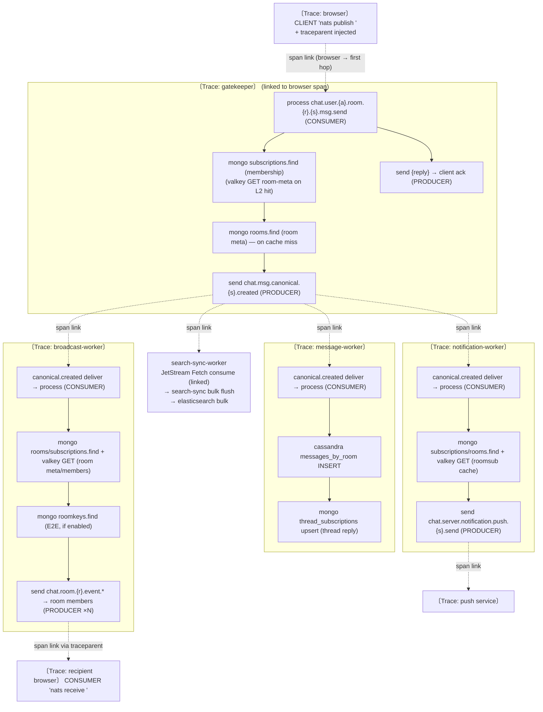
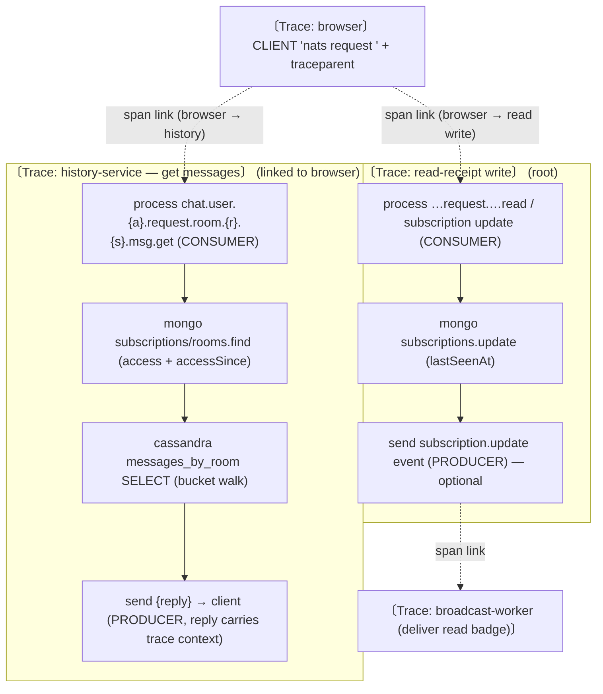
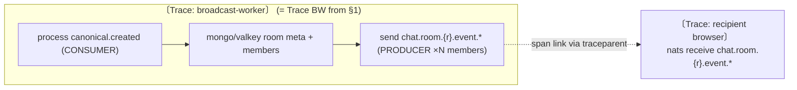
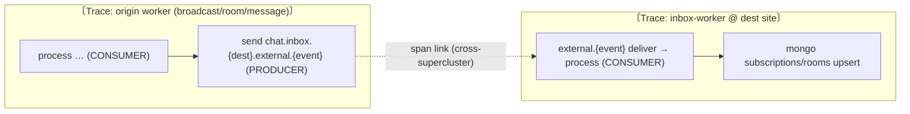
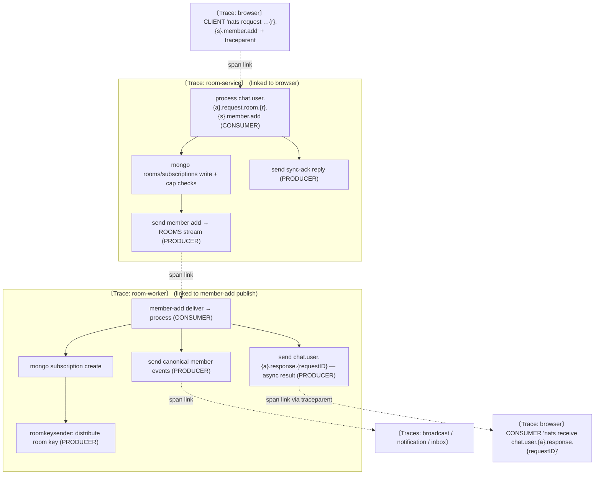

# o11y — Expected Trace Design (key scenarios)

Design-first reference for what traces **should** look like per user scenario,
so we can then test reality against it. Grounded in the actual code
(`message-gatekeeper`, `message-worker`, `broadcast-worker`,
`notification-worker`, `search-sync-worker`, `history-service`) and the
`o11y/nats` (Marz `otelnats`/`oteljetstream`) propagation model.

> Status: DESIGN. Not yet verified end-to-end (integration tests run in CI;
> live verification pending). See §9.

---

## 0. The propagation model (read this first)

This is why traces look "scattered" — **it is by design**, per the OTel
messaging semantic conventions.

| Boundary | Correlation | Same trace? |
|---|---|---|
| Within one service (handler → DB calls) | parent → child spans | **Yes** |
| Across a NATS hop (publish → consume), JetStream **or** core | **span LINK** | **No — new trace** |
| Reply of a Go request/reply back to the requester | requester-side receive span with a link to the responder reply | Yes, when caller ctx already has an active span |

What `otelnats` does at each hop:

- **Producer** (`Publish` / `PublishMsg` / `Request`): starts a `send <subject>`
  span (`PRODUCER`) **as a child of the active span** (so within the producing
  service it stays in the same trace), then injects W3C `traceparent` into the
  message headers.
- **Consumer** (`Subscribe` / `QueueSubscribe` / JetStream `Consume` / `Fetch`): extracts
  the producer's span context, then starts a **detached** `<subject> deliver`
  span (new root, empty parent) carrying a **LINK** to the producer span, and a
  `process <subject>` span (`CONSUMER`) under it (also linked). Handler work and
  DB spans hang off `process`.
- **Go request/reply response** (`Conn.Request` + responder `Conn.Respond`):
  the responder reply is sent through the traced publish path, and the requester
  creates a short `receive <subject>` consumer span with a link to that reply.
  If the requester calls `Conn.Request(context.Background(), ...)` without an
  active caller span, the send and reply-receive spans are still discoverable
  by links but may not land in the same trace.

Net effect: **one logical flow = a constellation of per-service traces**, each
rooted at a `deliver`/`process` pair and stitched to its upstream by a span
**link** (navigable in Tempo, but not a single trace tree).

Three consequences to keep in mind:

1. **The web client is instrumented on outbound and receive-side NATS paths.**
   The browser runs an OTel `WebTracerProvider`, wraps every NATS
   publish/request and HTTP fetch in a `CLIENT` span (`withSpan`), and injects
   W3C `traceparent` into the headers (`injectTraceHeaders`; CORS now allows
   `traceparent`/`tracestate`/`baggage`). Delivered NATS messages that flow
   through the app subscription helpers extract `traceparent` and start a
   detached `nats receive <subject>` `CONSUMER` span with a link to the upstream
   producer. So browser-originated and browser-received legs are both visible,
   but still as linked traces rather than one shared trace ID.
2. **NATS vs HTTP propagation differ.** A browser→backend **NATS** hop is still
   **link-based** (the gatekeeper/history `process` span carries a *link* to the
   browser span; new trace). A browser→backend **HTTP** hop (`auth` / `portal` /
   `upload` via `o11y/gin`) is **parent-child** (the server span is a *child* of
   the browser span — genuinely one trace).
3. **NATS tracing is gated** on `OTEL_INSTRUMENTATION_GO_TRACING_ENABLED` +
   `OTEL_NATS_TRACING_ENABLED`; `pkg/natsutil.Connect` force-enables them.
   Without them, **none** of the NATS spans/links below exist.

Legend for the diagrams: **solid arrow = parent→child (same trace)**,
**dashed arrow = span link (trace boundary)**, `〔…〕 = one trace`.

**Span naming.** Diagram labels like `publish msg.send` are *conceptual*. The
actual **frontend** span names follow `nats <operation> <subject>` —
`nats publish <subject>`, `nats request <subject>`,
`nats request_async_result <subject>`, and `nats receive <subject>` — so a
Tempo trace list is legible at a glance
instead of a wall of `nats.request`. The subject is *also* carried on the
`messaging.destination.name` attribute (with `chat.request_id` on requests), so
you can filter by span name **or** by attribute. **Backend** `process
<subject>` / `<subject> deliver` spans are named by `otelnats` from the subject
directly.

---

## 1. Scenario A — User sends a message in a group

Flow (CLAUDE.md event flow; `MESSAGES → MESSAGES_CANONICAL → fan-out`):
client → `MESSAGES` → `message-gatekeeper` validates → `MESSAGES_CANONICAL` →
**4 independent consumers** (`message-worker`, `broadcast-worker`,
`notification-worker`, `search-sync-worker`).

### Expected trace constellation

### Per-service span tree (what to assert)

- **gatekeeper** (1 trace, root): `process …msg.send` → `mongo subscriptions.find`
  (+ `valkey GET` / `mongo rooms.find` on cache miss) → `send …canonical.created`
  + `send {reply}`.
- **message-worker** (1 trace, linked): `…canonical.created deliver` → `process`
  → `cassandra … INSERT` (+ `mongo thread_subscriptions` for thread replies).
- **broadcast-worker** (1 trace, linked): `process` → `mongo`/`valkey` room
  meta+members (+ `mongo roomkeys` if E2E) → N× `send chat.room.{r}.event.*`.
- **notification-worker** (1 trace, linked): `process` → `mongo`/`valkey` →
  `send push.{s}.send` → links into the push service's trace.
- **search-sync-worker** (linked): JetStream `Fetch` consumer span → `search-sync bulk flush` (links to every source message in the batch) → Elasticsearch bulk spans.

**Total for one message ≈ 6 traces** — the **browser** publish span is its own
trace (linked, not parent, into the gatekeeper), plus gatekeeper +
message-worker + broadcast-worker + notification-worker + search-sync; the push
service adds a 7th linked off notification. They are
stitched by links, not a shared trace ID: browser → gatekeeper (link), and
gatekeeper's `send …canonical.created` → each of the 4 canonical consumers
(link).

---

## 2. Scenario B — User switches group (opens a room)

Opening a room is **request/reply** to `history-service` (load messages) plus a
**read-receipt** write. The browser **is** instrumented for outbound (§0): each
issues a `nats request <subject>` CLIENT span. Each backend leg is still its own
trace, because the browser→backend NATS hop is a **link** (not parent-child).

### What to assert
- **history get** (1 trace): `process …msg.get` → `mongo` access checks →
  `cassandra SELECT` (one span per bucket query) → reply.
- **read-receipt** (1 trace): `process …read` → `mongo subscriptions.update`
  → optional `send subscription.update` (links to a broadcast-worker trace that
  delivers the read badge).
- Client-perceived RTT **is** captured — on the browser's `nats request`
  CLIENT span (it wraps `await nc.request`). Go service-to-service
  request/reply also emits a requester-side `receive <subject>` span when the
  responder replied through `Conn.Respond`. Browser NATS request correlation
  remains link-based on the request leg; the browser span itself still owns the
  user-perceived RTT.

---

## 3. Scenario C — User receives a new group message

"Receiving" is the **tail of Scenario A**: `broadcast-worker` delivers to room
members via core NATS `send chat.room.{r}.event.*`. The recipient browser
receives it over `nats.ws`; the web subscription wrapper extracts `traceparent`
from the message headers and starts a detached `nats receive <subject>`
`CONSUMER` span linked to the broadcast-worker producer span.

So the backend view of "receive" still ends at the broadcast-worker producer
span, but the recipient-side browser render callback is now visible as a linked
browser consumer trace.

---

## 4. Scenario D — Cross-site delivery (member on a remote site)

Federation is **direct INBOX publish**: an origin-site service JetStream-
publishes to `chat.inbox.{destSite}.external.{event}`, routed by the NATS
supercluster; `inbox-worker` at the destination consumes. Same link model — the
cross-site hop is a span **link**, so the destination trace is separate.

---

## 5. Scenario E — Send a DM

A DM room is **exactly two participants**. Sending a DM message uses the **same
pipeline as Scenario A** (client → `MESSAGES` → gatekeeper → `MESSAGES_CANONICAL`
→ message-worker/broadcast/notification/search-sync); only `roomType=dm` and
broadcast delivers to the two participants. No new span shape.

The DM-specific piece is **first-time room provisioning**: `user-service`'s
`roomclient.CreateDMRoom` issues a NATS **request/reply** to `room-worker`'s
`serverCreateDM` on `chat.server.request.room.{site}.create.dm`
(`subject.RoomCreateDMSync`).

- `〔Trace: user-service〕` `process …request…dm` → `mongo` → `send
  …room.{site}.create.dm` (PRODUCER) + reply to client.
- `〔Trace: room-worker〕` (linked to the `send …create.dm`) `process` →
  `mongo rooms/subscriptions insert` → atrest DEK provision (`vault` +
  `mongo dek`) → `roomkeysender` publish → reply.

Then the message send follows Scenario A.

---

## 6. Scenario F — Create a channel / join a room (add member)

Request/reply entrypoint on `room-service`, then an **async `ROOMS` →
`room-worker`** fan-out. This path uses the **two-phase async reply**
(`asyncJob`): the client gets a fast **sync ack**, and the real result later
arrives on `chat.user.{account}.response.{requestID}` (subscribed to *before*
the request is published).

Real subjects (`pkg/subject`): add-members
`chat.user.{account}.request.room.{roomID}.{siteID}.member.add`
(`MemberAddPattern`, **not** `member.invite`); create channel
`chat.user.{account}.request.room.{siteID}.create`; async result
`chat.user.{account}.response.{requestID}`.

- The **async result** back to the client (`response.{requestID}`) is a
  **browser receive** span: `nats receive
  chat.user.{account}.response.{requestID}`. The client-perceived "did the add
  succeed" latency is still split across linked traces (request span + async
  receive span), not one parent-child trace.
- **Create channel** is the same shape minus the member-add fan-out:
  `room-service` `process chat.user.{a}.request.room.{s}.create` → `mongo`
  room+owner-subscription insert → atrest DEK provision → reply.

---

## 7. Scenario G — Edit / delete a message

Client → `history-service` (`…request.room.{r}.{s}.msg.edit` / `…msg.delete`)
**request/reply** → Cassandra edit / soft-delete → **republish**
`chat.msg.canonical.{site}.edited` / `.deleted` → fan-out to `broadcast-worker`
(deliver the edit/tombstone to the room) and `search-sync-worker`
(reindex / remove).

- `〔Trace: history-service〕` (linked to browser) `process …msg.edit` →
  `mongo` access checks → `cassandra … UPDATE` (or soft-delete) → `send
  …canonical.edited` (PRODUCER, link target) + reply.
- `〔Trace: broadcast-worker〕` `…canonical.edited deliver → process` (linked) →
  `mongo`/`valkey` → `send chat.room.{r}.event.*` (edit).
- `search-sync-worker` reindex: JetStream `Fetch` consume is linked to the
  canonical producer; `search-sync bulk flush` links to the source message spans
  and parents the Elasticsearch bulk spans.

---

## 8. Known gaps (design-level, expected to be visible/absent)

1. **Bare-context Go request/reply callers can still look split.** `Conn.Request`
   creates the requester-side reply receive span as a child of the caller ctx.
   If that ctx has no active span, the send and reply-receive spans may be two
   root traces connected only by links. Start an ambient caller span around
   background-worker `Conn.Request(context.Background(), ...)` calls when the
   full round trip must read as one trace.
2. **Each NATS hop is a separate trace.** Expected, not a bug — navigate via
   span links in Tempo, not a single trace ID.

---

## 9. How to verify (next step)

Per scenario, drive the flow against a live stack (o11y monitor: Tempo/Loki/
Prometheus) with NATS tracing enabled, then in Tempo assert:

- the per-service span trees in §1–§7 exist with the listed DB spans
  (`mongodb.*`, `cassandra.*`, `redis.*`, `elasticsearch.*`),
- each downstream `process` span carries a **link** to the upstream `send` span,
- log lines for a span (Loki) share its `traceId`/`spanId`,
- the §8 limitations are understood (especially bare-context request/reply
  callers), not mistaken for missing telemetry.

The `pkg/natsutil` continuity integration test asserts the correct **link-based**
contract across a publish→consume hop — the consumer handler gets a *valid* span
context whose span carries a **link** back to the producer, **not** a shared
trace ID (ground truth: `o11y` v0.8.0 / `otel-nats` v0.2.11 add
`trace.WithLinks(originSpanCtx)` on the consumer span per the OTel messaging
semconv). Asserting `traceId` equality across a hop would be *wrong*. These
scenarios extend that single-hop gate to the real multi-service pipelines.
