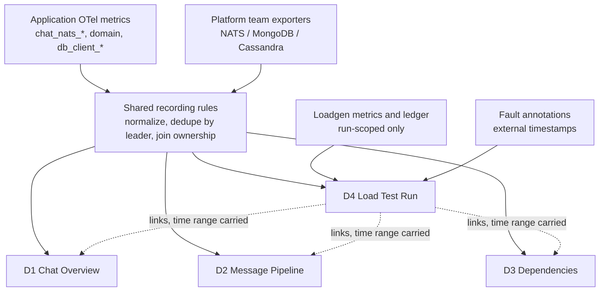

# Dashboard and Alert Guide

> Status: design specification. Written 2026-08-15 against `main` at `c9f1351`
> (#272 merged), plus the unmerged work described in Section 3. This document
> and its two companions are the only version-controlled description of the
> dashboards. Grafana JSON is not committed to this repository, so a dashboard
> that drifts from this document is wrong, and a dashboard lost to a Grafana
> outage is rebuilt from here.

Companions:

- [Dashboard Panel Catalog](dashboard-panel-catalog.md) — every panel: row,
  PromQL, source status, expected reading, no-data meaning, applicable
  situations. Its **Appendix A** is the consolidated metric inventory, with the
  closed label enums the panels depend on.
- [Alerting Baseline](alerting-baseline.md) — the alert rules this project
  owns, their thresholds, and their page/no-page rationale.

Upstream contracts this document extends rather than restates:

| Document | Owns | Availability |
|---|---|---|
| `docs/load-testing/failure-testing/dashboard-evidence-contract.md` | The three independent dimensions, query cadence, dispatch and observer validity, recovery classification. Section 5 here explains which parts survive outside a failure test. | **Not on `main`** — branch `codex/loadgen-failure-evidence` |
| `docs/load-testing/failure-testing/nats-failure-metrics-contract.md` | Shared NATS metric semantics, label enums, required alert list. | **Not on `main`** — branch `codex/failure-testing-docs` |
| [`storage-dependency-metrics.md`](storage-dependency-metrics.md) §7 | The production-base plus failure-test-overlay model. Section 4 here implements it. | On `main` |
| [`../../load-testing/system/sli-slo.md`](../../load-testing/system/sli-slo.md) | Authoritative SLO definitions, the error-budget eligibility table, the burn-rate alerting policy. | On `main` |
| [`o11y-metrics-inventory.md`](o11y-metrics-inventory.md) | Per-service metric coverage. | On `main` |

The first two are referenced by section number throughout. Until their branches
merge, those references resolve only against the named branch — this is stated
rather than linked so a broken link does not read as a missing document.

---

## 1. Scope and Ownership

This document owns the dashboards and alerts built from **metrics this
repository emits**. It covers four situations with one shared vocabulary:
day-to-day production operations, soak tests, failure tests, and — reserved
only, see Section 11 — stress tests.

It does **not** own:

- Fault mechanics, traffic profiles, or campaign acceptance thresholds. Those
  belong to the plans under `docs/load-testing/`.
- SLO definitions or targets. Those belong to `sli-slo.md`.
- Metric semantics and label enums. Those belong to the NATS failure metrics
  contract and to `o11y-metrics-inventory.md`.
- Infrastructure dashboards and alerts for NATS, MongoDB, and Cassandra. Those
  belong to the platform teams that run them (Section 2).

### 1.1 Dependency ownership boundary

NATS, MongoDB, and Cassandra each have a dedicated team with its own
dashboards and its own alerts. This project does not deploy exporters for them.
The boundary is drawn by **who the metric is about**, not by which process
exposes it:

| Class | Example | Owner | How it appears here |
|---|---|---|---|
| Server and cluster health | NATS routes/gateways/memory, WiredTiger cache, Cassandra compaction backlog | Platform team | Grafana text panel with a link and one sentence on what to look for there. Never an empty panel. |
| Our resources hosted on their server | JetStream stream and consumer state for our streams and durables | **This project** | Real panels, built on their exported series through our recording rules |
| Our client's experience of them | `db_client_*`, `cassandra_query_attempts_total`, `chat_nats_publish_attempts_total` | **This project** | Real panels |

The middle row is the one worth stating explicitly. A backlog on
`MESSAGES-CANONICAL-<site>` for the `message-worker` durable is our application
state that happens to live on their server. `sli-slo.md` §7 names a stalled
JetStream backlog as the outage backstop for every asynchronous SLO, so this
project cannot delegate it.

Their metrics are already scraped into our Prometheus, and their recommended
alerts will be adopted as-is. Section 8 lists what still has to be built on top
of those series, and why their alerts cannot replace ours.

---

## 2. What the platform teams' alerts cannot answer

Adopting the NATS team's recommended alerts is correct and removes most of the
infrastructure alerting burden. Seven questions remain ours because they
require knowledge that only this repository has.

1. **Which service and which journey.** The exporter reports
   `stream="MESSAGES-CANONICAL-<site>", consumer="message-worker"`. Turning that
   into "message persistence is degraded, SLO-1a is burning" needs the
   stream/durable to service to journey mapping, which is a recording-rule label
   join defined in Section 9.

2. **Alive but not consuming.** From the broker's side a wedged consumer looks
   healthy: the durable exists, it has a leader, pending climbs slowly. Our
   `chat_nats_consumer_loop_up` drops to zero the moment the iterator dies. The
   join of the two is precise within seconds and cannot be written by anyone
   who does not know that gauge exists.

3. **FIFO lanes defeat generic thresholds.** `outbox-worker`'s per-destination
   ordered consumers run with `MaxAckPending=1`, so `num_ack_pending` can only
   ever be 0 or 1. Any generic "ack pending too high" rule is structurally
   incapable of firing on them, even when a peer has been parked for hours
   (`MaxDeliver=-1`, never Ack — by design). The correct signal there is a
   non-advancing ack floor while pending is non-zero.

4. **The same series means opposite things on different consumers.** 5000
   pending on `message-worker` during a soak is normal. 5000 pending on an
   outbox FIFO lane means a peer has been down a long time. Thresholds must be
   derived per consumer from the SLOs, not set globally.

5. **Absence.** A durable deleted by accident produces no series at all, so an
   infrastructure dashboard shows nothing and an infrastructure alert stays
   silent. Only this repository knows which consumers are supposed to exist.
   This is the operational form of the contract's rule that a missing series is
   unknown, never zero.

6. **Core NATS publish success is not delivery.** For `recipient_event` and
   `client_response`, nats.go returns nil as soon as the payload enters the
   write or reconnect buffer. During a full broker outage
   `chat_nats_publish_attempts_total{outcome="success"}` keeps climbing until
   the buffer overflows. Their dashboard shows the outage; only ours can show
   that we kept succeeding into a buffer with no exit.

7. **Fault-window coordination.** During a failure test the platform team's
   alerts fire at the platform team. That is a scheduled cross-team agreement,
   not something this project can silence unilaterally. See
   [Alerting Baseline](alerting-baseline.md) §6.

---

## 3. Source status vocabulary

Every panel and alert in the companions carries one of these:

| Status | Meaning |
|---|---|
| **Available** | Emitted by code on `main` at `c9f1351` and scrapeable wherever the service is deployed |
| **#283 pending** | Depends on PR #283 (`codex/nats-metrics-review-followup`), which is open and in draft |
| **#271 pending** | Depends on the loadgen work on `codex/loadgen-failure-evidence` |
| **Proposed** | Reviewed but not yet on any branch |
| **Missing** | Not emitted and not planned; the panel is not built, and the gap is listed in Section 8 |

#283 and #271 are tracked separately on purpose. They land independently: if
#283 merges first, the request/reply rows on D2 can be built while the D4
evidence rows still cannot; if #271 merges first, the reverse. Anyone building
a dashboard needs to know which half is unblocked.

---

## 4. Dashboard map

Four dashboards, plus one reservation. The split is deliberate; Section 4.2
explains why it is not one dashboard with a mode variable.

| ID | Name | Audience and question | Row axis |
|---|---|---|---|
| **D1** | Chat Overview | On-call, first screen. Is the pipeline moving right now, and if not, where does it stop? | Message path (funnel) |
| **D2** | Message Pipeline | Whoever D1 sent here. Which service, which stage, which dependency? | Service, then layer |
| **D3** | Dependencies — Client View | Is this us or them? | Dependency, then client concern |
| **D4** | Load Test Run | Is the evidence valid, was there impact, was anything lost? | The contract's three dimensions |
| *(reserved)* | Stress / Capacity | Where is the knee? | Offered load, not time — see Section 11 |

### 4.1 Which dashboard for which situation

| Situation | Primary | Also open | Not used |
|---|---|---|---|
| Daily operations | D1 | D2, D3 on demand | D4 |
| Soak test | D4 | D1, D2, D3 linked from D4 | — |
| Failure test | D4 | D1, D2, D3 linked from D4 | — |
| Stress test | reserved | D2, D3 | D4 as-is (wrong x-axis) |

D3 is opened directly by both operations and testing. It is not duplicated.

### 4.2 Base and overlay: share recording rules, not dashboards

`storage-dependency-metrics.md` §7 defines a production base with a
failure-test overlay, and requires that testing must not introduce a second
definition of health. That requirement is about **definitions**, and it is
satisfied by sharing the recording rules (Section 9). It does not require a
single dashboard.

D4 is a separate dashboard rather than a mode of D1 for one decisive reason:
**the loadgen series exist only while a run is in progress.** If the loadgen
rows lived on the operations dashboard they would read no-data for nearly all
of their lifetime, which trains everyone to scroll past no-data. The first
casualty would be the one case that matters — an observer dying mid-run, which
also presents as no-data. A dashboard that makes no-data unremarkable cannot
be used to evaluate absence claims.



The overlay is realized by dashboard links that carry the time range, not by
copying base panels into D4.

### 4.3 The same signal takes two forms

A signal that appears on both an operations dashboard and D4 is drawn
differently, because the question differs:

| | Operations (D1) | Test run (D4) |
|---|---|---|
| Question | Is it healthy now? | Did it change when the fault was injected, and did it recover? |
| Form | Stat panel, thresholded | Time series with the fault annotation overlaid |
| Example | `chat_nats_consumer_loop_up` as a red/green tile | `chat_nats_consumer_loop_up` as a line that is expected to drop and return |

This is the concrete meaning of base and overlay in this project. The
underlying recording rule is identical; only the visualization and the reading
differ.

---

## 5. The three-dimension framework outside a failure test

The evidence contract defines three independent dimensions per query window:
Evidence (`VALID` / `INCONCLUSIVE`), Impact (`NO_IMPACT` /
`TRANSIENT_RECOVERED` / `UNRECOVERED`), and Correctness (`CLEAN` /
`CONFIRMED_VIOLATION`). They do not all transfer to day-to-day operations.

| Dimension | Soak | Failure test | Daily operations |
|---|---|---|---|
| **Evidence** | Carries over unchanged | Native | **Carries over, and matters more.** Replace loadgen dispatch validity with scrape health and series freshness. |
| **Impact** | Carries over | Native | **Replaced by SLO burn rate.** The three labels assume a single injection with an external remediation timestamp; daily operations has no such timestamp to start the recovery streak from. |
| **Correctness** | Carries over | Native | **Not achievable.** `CLEAN` requires the loadgen ledger to reconcile every operation. Production has no ledger. The weak substitute is `chat_nats_terminal_failures_total`, which enumerates known loss but proves nothing about absence. |

Two consequences for the panel catalog:

- D1 and D2 carry an Evidence concern, expressed as scrape health and expected
  series presence, and it sits at the top of D4 for the same reason it exists
  on D1: an absence claim read from an incomplete window is not a result.
- **Do not build a `CLEAN` panel on an operations dashboard.** It has no input
  and would read green forever. If a correctness question must be answered in
  production, the honest answer is that it requires a run of the ledger-backed
  workload, not a panel.

---

## 6. Traffic reality the panels must match

The soak workload has six lanes and nothing else. Panels must not imply
coverage that no traffic exercises.

| Lane | Default rate | Actions |
|---|---|---|
| send | 100/s | message send, 10% of which are thread replies |
| read | 700/s | LoadHistory 75%, GetThreadMessages 15%, GetMessageByID 10% |
| mutation | 5/s | edit, delete, pin, unpin |
| reaction | 100/s | reaction add/remove |
| pinned-list | 1/s | pinned message list |
| verify | 1/s | Cassandra read-back verification |

Source: `tools/loadgen/soak_config.go` (`SEND_RATE`, `READ_RATE`,
`MUTATION_RATE`, `REACTION_RATE`, `PINNED_LIST_RATE`, `VERIFY_RATE`).

There is **no** room or member lifecycle lane, no presence, no search, no push,
no federation, and no bot lane. Panels for those paths are legitimate on the
operations dashboards, where real traffic exists, but on D4 they will be flat
and must be labelled as such. A flat federation panel during a soak is not
evidence that federation is healthy.

---

## 7. Reading traps

These are the ways a correct-looking panel produces a wrong conclusion. Each
one is repeated on the specific panels it affects in the panel catalog.

### 7.1 A missing series is unknown, never zero

Quoted directly from the evidence contract: *"A missing series is unknown,
never zero"*, and *"Queries must not use `or vector(0)` for required
evidence."* This applies to operations dashboards exactly as it applies to
campaign evaluation. Positive evidence survives an incomplete window; an
absence claim does not.

A consequence that catches people on D4: for `chat_nats_consumer_loop_up`,
**the series disappearing and the series reading zero are different events.**
Disappearing means the process is gone — explain it with the Kubernetes pod
metrics. Reading zero means the process is alive and not consuming, which is an
application failure. A panel that renders both as "nothing" hides the
distinction.

### 7.2 MongoDB retryable writes absorb an election into latency

The MongoDB driver retries a write that fails due to a primary stepping down.
The retry succeeds, so `db_client_operation_duration` records a slower
operation with **no `error_type`**. An election can therefore pass through a
service with zero observed errors.

Judge MongoDB impact from `db_client_connection_pending_requests` and
`db_client_connection_timeouts_total`, which show checkout queueing, not from
the operation error ratio.

### 7.3 No service gates readiness on MongoDB or Cassandra

Only `natsutil.HealthCheck` is registered. A pod whose Cassandra session is
broken stays Ready and keeps receiving work. This is deliberate — a send should
not go offline because Cassandra is degraded — and this document records it as
a reading condition, not as a change proposal.

The practical effect: **pod readiness is not evidence of storage health.** Do
not read a green readiness panel as a statement about the databases.

### 7.4 `error_type` does not exist on successful operations

In PromQL, `error_type!=""` excludes series where the label is absent as well
as those where it is empty. Filter the numerator; leave the denominator
unfiltered so it counts successes and failures alike.

### 7.5 Scrape interval differs between environments

Staging and production scrape every 30s, which is what the evidence contract's
cadence is built on: 2-minute lookback, 1-minute step, minimum three samples
per required series.

Local differs: `docker-local/o11y/prometheus.yaml` uses 15s and
`tools/observability/prometheus/prometheus.yml` uses 5s. A recording rule or
alert validated locally will behave differently in staging. In particular, do
not use a `[1m]` range with a 30s scrape — two samples is not enough for a
stable rate.

### 7.6 Clustered consumer state double-counts without a leader filter

`sli-slo.md` §8 P3 requires filtering to the consumer leader before aggregating
consumer state, or follower replicas export duplicate series and every
aggregate is multiplied by the replication factor. This failure mode does not
break a panel; it silently scales it. That is why the filter belongs in a
recording rule (Section 9) rather than in each panel's PromQL.

### 7.7 `message_worker_persistence_total` counts attempts, not messages

The counter is recorded per persistence attempt. Under JetStream redelivery the
same message increments it more than once, so during a recovery burst the
funnel can show more persisted than canonical published. This is expected, not
a defect. `sli-slo.md` §0.1 covers the same limitation for the whole v1
accounting model, which is why the asynchronous SLOs are marked *approximate
(lag-enforced)*.

### 7.8 Fan-out size over deliveries is not a ratio for channels

A channel event is delivered by one publish to the room subject.
`broadcast_worker_fanout_recipients` records the intended audience while
`broadcast_worker_recipient_deliveries_total` records one attempt. Dividing
them looks like catastrophic loss on the dominant room type. They are
comparable only for `dm`, `bot_dm`, and `thread`, where the worker publishes
once per recipient. Per-recipient channel evidence comes from the loadgen
recipient observer and from nothing else.

### 7.9 The request `operation` label is coarse

`RequestOperationFromSubject` maps concrete subjects onto a small closed
vocabulary. Two collisions matter:

- **`history_read` merges the whole read lane.** `LoadHistory`,
  `GetThreadMessages`, `GetMessageByID`, `pinned.list`, `surrounding`, and
  `next` all land on one label. SLO-4 (channel load within 500 ms) and SLO-5
  (thread open within 300 ms) have different bounds but share this series, so
  neither can be evaluated from it alone. Until the label is refined, those two
  SLOs are measurable only from the loadgen per-action latency.
- **`history_mutation` merges reaction traffic with edit/delete/pin/unpin** at
  roughly 20:1 by default rate. The curve is effectively the reaction curve,
  and a mutation-only anomaly is invisible inside it.

### 7.10 The reaction path has no Cassandra client telemetry

`history-service/internal/cassrepo/reactions.go` (4 sites) and `pin.go` (2
sites) call `session.ExecuteBatch` directly, bypassing the o11y batch seam, so
they emit no client metrics at all. `bot-message-worker/store_cassandra.go`
adds 4 more. The reads on the same paths are instrumented;
`message-worker/store_cassandra.go` was fixed by #272.

Combined with 7.9, this means the soak lane with the second-highest rate
(reaction, 100/s) is both merged into a shared RPC series **and** invisible in
the Cassandra client series. A reaction-path storage problem will show up as
latency on `history_mutation` and nowhere else.

### 7.11 Consumer recovery hides transient iterator loss

With #283, a terminal iterator error sets `chat_nats_consumer_loop_up` to zero,
records a terminal failure, then recreates the consumer and iterator with
capped exponential backoff. A single transient loss therefore self-heals in
seconds and `loop_up` is back at 1 before most evaluation windows notice.

Two readings follow. A sustained `loop_up == 0` now means **recovery is
repeatedly failing**, not that the iterator died once. And a consumer that is
churning — recovery alternating between success and failure — leaves `loop_up`
reading 1 most of the time and is visible only in
`chat_nats_consumer_recovery_attempts_total`.

### 7.12 `chat_nats_client_*` carry no service or site label

`chat_nats_client_connected`, `chat_nats_client_connection_events_total`, and
`nats_slow_consumer_events_total` are emitted from the connection helper, which
sits below the layer that knows the site. They are scoped by the OpenTelemetry
resource instead. Every panel using them must join `target_info` to recover
`service_name`; without the join the panel shows a connection count with no way
to tell which service lost its connection.

### 7.13 The domain counters have no inline `site` label

`chat_nats_*` sets `service_name` and `site` as explicit attributes in code
(`pkg/natsmetrics/metrics.go`, the `base` slice). The four domain counters —
`message_gatekeeper_messages_total`, `message_worker_persistence_total`,
`broadcast_worker_fanout_recipients`,
`broadcast_worker_recipient_deliveries_total`, and
`notification_worker_outcomes_total` — set only their own dimensions
(`result`, `reason`, `message_kind`, `room_kind`, `event_type`, `kind`). Their
service and site identity comes from the OpenTelemetry resource instead.

This matters most on the J1 funnel, which mixes both families. In a multi-site
deployment, `chat_nats_publish_attempts_total{site="$site"}` is one site while
an unqualified `message_gatekeeper_messages_total` is every site, and the
funnel silently compares them. Either join `target_info` on the domain
counters, or confirm the collector promotes the resource's site attribute
inline — and verify which, rather than assuming, since the answer depends on
collector configuration.

### 7.14 `atrest_*` are not on the SDK endpoint

The seven at-rest and one bot-worker counters are registered through
`promauto`, not the OTel meter, so they are not on `:2112` and carry none of
the resource attributes. Before building a panel or an alert on them, confirm
Prometheus actually scrapes the endpoint that exposes them. An alert on an
unscraped series is worse than no alert: it is a rule that can never fire.

---

## 8. Prerequisites

Panels are not built for metrics that do not exist. Each row below states the
question that stays unanswerable until the item lands.

### 8.1 Blocking a panel that is otherwise specified

| Prerequisite | Status | Question it blocks |
|---|---|---|
| PR #283 merged | Draft, CI blocked | Every inbound request/reply panel on D2 (`chat_nats_request_handled_total`, `chat_nats_request_handler_duration_seconds`) and the consumer recovery panels. Without it, the read path — the highest-volume soak lane — has no RPC-level success or latency signal at all. |
| PR #271 merged | Open | The entire Evidence row on D4: dispatch validity, observer validity, and the intended/dispatched identity. Without it, D4 can show impact but cannot state whether the observation window was complete. |
| Verify exporter metric names against the deployed NATS exporter | Not started | Whether the JetStream consumer rows on D2 are a recording rule over existing series or need a collector. Capture a raw `/metrics` sample first; the deployment doc already requires this before applying canonical rules. |
| `ack_floor` series present in the exporter output | Unverified | The stall signal for `outbox-worker`'s FIFO lanes. If present, Section 9's stall rule is a recording rule. If absent, it needs a bounded collector. |

### 8.2 Known gaps with no panel

| Gap | Status | Question it blocks |
|---|---|---|
| `chat_jetstream_consumer_oldest_pending_age_seconds` | Missing | How long the oldest unacknowledged message has been waiting. Pending count alone cannot separate a fresh burst from a permanently parked message. The ack-floor stall rule is a substitute, not an equivalent — it detects that the floor is stuck, not for how long. |
| Cassandra batch telemetry at the 10 bare `ExecuteBatch` sites | Missing | Latency and error rate for the reaction and pin/unpin write paths (trap 7.10). |
| Consumer sampler coverage for `message-gatekeeper` (MESSAGES) and `notification-worker` | Proposed in #271 review | Backlog on two of the four hot-path durables during a test run. Only `message-worker` and `broadcast-worker` are sampled today. |
| Ack-floor gauge in the loadgen sampler | Proposed in #271 review | Stall detection from the loadgen side. `tools/loadgen/consumerlag.go` reads `NumPending`, `NumAckPending`, and `NumRedelivered` only. |
| Refined `operation` label for the read lane | Not proposed | SLO-4 and SLO-5 evaluation from service-side metrics (trap 7.9). |
| Domain metrics for `room-service`, `room-worker`, `inbox-worker`, `outbox-worker`, `search-sync-worker` | Missing | Business outcomes on the room, membership, and federation paths. `o11y-metrics-inventory.md` §2 tracks these as F-items. |
| Fault annotation source | Missing | Aligning injection, failover, recovery, and settle timestamps on D4. Manual annotations are acceptable locally; a durable event source is required for staging campaigns. |

---

## 9. Recording rules — recommendations

These are recommendations, not a committed layout. The file location and
ownership are an operations decision and are deliberately left open.

The case for putting this logic in recording rules rather than in each panel is
trap 7.6: a missing leader filter does not break a panel, it multiplies it by
the replication factor. That class of error has to be structurally impossible,
not left to whoever writes the next query.

Four jobs for the rule layer:

1. **Normalize** the platform exporter's names into a stable
   `chat_jetstream_*` namespace, so an exporter version bump changes one file
   instead of every panel and alert. Document the source expression beside each
   rule, as the NATS metrics contract §5 requires.
2. **Deduplicate** clustered replica exports by filtering to the leader before
   aggregating.
3. **Join ownership** — map `(stream, consumer)` to the owning service and
   journey, so a backlog panel can say which SLO is at risk.
4. **Derive** the signals that have no direct series, notably the ack-floor
   stall condition.

Sketches, to be adapted once the exporter's real metric names are captured:

```promql
# 1+2. Normalize and deduplicate. Source metric names are placeholders until
# a raw /metrics sample from the deployed exporter is captured.
chat_jetstream_consumer_pending
  = max by (cluster, site, stream, consumer) (
      <exporter>_consumer_num_pending{is_consumer_leader="true"}
    )

# 4. Ack-floor stall: pending work exists and the floor has not moved.
# This is the substitute for the missing oldest-pending-age gauge. It proves
# the floor is stuck; it does not say for how long.
chat_jetstream_consumer_ack_floor_stalled
  = (increase(chat_jetstream_consumer_ack_floor_stream_sequence[10m]) == 0)
    and (chat_jetstream_consumer_pending > 0)
```

Only `max by (...)` — not `sum by (...)` — is safe for deduplication if the
leader label turns out to be unavailable, since replicas report the same value.
Verify which is correct against the real output before committing either.

**Do not add `run_id` to hot-path series.** Keep run identity on loadgen and run
metadata, and correlate by time range plus environment and site labels.
Otherwise each run multiplies hot-path cardinality permanently.

---

## 10. Dashboard conventions

### 10.1 Variables

| Variable | D1 | D2 | D3 | D4 |
|---|---|---|---|---|
| `environment` | yes | yes | yes | yes |
| `site` | yes | yes | yes | yes |
| `service_name` | — | yes | yes | — |
| `dependency` | — | — | yes | — |
| `operation` | — | yes | yes | — |
| `stream` / `consumer` | — | yes | — | yes |
| `lane` | — | — | — | yes |
| `scenario` | — | — | — | yes |
| `lookback` / `step` / `healthy_points` | — | — | — | yes, visible per the evidence contract |

Server and member identity is a drill-down, never a default aggregation
dimension.

### 10.2 Range windows

Default to `[5m]` for operations panels and `[2m]` for D4 evidence panels,
matching the evidence contract's lookback. With a 30s scrape, `[2m]` yields
four samples, satisfying the contract's minimum of three per required series.
Never use `[1m]`.

### 10.3 Panel requirements

Every panel in the catalog carries five fields, and a panel that cannot fill
them is not ready to build:

1. **Row** — which section it belongs to.
2. **PromQL** — the query, with source status noted for each metric used.
3. **Expected reading** — what a given shape means. Not "shows the error rate",
   but "a step that stays flat after the fault window means unrecovered".
4. **No-data meaning** — what an empty panel proves, which is usually nothing.
5. **Applies to** — which of the four situations.

Panel descriptions in Grafana must carry at least fields 3 and 4. A trap from
Section 7 that applies to a panel is repeated in that panel's description; a
reader diagnosing an incident does not have this document open.

---

## 11. Stress and capacity — reservation only

No stress dashboard is specified, because no stress workload exists yet.
Reserving three decisions is enough:

1. **The x-axis is offered load, not time.** Every dashboard here plots
   degradation against time. A stress test asks where the knee is, which needs
   latency and error rate plotted against the load being offered. Reusing a
   time-axis panel for that question misleads.
2. **`loadgen_soak_configured_rate{lane}` is the join key.** It already exists
   as part of #271's dispatch validity work, and it is the series that says
   what load was being offered at a given moment. That makes the load axis
   derivable without new instrumentation — an unplanned benefit of #271.
3. **Capacity is defined by the first SLO to break**, per `sli-slo.md` §10.
   Not by a latency percentile, and not by a resource utilization threshold.

Everything else waits until there is a workload to measure.

---

## 12. Verification before use

A dashboard built from this document is not trustworthy until:

1. Every panel has produced non-stale data at least once in the target
   environment. A panel that has never had data is indistinguishable from a
   broken query.
2. The Prometheus metric names and label spellings have been checked against
   the deployed collector, not assumed from the OTel instrument names in this
   document.
3. The `target_info` join used by the connection panels resolves in the target
   environment, since the join keys depend on collector configuration.
4. A deliberate known failure changes the expected panels. The NATS metrics
   contract §12 requires this for the metric implementation; the same standard
   applies to the dashboard built on it.
