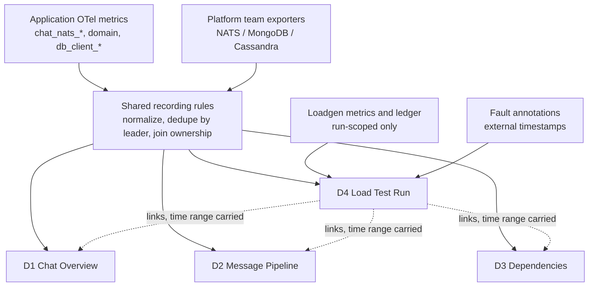

# Dashboard and Alert Guide

> Status: design specification. Verified against `main` at `d4d270e`
> (#272, #271, #286, and #295 merged). #283 is not expected to land and nothing
> here depends on it. This document
> and its two companions are the only version-controlled description of the
> dashboards. Grafana JSON is not committed to this repository, so a dashboard
> that drifts from this document is wrong, and a dashboard lost to a Grafana
> outage is rebuilt from here.

Companions:

- [Dashboard Panel Catalog](dashboard-panel-catalog.md) — every panel: row,
  PromQL, source status, expected reading, no-data meaning, applicable
  situations. Its **Appendix A** is the consolidated metric inventory, with the
  closed label enums the panels depend on.
- [Alerting Baseline](alerting-baseline.md) — the alert rules this project
  owns, their thresholds, and their page/no-page rationale.

Upstream contracts this document extends rather than restates:

| Document | Owns | Availability |
|---|---|---|
| [`../../load-testing/failure-testing/dashboard-evidence-contract.md`](../../load-testing/failure-testing/dashboard-evidence-contract.md) | The three independent dimensions, query cadence, dispatch and observer validity, recovery classification. Section 5 here explains which parts survive outside a failure test. | On `main` since #271 |
| `docs/load-testing/failure-testing/nats-failure-metrics-contract.md` | Shared NATS metric semantics, label enums, required alert list. | **Not on `main`** — branch `codex/failure-testing-docs` |
| [`storage-dependency-metrics.md`](storage-dependency-metrics.md) §7 | The production-base plus failure-test-overlay model. Section 4 here implements it. | On `main` |
| [`../../load-testing/system/sli-slo.md`](../../load-testing/system/sli-slo.md) | Authoritative SLO definitions, the error-budget eligibility table, the burn-rate alerting policy. | On `main` |
| [`o11y-metrics-inventory.md`](o11y-metrics-inventory.md) | Per-service metric coverage. | On `main` |

The NATS failure metrics contract is referenced by section number throughout.
Until its branch merges, those references resolve only against the named branch
— this is stated rather than linked so a broken link does not read as a missing
document.

---

## 1. Scope and Ownership

This document owns the dashboards and alerts built from **metrics this
repository emits**. It covers four situations with one shared vocabulary:
day-to-day production operations, soak tests, failure tests, and — reserved
only, see Section 11 — stress tests.

It does **not** own:

- Fault mechanics, traffic profiles, or campaign acceptance thresholds. Those
  belong to the plans under `docs/load-testing/`.
- SLO definitions or targets. Those belong to `sli-slo.md`.
- Metric semantics and label enums. Those belong to the NATS failure metrics
  contract and to `o11y-metrics-inventory.md`.
- Infrastructure dashboards and alerts for NATS, MongoDB, and Cassandra. Those
  belong to the platform teams that run them (Section 2).

### 1.1 Dependency ownership boundary

NATS, MongoDB, and Cassandra each have a dedicated team with its own
dashboards and its own alerts. This project does not deploy exporters for them.
The boundary is drawn by **who the metric is about**, not by which process
exposes it:

| Class | Example | Owner | How it appears here |
|---|---|---|---|
| Server and cluster health | NATS routes/gateways/memory, WiredTiger cache, Cassandra compaction backlog | Platform team | Grafana text panel with a link and one sentence on what to look for there. Never an empty panel. |
| Our resources hosted on their server | JetStream stream and consumer state for our streams and durables | **This project** | Real panels, built on their exported series through our recording rules |
| Our client's experience of them | `db_client_*`, `cassandra_query_attempts_total`, `chat_nats_publish_attempts_total` | **This project** | Real panels |

The middle row is the one worth stating explicitly. A backlog on
`MESSAGES-CANONICAL-<site>` for the `message-worker` durable is our application
state that happens to live on their server. `sli-slo.md` §7 names a stalled
JetStream backlog as the outage backstop for every asynchronous SLO, so this
project cannot delegate it.

Their metrics are already scraped into our Prometheus, and their recommended
alerts will be adopted as-is. Section 8 lists what still has to be built on top
of those series, and why their alerts cannot replace ours.

---

## 2. What the platform teams' alerts cannot answer

Adopting the NATS team's recommended alerts is correct and removes most of the
infrastructure alerting burden. Seven questions remain ours because they
require knowledge that only this repository has.

1. **Which service and which journey.** The exporter reports
   `stream="MESSAGES-CANONICAL-<site>", consumer="message-worker"`. Turning that
   into "message persistence is degraded, SLO-1a is burning" needs the
   stream/durable to service to journey mapping, which is a recording-rule label
   join defined in Section 9.

2. **Alive but not consuming.** From the broker's side a wedged consumer looks
   healthy: the durable exists, it has a leader, pending climbs slowly. Our
   `chat_nats_consumer_loop_up` drops to zero the moment the iterator dies. The
   join of the two is precise within seconds and cannot be written by anyone
   who does not know that gauge exists.

3. **FIFO lanes defeat generic thresholds.** `outbox-worker`'s per-destination
   ordered consumers run with `MaxAckPending=1`, so `num_ack_pending` can only
   ever be 0 or 1. Any generic "ack pending too high" rule is structurally
   incapable of firing on them, even when a peer has been parked for hours
   (`MaxDeliver=-1`, never Ack — by design). The correct signal there is a
   non-advancing ack floor while pending is non-zero.

4. **The same series means opposite things on different consumers.** 5000
   pending on `message-worker` during a soak is normal. 5000 pending on an
   outbox FIFO lane means a peer has been down a long time. Thresholds must be
   derived per consumer from the SLOs, not set globally.

5. **Absence.** A durable deleted by accident produces no series at all, so an
   infrastructure dashboard shows nothing and an infrastructure alert stays
   silent. Only this repository knows which consumers are supposed to exist.
   This is the operational form of the contract's rule that a missing series is
   unknown, never zero.

6. **Core NATS publish success is not delivery.** For `recipient_event` and
   `client_response`, nats.go returns nil as soon as the payload enters the
   write or reconnect buffer. During a full broker outage
   `chat_nats_publish_attempts_total{outcome="success"}` keeps climbing until
   the buffer overflows. Their dashboard shows the outage; only ours can show
   that we kept succeeding into a buffer with no exit.

7. **Fault-window coordination.** During a failure test the platform team's
   alerts fire at the platform team. That is a scheduled cross-team agreement,
   not something this project can silence unilaterally. See
   [Alerting Baseline](alerting-baseline.md) §6.

---

## 3. Source status vocabulary

Every panel and alert in the companions carries one of these:

| Status | Meaning |
|---|---|
| **Available** | Emitted by code on `main` at `d4d270e` and scrapeable wherever the service is deployed |
| **Proposed** | Specified here but not emitted yet. Only the JetStream backlog row is in this state, and it is blocked on a deployment, not on code — see Section 9. |
| **Missing** | Not emitted and not planned; the panel is not built, and the gap is listed in Section 8 |

### 3.1 Everything the application emits is Available

Four merges cleared what earlier revisions of this document listed as blocked:

| PR | What it landed |
|---|---|
| #272 | The shared `chat_nats_*` consumer and publish families on the four hot-path workers |
| #286 | Inbound request/reply metrics, and the same families on `history-service`, `room-service`, `room-worker` |
| #271 | The loadgen evidence ledger: dispatch validity, observer validity, terminal results, and a full set of JetStream cursor gauges including an ack-floor stall duration |
| #295 | Eight more soak lanes, eleven metric families, and consumer sampling across nine durables |

**Only one thing in this document is not Available: the JetStream backlog row**
(D2 Row 5 and alert rule 9). It needs no application change — just the NATS
exporter scraped in staging and production. Section 9 is its full
specification.

### 3.2 #283 is not landing, and nothing here depends on it

#283 proposed a consumer supervisor that would recreate a lost iterator with
capped backoff, plus a `chat_nats_consumer_recovery_attempts_total` counter.
#286 shipped the rest of its scope without it, and it is not expected to merge.

**Every reference to it has been removed** — the panel, the alert rule, and the
recovery query are gone rather than parked, because a permanently empty tile
teaches exactly the no-data blindness this document exists to prevent
(Section 4.2).

No coverage is lost, and that is worth stating because it is counter-intuitive:
the recovery counter only has meaning if a supervisor exists to recover.
Without one there is no churn failure mode to miss — a loop either runs or it
is gone, and `chat_nats_consumer_loop_up` (alert rule 2) covers the second case
completely.

What does survive is trap 7.11: anyone who read the #283 discussion will expect
self-healing that `main` does not have.


---

## 4. Dashboard map

Four dashboards, plus one reservation. The split is deliberate; Section 4.2
explains why it is not one dashboard with a mode variable.

| ID | Name | Audience and question | Row axis |
|---|---|---|---|
| **D1** | Chat Overview | On-call, first screen. Is the pipeline moving right now, and if not, where does it stop? | Message path (funnel) |
| **D2** | Message Pipeline | Whoever D1 sent here. Which service, which stage, which dependency? | Service, then layer |
| **D3** | Dependencies — Client View | Is this us or them? | Dependency, then client concern |
| **D4** | Load Test Run | Is the evidence valid, was there impact, was anything lost? | The contract's three dimensions |
| *(reserved)* | Stress / Capacity | Where is the knee? | Offered load, not time — see Section 11 |

### 4.1 Which dashboard for which situation

| Situation | Primary | Also open | Not used |
|---|---|---|---|
| Daily operations | D1 | D2, D3 on demand | D4 |
| Soak test | D4 | D1, D2, D3 linked from D4 | — |
| Failure test | D4 | D1, D2, D3 linked from D4 | — |
| Stress test | reserved | D2, D3 | D4 as-is (wrong x-axis) |

D3 is opened directly by both operations and testing. It is not duplicated.

### 4.2 Base and overlay: share recording rules, not dashboards

`storage-dependency-metrics.md` §7 defines a production base with a
failure-test overlay, and requires that testing must not introduce a second
definition of health. That requirement is about **definitions**, and it is
satisfied by sharing the recording rules (Section 9). It does not require a
single dashboard.

D4 is a separate dashboard rather than a mode of D1 for one decisive reason:
**the loadgen series exist only while a run is in progress.** If the loadgen
rows lived on the operations dashboard they would read no-data for nearly all
of their lifetime, which trains everyone to scroll past no-data. The first
casualty would be the one case that matters — an observer dying mid-run, which
also presents as no-data. A dashboard that makes no-data unremarkable cannot
be used to evaluate absence claims.



The overlay is realized by dashboard links that carry the time range, not by
copying base panels into D4.

### 4.3 The same signal takes two forms

A signal that appears on both an operations dashboard and D4 is drawn
differently, because the question differs:

| | Operations (D1) | Test run (D4) |
|---|---|---|
| Question | Is it healthy now? | Did it change when the fault was injected, and did it recover? |
| Form | Stat panel, thresholded | Time series with the fault annotation overlaid |
| Example | `chat_nats_consumer_loop_up` as a red/green tile | `chat_nats_consumer_loop_up` as a line that is expected to drop and return |

This is the concrete meaning of base and overlay in this project. The
underlying recording rule is identical; only the visualization and the reading
differ.

---

## 5. The three-dimension framework outside a failure test

The evidence contract defines three independent dimensions per query window:
Evidence (`VALID` / `INCONCLUSIVE`), Impact (`NO_IMPACT` /
`TRANSIENT_RECOVERED` / `UNRECOVERED`), and Correctness (`CLEAN` /
`CONFIRMED_VIOLATION`). They do not all transfer to day-to-day operations.

| Dimension | Soak | Failure test | Daily operations |
|---|---|---|---|
| **Evidence** | Carries over unchanged | Native | **Carries over, and matters more.** Replace loadgen dispatch validity with scrape health and series freshness. |
| **Impact** | Carries over | Native | **Replaced by SLO burn rate.** The three labels assume a single injection with an external remediation timestamp; daily operations has no such timestamp to start the recovery streak from. |
| **Correctness** | Carries over | Native | **Not achievable.** `CLEAN` requires the loadgen ledger to reconcile every operation. Production has no ledger. The weak substitute is `chat_nats_terminal_failures_total`, which enumerates known loss but proves nothing about absence. |

Two consequences for the panel catalog:

- D1 and D2 carry an Evidence concern, expressed as scrape health and expected
  series presence, and it sits at the top of D4 for the same reason it exists
  on D1: an absence claim read from an incomplete window is not a result.
- **Do not build a `CLEAN` panel on an operations dashboard.** It has no input
  and would read green forever. If a correctness question must be answered in
  production, the honest answer is that it requires a run of the ledger-backed
  workload, not a panel.

---

## 6. Traffic reality the panels must match

Panels must not imply coverage that no traffic exercises. Since #295 the
continuous soak runs fourteen lanes on one `seed -> soak -> stopped` lifecycle;
there is no separate deployment and no extra phase.

| Lane | Default rate | Ledger-tracked | Drives |
|---|---|---|---|
| send | 100/s | yes | message send, 10% of which are thread replies |
| read | 700/s | no | LoadHistory 75%, GetThreadMessages 15%, GetMessageByID 10% |
| mutation | 5/s | no | edit, delete, pin, unpin |
| reaction | 100/s | no | reaction add/remove |
| pinned_list | 1/s | no | pinned message list |
| verify | 1/s | no | Cassandra read-back verification |
| member_mutation | 2/s | admission + room_state | paired add/remove over a candidate ring |
| room_mutation | 1/s | admission + room_state | rename, mute/unmute |
| room_read | 20/s | no | member list, rooms-info, subscription list, read receipts |
| room_create | 0.05/s | admission + room_state | capped by `SOAK_ROOM_CREATE_BUDGET` (default 2000) |
| read_receipt | 5/s | admission + room_state | `messageRead` |
| user_read | 10/s | no | 14 user-service reads |
| search_read | 5/s | no | message and room search |
| presence | 30/s | **no, by design** | hello/ping/activity/bye plus batch query |

Source: `tools/loadgen/soak_config.go` and `soak_workload.go`.

**Still absent: federation, push, and bot lanes.** A flat panel on those paths
during a soak means "not exercised", never "healthy".

Three reading consequences the panels carry:

- **Presence is deliberately outside the ledger.** Its signals are Core NATS
  fire-and-forget publishes that the client buffers during an outage and
  flushes on reconnect, so a successful publish proves nothing about delivery
  and a failed one proves nothing about loss — the same reasoning as trap 7.16
  and Section 2 item 6. Only the batch query is evidence, and only outside the
  settle window.
- **Read-only lanes carry latency, error and result metrics only.** A read has
  no expected side effect to reconcile. Read receipts are the exception —
  `messageRead` is a synchronous write with a monotonic cursor, so verification
  compares two *server-written* timestamps and the generator's clock never
  enters the verdict.
- **Ledger-tracked mutations are never resent.** They are not idempotent: a
  replayed remove drops a member the first attempt already removed. Ambiguity
  is settled by reconciliation against a MongoDB primary read, not by retry.
  This is why `not_sent` is reserved for proven local failures and everything
  ambiguous stays `unverified` (D4-3.1).

## 7. Reading traps

These are the ways a correct-looking panel produces a wrong conclusion. Each
one is repeated on the specific panels it affects in the panel catalog.

### 7.1 A missing series is unknown, never zero

Quoted directly from the evidence contract: *"A missing series is unknown,
never zero"*, and *"Queries must not use `or vector(0)` for required
evidence."* This applies to operations dashboards exactly as it applies to
campaign evaluation. Positive evidence survives an incomplete window; an
absence claim does not.

A consequence that catches people on D4: for `chat_nats_consumer_loop_up`,
**the series disappearing and the series reading zero are different events.**
Disappearing means the process is gone — explain it with the Kubernetes pod
metrics. Reading zero means the process is alive and not consuming, which is an
application failure. A panel that renders both as "nothing" hides the
distinction.

### 7.2 MongoDB retryable writes absorb an election into latency

The MongoDB driver retries a write that fails due to a primary stepping down.
The retry succeeds, so `db_client_operation_duration` records a slower
operation with **no `error_type`**. An election can therefore pass through a
service with zero observed errors.

Judge MongoDB impact from `db_client_connection_pending_requests` and
`db_client_connection_timeouts_total`, which show checkout queueing, not from
the operation error ratio.

### 7.3 No service gates readiness on MongoDB or Cassandra

Only `natsutil.HealthCheck` is registered. A pod whose Cassandra session is
broken stays Ready and keeps receiving work. This is deliberate — a send should
not go offline because Cassandra is degraded — and this document records it as
a reading condition, not as a change proposal.

The practical effect: **pod readiness is not evidence of storage health.** Do
not read a green readiness panel as a statement about the databases.

### 7.4 `error_type` does not exist on successful operations

In PromQL, `error_type!=""` excludes series where the label is absent as well
as those where it is empty. Filter the numerator; leave the denominator
unfiltered so it counts successes and failures alike.

### 7.5 Scrape interval differs between environments

Staging and production scrape every 30s, which is what the evidence contract's
cadence is built on: 2-minute lookback, 1-minute step, minimum three samples
per required series.

Local differs: `docker-local/o11y/prometheus.yaml` and its two-site variant
`docker-local/o11y/prometheus.fed.yaml` use 15s, and
`tools/observability/prometheus/prometheus.yml` uses 5s. A recording rule or
alert validated locally will behave differently in staging. In particular, do
not use a `[1m]` range with a 30s scrape — two samples is not enough for a
stable rate.

The federated variant is also the only local config that produces a real `site`
label: both sites run identical service names, so it derives `site` from the
Compose project (`chat-site-local` -> `site-local`). Any panel or rule that
aggregates without `site` is untested against a multi-site deployment
everywhere except there.

### 7.6 Clustered consumer state double-counts without a leader filter

`sli-slo.md` §8 P3 requires filtering to the consumer leader before aggregating
consumer state, or follower replicas export duplicate series and every
aggregate is multiplied by the replication factor. This failure mode does not
break a panel; it silently scales it. That is why the filter belongs in a
recording rule (Section 9) rather than in each panel's PromQL.

### 7.7 `message_worker_persistence_total` counts attempts, not messages

The counter is recorded per persistence attempt. Under JetStream redelivery the
same message increments it more than once, so during a recovery burst the
funnel can show more persisted than canonical published. This is expected, not
a defect. `sli-slo.md` §0.1 covers the same limitation for the whole v1
accounting model, which is why the asynchronous SLOs are marked *approximate
(lag-enforced)*.

### 7.8 Fan-out size over deliveries is not a ratio for channels

A channel event is delivered by one publish to the room subject.
`broadcast_worker_fanout_recipients` records the intended audience while
`broadcast_worker_recipient_deliveries_total` records one attempt. Dividing
them looks like catastrophic loss on the dominant room type. They are
comparable only for `dm`, `bot_dm`, and `thread`, where the worker publishes
once per recipient. Per-recipient channel evidence comes from the loadgen
recipient observer and from nothing else.

### 7.9 The request `operation` label is coarse

`RequestOperationFromSubject` maps concrete subjects onto a small closed
vocabulary. Two collisions matter:

- **`history_read` merges the whole read lane.** `LoadHistory`,
  `GetThreadMessages`, `GetMessageByID`, `pinned.list`, `surrounding`, and
  `next` all land on one label. SLO-4 (channel load within 500 ms) and SLO-5
  (thread open within 300 ms) have different bounds but share this series, so
  neither can be evaluated from it alone. Until the label is refined, those two
  SLOs are measurable only from the loadgen per-action latency.
- **`history_mutation` merges reaction traffic with edit/delete/pin/unpin** at
  roughly 20:1 by default rate. The curve is effectively the reaction curve,
  and a mutation-only anomaly is invisible inside it.

### 7.10 The reaction path has no Cassandra client telemetry

`history-service/internal/cassrepo/reactions.go` (4 sites) and `pin.go` (2
sites) call `session.ExecuteBatch` directly, bypassing the o11y batch seam, so
they emit no client metrics at all. `bot-message-worker/store_cassandra.go`
adds 4 more. The reads on the same paths are instrumented;
`message-worker/store_cassandra.go` was fixed by #272.

Combined with 7.9, this means the soak lane with the second-highest rate
(reaction, 100/s) is both merged into a shared RPC series **and** invisible in
the Cassandra client series. A reaction-path storage problem will show up as
latency on `history_mutation` and nowhere else.

### 7.11 A stopped consumer loop does not restart itself

`natsmetrics.Consume` calls `LoopFailed` on a terminal `Next` error and then
**returns** — the loop is gone until the process restarts.
`chat_nats_consumer_loop_up` therefore stays at zero once it drops, which makes
it a strong and immediate signal and justifies the short `for` window on alert
rule 2.

Stated explicitly because #283 proposed the opposite — capped-backoff iterator
recreation with a recovery counter — and it is not landing (Section 3.2).
**Anyone who read that discussion will expect self-healing that does not
exist.** There is no churn failure mode to look for and no recovery metric to
build a panel on.

### 7.12 `chat_nats_client_*` carry no service or site label

`chat_nats_client_connected`, `chat_nats_client_connection_events_total`, and
`nats_slow_consumer_events_total` are emitted from the connection helper, which
sits below the layer that knows the site. They are scoped by the OpenTelemetry
resource instead. Every panel using them must join `target_info` to recover
`service_name`; without the join the panel shows a connection count with no way
to tell which service lost its connection.

### 7.13 The domain counters have no inline `site` label

`chat_nats_*` sets `service_name` and `site` as explicit attributes in code
(`pkg/natsmetrics/metrics.go`, the `base` slice). The four domain counters —
`message_gatekeeper_messages_total`, `message_worker_persistence_total`,
`broadcast_worker_fanout_recipients`,
`broadcast_worker_recipient_deliveries_total`, and
`notification_worker_outcomes_total` — set only their own dimensions
(`result`, `reason`, `message_kind`, `room_kind`, `event_type`, `kind`). Their
service and site identity comes from the OpenTelemetry resource instead.

This matters most on the J1 funnel, which mixes both families. In a multi-site
deployment, `chat_nats_publish_attempts_total{site="$site"}` is one site while
an unqualified `message_gatekeeper_messages_total` is every site, and the
funnel silently compares them. Either join `target_info` on the domain
counters, or confirm the collector promotes the resource's site attribute
inline — and verify which, rather than assuming, since the answer depends on
collector configuration.

### 7.14 `atrest_*` are not on the SDK endpoint

The seven at-rest and one bot-worker counters are registered through
`promauto`, not the OTel meter, so they are not on `:2112` and carry none of
the resource attributes. Before building a panel or an alert on them, confirm
Prometheus actually scrapes the endpoint that exposes them. An alert on an
unscraped series is worse than no alert: it is a rule that can never fire.

### 7.15 One binary, several `service_name` values

Since #286 every adopter reads `service_name` from `OTEL_SERVICE_NAME`, and the
bot and Teams deployments of the same binary set different values:

| Binary | Deployments and their `service_name` |
|---|---|
| `message-worker` | `message-worker`, `teams-message-worker` |
| `broadcast-worker` | `broadcast-worker`, `bot-broadcast-worker` |
| `notification-worker` | `notification-worker`, `bot-notification-worker` |
| `room-worker` | `room-worker`, `teams-room-worker` |

A panel or alert pinned to `service_name="message-worker"` **silently excludes
the Teams pod**, and the exclusion looks like a healthy narrower scope rather
than like missing coverage. Use a regex (`service_name=~"(teams-|bot-)?message-worker"`)
or a template variable populated from the live label values, and never hardcode
the base name alone.

This is the one pre-existing label #286 changed: both `room-worker` deployments
previously reported as `room-worker` and were indistinguishable.

### 7.16 Outbound request metrics deliberately exclude business rejections

`chat_nats_requests_total` carries a transport-shaped outcome enum. A remote
"you are not a room member" means the exchange worked and the peer answered, so
counting it as a failure would land it in `other_error` and leave the family
non-zero at baseline — useless as a failure signal. `ListMembers` and
`GetMessageReadMeta` both exclude their expected business rejections for this
reason.

The consequence for reading: **this family is a transport-health signal, not a
success-rate signal.** The business outcome of an outbound request is not
visible here, and for the inbound side it belongs to
`chat_nats_request_handled_total`, whose `result` enum does distinguish the
categories.

### 7.17 Search-index loss is invisible to every signal in this document

`search-sync-worker/handler.go` **Acks and drops** a message whose payload it
cannot decode (`decode payload failed`) or cannot turn into a bulk action
(`build action failed`). The comment on the second one is explicit: *"Every
BuildAction error is parse/validation poison — Ack drops it for good, so this
line is the only trace."*

Trace the consequences through the signals this document specifies:

| Signal | What it shows |
|---|---|
| JetStream backlog (D2-5.1) | Nothing. The message was Acked, so pending goes to zero. |
| Ack-floor stall (D2-5.2) | Nothing. The floor advances normally. |
| Redelivery (D2-1.3) | Nothing. There is no Nak and no redelivery. |
| Terminal failures (D1-3.3, D2-1.5) | Nothing — **`search-sync-worker` is not a `chat_nats_*` adopter at all**, so it emits no consumer family, no loop gauge, and no terminal-failure counter. |
| Loadgen ledger (D4-3.1) | Nothing. No observer covers the search path. |

**A log line is the only evidence.** Search is the one MESSAGES-CANONICAL
downstream with no end-to-end check, and this is the concrete reason the
search-index observer exists in #295 — where it is present but **rejected at
startup**, because every soak body is a single run of one character and
analyzes to one token, so the probe would report every message lost.

Do not read a clean backlog row as evidence that indexing is intact. Nothing on
these dashboards can make that claim today.

### 7.18 Some durables have no loop gauge

`chat_nats_consumer_loop_up` exists only for the seven `chat_nats_*` adopters,
and only for the consumer each of them registers with `natsmetrics`. Several
durables that carry real traffic have no gauge:

| Durable | Stream | Owner | Instrumented? |
|---|---|---|---|
| `notification-worker-room-event-invalidate` | ROOMS | notification-worker | **No** — the service registers only its canonical consumer |
| `message-sync` | MESSAGES-CANONICAL | search-sync-worker | No — not an adopter |
| `spotlight-sync` | INBOX | search-sync-worker | No — not an adopter |
| `user-room-sync` | INBOX | search-sync-worker | No — not an adopter |

Two consequences. **D1-1.1 cannot detect the absence of these durables**, and
**D1-3.1 cannot detect them wedging** — the two rules that guide §2 items 2 and
5 present as the ones only this project can write do not reach them. The
platform exporter's backlog series do cover them, which is one more reason the
JetStream backlog row (Section 9) is not optional.

#295 makes this visible by sampling all nine durables during a run; the gap
itself predates it and exists on `main` today.

---

## 8. Prerequisites

Panels are not built for metrics that do not exist. Each row below states the
question that stays unanswerable until the item lands.

### 8.1 Blocking a panel that is otherwise specified

| Prerequisite | Status | Question it blocks |
|---|---|---|
| **Scrape the NATS exporter in staging and production** | Not deployed | The entire JetStream backlog row (D2 Row 5), its two alerts, and the daily-operations outage backstop that `sli-slo.md` §7 names for every asynchronous SLO. **This is the largest single blocker and it is a deployment task, not a metrics one** — Section 9 specifies every rule and panel that appears the moment the series arrive. |
| Diff the deployed exporter's `/metrics` against Section 9.1 | Not started | Whether the recording rules can be adopted as written. Section 9.1's vocabulary is verified against `natsio/prometheus-nats-exporter:0.16.0` with `-jsz=all`, which is what `tools/observability/` runs; a different pinned version needs one sample captured and diffed. |
| Establish how the deployment exposes consumer-leader identity | Open | Whether the rules need a leader-label filter or `max by (...)` over replicas is sufficient (Section 9.4 question 3). Getting this wrong does not break a panel — it multiplies it by the replication factor (trap 7.6). |


### 8.2 Known gaps with no panel

| Gap | Status | Question it blocks |
|---|---|---|
| `chat_jetstream_consumer_oldest_pending_age_seconds` | Missing — **confirmed absent** from the exporter vocabulary (Section 9.1), not merely unverified | How long the oldest unacknowledged message has been waiting. Neither substitute closes it: an ack-floor stall proves the floor is stuck, but **a consumer can fall permanently behind without ever freezing its floor** — it just advances too slowly to catch up. The evidence contract states this limitation explicitly. |
| `chat_jetstream_consumer_last_active_age_seconds` | Missing — no exporter source | The contract §5 lists it; jsz does not emit a last-active timestamp. Nothing in this document depends on it. |
| Cassandra batch telemetry at the 10 bare `ExecuteBatch` sites | Missing | Latency and error rate for the reaction and pin/unpin write paths (trap 7.10). Unchanged by #271/#286: still 4 sites in `reactions.go`, 2 in `pin.go`, 4 in `bot-message-worker/store_cassandra.go`. |
| Refined `operation` label for the read lane | Not proposed | SLO-4 and SLO-5 evaluation from service-side metrics (trap 7.9). |
| Domain metrics for `room-service`, `room-worker`, `inbox-worker`, `outbox-worker`, `search-sync-worker` | Missing | Business outcomes on the room, membership, and federation paths. #286 gave the first three `chat_nats_*` coverage, which is NATS failure evidence — not business outcomes. `o11y-metrics-inventory.md` §2 tracks these as F-items. |
| Inbound request metrics for `user-service`, `search-service`, `media-service`, `bot-message-handler`, `bot-room-service` | Missing | Server-side success rate and latency for every request/reply service outside the seven-service failure-test scope. These build a `natsrouter` **without** `WithMetrics`, so the router is unchanged and emits nothing. |
| Fault annotation source | Missing | Aligning injection, failover, recovery, and settle timestamps on D4. Manual annotations are acceptable locally; a durable event source is required for staging campaigns. |
| Per-message searchable marker in soak payloads | Missing — blocks #295's search-index observer | Whether search indexing dropped a message (trap 7.17). #295 ships the observer machinery but **refuses the flag at startup**: soak bodies are one run of a single character, so they analyze to one token and the probe would report every message lost. The change touches the send path, the `SOAK_PAYLOAD_*` budgets, and the sonic wire-compat tests. |
| Loop gauges for `notification-worker-room-event-invalidate`, `message-sync`, `spotlight-sync`, `user-room-sync` | Missing | Absence and wedge detection for four durables that carry real traffic (trap 7.18). Alert rules 1 and 2 do not reach them. |
| `loadgen_failure_observer_configured` for the `room_state` and `search_index` observers | Missing | Whether an observer is switched off or broken. The gauge is set for `admission`, `cassandra_history`, and `recipient_broadcast` only, while `room_state` is `Required: true` for every room, member, and read-receipt operation. `loadgen_failure_observer_up` does cover `room_state`, so live-versus-down is answerable; enabled-versus-disabled is not (see D4-1.3). |

### 8.3 Cleared

Recorded so a reader coming from an earlier revision knows these are done, not
forgotten. All four are Available on `main` at `d4d270e`.

| Was blocked on | Cleared by |
|---|---|
| Inbound request/reply panels (D2 Row 4) | #286 — `history-service`, `room-service`, `room-worker` |
| D4 Evidence row: dispatch validity, observer validity, dispatch identity | #271 |
| Consumer sampler coverage beyond two durables | #271, then #295 — nine durables now |
| Ack-floor gauge in the loadgen sampler | #271, and better than proposed: `loadgen_consumer_ack_floor_stall_seconds` is a **duration**, not a boolean |
| Whether the exporter exposes an ack floor at all | Answered **yes** — `jetstream_consumer_ack_floor_stream_seq` is in active use by the repo's own local dashboards (Section 9.1) |
| Room, member, presence, search and user traffic in the soak | #295 — Section 6 |


---

## 9. Platform exporter metrics and recording rules

This section is the specification for the JetStream backlog row: which
exporter series it needs, how they are normalized, and which panels appear the
moment those series are scraped. Nothing here needs new application code.

Recording-rule file location and ownership are an operations decision and are
deliberately left open. The rules themselves are not optional — see 9.2.

### 9.1 Verified source vocabulary

`prometheus-nats-exporter` run with `-jsz=all` emits the families below. These
names are **not guesses**: `tools/observability/` runs
`natsio/prometheus-nats-exporter:0.16.0` with that flag, and the dashboards
under `tools/observability/grafana/dashboards/` query these series today.

| Exporter series | Type | What it gives us |
|---|---|---|
| `jetstream_consumer_num_pending` | gauge | Undelivered backlog per consumer |
| `jetstream_consumer_num_ack_pending` | gauge | Delivered-but-unacknowledged, the in-flight window |
| `jetstream_consumer_num_redelivered` | gauge | Currently-redelivering count |
| `jetstream_consumer_num_waiting` | gauge | Outstanding pull requests |
| `jetstream_consumer_delivered_stream_seq` | gauge | Delivery cursor, monotonic |
| `jetstream_consumer_ack_floor_stream_seq` | gauge | **Acknowledgment floor** — the stall signal's input |
| `jetstream_stream_last_seq` | gauge | Publish cursor, monotonic |
| `jetstream_stream_total_messages` | gauge | Messages retained |
| `jetstream_stream_total_bytes` | gauge | Bytes retained |

Labels are `stream_name` and `consumer_name` (stream families carry only
`stream_name`), plus the exporter's server identity labels.

**The ack floor is present.** That was previously listed as unverified, and it
is what makes the stall rule a recording rule rather than a bounded collector.

Three things this vocabulary does **not** contain, which is why Section 8.2
still lists gaps:

- **No oldest-pending age.** Confirmed absent, not merely unverified. The
  stall rule below is the substitute, with the limitation stated in 9.3.
- **No last-active timestamp.** `chat_jetstream_consumer_last_active_age_seconds`
  from the NATS failure metrics contract §5 has no source here.
- **No per-subject counts.** jsz does not break messages down by subject. The
  practical axes are per-stream and per-consumer; since durables are named
  after the consuming service, per-consumer is the axis that matters here.

### 9.2 Why a rule layer rather than raw series in panels

Four jobs, and the first two are the reason this cannot be left to whoever
writes the next query:

1. **Normalize** exporter names into a stable `chat_jetstream_*` namespace, so
   an exporter version bump changes one file instead of every panel and alert.
   Document the source expression beside each rule, as the NATS metrics
   contract §5 requires.
2. **Deduplicate** clustered replica exports. Trap 7.6: a missing leader filter
   does not break a panel, it multiplies it by the replication factor.
3. **Join ownership** — map `(stream, consumer)` to the owning service and
   journey, so a backlog panel can say which SLO is at risk.
4. **Derive** the ack-floor stall condition, which has no direct series.

### 9.3 The rules

Label names below assume `stream_name` / `consumer_name` as verified in 9.1.
The leader filter is written as a placeholder because it is the one thing 9.4
still has to establish.

```promql
# --- Normalize + deduplicate -------------------------------------------------
# Source: jetstream_consumer_num_pending (exporter 0.16.0, -jsz=all)
chat_jetstream_consumer_pending
  = max by (site, stream, consumer) (
      label_replace(label_replace(
        jetstream_consumer_num_pending,
        "stream", "$1", "stream_name", "(.*)"),
        "consumer", "$1", "consumer_name", "(.*)")
    )

# Same shape for: num_ack_pending -> chat_jetstream_consumer_ack_pending
#                 num_redelivered -> chat_jetstream_consumer_redelivered
#                 num_waiting     -> chat_jetstream_consumer_waiting
#                 ack_floor_stream_seq   -> chat_jetstream_consumer_ack_floor
#                 delivered_stream_seq   -> chat_jetstream_consumer_delivered

# --- Derive: throughput ------------------------------------------------------
# Both cursors are monotonic, so rate() is the message rate. Publish rate comes
# from the stream, ack rate from the consumer's floor.
chat_jetstream_stream_publish_rate
  = sum by (site, stream) (rate(jetstream_stream_last_seq[5m]))

chat_jetstream_consumer_ack_rate
  = sum by (site, stream, consumer) (
      rate(jetstream_consumer_ack_floor_stream_seq[5m])
    )

# --- Derive: ack-floor stall -------------------------------------------------
# Pending work exists and the floor has not moved in the lookback.
chat_jetstream_consumer_ack_floor_stalled
  = (increase(chat_jetstream_consumer_ack_floor[10m]) == 0)
    and (chat_jetstream_consumer_pending > 0)
```

Two notes on shape.

**Prefer a duration to a boolean if the exporter ever exposes a last-advance
timestamp.** `loadgen_consumer_ack_floor_stall_seconds` (#271) is the same idea
expressed in seconds, computed from `ConsumerInfo.AckFloor.Last`. A boolean
cannot distinguish a two-minute pause from a two-hour park, and the threshold
separating them is the whole point. jsz does not expose that timestamp today,
so the boolean is what the rule layer can build; the loadgen gauge remains the
better instrument during a run.

**The stall condition is not sufficient on its own.** The evidence contract
states it directly: a consumer can fall permanently behind without ever
freezing its floor — it just advances more slowly than production. The floor
keeps moving, the stall rule stays silent, and the backlog grows without bound.
Always pair it with `chat_jetstream_consumer_pending`, and treat a
consistently-negative `chat_jetstream_consumer_ack_rate` minus publish rate as
the complementary signal.

**Do not add `run_id` to any of these.** Keep run identity on loadgen and run
metadata, and correlate by time range plus environment and site labels.
Otherwise each run permanently multiplies hot-path cardinality.

### 9.4 What to establish before adopting the rules

Three questions, in order. Only the third is genuinely open.

1. **Is the exporter scraped in staging and production at all?** The
   deployment matrix marks it Required for both, which means intended, not
   present. This is a deployment question, not a metrics one.
2. **Is the deployed version's vocabulary the same as 0.16.0's?** The
   deployment doc already requires pinning an approved version and validating
   raw names before applying canonical rules. Capture one `/metrics` sample and
   diff it against the table in 9.1.
3. **How does the deployment expose leader identity?** This is the real
   unknown. Locally NATS is single-node, so replica duplication cannot occur
   and the local dashboards do not need a filter. In a clustered deployment,
   whether `-jsz=all` against one server returns cluster-wide state, and
   whether the exporter labels the consumer leader at all, decides between:
   - an `is_consumer_leader`-style filter, if the label exists;
   - `max by (...)` over replicas, which is safe because replicas report the
     same value for these gauges — this is why 9.3 uses `max`, not `sum`;
   - scraping every server and deduplicating in the rule.

   **`sum by (...)` is wrong in every case** and is the specific mistake trap
   7.6 exists to prevent.

Until question 1 is answered, D2 Row 5 has no data and the daily-operations
backlog signal does not exist. During a loadgen run the `loadgen_consumer_*`
family (Appendix A.6) covers the same ground; outside a run there is no
substitute.

## 10. Dashboard conventions

### 10.1 Variables

| Variable | D1 | D2 | D3 | D4 |
|---|---|---|---|---|
| `environment` | yes | yes | yes | yes |
| `site` | yes | yes | yes | yes |
| `service_name` | — | yes | yes | — |
| `dependency` | — | — | yes | — |
| `operation` | — | yes | yes | — |
| `stream` / `consumer` | — | yes | — | yes |
| `lane` | — | — | — | yes |
| `scenario` | — | — | — | yes |
| `lookback` / `step` / `healthy_points` | — | — | — | yes, visible per the evidence contract |

Server and member identity is a drill-down, never a default aggregation
dimension.

### 10.2 Range windows

Default to `[5m]` for operations panels and `[2m]` for D4 evidence panels,
matching the evidence contract's lookback. With a 30s scrape, `[2m]` yields
four samples, satisfying the contract's minimum of three per required series.
Never use `[1m]`.

### 10.3 Panel requirements

Every panel in the catalog carries five fields, and a panel that cannot fill
them is not ready to build:

1. **Row** — which section it belongs to.
2. **PromQL** — the query, with source status noted for each metric used.
3. **Expected reading** — what a given shape means. Not "shows the error rate",
   but "a step that stays flat after the fault window means unrecovered".
4. **No-data meaning** — what an empty panel proves, which is usually nothing.
5. **Applies to** — which of the four situations.

Panel descriptions in Grafana must carry at least fields 3 and 4. A trap from
Section 7 that applies to a panel is repeated in that panel's description; a
reader diagnosing an incident does not have this document open.

---

## 11. Stress and capacity — reservation only

No stress dashboard is specified, because no stress workload exists yet.
Reserving three decisions is enough:

1. **The x-axis is offered load, not time.** Every dashboard here plots
   degradation against time. A stress test asks where the knee is, which needs
   latency and error rate plotted against the load being offered. Reusing a
   time-axis panel for that question misleads.
2. **`loadgen_soak_configured_rate{lane}` is the join key.** It already exists
   as part of #271's dispatch validity work, and it is the series that says
   what load was being offered at a given moment. That makes the load axis
   derivable without new instrumentation — an unplanned benefit of #271.
3. **Capacity is defined by the first SLO to break**, per `sli-slo.md` §10.
   Not by a latency percentile, and not by a resource utilization threshold.

Everything else waits until there is a workload to measure.

---

## 12. Verification before use

A dashboard built from this document is not trustworthy until:

1. Every panel has produced non-stale data at least once in the target
   environment. A panel that has never had data is indistinguishable from a
   broken query.
2. The Prometheus metric names and label spellings have been checked against
   the deployed collector, not assumed from the OTel instrument names in this
   document.
3. The `target_info` join used by the connection panels resolves in the target
   environment, since the join keys depend on collector configuration.
4. A deliberate known failure changes the expected panels. The NATS metrics
   contract §12 requires this for the metric implementation; the same standard
   applies to the dashboard built on it.
