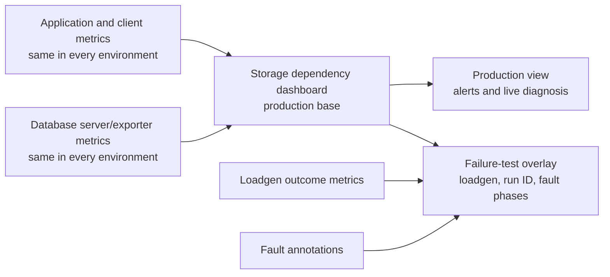

# Storage Dependency Metrics and Dashboard Contract

> Inventory date: 2026-08-11. This document is the repository source of truth for MongoDB- and Cassandra-related metrics used by production operations and failure/load testing. The inventory is based on current service wiring, `pkg/mongoutil`, `pkg/cassutil`, `github.com/flywindy/o11y v0.9.1`, loadgen collectors, and Prometheus provisioning in this repository.

## 1. Ownership and Reuse

This document belongs under `docs/specs/o11y/` because metric names, labels, recording rules, scrape coverage, and the production dashboard are operational contracts. Failure-test plans under `docs/load-testing/` own fault mechanics, traffic profiles, reconciliation, and test-specific acceptance thresholds; they reference this contract instead of copying it.

Production and failure testing use the same base storage dashboard and the same application/client/server metrics. A failure-test view adds loadgen outcome rows, run metadata, and fault annotations. It must not introduce a second definition of storage health.



## 2. Status Vocabulary

| Status | Meaning |
|---|---|
| Existing | Emitted by current code and scrapeable when the service is deployed with the repository's SDK metrics endpoint |
| Partial | Emitted only by some direct clients, or lacks enough labels/coverage for a reliable dashboard |
| Missing | Not emitted or not scraped in the current repository; required before the related failure campaign can produce a conclusive result |

Prometheus converts OpenTelemetry dots to underscores and appends unit/type suffixes. For example, `db.client.operation.duration` is normally exported as the `db_client_operation_duration_seconds_*` histogram family. Verify the actual collector/exporter output in the target environment before installing alerts.

## 3. Existing MongoDB Client Metrics

`pkg/mongoutil.Connect` instruments clients only when the caller passes `mongoutil.WithObservability`. The o11y integration currently emits the following complete MongoDB client metric set:

| OTel instrument / Prometheus family | Type | Allowed labels | What it proves | Status |
|---|---|---|---|---|
| `db.client.operation.duration` / `db_client_operation_duration_seconds_*` | Histogram | `service_name`, `db_system_name`, `db_operation_name`, `network_peer_address`, `network_peer_port`, `error_type` | Command throughput, latency, and observed errors by service/operation/server | Existing for instrumented clients |
| `db.client.connection.count` / `db_client_connection_count` | Up/down counter | `service_name`, `db_system_name`, pool name, connection state (`used`/`idle`), server address/port | Pool occupancy and connection loss/recovery | Existing for instrumented clients |
| `db.client.connection.idle.min` | Up/down counter | `service_name`, `db_system_name`, pool name, server address/port | Configured warm idle floor | Existing for instrumented clients |
| `db.client.connection.max` | Up/down counter | Same as above | Configured maximum; zero means the driver/default was not exposed as a finite configured value | Existing for instrumented clients |
| `db.client.connection.pending_requests` | Up/down counter | Same as above | Checkout queue pressure | Existing for instrumented clients |
| `db.client.connection.timeouts` | Counter | Same as above | Pool checkout timeouts | Existing for instrumented clients |
| `db.client.connection.create_time` | Histogram | Same as above | Connection establishment latency | Existing for instrumented clients |

The SDK deliberately drops `db.client.connection.idle.max`, `.use_time`, and `.wait_time`. Dashboard queries must not depend on those families.

Mongo operation metrics intentionally omit database and collection labels to control cardinality. Traces are required when an operator must distinguish collections or individual calls.

### 3.1 MongoDB instrumentation coverage

| Coverage | Direct MongoDB processes |
|---|---|
| Instrumented | admin-service; bot-message-handler; bot-message-worker; botplatform-service; bot-room-service; broadcast-worker; history-service; hr-sync-worker; inbox-worker; media-service; message-gatekeeper; message-worker; notification-worker; portal-service; room-service; room-worker; search-service; search-sync-worker; tcard-service; teams-room-inspector; upload-service; user-presence-service; user-service; data-migration oplog connector/direct-transfer/transformers |
| Missing instrumentation | teams-chat-member-sync; teams-chat-sync; teams-hr-sync; teams-room-creation; teams-room-verify; teams-user-sync; loadgen's own MongoDB clients |

The missing processes must pass `mongoutil.WithObservability` before a service-complete MongoDB fault campaign. A healthy metric from another service is not evidence that an uninstrumented client recovered.

## 4. Existing Cassandra Client Metrics

`pkg/cassutil.Connect` instruments sessions only when the caller passes `cassutil.WithObservability`.

| OTel instrument / Prometheus family | Type | Allowed labels | What it proves | Status |
|---|---|---|---|---|
| `db.client.operation.duration` / `db_client_operation_duration_seconds_*` | Histogram | `service_name`, `db_system_name`, `db_operation_name`, `db_namespace`, server address/port, `error_type` | Per-attempt/page query latency, rate, errors, and coordinator changes | Existing for ordinary queries |
| `cassandra.query.attempts` / `cassandra_query_attempts_total` | Counter | Same bounded query labels | One observation per driver attempt and per result page | Existing for ordinary queries |
| `db.client.connection.create_time` / `db_client_connection_create_time_seconds_*` | Histogram | `service_name`, `db_system_name`, pool name, server address/port | Successful connection establishment latency | Existing |
| `cassandra.connection.attempts` / `cassandra_connection_attempts_total` | Counter | Same connection labels plus `error_type` | Connection attempts and failures by node | Existing |

Direct Cassandra session coverage is:

| Coverage | Processes |
|---|---|
| Instrumented | message-worker; bot-message-worker; history-service |
| Missing instrumentation | data-migration/es-index-migrator; loadgen direct-Cassandra seed/teardown and legacy direct modes |

All current production batch call sites use `session.ExecuteBatch` directly. The o11y integration documents that batch spans/metrics require its `ExecuteBatch` seam, so message fan-out, bot message fan-out, reaction, pin/unpin, and other Cassandra batches are a metric blind spot even inside otherwise instrumented services.

## 5. Existing Storage-Relevant Application and Loadgen Metrics

These metrics do not replace database telemetry; they connect dependency behavior to a product outcome.

| Metric family | Producer | Use during a storage fault | Status |
|---|---|---|---|
| `loadgen_soak_operations_total{action,outcome,phase}` | loadgen soak | Offered and completed Cassandra-path operations | Existing |
| `loadgen_soak_retries_total{action}` | loadgen soak | Harness retries; must be kept separate from application/driver retries | Existing |
| `loadgen_soak_errors_total{action,class}` | loadgen soak | Failure class by business action | Existing |
| `loadgen_soak_rpc_latency_seconds_*{action}` | loadgen soak | End-to-end latency through message/history paths | Existing |
| `loadgen_soak_verifications_total{action,class}` | loadgen soak | Sampled Cassandra read-back correctness | Existing |
| `loadgen_soak_mutation_target_missing_total` | loadgen soak | Persisted target still absent after the dedicated wait/retry policy | Existing |
| `loadgen_soak_saturation_total{lane}` | loadgen soak | Invalid-run detector: loadgen dropped work because its own in-flight budget filled | Existing |
| `loadgen_failure_operations_total{scenario,lane,result}` | loadgen soak | Terminal good/bad/missing-after-deadline results for durable operation lanes | Existing for Cassandra user-message sends |
| `loadgen_failure_observations_total{scenario,lane,observer,result}` | loadgen soak | Separates admission failures from Cassandra history loss or mismatch | Existing for admission and Cassandra history |
| `loadgen_failure_inflight{scenario,lane}` | loadgen soak | Unresolved-operation backlog and deadline pressure | Existing for Cassandra user-message sends |
| `loadgen_failure_recovered_operations_total` | loadgen soak | Operations restored from the PVC-backed WAL after loadgen restart | Existing |
| `loadgen_failure_invalidations_total{reason}` | loadgen soak | Ledger capacity or WAL failures that invalidate evidence | Existing |
| `loadgen_failure_journal_bytes` | loadgen soak | Persistent evidence footprint and compaction health | Existing |
| `loadgen_nats_connected{pool}`, `loadgen_nats_connection_events_total{pool,event}`, `loadgen_nats_outage_duration_seconds_*{pool}` | loadgen soak | Separates generator connection loss from service/storage impact | Existing for soak; other loadgen pools remain a gap |
| `loadgen_published_total`, `loadgen_publish_errors_total`, E1/E2 histograms | loadgen message modes | Admission and visible-delivery impact on Mongo/Cassandra-backed paths | Existing; terminal ledger is currently limited to soak message sends |
| `loadgen_member_*` | loadgen member modes | Mongo-backed room/member operation impact | Existing but no final state ledger |
| `loadgen_botroom_*` | loadgen botroom mode | Bot path traffic and latency | Existing, but it does not exercise the real bot-message-worker persistence lane |
| `oplog_events_published_total`, `oplog_publish_errors_total`, `oplog_events_skipped_total`, `oplog_events_degraded_total`, `oplog_replication_lag_ms` | oplog-connector | Mongo change-stream progress and downstream publish health | Existing |
| `atrest_dek_cache_hits_total`, `atrest_dek_cache_misses_total`, `atrest_dek_creations_total`, `atrest_kek_wrap_total`, `atrest_kek_unwrap_total`, `atrest_kek_renewal_failures_total` | at-rest encryption package | Separates storage failure from key-cache/Vault behavior on encrypted message paths | Existing where at-rest encryption is wired |
| `cache_hits_total`, `cache_misses_total`, `cache_errors_total` | service caches | Explains whether Mongo load/impact was hidden or amplified by cache behavior | Existing in selected services |
| `go_*`, `process_*`, container CPU/memory/network | SDK/runtime, cAdvisor | Detects client or loadgen exhaustion and recovery surge | Existing where targets are scraped |

The Cassandra soak message-send lane now proves a terminal admission and history result for every generated operation and retains unresolved evidence on a dedicated PVC. Other loadgen lanes remain aggregate or sampled. A campaign that relies on one of those lanes remains inconclusive if aggregate success looks healthy but individual operations can disappear.

## 6. Missing Metrics and Telemetry

### 6.1 P0: required for both production and failure testing

| Missing signal | Required implementation | Why it is required |
|---|---|---|
| MongoDB server metrics | Deploy a MongoDB exporter and scrape every replica-set member | Client latency cannot identify election state, replication lag, flow control, locks, cache pressure, connections, or oplog-window risk |
| Cassandra server metrics | Deploy JMX exporter/agent on every node and scrape it | Client latency cannot identify dropped messages, pending compactions, hints, tombstones, coordinator saturation, GC, disk, or repair progress |
| Storage readiness | Add bounded Mongo `Ping` and Cassandra query probes, or an explicit dependency-readiness policy, to direct clients | Current checked services pass only `natsutil.HealthCheck`; a storage-broken pod can remain ready |
| Mongo instrumentation gaps | Instrument every direct service/process listed in Section 3.1 | Otherwise the service-by-service dashboard is incomplete |
| Cassandra batch telemetry | Route production batches through the o11y batch seam or add equivalent batch duration/error metrics | The highest-risk denormalized writes are currently absent from Cassandra operation metrics |
| Retry/exhaustion metrics | Count application retry, driver attempt, JetStream redelivery, terminal failure, and permanent drop separately | Logs alone cannot prove retry safety or enumerate exhausted work |
| Operation outcome ledger expansion | Extend the implemented Cassandra message-send ledger to MongoDB state, mutations, real bot messages, federation, and the remaining JetStream lanes | Required to detect silent loss and ambiguous success outside the first vertical slice |
| Fault timeline | Emit Grafana annotations or a bounded `fault_event` series with run/scenario/phase | Required to align election, error, backlog, and recovery windows |

### 6.2 MongoDB server signals to normalize

Exporter names vary by version, so recording rules should expose stable project-owned series. The source exporter metric must be documented beside each rule.

| Canonical signal | Dimensions | Dashboard/alert use |
|---|---|---|
| `chat_storage_member_up{dependency="mongodb"}` | cluster, member, role | Member reachability and topology |
| `chat_mongodb_primary_members` | cluster | Must equal one per replica set |
| `chat_mongodb_elections_total` | cluster | Election timeline/rate |
| `chat_mongodb_replication_lag_seconds` | cluster, member | Secondary lag and post-fault convergence |
| `chat_mongodb_oplog_window_seconds` | cluster | Change-stream history-loss risk |
| `chat_mongodb_connections{state}` | cluster, member, state | Server connection saturation |
| `chat_mongodb_operations_total{operation}` | cluster, member, operation | Server-side throughput |
| `chat_mongodb_operation_latency_seconds_*{operation}` | cluster, member, operation | Server latency independent of client queues |
| `chat_mongodb_wiredtiger_cache_bytes{state}` | cluster, member, state | Cache pressure/eviction |
| `chat_mongodb_lock_time_seconds_total{mode}` | cluster, member, mode | Lock contention |
| `chat_mongodb_flow_control_*` | cluster, member | Majority-commit/replication pressure |
| `chat_storage_disk_bytes{dependency="mongodb",state}` | cluster, member, state | Capacity and recovery headroom |

### 6.3 Cassandra server signals to normalize

| Canonical signal | Dimensions | Dashboard/alert use |
|---|---|---|
| `chat_storage_member_up{dependency="cassandra"}` | cluster, dc, rack, node | Node reachability/topology |
| `chat_cassandra_client_request_total{operation,outcome}` | cluster, dc, node | Read/write failure rate |
| `chat_cassandra_client_request_latency_seconds_*{operation}` | cluster, dc, node | Server-side read/write latency |
| `chat_cassandra_timeouts_total{operation}` | cluster, dc, node | Timeout classification |
| `chat_cassandra_unavailable_total{operation}` | cluster, dc, node | Consistency/quorum failure |
| `chat_cassandra_dropped_messages_total{type}` | cluster, dc, node, type | Internal overload/loss signal |
| `chat_cassandra_pending_compactions` | cluster, dc, node | Compaction backlog and recovery |
| `chat_cassandra_compaction_bytes_total` | cluster, dc, node | Compaction work rate |
| `chat_cassandra_hints{state}` | cluster, dc, node, state | Hinted handoff backlog/delivery |
| `chat_cassandra_read_repair_total{outcome}` | cluster, dc, node | Replica convergence evidence |
| `chat_cassandra_tombstone_scanned_*` | cluster, dc, node | Delete/read amplification |
| `chat_cassandra_threadpool_tasks{pool,state}` | cluster, dc, node, pool, state | Native transport/mutation/read saturation |
| `chat_cassandra_gc_pause_seconds_*` | cluster, dc, node | JVM stall attribution |
| `chat_cassandra_sstable_count{table}` | cluster, dc, node, keyspace, table | TWCS/read amplification |
| `chat_storage_disk_bytes{dependency="cassandra",state}` | cluster, dc, node, state | Capacity and recovery headroom |
| `chat_cassandra_repair_progress{state}` | cluster, dc, node, state | Operator repair completion |

Table/keyspace labels are acceptable on server metrics because their values are bounded by deployed schema. Never label application hot-path metrics with room ID, message ID, account, trace ID, or arbitrary error text.

## 7. Dashboard Specification

### 7.1 Base dashboard: `Storage Dependencies`

The production dashboard should contain the following rows:

1. **User impact:** request/message rate, error ratio, p95/p99 service latency, and affected services.
2. **Client operations:** MongoDB/Cassandra operation rate, error ratio, p95/p99 by service and operation.
3. **Client pools/connections:** Mongo used/idle/pending/timeouts and Cassandra connection attempts/failures/create latency.
4. **Topology:** Mongo primary/member state/elections/lag; Cassandra up nodes by DC/rack and coordinator distribution.
5. **Server saturation:** connections, queues, locks/cache/flow control for Mongo; pending compactions, thread pools, dropped messages, GC for Cassandra.
6. **Durability and convergence:** Mongo oplog window/change-stream lag; Cassandra hints, repair, tombstones, SSTables, disk.
7. **Upstream backlog:** JetStream pending/ack-pending/redelivery for workers that write the affected storage.
8. **Runtime:** service/container CPU, memory, goroutines, restarts, and network.

Dashboard variables: `environment`, `site`, `dependency`, `cluster`, `service_name`, and `operation`. Server/member is a drill-down variable, not a default aggregation.

### 7.2 Failure-test overlay

The failure-test view reuses all base rows and adds:

- `run_id`, `scenario`, and traffic-profile variables sourced from loadgen/run metadata.
- An annotation track for baseline, injection, failover, recovery, backlog-drain, and settle timestamps.
- Loadgen offered/completed/retried/failed/saturated rates.
- Eligible/good/bad/missing-after-deadline outcomes after the P0 ledger is implemented.
- Before/during/after deltas for latency, error rate, replication lag, pending work, and resource saturation.
- A verdict panel that reports `PASS`, `FAIL`, or `INCONCLUSIVE`; missing required telemetry is never a pass.

Do not add `run_id` to every database operation. Keep it on loadgen/run metadata and use time-range plus deployment/environment labels to correlate the run; otherwise each run multiplies hot-path time-series cardinality.

### 7.3 Core PromQL patterns

The following queries use the SDK's current Prometheus naming. Label spelling must be verified against the deployed collector.

```promql
# Operation rate by storage and service
sum by (db_system_name, service_name, db_operation_name) (
  rate(db_client_operation_duration_seconds_count[5m])
)

# Operation error ratio (error_type exists only on failures)
sum by (db_system_name, service_name) (
  rate(db_client_operation_duration_seconds_count{error_type!=""}[5m])
)
/
sum by (db_system_name, service_name) (
  rate(db_client_operation_duration_seconds_count[5m])
)

# p99 client latency
histogram_quantile(0.99,
  sum by (le, db_system_name, service_name, db_operation_name) (
    rate(db_client_operation_duration_seconds_bucket[5m])
  )
)

# Mongo pool checkout pressure
sum by (service_name, db_client_connection_pool_name) (
  db_client_connection_pending_requests
)

# Mongo pool timeout rate
sum by (service_name, db_client_connection_pool_name) (
  rate(db_client_connection_timeouts_total[5m])
)

# Cassandra observed attempts by service/coordinator
sum by (service_name, server_address, error_type) (
  rate(cassandra_query_attempts_total[5m])
)

# Loadgen soak terminal mix
sum by (action, outcome, phase) (
  rate(loadgen_soak_operations_total[5m])
)

# Read-back failures
sum by (action, class) (
  increase(loadgen_soak_verifications_total{class!="ok"}[$__range])
)
```

In PromQL, `error_type!=""` excludes series where the label is absent as well as series where it is empty. Keep the denominator unfiltered so it includes successful and failed operations.

## 8. Scrape and Deployment Gaps

Current repository provisioning is insufficient for a complete storage dashboard:

- `docker-local/o11y/prometheus.yaml` scrapes chat service SDK endpoints and the OTel collector, but no MongoDB or Cassandra exporter.
- `tools/observability/prometheus/prometheus.yml` scrapes cAdvisor, NATS exporter, and a stale fixed subset of application endpoints; it also has no storage exporters.
- Local MongoDB and Cassandra are single-node. Local tests can validate total outage/restart and client recovery, but not Mongo primary election/majority loss or Cassandra replica/quorum/hinted-handoff behavior.
- Production/staging exporter deployment and recording rules are not represented in this repository, so their presence must be a campaign preflight gate rather than an assumption.

## 9. Implementation Order

1. Deploy/scrape MongoDB and Cassandra server exporters in staging and production, then add stable recording rules.
2. Close direct-client instrumentation gaps and Cassandra batch telemetry.
3. Add storage readiness or explicitly document a deliberate readiness policy.
4. Add retry/exhaustion/terminal-outcome metrics and the loadgen operation ledger.
5. Build the shared production base dashboard.
6. Add the failure-test overlay and fault annotations.
7. Execute single-dependency campaigns only after every required panel has non-stale data.

## 10. Code Evidence

- Mongo client setup and startup ping: `pkg/mongoutil/mongo.go`, `tuning.go`, and `readpref.go`.
- Cassandra consistency, timeout, host policy, and pool setup: `pkg/cassutil/cass.go`.
- SDK metric definitions and label filters: cached `github.com/flywindy/o11y v0.9.1` Mongo and Cassandra integrations, selected by `go.mod`.
- Current loadgen collectors: `tools/loadgen/metrics.go`.
- Mongo change-stream outcome metrics: `data-migration/oplog-connector/metrics.go`.
- At-rest metrics: `pkg/atrest/metrics.go`.
- Current scrape configs: `docker-local/o11y/prometheus.yaml` and `tools/observability/prometheus/prometheus.yml`.
- Current readiness wiring: service `main.go` files and `pkg/natsutil/health.go`; no MongoDB/Cassandra probe is registered.
