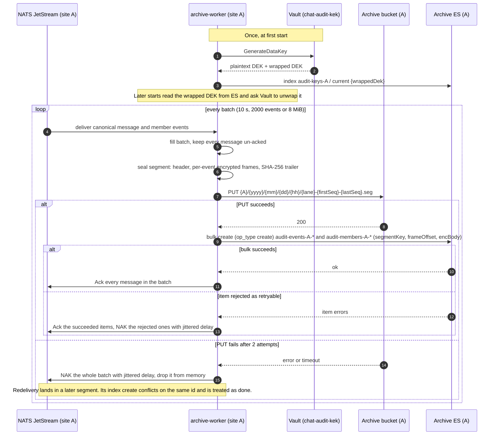
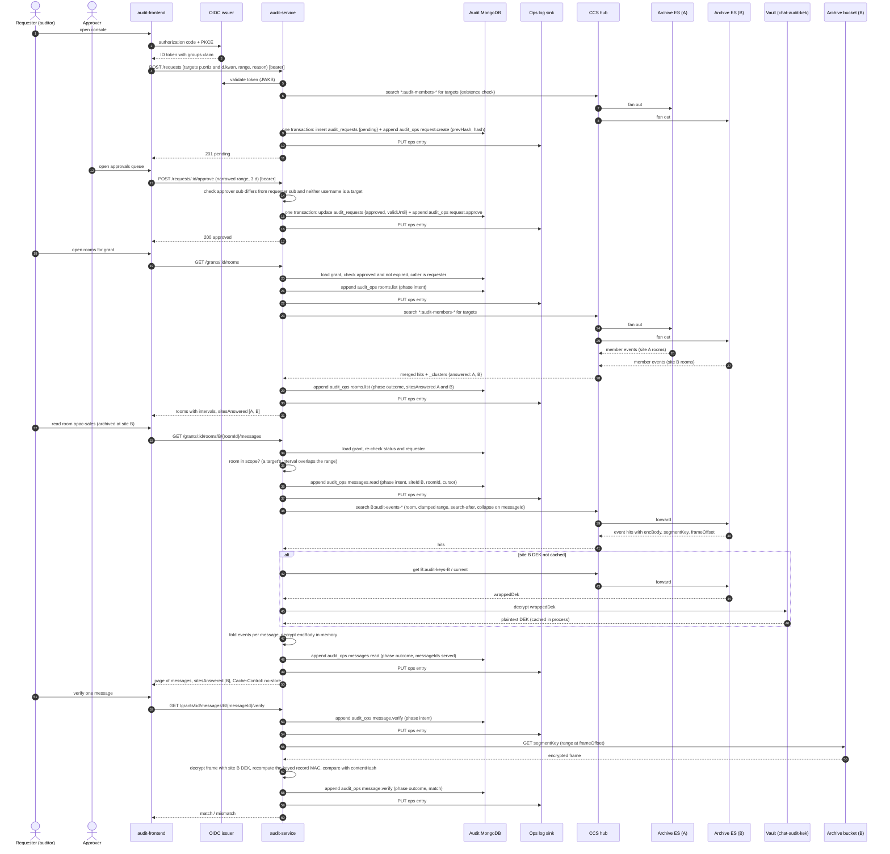

# Message audit access — design

**Date:** 2026-09-29 (revised 2026-09-30 for a central audit plane)
**Branch:** `claude/bold-knuth-sitjie`
**Status:** approved design, not implemented

## Goal

Let an authorized investigator read every message in every room that one or more
user accounts belong to, on any site, after a sign-off by a second person, with every
operation recorded in a tamper-evident log. The capability must be hard to reach for a
developer with production access to the platform.

## Decisions summary

| Question | Decision |
|---|---|
| Sign-off | Two-person: a requester submits, a different approver grants |
| Threat model | Developers with production access (kubectl, MongoDB, Cassandra, Vault policies) |
| Identity and roles | OIDC SSO, roles from an IdP group claim, no platform-stored auditor role |
| Grant shape | One or more target accounts, one message date range, time-limited validity, valid on every site |
| Multi-site | One central audit plane; each site keeps its own archive; reads fan out through Elasticsearch cross-cluster search (CCS) |
| Consumption | Interactive console; export is a follow-up |
| Message source | A per-site archive fed from MESSAGES-CANONICAL, not live Cassandra |
| Archive record | Sealed segments in a per-site S3-compatible bucket under Object Lock, encrypted with an audit-only Vault key |
| Archive index | Per-site dedicated Elasticsearch cluster, append-only event documents with encrypted bodies, folded to state on read, no plaintext search |
| Operation log | Hash-chained collection in a dedicated MongoDB deployment, mirrored to an Object Lock bucket |
| Membership history | Recorded by the archive from rollout on; rooms the target left stay readable for the membership interval |

## Non-goals

- Export bundles.
- Plaintext full-text search over message bodies. The index shape allows it later, but
  no mode flag or migration tool is designed here.
- Backfill of messages sent before the archive worker was deployed.
- Legal hold on live deletes in Cassandra. The archive keeps deleted content; the live
  store is unchanged.
- Changes to the chat clients or to how users see their own messages.
- Per-site operation logs. Reads of a site's data are logged centrally, not at that site.

## Background: what exists and what is wrong with it

The survey of the repo found four facts that shape this design.

1. **Any backend credential can already read any user's history.** `history-service`
   trusts the `{account}` segment of the NATS subject and checks only that the named
   account is subscribed to the room. Backend services share one NATS user allowed to
   publish and subscribe on `>`. `auth-service` in `DEV_MODE` mints a JWT for any
   account with no validation. An audit front door is pointless while this side door
   stays open, so §2 closes it.
2. **One Vault key decrypts everything.** At-rest encryption wraps every room DEK with
   one transit key, `chat-kek`, and at least seven services hold the decrypt policy.
   The archive therefore uses a separate key that no chat service holds.
3. **`admin_audit` is not evidence-grade.** It logs mutations only, best-effort after the
   action, in a mutable collection on the shared cluster.
4. **History is lost.** Leaving a room hard-deletes the subscription, editing overwrites
   in place, and deleting a message nulls its content. Live Cassandra cannot answer
   "what did this person write last year in a room they since left".

Three existing patterns this design builds on: the `permission_grants` collection
(applicant, approver, reason, time window), the `search-sync-worker` batching pipeline,
and `search-service`'s cross-cluster search over `messages-*,*:messages-*`, which
already spans sites the same way the audit reads will.

## 1. Architecture

The archive is per site, because a room's messages are produced at the room's site and
should stay there. The control plane is central, because a leak investigation crosses
sites and one two-person workflow, one log, and one hash chain are simpler to run and
to trust than one per site.

Four deliverables, in dependency order.

1. **Prerequisite hardening** (§2). Small code changes plus ops configuration.
2. **`archive-worker`** (§4), deployed once per site. A JetStream worker that copies
   every canonical message and membership event of its site into that site's archive
   bucket and archive index.
3. **`audit-service`** (§3, §5, §6), deployed once. A flat Gin service owning grants,
   the operation log, room enumeration, and message reads across all sites.
4. **`audit-frontend`** (§8), deployed once. A separate Vite and React SPA.

### Stores

All stores belong to the audit plane and are reachable only with credentials the audit
plane holds (§7).

| Store | Scope | Purpose | Written by | Read by |
|---|---|---|---|---|
| Archive bucket (S3-compatible, Object Lock compliance mode) | per site | System of record: sealed, encrypted segments of canonical events, and encrypted copies of attachment blobs | that site's `archive-worker` | `audit-service` (verification only) |
| Archive Elasticsearch cluster | per site | Append-only query index: one document per message and membership event, encrypted bodies, the site's wrapped archive DEK | that site's `archive-worker` | `audit-service`, through CCS |
| CCS hub Elasticsearch cluster | central | Holds no data; every site's archive cluster is registered on it as a remote | nobody | `audit-service` |
| Audit MongoDB deployment | central | `audit_requests`, `audit_ops`, `audit_chain_checkpoints` | `audit-service` | `audit-service` |
| Operation log sink (S3-compatible, Object Lock) | central | Immutable copy of every `audit_ops` entry | `audit-service` | Ops, on demand |

`audit-service` has no connection to NATS, Cassandra, any chat MongoDB, or the live
search cluster. `archive-worker` has no connection to any MongoDB.

### Data flow

```
site A: MESSAGES-CANONICAL ─┐
        INBOX (member evts) ┴► archive-worker(A) ─► segment PUT ─► bucket(A)
                                     └─► bulk index ─► archive ES(A) ◄─┐
site B: (same)                                       archive ES(B) ◄─┤ CCS
                                                                      │
audit-frontend ─► audit-service ─► grant check ─► ops log ─► CCS hub ─┘ query + decrypt
```

### Sequence: archiving one batch at a site



### Sequence: a cross-site investigation



## 2. Prerequisite hardening

These changes are required before the audit plane is meaningful. They are small and
ship first.

- **`auth-service` dev-mode guard.** `DEV_MODE=true` is refused at startup unless a
  second flag, `DEV_MODE_LOCAL_ONLY_ACK=true`, is also set. Local docker-compose sets
  both. A production deployment that copies `DEV_MODE=true` by mistake exits instead of
  minting unauthenticated JWTs.
- **Per-service NATS credentials.** The shared `backend` NATS user with `>` on publish
  and subscribe is replaced by per-service users. Only the services that legitimately
  call history on a user's behalf keep `chat.user.>` publish rights: `room-service`,
  `message-gatekeeper`, `broadcast-worker`, `notification-worker`, `room-worker`,
  `search-sync-worker`. Every other service gets the subjects it actually uses. This is
  an ops change in the NATS account configuration, documented in
  `docker-local/setup.sh` for local parity, with no application code change.

## 3. Identity, roles, and the grant workflow

### Identity

`audit-frontend` performs the OIDC authorization-code flow with PKCE against the
existing issuer and sends the ID token as a bearer on every call. `audit-service`
validates it per request with `pkg/oidc` and reads a groups claim. The claim name and
the two group names are configuration:

| Env | Default | Meaning |
|---|---|---|
| `AUDIT_OIDC_GROUPS_CLAIM` | `groups` | Claim holding the user's groups |
| `AUDIT_AUDITOR_GROUP` | required | Group that grants the auditor role |
| `AUDIT_APPROVER_GROUP` | required | Group that grants the approver role |

There is no session collection and no platform-stored role. Token lifetime is the
revocation window, so the IdP must issue short-lived tokens for this client; this is a
deployment precondition. A token from a user in neither group is refused and logged.

Every identity is recorded as the OIDC `sub` claim (stable, opaque) plus the
`preferred_username` claim (the platform account name, which is system-wide). Distinctness
checks compare `sub` between requester and approver, and `preferred_username` against the
target list. Auditors and approvers do not need a chat account.

### Grant record

`audit_requests`, one document per request, never deleted.

| Field | Type | Meaning |
|---|---|---|
| `_id` | string | UUIDv7 hex via `idgen.GenerateUUIDv7()` |
| `targetAccounts` | string[] | 1 to `AUDIT_MAX_TARGETS` (default 20) accounts |
| `requesterSubject`, `requesterAccount` | string | From the token |
| `reason` | string | 1 to 1000 runes |
| `caseRef` | string | Optional external reference |
| `messageRange` | `{from, to}` | Half-open UTC window the auditor may read; `to` may not exceed submission time |
| `requestedValidity` | duration | Capped by `AUDIT_MAX_VALIDITY` (default 30d); default `AUDIT_DEFAULT_VALIDITY` (7d) |
| `status` | enum | `pending`, `approved`, `denied`, `revoked`, `expired` |
| `approverSubject`, `approverAccount`, `decidedAt`, `decisionNote` | | Set on approve or deny |
| `validUntil` | time | Set on approve: `decidedAt + validity`, approver may shorten |
| `revokedBySubject`, `revokedAt` | | Set on revoke |
| `createdAt`, `updatedAt` | time | |

A grant has no site field. It is valid on every site the audit plane is connected to.

Target accounts are checked against `*:audit-members-*` at submission. An account
with no membership document on any site is accepted, since it may simply have joined
nothing since rollout, but the request shows it as "no rooms found" so a typo is
visible to the approver.

### Rules

- On approve, the approver may remove accounts from `targetAccounts`, shorten
  `validity`, and narrow `messageRange`. Never add, extend, or widen.
- The approver's `sub` must differ from the requester's.
- Neither requester's nor approver's `preferred_username` may appear in
  `targetAccounts`. Requester, approver, and every target are pairwise distinct on one
  request. An auditor's own account may be a target of a different request approved by
  someone else.
- Transitions: `pending` to `approved` or `denied`; `approved` to `revoked`. Anything
  else is a conflict. Nobody edits a request after submission.
- A grant is usable only while `status = approved` and `now < validUntil`, evaluated on
  every read. A periodic sweep marks stale rows `expired` for listing only.
- Only the requester reads under a grant. A second auditor on the same case submits
  their own request.
- Requesters see their own requests. Approvers see all requests.

### Endpoints

All under `/v1/audit`, bearer-authenticated, JSON.

| Method and path | Role | Action |
|---|---|---|
| `POST /requests` | auditor | Create |
| `GET /requests`, `GET /requests/:id` | auditor (own), approver (all) | List, detail |
| `POST /requests/:id/approve`, `/deny`, `/revoke` | approver | Decide |
| `GET /grants/:id/rooms` | requester | Rooms in scope on every site (§5) |
| `GET /grants/:id/rooms/:siteId/:roomId/messages` | requester | Page a room |
| `GET /grants/:id/rooms/:siteId/:roomId/threads/:parentId/messages` | requester | Page a thread |
| `GET /grants/:id/messages` | requester | Cross-room, cross-site metadata query |
| `GET /grants/:id/messages/:siteId/:messageId/verify` | requester | Verify against that site's bucket |
| `GET /grants/:id/attachments/:siteId/:fileId` | requester | Stream an archived attachment (§5) |
| `GET /ops` | approver | Operation log, filterable |
| `GET /ops/verify` | approver | Walk the hash chain |
| `GET /sites` | any role | Sites the plane is connected to and whether each answered its last health probe |
| `GET /healthz`, `GET /readyz` | none | Probes |

Room and message paths carry the site because room IDs and message IDs are only unique
within a site's archive, and because the site selects the bucket and the DEK.

Errors use `pkg/errcode` with a new `codes_audit.go`: `AuditGrantNotActive`,
`AuditNotRequester`, `AuditSelfApproval`, `AuditTargetIsParty`,
`AuditRoomOutOfScope`, `AuditLogUnavailable`, `AuditSiteUnavailable`,
`AuditInvalidTransition`.

## 4. `archive-worker`

Deployed once per site, configured with that site's `SITE_ID`, NATS, archive bucket,
and archive Elasticsearch cluster.

### Sources

Three durable pull consumers in one process, each guarded by `pkg/loopguard`. The first
two feed the segment batches; the third is the attachment lane described below.

- **MESSAGES-CANONICAL**, filter on the per-message event subjects: created, updated,
  deleted, pinned, unpinned, reacted. The canonical event carries the full plaintext
  message, so no Cassandra read and no chat-side decrypt is needed.
- **INBOX**, filter on `subject.InboxMemberEventSubjects(siteID)`: member added, member
  removed, joined-at refreshed, room renamed, on both lanes. Joined-at refreshed is
  acknowledged without being archived. A local user joining a remote-site room
  arrives on the external lane, so a site's members index knows every room its own
  users are in, including rooms whose messages are archived elsewhere.

### Batching

Events are accumulated per pod and sealed into one segment when the first of three
bounds trips.

| Env | Default | Bound |
|---|---|---|
| `ARCHIVE_FILL_INTERVAL` | `10s` | Time since the first event in the batch |
| `ARCHIVE_BATCH_EVENTS` | `2000` | Event count |
| `ARCHIVE_BATCH_BYTES` | `8MiB` | Encrypted size |
| `ARCHIVE_PUT_TIMEOUT` | `10s` | One upload attempt |
| `ARCHIVE_BULK_TIMEOUT` | `10s` | One index attempt |
| `ARCHIVE_WRITE_ATTEMPTS` | `2` | Upload and index attempts before a NAK |
| `CONSUMER_ACK_WAIT` | `60s` | Must exceed fill + attempts × (put + bulk timeouts); 10 + 2 × 20 = 50s at defaults |
| `CONSUMER_MAX_ACK_PENDING` | `12000` | Must be ≥ replicas × 2 × `ARCHIVE_BATCH_EVENTS` |

At the projected 200 events a second the count bound trips every 10 seconds, giving
about 8,600 objects a day of roughly 4 MiB each. Startup refuses a configuration where
the worst-case batch time exceeds the ack wait, and warns when the ack-pending ceiling
is below the formula, using the same shape of check as `search-sync-worker`. Production
runs three replicas per site.

The consumer uses `stream.WithUnlimitedRedelivery`. Poison events that fail to parse
are logged, counted, and terminated.

### Segment format

Key: `{site}/{yyyy}/{mm}/{dd}/{hh}/{lane}-{firstSeq}-{lastSeq}.seg`. Time-ordered by
construction; room is not in the key because the index answers by-room questions. The
lane (`events` or `members`) is in the key because the two lanes read different streams
with independent sequence spaces.

Body:

1. Plaintext header: format version, site, first and last stream sequence, record count.
2. One frame per event: 4-byte length prefix, then the archive record encrypted
   individually with the site's archive DEK and a fresh nonce.
3. Trailer: SHA-256 over everything before it.

An archive record is the canonical event plus site, stream name, stream sequence,
subject, and event time. Its `contentHash` is `hmac-sha256:` plus
hex(HMAC-SHA256(k, record canonical JSON)), with `k = HKDF-SHA256(DEK, info
"chat-audit-record-mac")` derived from the site's DEK. An unkeyed hash would let a
reader of the index confirm a guessed short body offline, so verification requires the
DEK. The manifest of which messages a segment holds is inside
the encrypted frames, so the bucket exposes only site and time.

### Encryption

One transit key, `chat-audit-kek`, on one Vault that every site's worker and the central
service can reach. This is the one cross-site dependency the workers have, and they use
it only when creating or unwrapping their site's DEK, which is rare and cached, so it is
never on the write path.

Each site has one archive DEK. The worker generates it through
`atrest.KeyWrapper.GenerateDataKey` on first start, stores the wrapped form as the single
document of the site's `audit-keys-{site}` index (§Index shape), and caches the
unwrapped form in process. On later starts it reads the index and unwraps. Publishing
the wrapped DEK in the index means the central service obtains every site's key through
the same CCS path it uses for everything else, with no cross-site MongoDB or secret
distribution. A wrapped DEK is safe to expose; only the Vault decrypt policy turns it
into plaintext.

`chat-kek` is never involved. The worker's Vault role has `datakey` and `encrypt` on the
audit key; the service's role has `decrypt` only. No chat-side role has any policy on
the audit key.

### Write order and acknowledgement

1. Seal the segment and compute the trailer.
2. PUT the segment. Up to `ARCHIVE_WRITE_ATTEMPTS` attempts in process with a short
   jittered wait between them. A 200 means durable.
3. Bulk-index the batch with `op_type: create`, one document per event with id
   `{site}-{streamSeq}`, each pointing at `segmentKey` and `frameOffset`. Retry the
   same way. This order means the index never points at a missing segment.
4. Ack every message whose bulk item succeeded or returned a version conflict, since a
   conflict means that event is already archived. NAK any item the bulk rejected as
   retryable, through `jsretry` with the default jittered backoff.
5. If the PUT fails after all attempts, nothing has been written anywhere: NAK the whole
   batch through `jsretry` and drop it from memory. The batch is rebuilt from
   redelivery, never from memory.

A redelivered event lands in a later segment and its index create is refused as a
conflict on the same id. The bucket gains a duplicate frame, the index is unchanged,
and a rebuild dedups by stream sequence. Duplicates cost storage, never correctness.
The worker never issues an update or a delete against any index.

A replay that re-seals the same stream sequences within the same clock hour produces the
same segment key, so the versioned, locked bucket gains a second object version under it
(the frames carry fresh nonces, so the bytes differ). Documents carry no version id, so a
reader verifies the frame by `contentHash`, which it already does; the audit-service PR
should consider recording the object version id.

### Behaviour when the bucket is unavailable

In plain terms: the pod tries the upload twice over about twenty seconds while
holding the batch in memory and its messages un-acked. If that fails it hands the whole
batch back to NATS with a jittered delay of about a minute, and drops it. It keeps
pulling, filling, failing, and handing back, with the delay growing to a cap of a few
minutes, so a long outage produces a slow trickle of redeliveries rather than a storm.
Nothing is acked, nothing is indexed, nothing is lost, and there is no delivery cap to
exhaust. Readiness stays green because NATS is healthy; the alert is on the
`archive_write_failures_total` and `archive_lag_seconds` metrics. When the bucket
returns, the next redelivered batch succeeds and the backlog drains with no operator
action. A pod that dies mid-upload leaves its messages un-acked until the 60-second ack
wait passes, after which NATS redelivers them to another pod.

### Object Lock

Retention comes from the bucket's default Object Lock rule in compliance mode. The
worker sets no per-object retention. At startup it reads the bucket's lock
configuration and refuses to run if lock is absent or the mode is not compliance. The
worker's bucket credential has `PutObject` only.

### Why sealed segments rather than Elasticsearch snapshots

Once frames are encrypted, a stolen segment and a stolen snapshot are equally
unreadable, so confidentiality does not decide this. Three other things do. A segment
is sealed before its events are indexed, in the same batch, so no event is ever in the
index without already being in the record; a snapshot leaves everything since the last
snapshot unprotected. Object Lock works on a segment, which is written once, and fights
a snapshot repository, which rewrites its metadata and deletes shared files on every
cycle. And a segment is a versioned framing a small Go tool opens with the DEK for a
single ranged read, where a snapshot is Lucene files that need a compatible
Elasticsearch to restore in full. Snapshots stay as the archive cluster's operational
backup, for fast restore rather than evidence.

### Index shape

The index is append-only and event-sourced: one immutable document per archived event,
never a document per message that gets updated. Two Elasticsearch controls enforce it.
The worker's role holds only the `create_doc` privilege on the audit indices, which
allows new documents and refuses updates, deletes, and overwrites, so a stolen worker
credential cannot change history. The lifecycle policy sets each daily index
read-only at `min_age: 1d`, after which even creates are refused. Altering the index
then takes cluster-admin rights, which is why the bucket remains the evidence copy:
Elasticsearch has no equivalent of Object Lock.

Four indices on each site's archive cluster (events, members, blobs, keys). The
worker's `bootstrap.go` pushes the templates and the lifecycle policy on every start,
not only under `BOOTSTRAP_STREAMS`. Event
indices are daily under an index lifecycle policy: hot, read-only at `min_age: 1d`,
deleted at `ARCHIVE_INDEX_RETENTION`.

**`audit-events-{site}-{yyyy.mm.dd}`**, one document per message event, id
`{site}-{streamSeq}`:

| Field | ES type | Notes |
|---|---|---|
| `seq` | long | Stream sequence; the fold order |
| `eventType` | keyword | `created`, `updated`, `deleted`, `pinned`, `unpinned`, `reacted` |
| `eventAt` | date | Event timestamp |
| `messageId`, `roomId`, `siteId` | keyword | No `roomType`: the canonical message event does not carry it, so the fold takes it from the members index |
| `senderAccount`, `senderId` | keyword | Author of the message, on every event |
| `createdAt` | date | Message creation time, on every event, for range clamping and sort |
| `threadParentId` | keyword | |
| `attachmentCount`, `attachmentTypes` | integer, keyword | On `created` and `updated` |
| `actorAccount` | keyword | On `pinned`, `unpinned`, `reacted`, `deleted`; for `pinned` and `unpinned` the pinner (`message.pinnedBy.account`), falling back to the author |
| `segmentKey`, `frameOffset`, `contentHash` | keyword, long, keyword | Pointer to the sealed record; `contentHash` is the keyed `hmac-sha256:` digest of the record |
| `encBody` | binary, not indexed | Ciphertext of body, cards, quoted parent; only on `created` and `updated` |

**`audit-members-{site}-{yyyy.mm.dd}`**, one document per affected account of a
membership event, id `{site}-{streamSeq}-{i}` with `i` the account's position in the
event (one document with empty `account` for `room_renamed`):

| Field | ES type | Notes |
|---|---|---|
| `seq`, `eventType`, `eventAt` | long, keyword, date | `member_added`, `member_removed`, `room_renamed` |
| `roomId`, `roomSiteId`, `account`, `roomType`, `roomName` | keyword | `roomSiteId` is the site that archives the room's messages, which for a remote room differs from the index's site; `account` empty on `room_renamed` |
| `segmentKey`, `frameOffset`, `contentHash` | keyword, long, keyword | `contentHash` as for events; every document of one event shares the event's record |

**`audit-blobs-{site}`**, one document per attachment, id `{site}-{fileId}`:

| Field | ES type | Notes |
|---|---|---|
| `fileId`, `messageId`, `roomId`, `siteId` | keyword | |
| `fileName`, `contentType`, `sizeBytes` | keyword, keyword, long | From the attachment metadata; `sizeBytes` of `-1` means over the size cap, size unknown at source |
| `blobKey`, `plainSha256`, `chunkBytes` | keyword, keyword, integer | Empty when skipped |
| `skipped` | keyword | Absent, `size`, `missing`, or `legacy` |
| `archivedAt` | date | |

**`audit-keys-{site}`**, exactly one document, id `current`, written once with
`op_type: create` and never again:

| Field | ES type | Notes |
|---|---|---|
| `siteId` | keyword | |
| `wrappedDek` | binary, not indexed | Output of the transit `datakey/wrapped` call |
| `createdAt` | date | |

`encBody` is meant to be kept for 180d. Because documents are immutable, stripping is a
scheduled reindex job owned by the audit-service PR; ILM has no reindex action. The
policy sets each daily index read-only at `min_age: 1d` and deletes it at
`ARCHIVE_INDEX_RETENTION` (default `2555d`). Older messages are read from the segment by
ranged GET at the stored offset.

### Attachment lane

Attachments are blobs in the legacy Drive backend or the upload MinIO bucket, and the
message carries only their metadata. The platform never deletes them today, but the
audit plane does not control them, so the archive takes its own copy.

The third consumer on MESSAGES-CANONICAL filters to `created` events and ignores any
without attachments. It runs on its own durable with `CONSUMER_ACK_WAIT` sized for
large downloads (`ARCHIVE_BLOB_ACK_WAIT`, default 10m), the outage retry budget, and
`jsretry.Heartbeat` to hold the deadline open during a slow transfer, since this lane,
unlike the segment lane, does honest long work per message. Per attachment it:

1. Skips the blob when its declared size exceeds `ARCHIVE_BLOB_MAX_BYTES` (default the
   upload cap, 100 MiB) and records a metadata-only document with `skipped: size`.
2. Downloads the blob through `pkg/drive` with the site's Drive credential, from the
   `drive_host` in the link `upload-service` wrote (`api/v1/file/rooms/...?drive_host=`).
   Legacy MinIO-hosted attachments (`api/v1/file-upload/...`) are recorded as
   `skipped: legacy`, because resolving them needs the upload MongoDB lookup this worker
   deliberately does not have. `upload-service` only writes the relative Drive form;
   absolute legacy URLs are normalised to the relative `file-upload` form before the
   worker sees them (`pkg/model/cassandra/attachment_legacy.go`).
3. Streams it through chunked AES-GCM with the site's archive DEK, 4 MiB chunks, a
   fresh nonce per chunk, and the chunk index and file id as authenticated data, while
   computing the plaintext SHA-256.
4. PUTs the result once to `{site}/blobs/{fileId}` in the archive bucket, under the
   bucket's Object Lock rule. The encrypted blob is buffered in memory before the PUT,
   bounded by `ARCHIVE_BLOB_MAX_BYTES` x `ARCHIVE_BLOB_WORKERS` per pod.
5. Creates one `audit-blobs-{site}` document (below) with `op_type: create`. A
   redelivery conflicts on the id and is done. Acks the message.

A download that fails after the in-process attempts NAKs through `jsretry`; a blob that
no longer exists at the source is recorded as `skipped: missing` and acked, since
retrying cannot bring it back. Blobs are archived once per file id even when the same
file is referenced by several messages.

The lane reserves a worker slot (`ARCHIVE_BLOB_WORKERS`) before each fetch and asks for
no more messages than it has free slots, so no delivered message waits for a worker with
its ack wait running and no heartbeat. A message that exhausts the delivery budget is
Termed with a logged `disposition=drop` and gets no `BlobDoc`.

### Cross-cluster search

Each site's archive cluster is registered as a remote on the central CCS hub under its
site ID as the cluster alias, with a cross-cluster API key granting read on
`audit-events-*`, `audit-members-*`, and `audit-keys-*` and nothing else. Every
remote is marked `skip_unavailable: true`, so one site being down degrades a query to
the sites that answered rather than failing it. `audit-service` queries
`*:audit-events-*` and `*:audit-members-*` through the hub, exactly as
`search-service` queries `*:messages-*`, and reads the `_clusters` section of every
response to learn which sites answered. Local docker-compose registers the local
archive cluster on the hub under `site-local` so the code path is the same in dev.

## 5. Read path

Every read follows the same order: validate token and role, load the grant and check
status, expiry, and that the caller is its requester, check scope, append the intent
entry and confirm it is durable (§6), then query and decrypt, then append the outcome
entry. Nothing is served before the intent entry is acknowledged. Every response that
touched the archive carries `sitesAnswered` and `sitesSkipped`, and the console shows
them.

The index holds events, so every read folds them into state at query time. The fold is
in `audit-service`, in one package with table-driven tests, and it is the only place
that knows how event types combine.

**Room enumeration** queries `*:audit-members-*` for the grant's targets, sorted by
`seq`, and folds `member_added` and `member_removed` per `(roomSiteId, roomId, account)`
into intervals; the latest `room_renamed` gives the name. Each room carries the targets
who are members and their intervals. A room is in scope if at least one target's
interval overlaps the grant's message range. Rooms whose first membership event is the
archive's first sequence are flagged so the auditor knows visible history begins at
rollout. A room whose site was skipped is listed from the events the answering sites
hold, marked as unreachable until its site answers.

**Room messages** take grant, site, room, optional cursor, page size (default 100, max
500). The query runs against `{site}:audit-events-*`, clamped to the intersection of
the grant's message range and the union of the targets' intervals in that room, sorted
by `createdAt` then `messageId`, paged with search-after, and collapsed on `messageId`
with inner hits ordered by `seq` descending. Each collapsed group is folded: the newest
`created` or `updated` event supplies the body, a `deleted` event supplies the deletion
time, the `updated` events form the edit history, and pins and reactions fold to their
last state. The cursor does not carry the grant ID, so it cannot be replayed under a
different grant. Each body's `encBody` is decrypted in memory with that site's archive
DEK, unwrapped from `{site}:audit-keys-{site}` on first use and cached. Deleted
messages return their deletion time and their last body. Thread replies read the same
way, filtered by parent.

**Cross-room query** takes grant plus metadata filters: sender in the target set, date
range, has attachment, deleted, edited, room type, thread only, and optionally a site
list. It runs against `*:audit-events-*`, restricted to the rooms in scope, collapsed
and folded the same way, and returns the same page shape with the site on every hit.
"Deleted" and "edited" filters are answered by the presence of a `deleted` or `updated`
event for the message. There is no body filter.

**Attachments** are listed on their message from the event's metadata. Opening one
calls `GET /grants/:id/attachments/:siteId/:fileId`, which loads the `audit-blobs`
document, checks that its message's room is in scope for the grant, logs
`attachment.download` with the file id and size, fetches the blob from that site's
bucket, decrypts it chunk by chunk with that site's DEK, verifies the plaintext hash
before sending the last byte, and streams it with `Content-Disposition: attachment`
and `no-store`. Images are additionally rendered inline in the console. A skipped blob
returns its metadata and the reason, never a fetch from the live platform. This is the
one read whose content leaves the audit plane onto the auditor's machine, which is why
it is logged as a download rather than a read.

**Verify** takes grant, site, and message ID, fetches the segment from that site's
bucket with that site's read credential, decrypts the frame at the offset with that
site's DEK, recomputes the keyed record MAC (the key is derived from that DEK), and
reports whether it matches `contentHash`.

Plaintext exists only inside the `audit-service` process and the auditor's browser.
Responses set `Cache-Control: no-store`.

## 6. Operation log

`audit_ops` in the audit MongoDB, one document per operation, never updated or deleted.

| Field | Meaning |
|---|---|
| `_id` | UUIDv7 hex |
| `seq` | Monotonic sequence across the whole plane |
| `prevHash`, `hash` | SHA-256 of the previous entry, and of this entry's canonical JSON including `prevHash` |
| `actorSubject`, `actorAccount`, `actorRoles` | From the token |
| `action` | `login`, `auth.denied`, `request.create`, `request.approve`, `request.deny`, `request.revoke`, `rooms.list`, `messages.read`, `messages.query`, `message.verify`, `attachment.download`, `ops.list`, `ops.verify` |
| `phase` | `intent` or `outcome` for reads; absent for mutations and authentication events |
| `outcome` | On outcome entries: `ok` or `failed`, with an error class on failure |
| `intentSeq` | On outcome entries: the `seq` of the matching intent entry |
| `grantId`, `targetAccounts`, `siteId`, `roomId` | Scope; `siteId` on every archive read |
| `messageIds`, `fileId`, `bytes` | On outcome entries only: what was served, `messageIds` capped at the page size |
| `sitesAnswered`, `sitesSkipped` | On outcome entries of reads that fanned out |
| `query` | On intent entries: the filter or cursor used, never message content |
| `requestId`, `clientIp`, `userAgent`, `timestamp` | Context |

### When entries are written

The rule: no operation is performed unless its record is already durable, and no
record claims an outcome the operation did not have. Entries are written synchronously
on the request path with majority write concern, never buffered or batched. If the
insert fails the operation is refused with `AuditLogUnavailable`.

- **Mutations** (`request.*`): the `audit_requests` update and the `audit_ops` insert
  run in one MongoDB transaction on the audit replica set, so neither exists without
  the other.
- **Reads** (`rooms.list`, `messages.*`, `message.verify`, `attachment.download`,
  `ops.*`): two entries. The intent entry, carrying grant, scope, and the exact query or
  cursor, is acknowledged before the archive is touched. The outcome entry, carrying
  what was served or the failure, is written after. A crash between them leaves an
  intent with no outcome, which the log makes visible rather than hiding. Writing the
  record first means a failure can over-report a read, never under-report one.
- **Authentication events** (`login`, `auth.denied`): one entry, acknowledged before
  the response is sent.

### Chain and sink

One serialized appender per process holds the last hash in memory and reloads it on
start. Two replicas would fork the chain, so `audit-service` runs as exactly one
replica. After an insert is acknowledged the same entry is uploaded to the sink at
`{yyyy-mm-dd}/{seq}.json`. If the sink upload fails the operation proceeds, the entry
is queued for retry, and `audit_ops_sink_backlog` turns readiness red until it drains,
so a sink outage is visible but does not stop an investigation.

The service's MongoDB user holds `insert` and `find` on `audit_ops` and
`audit_chain_checkpoints` and nothing else, so the appender cannot update or delete an
entry even by bug; `audit_requests` is granted separately with `update` for state
transitions. This is the same append-only-by-privilege rule the index gets from
`create_doc`.

`audit_chain_checkpoints` stores `{seq, hash, at}` every `AUDIT_CHECKPOINT_EVERY`
(default 1000) entries. `GET /ops/verify` walks from the latest checkpoint before a
given sequence and reports the first break.

## 7. Hardening and deployment

- **Namespaces.** `audit-service`, the CCS hub, the audit MongoDB, and the sink live in a
  dedicated namespace at the site that hosts the control plane. Each site runs
  `archive-worker` in a dedicated audit namespace of its own. Every audit namespace's
  RBAC excludes the developer group: no exec, no secret reads, no port-forward. Network
  policy allows each archive cluster to accept CCS connections only from the hub, and
  the hub only from `audit-service`. The deployment pipelines for these namespaces have
  a non-developer approver.
- **Vault.** One key, two roles. Workers, one role per site bound to that site's
  ServiceAccount: `datakey`, `encrypt` on `chat-audit-kek`. Service: `decrypt` on
  `chat-audit-kek`. Neither has any policy on `chat-kek`.
- **Storage encryption.** Every audit bucket also has server-side encryption on by
  default, bucket-managed (SSE-S3 or MinIO's KMS-backed default), with a KMS key
  separate from anything the chat services use. It is defence in depth for disks and
  backups, not the control: server-side encryption is transparent to any holder of a
  read credential, which is why the frames are encrypted by the worker first. No
  customer-provided keys (SSE-C), since a lost key would make a locked bucket
  permanently unreadable. The operation log sink is deliberately not
  application-encrypted: its entries carry no bodies, and keeping them readable lets a
  reviewer walk the hash chain from the bucket alone, with no Vault and no running
  service.
- **Credentials.** Worker: NATS user limited to its three consumers, its site's bucket
  `PutObject` only, a read-only Drive API credential for the attachment lane, its site's Elasticsearch role with `create_doc` only on the three
  index patterns plus the template and lifecycle privileges `bootstrap.go` needs.
  Service:
  one `GetObject`-only credential per site's bucket, a read role on the hub, the audit
  MongoDB user, sink `PutObject` only. CCS: one cross-cluster API key per site,
  installed on the hub, read-only on the three index patterns. All from secrets in the
  audit namespaces.
- **No dev bypass.** `audit-service` has no dev mode. Local docker-compose runs an OIDC
  issuer container with group claims on test users.
- **Buckets.** Object Lock compliance mode with a default retention rule. Bucket admin
  credentials stay with ops. Versioning is on, as Object Lock requires.
- **Disabling the attachment lane.** Turning `ARCHIVE_BLOBS_ENABLED` off after it was on
  leaves the `archive-worker-blobs` durable on the server, and its backlog
  grows with every created message. Ops must delete the durable.
- **Replicas.** `audit-service` exactly one. `archive-worker` three per site, scaling
  with the ack-pending formula in §4.

## 8. Frontend

`audit-frontend` mirrors `admin-frontend`'s toolchain (Vite, React 19, Vitest) and
shell, sharing nothing at runtime. Pages: OIDC login redirect, my requests, new request,
request detail, approvals queue (approver), rooms for a grant, room messages with
thread expansion, cross-room query, verify message, operation log (approver). Every
page that reads the archive shows which sites answered. Message rendering reuses
`admin-frontend`'s shared display components where they exist. No client-side
persistence of message bodies beyond the current page. The search box is absent, since
there is no body filter.

## 9. Configuration

`audit-service`:

| Env | Default | Meaning |
|---|---|---|
| `PORT` | `8083` | |
| `OIDC_ISSUER_URL`, `OIDC_AUDIENCES` | required | Validator |
| `AUDIT_OIDC_GROUPS_CLAIM`, `AUDIT_AUDITOR_GROUP`, `AUDIT_APPROVER_GROUP` | §3 | |
| `AUDIT_MONGO_URI`, `AUDIT_MONGO_DB` | required, `audit` | Audit deployment |
| `AUDIT_HUB_SEARCH_URL`, `AUDIT_HUB_SEARCH_USERNAME`, `AUDIT_HUB_SEARCH_PASSWORD` | required | CCS hub |
| `AUDIT_SITE_IDS` | required | Sites registered on the hub, e.g. `site-a,site-b` |
| `AUDIT_SITE_{ID}_S3_ENDPOINT`, `_S3_BUCKET`, `_S3_ACCESS_KEY`, `_S3_SECRET_KEY` | required per site | Verification reads; `{ID}` is the site ID upper-cased with `-` as `_` |
| `AUDIT_SINK_BUCKET`, `AUDIT_SINK_S3_ENDPOINT`, credentials | required | Ops log sink |
| `VAULT_*`, `ATREST_VAULT_TRANSIT_KEY=chat-audit-kek` | required | Decrypt |
| `AUDIT_MAX_TARGETS`, `AUDIT_DEFAULT_VALIDITY`, `AUDIT_MAX_VALIDITY` | 20, 7d, 30d | |
| `AUDIT_PAGE_SIZE_DEFAULT`, `AUDIT_PAGE_SIZE_MAX` | 100, 500 | |
| `AUDIT_CHECKPOINT_EVERY` | 1000 | |

`archive-worker`: the §4 batching table plus `NATS_URL`, `NATS_CREDS_FILE`, `SITE_ID`,
`ARCHIVE_SEARCH_URL`, `ARCHIVE_SEARCH_BACKEND` (default `elasticsearch`),
`ARCHIVE_SEARCH_USERNAME`, `ARCHIVE_SEARCH_PASSWORD`, `ARCHIVE_SEARCH_TLS_SKIP_VERIFY`,
`ARCHIVE_BUCKET`, `ARCHIVE_S3_*`, `VAULT_*`, `ATREST_VAULT_TRANSIT_KEY`,
`ARCHIVE_INDEX_RETENTION`, `ARCHIVE_REQUIRE_OBJECT_LOCK`, `ARCHIVE_REPLICAS`,
`ARCHIVE_FETCH_BATCH`, `ARCHIVE_BLOBS_ENABLED`, `ARCHIVE_BLOB_WORKERS`,
`ARCHIVE_BLOB_MAX_BYTES`, `ARCHIVE_BLOB_ACK_WAIT`, `DRIVE_*` (as `upload-service`),
`CONSUMER_*`, `BOOTSTRAP_STREAMS`, `DEV_MODE`.

Both services follow the repo layout: `main.go`, `handler.go`, `routes.go` (service
only), `store.go` with mockgen, `store_mongo.go` (service only), `store_search.go`,
`store_bucket.go`, `bootstrap.go` (worker only), `deploy/` with Dockerfile,
docker-compose, and azure-pipelines.

## 10. Observability

Through `pkg/obs`. Spans never carry message bodies or tokens.

Metrics: `audit_ops_total{action,outcome}`, `audit_ops_sink_backlog`,
`audit_chain_verify_total{result}`, `audit_sites_skipped_total{site}`,
`archive_events_total{source,outcome}`, `archive_segments_total`,
`archive_segment_bytes`, `archive_write_failures_total{store}`,
`archive_lag_seconds` (event timestamp to ack), `archive_redeliveries_total`,
`audit_decrypt_failures_total{site}`, `archive_blobs_total{outcome}`,
`archive_blob_bytes_total`, `archive_blob_lag_seconds`.

The alerting relationship to state in the runbook: a steady non-zero
`archive_redeliveries_total` with no pod restarts means batches are exceeding the ack
wait and either the fill window or the ack wait needs adjusting. A non-zero
`audit_sites_skipped_total` means investigations are seeing partial results.

## 11. Testing

Unit tests per handler with mocked stores, table-driven, covering the state machine,
every distinctness rule, expiry at the boundary, range clamping, skipped sites in
`_clusters`, the log-before-read ordering, and a refused read when the log insert
fails. Fold tests, table-driven over event sequences: create then edit then delete,
edit after delete, out-of-order delivery, pin and unpin, a reaction on a deleted
message, join then leave then rejoin, and a rename with no membership change. Chain tests with a tampered middle entry and a truncated tail. Segment format
round-trip tests with a corrupted trailer and a corrupted frame. Batching tests for
each of the three bounds and for the ack-wait startup check.

Integration tests with `pkg/testutil` containers: MongoDB, Elasticsearch, MinIO, NATS.
The worker test publishes canonical and member events, kills the bucket mid-batch, and
asserts nothing is acked, then restores it and asserts one segment per batch and
a create conflict, not a second document, after a forced redelivery, and that an
update or delete with the worker's role is refused. The service test runs a request
through approval and reads a real archived room. The CCS test uses two Elasticsearch
nodes on a shared docker network, as `search-service`'s CCS test already does, with
one registered on the other as a remote, and asserts a cross-site room read and a
skipped-site response when the remote is stopped. OIDC is validated against a test
issuer with group claims.

The attachment lane test seeds a blob in MinIO, publishes a create event referencing
it, and asserts one encrypted object, one `audit-blobs` document, a matching hash on
download through the service, and a `skipped: missing` document when the source blob
is removed before the event arrives.

Coverage floor 80%, target 90% on handlers and stores, per the repo rule.

## 12. Rollout

1. Prerequisite hardening (§2).
2. Per site: archive bucket, archive Elasticsearch, worker namespace, Vault role.
   Central: CCS hub, audit MongoDB, sink, service namespace, Vault key and service
   role.
3. `archive-worker` at every site. The archives start accumulating; nothing reads them.
4. Register each archive cluster on the hub; confirm `*:audit-keys-*` returns one
   document per site.
5. `audit-service` and `audit-frontend`.
6. IdP groups populated, first request exercised end to end by the security owner,
   including a room on a site other than the control plane's.

## 13. Follow-ups

- Export bundles on the same grant model.
- Plaintext full-text search, gated by its own sign-off and a reindex tool.
- Backfill of pre-rollout history from Cassandra.
- Legal hold on live deletes.
- A write-ahead-log variant of the worker that acks per message, if the NATS team
  rules out batch acknowledgement. Not designed here.
- Per-site secondary logging of CCS reads through the archive cluster's own audit
  trail, if a site must hold a local record of reads of its data.

## 14. Risks

- **A single-replica `audit-service`** is an availability trade for chain integrity. An
  outage blocks investigations, not the archives.
- **The central service can decrypt every site's archive** and read every site's
  bucket. Its namespace, Vault role, and credentials are the whole control. This is the
  price of one console and one log.
- **The index is append-only by privilege, not by physics.** `create_doc` and write
  blocks stop the worker's credential and ordinary mistakes; a cluster administrator
  can still alter it. That is acceptable because the index is derived and the bucket is
  the record. The two are compared on Verify.
- **The archive index holds ciphertext for 180 days** and metadata forever. Metadata
  alone reveals who talked to whom and when, and it is plaintext in the index, in the
  cluster's own snapshots, and in the memberships fold alike. The control for all three
  is the archive cluster's isolation and read credentials, plus server-side encryption
  on the snapshot repository; snapshots need no further encryption because bodies are
  already ciphertext.
- **The archive DEK is one key per site.** Compromise of the audit Vault role exposes
  every site's archive. Rotation follows the same re-wrap procedure as `chat-kek`.
- **Partial results are silent unless shown.** `skip_unavailable` returns what answered.
  The `sitesSkipped` field, the console indicator, and the metric exist so an auditor
  never mistakes a site outage for "nothing there".
- **Attachment storage doubles.** Every attachment up to the cap is stored once more,
  encrypted, for the archive retention. Size the archive bucket against the upload
  bucket's growth. Skipped blobs are visible in the index and the console.
- **Object counts.** About 3 million segments a year per site at the default batching.
  Within MinIO's comfortable range for objects of this size; the fill interval is the
  knob if that changes.
- **Vault unavailability** fails audit reads closed and stalls a worker only at start
  or DEK creation, never on the write path.
